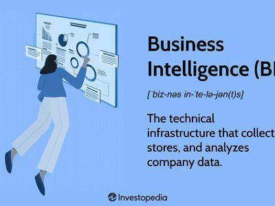

In today’s data-driven world, companies increasingly rely on data analysis, business intelligence (BI), and algorithmic trading to make informed decisions that drive growth and efficiency. Data analysis serves as the foundation for extracting actionable insights from vast volumes of structured and unstructured data, allowing businesses to enhance their decision-making processes. BI utilizes these insights to provide historical, current, and predictive views of business operations, supporting efforts to optimize performance and identify new opportunities.

Algorithmic trading, a critical aspect of modern financial markets, leverages advanced algorithms to execute trades at speeds far beyond human capability. This method capitalizes on data analysis to optimize trading strategies, minimizing transaction costs and maximizing potential returns. The synergy between BI and algorithmic trading illustrates the transformative impact of data-driven technologies across various sectors.



Understanding these concepts and the technologies that drive them is crucial for businesses seeking a competitive edge. As organizations integrate these tools into their operations, they can better navigate market trends, adapt to changing consumer behaviors, and streamline their internal workflows. This interplay of data analysis, BI, and algorithmic trading continues to reshape industries, offering significant strategic advantages to those who can harness their potential effectively.

## Table of Contents

## What is Business Intelligence?

Business Intelligence (BI) encompasses the suite of technologies and strategies that organizations employ to analyze business information. The primary purpose of BI is to transform raw data into meaningful insights that can support informed decision-making. To achieve this, BI provides historical, current, and predictive perspectives of business operations.

At its core, Business Intelligence involves three key components:

1. **Data Mining**: This process entails exploring large datasets to discover patterns, correlations, and trends that may not be immediately apparent. Techniques such as clustering, classification, and regression are frequently used in data mining to extract valuable findings from data.

2. **Process Analysis**: This refers to examining and assessing business processes to understand their efficiency and effectiveness. By analyzing workflows and operations, companies can identify areas for enhancement and streamline their procedures to improve performance.

3. **Performance Benchmarking**: Benchmarking involves comparing a company's performance metrics against industry standards or best practices. This comparison helps organizations understand their standing relative to competitors and recognize opportunities for growth or improvement.

Business Intelligence typically involves the use of various tools and technologies, including data warehousing, dashboards, and reporting software. These tools facilitate the collection, storage, and visualization of data, allowing businesses to generate actionable insights. By leveraging BI solutions, organizations can better understand market trends, customer preferences, and operational efficiencies, ultimately leading to more strategic decision-making and competitive advantage.

## Core Functions of BI Technologies

Business Intelligence (BI) technologies encompass a variety of functions essential for transforming raw data into meaningful insights. These functions include data analytics, reporting, and visualization, which together facilitate improved decision-making within organizations.

Data analytics is a foundational aspect of BI technologies. It involves examining datasets to draw conclusions about the information they contain, often with the help of specialized systems and software. This process can include statistical analysis, predictive modeling, and other quantitative methods. By identifying patterns, trends, and correlations within the data, businesses can make informed decisions that drive growth and efficiency.

Reporting is another critical function facilitated by BI technologies. Through comprehensive reports, businesses are able to summarize and communicate data findings effectively. These reports can be tailored to meet the needs of different stakeholders, such as executives, managers, or operational teams, providing them with actionable insights. Reporting tools often generate automated and scheduled reports, saving time and ensuring consistency in data sharing across the organization.

Visualization plays a significant role in BI by converting data and findings into visual contexts, such as graphs, charts, and dashboards. This makes it easier for decision-makers to understand complex data concepts and identify new patterns. Visualization tools, such as Power BI, Tableau, and similar platforms, allow for interactive data exploration, which enhances the user's ability to comprehend and utilize information effectively.

BI technologies also leverage data warehousing and cloud services to enhance data management and accessibility. Data warehousing involves the storage of data in a centralized repository, allowing for improved data retrieval and analysis. This repository supports querying, reporting, and data analysis processes by providing a clear and structured view of the data. Cloud services offer scalable, flexible, and cost-effective solutions for BI, enabling businesses to process large volumes of data with minimal infrastructure investment.

Dashboards are a common feature in BI systems, offering a consolidated view of key performance indicators (KPIs) and other relevant business data. They provide real-time insights into market trends, customer behavior, and operational efficiencies, allowing businesses to make informed decisions quickly. Dashboards are customizable, enabling users to focus on specific metrics that align with their strategic objectives.

By leveraging these tools and functionalities, BI systems enable organizations to gain a deeper understanding of their market environment and optimize internal processes. This enhanced comprehension of market trends, customer behavior, and operational efficiencies allows companies to maintain a competitive edge and drive sustainable growth.

## Algorithmic Trading and Its Importance

Algorithmic trading is a technique that automates the trading process by employing sophisticated algorithms to analyze market data and execute trades based on pre-defined criteria. This method enhances the ability of traders to operate at optimal speeds and prices, offering a significant advantage over manual trading.

### Execution Speed and Optimization

A core benefit of [algorithmic trading](/wiki/algorithmic-trading) lies in its ability to execute orders at speeds and precision levels unattainable by human traders. Algorithms are capable of scanning multiple markets, comparing current and historical data, and executing trades within milliseconds. This rapid execution is crucial in markets where prices can fluctuate greatly in a very short period. Algorithms can be programmed to execute a set number of trades in response to a range of triggers, such as stock price fluctuations or specific economic indicators.

### Cost Reduction and Efficiency

Algorithmic trading also serves to reduce transaction costs. By optimizing order execution, these algorithms minimize the market impact by slicing large orders into smaller ones. They can avoid adverse price movements by timing trades according to market conditions. Furthermore, algorithms can work continuously without fatigue, allowing them to capitalize on opportunities 24/7, which maximizes the potential for profits while reducing manpower costs.

### Reliance on Data Analysis

The efficacy of algorithmic trading heavily depends on advanced data analysis. Algorithms analyze vast amounts of real-time and historical market data to identify trading signals and execute decisions based on statistical and quantitative techniques. Techniques such as [machine learning](/wiki/machine-learning) can be incorporated to adaptively improve trading strategies based on new data patterns and market conditions. Here is a simple example in Python to illustrate how an EMA (Exponential Moving Average) crossover strategy might be implemented:

```python
import pandas as pd

def ema_crossover_strategy(data, short_window=40, long_window=100):
    data['ShortEMA'] = data['Close'].ewm(span=short_window, adjust=False).mean()
    data['LongEMA'] = data['Close'].ewm(span=long_window, adjust=False).mean()

    data['Signal'] = 0
    data['Signal'][short_window:] = np.where(data['ShortEMA'][short_window:] > data['LongEMA'][short_window:], 1, 0)
    data['Position'] = data['Signal'].diff()

    return data

# 'data' is a DataFrame containing stock price data with a 'Close' column
# ema_crossover_strategy(data)
```
This strategy buys when the shorter-term EMA crosses above the longer-term EMA and sells when the shorter-term EMA crosses below.

### Market Opportunities

Algorithmic trading is particularly adept at capitalizing on short-term market opportunities. Strategies such as [market making](/wiki/market-making), [arbitrage](/wiki/arbitrage), and trend-following can be leveraged to exploit inefficiencies and discrepancies across different markets or financial instruments. Algorithms are not limited by human biases and emotions, allowing them to execute strategies based solely on technical indicators and data-driven predictions.

In summary, algorithmic trading represents a powerful integration of technology and finance, enabling swift and efficient trading that is heavily reliant on precise data analysis, thereby offering substantial economic advantages and strategic flexibility to trading firms.

## The Role of Data Analysis in BI and Algo Trading

Data analysis serves as the fundamental driver for both Business Intelligence (BI) and algorithmic trading, enabling organizations to derive significant insights from their data. In BI, data analysis is utilized to understand customer behaviors, market trends, and internal operational efficiencies. The process involves examining structured data, such as databases and spreadsheets, which can be easily organized and queried, as well as unstructured data, such as emails, social media feeds, and multimedia content, which requires more sophisticated techniques to analyze.

Algorithmic trading, on the other hand, relies heavily on data analysis to formulate and execute trading strategies. This involves processing large volumes of market data to identify patterns or signals that can inform buying and selling decisions. The effectiveness of algorithmic trading is greatly enhanced by the integration of advanced analytical techniques, such as machine learning and [artificial intelligence](/wiki/ai-artificial-intelligence) (AI).

Machine learning models, which include supervised, unsupervised, and [reinforcement learning](/wiki/reinforcement-learning), are increasingly leveraged in these domains to predict future trends based on historical data. For instance, in supervised learning, a model is trained on a labeled dataset, learning to map input data to the desired output. This can be particularly useful in predicting stock price movements or customer purchasing behaviors. A simple example of a machine learning algorithm is a linear regression model, where the relationship between variables is expressed as $y = \beta_0 + \beta_1x + \epsilon$, where $y$ is the dependent variable, $x$ is the independent variable, $\beta_0$ and $\beta_1$ are coefficients, and $\epsilon$ is the error term.

Incorporating AI into data analysis enhances the ability to process vast datasets with precision and speed. AI-powered systems can automate the detection of anomalies or trends within data that might not be immediately visible to human analysts. In algorithmic trading, AI can optimize trading strategies by adapting to new data in real time, reducing latency, and improving the accuracy of trade executions.

Python, a popular programming language in data analysis and algorithmic trading, offers libraries such as NumPy, pandas, scikit-learn, and TensorFlow that facilitate data manipulation, statistical analysis, and the implementation of machine learning models. A simple Python script using these libraries might involve loading a dataset with pandas, calculating statistical measures, and deploying a machine learning model from scikit-learn to predict future outcomes.

```python
import pandas as pd
from sklearn.linear_model import LinearRegression

# Load data
data = pd.read_csv('market_data.csv')

# Select features and target variable
X = data[['feature1', 'feature2']]
y = data['target']

# Fit the model
model = LinearRegression()
model.fit(X, y)

# Predict future outcomes
predictions = model.predict(X)
```

In summary, data analysis underpins the efficacy of BI and algorithmic trading, with advancements in machine learning and AI leading to more refined, accurate, and actionable insights. This integration not only enhances predictive capabilities but also fosters more informed decision-making processes, providing a competitive advantage in both business and financial sectors.

## Emerging Trends in BI and Trading Technologies

The current landscape of Business Intelligence (BI) and trading technologies is undergoing rapid transformation, driven primarily by innovations in real-time data processing and analytics. This evolution is fundamentally altering how businesses and financial sectors operate, providing more immediate and actionable insights. With the rise of real-time analytics, organizations can now leverage instantaneous data to make timely decisions, which is crucial in dynamic environments such as trading where market conditions can change within seconds. Tools like Apache Kafka and Apache Flink are at the forefront, enabling the processing of data streams with minimal latency.

Cloud-based BI solutions have emerged as a dominant trend due to their scalability and cost-effectiveness. These platforms allow businesses to store and process large volumes of data without the need for significant infrastructure investments. Cloud providers such as Amazon Web Services (AWS), Microsoft Azure, and Google Cloud offer robust BI services that integrate seamlessly with existing systems, making it easier for companies to scale their operations and access global data sets. In addition, these solutions promote collaboration by allowing stakeholders to access insights from anywhere, enhancing decision-making processes.

Artificial Intelligence (AI) and machine learning algorithms are revolutionizing trading strategies by enabling deeper market analysis. AI-driven insights are increasingly utilized to recognize patterns and anomalies in vast data sets, providing traders with a competitive edge. By employing techniques such as natural language processing and sentiment analysis, trading algorithms can be designed to [factor](/wiki/factor-investing) in qualitative data from news articles and social media platforms. This enriches the quantitative analysis traditionally used in trading models, resulting in a more holistic view of the market.

In summary, the emerging trends in BI and trading technologies emphasize the importance of integrating advanced analytics, cloud computing, and AI. These technologies not only enhance operational efficiency but also offer strategic advantages through improved data-driven decision-making capabilities. As these trends continue to evolve, businesses that adapt and incorporate these innovations are likely to maintain a competitive edge in their respective industries.

## Challenges and Considerations

Implementing Business Intelligence (BI) and algorithmic trading systems presents numerous challenges, particularly regarding data privacy and system integration. These systems handle vast amounts of sensitive data, which necessitates robust privacy protections to prevent unauthorized access or misuse. Organizations must comply with regulations such as the General Data Protection Regulation (GDPR) in Europe and the California Consumer Privacy Act (CCPA) in the United States, which impose stringent requirements on data handling practices. These regulations mandate that businesses implement measures to secure personal data and establish protocols to address data breaches.

Data accuracy is another critical consideration. Inaccurate or incomplete data can lead to erroneous analyses and misguided business decisions. To ensure data reliability, organizations must implement stringent data management practices, including regular audits and validation checks. Advanced data cleaning techniques are crucial for handling missing data or outliers, which can skew analytical results.

The ethical use of artificial intelligence (AI) within BI and algorithmic trading systems is also paramount. As these technologies often employ complex algorithms to predict market trends or consumer behavior, ensuring that AI models do not perpetuate bias or discriminate against certain groups is essential. Developing transparent AI models and regularly assessing them for bias can help maintain ethical standards.

System integration challenges arise from the need to incorporate BI and algorithmic trading technologies into existing IT infrastructures. This process often involves integrating disparate data sources, which can result in compatibility issues. Utilizing application programming interfaces (APIs) and middleware solutions can facilitate the integration process by allowing different systems to communicate effectively.

Regulatory considerations play a significant role in shaping trading practices. Financial markets are subject to extensive regulation to ensure fairness and stability. Algorithmic trading firms must adhere to rules such as the Markets in Financial Instruments Directive II (MiFID II) in the European Union, which requires the disclosure of algorithms to regulatory bodies. Compliance with such regulations helps prevent market manipulation and ensures transparency in trading activities.

In conclusion, while BI and algorithmic trading technologies offer significant benefits, they also present challenges that organizations must address to be successful. By focusing on data privacy, accuracy, ethical AI use, and regulatory compliance, businesses can overcome these hurdles and leverage technology for competitive advantage.

## The Future of BI and Algo Trading

The future of Business Intelligence (BI) and algorithmic trading is characterized by the development of more sophisticated and individualized analytics tools that specifically address the nuanced requirements of organizations. With technological advancements, the integration of artificial intelligence (AI) into these domains is anticipated to significantly bolster their functionalities. AI's contribution includes enhancing predictive analytics, optimizing decision-making processes, and enabling automation on a scale previously unobtainable. 

In the sphere of BI, AI facilitates the transition from traditional BI platforms to more adaptive, real-time, and self-service analytics systems. These systems empower businesses to not only interpret historical and current data efficiently but also apply predictive modeling techniques. With AI, companies can employ advanced data analytics techniques such as natural language processing (NLP) and [deep learning](/wiki/deep-learning) to extract insights from unstructured data sources. For example, NLP can be utilized to analyze customer feedback or social media sentiment, enriching the data pool used for strategic decision-making.

Algorithmic trading is similarly being transformed by AI through the application of machine learning algorithms that adapt to market conditions in real-time, increasing trading accuracy and profitability. These algorithms are capable of analyzing vast datasets to determine optimal trading strategies while minimizing human intervention. This automation reduces the latency between data analysis and trade execution, thus maximizing potential returns. Furthermore, reinforcement learning – a type of machine learning – can be used to simulate various trading scenarios to improve algorithmic strategies autonomously. A simple Python example illustrating reinforcement learning for trading might look like this:

```python
import gym
import numpy as np

# Initialize environment and set random seed
env = gym.make('stocks-v0') # Hypothetical stocks trading environment
env.seed(0)
np.random.seed(0)

# Define a simple reinforcement learning agent
class SimpleAgent:
    def __init__(self, action_space):
        self.action_space = action_space

    def act(self, observation):
        return self.action_space.sample() # Random action

agent = SimpleAgent(env.action_space)

# Train the agent
for episode in range(100): # Number of episodes
    observation = env.reset()
    total_reward = 0
    done = False

    while not done:
        action = agent.act(observation)
        observation, reward, done, info = env.step(action)
        total_reward += reward

    print(f'Episode {episode} Total Reward: {total_reward}')
```

Enterprises that invest in cutting-edge BI and algorithmic trading systems are poised to secure substantial competitive advantages. These technologies enable businesses to streamline operations, enhance customer engagement, and optimize resource allocation. The confluence of AI with BI and algorithmic trading is likely to redefine industry standards by fostering agility, accuracy, and efficiency in decision-making processes. In an ever-evolving digital economy, being strategically aligned with these technological advancements will be crucial for sustained profitability and growth.

## Conclusion

Data analysis, business intelligence (BI), and algorithmic trading are significantly transforming businesses and financial activities. By leveraging these advanced technologies, organizations are better equipped to make strategic decisions, optimize operations, and improve their competitive standing in the marketplace. Companies utilizing data analysis can convert large volumes of raw data into actionable insights, thereby strengthening their decision-making processes.

Business intelligence offers comprehensive historical, current, and forecasted views of business operations, allowing organizations to identify market trends, customer preferences, and areas for operational efficiencies. Tools such as dashboards and data visualization aid in making complex datasets more understandable and actionable. The integration of machine learning and artificial intelligence into BI systems is further enhancing their ability to provide precise and predictive insights.

Algorithmic trading, on the other hand, automates trading processes using complex algorithms to achieve optimal trading speeds and prices, consequently reducing costs and maximizing market opportunities. The reliance on data analysis to build effective trading strategies is becoming increasingly crucial as market environments get more volatile and competitive.

Staying informed about emerging trends and continuous adoption of best practices is essential in the digital economy. The rapid pace of technological advancements means that businesses must remain agile and innovative, adopting scalable and efficient solutions such as cloud-based BI systems and AI-driven trading strategies. Investing in these technologies not only enhances operational capacities but also positions businesses to respond adeptly to evolving market demands.

Adopting a forward-thinking approach towards data analysis, business intelligence, and algorithmic trading is akin to maintaining a robust competitive edge. Businesses that embrace these tools effectively can expect substantial growth, driving strategic initiatives and delivering value in an increasingly data-centric world.

## References & Further Reading

[1]: Bergstra, J., Bardenet, R., Bengio, Y., & Kégl, B. (2011). ["Algorithms for Hyper-Parameter Optimization."](https://dl.acm.org/doi/10.5555/2986459.2986743) Advances in Neural Information Processing Systems 24.

[2]: ["Advances in Financial Machine Learning"](https://www.amazon.com/Advances-Financial-Machine-Learning-Marcos/dp/1119482089) by Marcos Lopez de Prado

[3]: ["Evidence-Based Technical Analysis: Applying the Scientific Method and Statistical Inference to Trading Signals"](https://www.amazon.com/Evidence-Based-Technical-Analysis-Scientific-Statistical/dp/0470008741) by David Aronson

[4]: ["Machine Learning for Algorithmic Trading"](https://github.com/stefan-jansen/machine-learning-for-trading) by Stefan Jansen

[5]: ["Quantitative Trading: How to Build Your Own Algorithmic Trading Business"](https://www.amazon.com/Quantitative-Trading-Build-Algorithmic-Business/dp/1119800064) by Ernest P. Chan