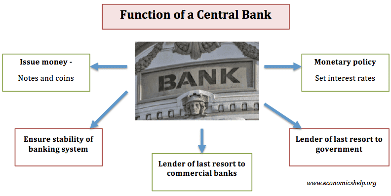

## Table of Contents

## What is a central bank?

A central bank is like a big boss for all the other banks in a country. It controls the money supply, which means it decides how much money is available for people to use. It also sets the interest rates, which are like the cost of borrowing money. When the central bank changes these rates, it can make borrowing cheaper or more expensive, which affects how much people spend and save.

The central bank also makes sure that the money in the country stays stable and trustworthy. It does this by controlling inflation, which is when prices go up over time. If inflation gets too high, the central bank might raise interest rates to slow it down. The central bank also keeps an eye on the whole economy to make sure it's working well and helps the government with its money plans.

## What are the primary functions of a central bank?

A central bank has a few main jobs. One big job is to control the amount of money in the country. They do this by deciding how much money banks can lend out. If they think there's too much money, they might make it harder for banks to lend. If they think there's not enough, they might make it easier. This helps keep the economy balanced and stops prices from going up too fast, which is called inflation.

Another important job is setting interest rates. Interest rates are like the price of borrowing money. When the central bank changes these rates, it can make borrowing cheaper or more expensive. If they lower the rates, people might borrow more and spend more, which can help the economy grow. If they raise the rates, borrowing becomes more expensive, and people might spend less, which can slow down the economy if it's growing too fast.

The central bank also keeps an eye on the whole economy and works with the government. They watch things like how many people have jobs and how much stuff people are buying. If the economy is doing well, they might not need to do much. But if things are going badly, they might need to step in and help. They also make sure that the money in the country stays stable and that people trust it. This is important because if people don't trust the money, the whole economy can get into trouble.

## How does a central bank control inflation?

A central bank controls inflation by managing the amount of money in the economy. If there's too much money, people might spend more, which can make prices go up. To stop this, the central bank can make it harder for banks to lend money. They do this by raising something called the reserve requirement, which means banks have to keep more money in their vaults and can't lend as much. Another way is by selling government bonds, which takes money out of circulation because people use their money to buy the bonds instead of spending it.

The central bank also uses interest rates to control inflation. When they raise interest rates, borrowing money becomes more expensive. This can make people and businesses borrow less and spend less, which slows down the economy and helps keep prices from rising too fast. On the other hand, if inflation is too low, the central bank might lower interest rates to make borrowing cheaper. This encourages people to borrow and spend more, which can help the economy grow and push prices up a bit. By carefully adjusting these tools, the central bank can keep inflation at a level that's good for the economy.

## What role does a central bank play in monetary policy?

A central bank is really important for deciding how money works in a country. It does this through something called monetary policy. The main thing the central bank does is control how much money is out there for people to use. If there's too much money, prices might go up too fast, which is called inflation. To stop this, the central bank can make it harder for banks to lend money by raising interest rates or by making banks keep more money in their vaults. This slows down how fast money moves around and helps keep prices stable.

The central bank also uses interest rates to guide the economy. When they think the economy needs a boost, they might lower interest rates. This makes borrowing cheaper, so people and businesses might borrow more and spend more, which can help the economy grow. But if the economy is growing too fast and prices are going up too much, the central bank might raise interest rates. This makes borrowing more expensive, so people might spend less, which can slow down the economy and help control inflation. By carefully adjusting these tools, the central bank keeps the economy on track and makes sure money stays stable and trustworthy.

## How does a central bank influence interest rates?

A central bank influences interest rates by setting what's called the "benchmark" or "policy" [interest rate](/wiki/interest-rate-trading-strategies). This is the rate at which banks can borrow money from the central bank. When the central bank changes this rate, it sends a signal to all the other banks about what they should do with their own interest rates. If the central bank lowers the benchmark rate, banks usually lower their rates too, making it cheaper for people and businesses to borrow money. If the central bank raises the benchmark rate, banks will often raise their rates, making borrowing more expensive.

The central bank uses this power over interest rates to help control the economy. If they want to encourage spending and help the economy grow, they might lower the benchmark rate. This makes loans cheaper, so people might borrow more to buy things like houses or cars, and businesses might borrow to expand. On the other hand, if the economy is growing too fast and prices are going up too much, the central bank might raise the benchmark rate. This makes borrowing more expensive, so people might spend less, which can slow down the economy and help keep prices stable. By adjusting the benchmark rate, the central bank can guide the economy in the direction they think is best.

## What is the process of open market operations and how does it work?

Open market operations are a way for the central bank to control how much money is in the economy. They do this by buying or selling government bonds. When the central bank wants to put more money into the economy, they buy these bonds from banks and other people. They pay for the bonds with new money, which means there's more money out there for people to use. This can help the economy grow because people and businesses might spend more.

On the other hand, if the central bank wants to take money out of the economy, they sell government bonds. When people buy these bonds, they use their money to pay for them, which means there's less money out there for spending. This can help slow down the economy if it's growing too fast and prices are going up too much. By buying and selling these bonds, the central bank can keep the amount of money in the economy just right, helping to control inflation and keep the economy stable.

## How do central banks manage foreign exchange reserves?

Central banks manage foreign exchange reserves by holding onto different kinds of money from other countries. They keep these reserves to make sure their own country's money stays stable and strong. For example, if their currency is getting weaker, they might use some of their foreign money to buy their own currency. This makes their own currency more valuable because there's more demand for it. They also use these reserves to help the economy during tough times, like if there's a big financial crisis.

Another way central banks manage their foreign exchange reserves is by investing them wisely. They might put the money into safe investments like government bonds from other countries. This way, the reserves can grow over time and be ready to use when needed. It's like saving money in a piggy bank but on a much bigger scale. By carefully managing these reserves, central banks can protect their country's economy and make sure it stays strong and stable.

## What is the significance of a central bank's role as a lender of last resort?

A central bank acts as a lender of last resort, which means it steps in to help banks when they're in big trouble and can't get money from anywhere else. Imagine a bank is like a person who needs money fast but can't borrow from friends or family. The central bank is like a special emergency lender that can give the bank the money it needs to keep going. This is really important because if a bank runs out of money, it might have to close down, which could scare people and make them take their money out of other banks too. By lending money in emergencies, the central bank helps stop this from happening and keeps the whole banking system safe.

The central bank's role as a lender of last resort also helps keep the economy stable. When banks know they can get help in a crisis, they feel more secure and are more likely to lend money to people and businesses. This keeps money flowing through the economy, which is good for everyone. But the central bank has to be careful about when and how it lends this emergency money. It needs to make sure banks don't take too many risks, knowing they can always get help. By balancing this support with careful rules, the central bank can protect the economy and keep it running smoothly.

## How does a central bank contribute to financial stability?

A central bank helps keep the financial system stable by making sure banks have enough money to work properly. If a bank is in trouble and can't get money from other places, the central bank can step in and lend it the money it needs. This stops the bank from going broke, which is important because if one bank fails, it could make people worried and cause them to take their money out of other banks too. By being there to help in emergencies, the central bank keeps the whole banking system calm and safe.

The central bank also watches over the economy to make sure it's not growing too fast or too slow. If the economy is doing too well and prices are going up too much, the central bank might raise interest rates to slow things down. If the economy is not doing well and people are not spending enough, the central bank might lower interest rates to encourage more spending. By keeping a close eye on things and making these adjustments, the central bank helps keep the economy stable and prevents big problems from happening.

## What are the differences between the functions of central banks in developed versus emerging economies?

Central banks in developed economies often focus on keeping prices stable and managing the economy's growth. They do this by setting interest rates and using tools like open market operations to control how much money is out there. Because these economies are usually more stable, their central banks can also spend time on things like regulating banks and making sure the financial system works well. They might also help with international money matters, like managing foreign exchange reserves to keep their currency strong.

In emerging economies, central banks have similar goals but face different challenges. They often need to work harder to control inflation, which can be higher and more unpredictable. These central banks might also have to step in more often to help the economy during tough times, like when there's a crisis or a lot of money is leaving the country. They might not have as many tools or as much experience as central banks in developed countries, so they have to be careful and flexible in how they manage the economy and the money supply.

Both types of central banks aim to keep their economies stable and help them grow, but the specific tasks and challenges they face can be quite different. In developed economies, the focus might be more on fine-tuning the economy, while in emerging economies, the central bank might need to take bigger steps to keep things under control.

## How do central banks use macroprudential tools to mitigate systemic risks?

Central banks use macroprudential tools to keep the whole financial system safe by managing risks that could affect everyone. One way they do this is by setting rules for how much money banks need to keep in reserve. If banks have to keep more money, they can't lend as much, which can stop them from taking too many risks. Central banks also might limit how much people can borrow for things like houses. This helps stop too many people from getting loans they can't pay back, which could cause big problems if lots of people default at the same time.

Another tool central banks use is stress tests. These are like practice runs where banks have to show they can handle tough times, like if the economy gets bad or if lots of people can't pay back their loans. By making sure banks are ready for these situations, central banks can prevent a small problem from turning into a big one that affects the whole economy. By using these tools, central banks can keep an eye on the big picture and make sure the financial system stays strong and stable.

## What are the challenges faced by central banks in the era of digital currencies and fintech?

Central banks face big challenges with digital currencies and fintech. One big challenge is keeping control over the money supply. With digital currencies like Bitcoin, people can use money that isn't controlled by any central bank. This can make it harder for central banks to manage how much money is out there and keep prices stable. They have to figure out new ways to watch and maybe even control these digital currencies to make sure they don't mess up the economy.

Another challenge is dealing with new fintech companies. These companies offer new ways for people to borrow, save, and spend money, often without using traditional banks. This can make it harder for central banks to see what's happening in the economy and make good decisions. Central banks need to work with these fintech companies to understand their impact and maybe even use their technology to make banking better. It's a big change, and central banks have to be ready to adapt to keep the financial system safe and stable.

## References & Further Reading

[1]: Bernanke, B. S., & Blinder, A. S. (1992). ["The Federal Funds Rate and the Channels of Monetary Transmission."](https://www.nber.org/papers/w3487) The American Economic Review, 82(4), 901-921.

[2]: Biais, B., Foucault, T., & Moinas, S. (2015). ["Equilibrium Fast Trading."](https://www.sciencedirect.com/science/article/pii/S0304405X15000288) The Review of Economic Studies, 82(2), 535-578.

[3]: Basel Committee on Banking Supervision. (2010). ["Basel III: A global regulatory framework for more resilient banks and banking systems."](https://www.bis.org/publ/bcbs189_dec2010.htm) Bank for International Settlements.

[4]: Gomber, P., Arndt, B., Lutat, M., & Uhle, T. (2011). ["High-Frequency Trading."](https://papers.ssrn.com/sol3/papers.cfm?abstract_id=1858626) SSRN Electronic Journal.

[5]: Campbell, J. Y., Lo, A. W., & MacKinlay, A. C. (1997). ["The Econometrics of Financial Markets."](https://www.researchgate.net/publication/23775223_The_Econometrics_of_Financial_Market) Princeton University Press.

[6]: Carney, M. (2013). ["The UK's macroprudential authority: Powers, processes and approach."](https://www.bankofengland.co.uk/-/media/boe/files/speech/2020/the-grand-unifying-theory-and-practice-of-macroprudential-policy-speech-by-mark-carney.pdf) Bank of England. 

[7]: Hendershott, T., Jones, C. M., & Menkveld, A. J. (2011). ["Does Algorithmic Trading Improve Liquidity?"](https://onlinelibrary.wiley.com/doi/full/10.1111/j.1540-6261.2010.01624.x) The Journal of Finance, 66(1), 1-33.