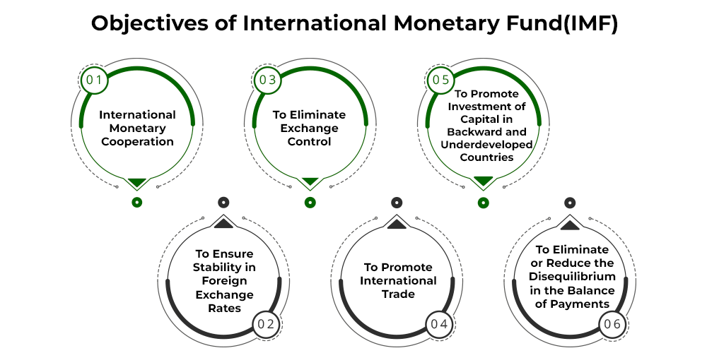

## Table of Contents

## What is the International Monetary Fund (IMF)?

The International Monetary Fund (IMF) is an organization that helps countries with their money problems. It was created after World War II to make sure countries could work together on their economies. The IMF gives advice and loans to countries that are having trouble with their money. It also keeps an eye on the world's economy to help prevent big problems.

Countries that join the IMF pay money into a big fund. When a country needs help, it can borrow money from this fund. The IMF makes rules about how the money should be used to fix the country's problems. This way, the IMF helps keep the world's economy stable and helps countries grow and develop.

## When was the IMF established and why?

The International Monetary Fund (IMF) was established on December 27, 1945. It was created after World War II, a time when many countries were struggling with their economies. The main reason for starting the IMF was to help countries work together and fix their money problems. Countries needed a way to borrow money and get advice on how to make their economies stronger.

The idea for the IMF came from a meeting in 1944 called the Bretton Woods Conference. Leaders from many countries met to talk about how to rebuild the world's economy after the war. They decided to create the IMF to help prevent big economic problems and to promote growth and development. By working together, countries could avoid the kind of economic troubles that had led to the war.

## What are the primary goals of the IMF?

The main goal of the International Monetary Fund (IMF) is to help countries with their money problems. When a country's economy is in trouble, the IMF can give it loans and advice. This helps the country fix its problems and make its economy stronger. The IMF also wants to make sure that countries work together and help each other. By doing this, the IMF helps keep the world's economy stable.

Another important goal of the IMF is to watch over the world's economy. The IMF keeps an eye on what is happening in different countries and around the world. If it sees a problem coming, it can warn countries and help them avoid big economic troubles. This way, the IMF helps prevent crises and promotes growth and development in all countries.

## How does the IMF promote global monetary cooperation?

The IMF promotes global monetary cooperation by bringing countries together to talk about their money problems. When countries work together, they can share ideas and find solutions that help everyone. The IMF holds meetings where leaders from different countries can discuss what is happening in their economies. By talking and working together, countries can avoid big problems and help each other grow.

Another way the IMF promotes cooperation is by setting rules and standards for how countries should handle their money. These rules help make sure that countries are doing things in a fair and stable way. When countries follow these rules, it makes it easier for them to trade and work together. This cooperation helps keep the world's economy strong and stable, which is good for everyone.

## What role does the IMF play in ensuring financial stability?

The IMF helps keep the world's money stable by watching over the global economy. It looks at what is happening in different countries and around the world. If it sees a problem coming, it can warn countries and help them fix it before it gets too big. This way, the IMF helps prevent big money troubles that could hurt everyone.

The IMF also gives loans and advice to countries that are having money problems. When a country's economy is in trouble, it can borrow money from the IMF to help fix things. The IMF makes rules about how the money should be used to make the country's economy stronger. By helping countries in this way, the IMF makes sure that problems in one country don't cause big problems for the whole world.

## How does the IMF facilitate international trade?

The IMF helps countries trade with each other by making sure their money is stable. When countries have stable money, it's easier for them to buy and sell things with other countries. The IMF watches over the world's economy and helps fix problems that could make trade hard. By doing this, the IMF makes it easier for countries to trade and grow their economies.

The IMF also sets rules about how countries should handle their money. These rules help make sure that countries are doing things in a fair way. When countries follow these rules, it makes it easier for them to trade with each other. This cooperation helps keep the world's economy strong and stable, which is good for everyone.

## What is the IMF's function in promoting high employment and sustainable economic growth?

The IMF helps countries have more jobs and grow their economies in a way that lasts. It does this by giving advice and loans to countries that need help. When a country's economy is not doing well, it can be hard for people to find jobs. The IMF works with these countries to make plans that will create more jobs and make the economy stronger. By helping countries fix their money problems, the IMF makes it easier for them to have more jobs and grow.

The IMF also watches over the world's economy to make sure it stays stable. When the world's economy is stable, it's easier for countries to grow and create jobs. The IMF looks at what is happening in different countries and around the world. If it sees a problem coming, it can warn countries and help them fix it before it gets too big. This way, the IMF helps countries have more jobs and grow their economies in a way that will last a long time.

## How does the IMF provide financial assistance to member countries?

The IMF helps countries that are having money problems by giving them loans. When a country joins the IMF, it pays money into a big fund. If the country needs help later, it can borrow money from this fund. The IMF decides how much money a country can borrow based on its needs and how much it has paid into the fund. The country has to follow certain rules about how to use the money to fix its problems.

The IMF also gives advice to countries on how to make their economies stronger. When a country gets a loan, the IMF works with it to make a plan. This plan shows how the country will use the money to create more jobs, grow its economy, and fix its money problems. The IMF keeps an eye on the country to make sure it is following the plan. This way, the IMF helps countries get back on track and grow in a healthy way.

## What are the conditions typically attached to IMF loans?

When the IMF gives a loan to a country, it usually comes with conditions that the country has to follow. These conditions are meant to help the country fix its money problems and make its economy stronger. For example, the IMF might ask the country to cut spending on certain things, raise taxes, or make changes to how it runs its economy. These rules are part of a plan that the IMF makes with the country to help it get better.

The IMF wants to make sure that the money it lends is used in the right way. So, it keeps an eye on the country to see if it is following the plan. If the country does what it is supposed to do, it can keep getting more money from the IMF. But if it doesn't follow the rules, the IMF might stop giving it money. This helps make sure that the country is doing what it needs to do to fix its economy.

## How does the IMF conduct surveillance and monitor global economies?

The IMF keeps an eye on the world's economy by watching what is happening in different countries. It does this through something called surveillance. The IMF looks at how countries are doing with their money and their economies. It talks to leaders and experts in these countries to get information. The IMF also uses data and reports to see if there are any problems coming up. By doing all this, the IMF can warn countries about possible troubles and help them fix things before they get too big.

The IMF shares what it learns with everyone. It writes reports called Article IV consultations, where it talks about what is happening in each country's economy. These reports give advice on what countries can do to make their economies stronger. The IMF also looks at the world's economy as a whole. It writes reports about global economic trends and risks. By sharing this information, the IMF helps countries work together and make better decisions about their money. This way, the IMF helps keep the world's economy stable and helps countries grow and develop.

## What is the role of the IMF in debt relief and restructuring?

The IMF helps countries that have too much debt by working on debt relief and restructuring. When a country owes a lot of money and can't pay it back, the IMF can step in to help. It works with the country and its lenders to make a plan. This plan might include lowering the amount of debt the country has to pay or changing the terms of the debt so it's easier to handle. The goal is to help the country get its money problems under control so it can start growing again.

The IMF also gives advice on how to manage debt better in the future. It helps countries make budgets and plans that will keep them from getting into too much debt again. By doing this, the IMF helps countries become more stable and less likely to need debt relief in the future. This way, the IMF not only helps with immediate debt problems but also works to prevent them from happening again.

## How does the IMF collaborate with other international organizations to achieve its objectives?

The IMF works with other big groups to help countries with their money problems. One important group it works with is the World Bank. Together, they help countries make their economies stronger. The IMF gives loans and advice to fix money problems right away, while the World Bank helps with long-term projects like building schools and roads. By working together, they can help countries in many different ways.

The IMF also works with groups like the United Nations and the World Trade Organization. With the United Nations, the IMF helps with big goals like ending poverty and making the world a better place. With the World Trade Organization, the IMF helps make sure countries can trade with each other easily. By teaming up with these groups, the IMF can do more to help countries and keep the world's economy stable.

## References & Further Reading

[1]: ["The International Monetary Fund, its policies, and problems"](https://www.imf.org/en/About/Factsheets/IMF-at-a-Glance) by Graham Bird, William Loehr, & Robert Hampshire

[2]: Farrell, D. (2001). ["The real new economy."](https://hbr.org/2003/10/the-real-new-economy) McKinsey Quarterly, 3, 32-47.

[3]: ["Algorithmic Trading and the International Monetary Fund: Enhancing the Benefits of a Dual Relationship"](https://www.imf.org/en/Blogs/Articles/2024/01/14/ai-will-transform-the-global-economy-lets-make-sure-it-benefits-humanity) by Fabrice Royer

[4]: ["The IMF and its critics"](https://www.cambridge.org/core/books/imf-and-its-critics/685AB86AD82ACEB4C5076F08E0C9EB56/listing) by Joseph E. Stiglitz, World Development Volume 25, Issue 3, March 1997

[5]: Gomber, P., Koch, J.-A., & Siering, M. (2017). ["Digital Finance and FinTech: current research and future research directions."](https://link.springer.com/content/pdf/10.1007/s11573-017-0852-x.pdf) Journal of Business Economics, 87, 537–580. 

[6]: Narang, R. K. (2009). ["Inside the Black Box: The Simple Truth About Quantitative Trading."](https://www.amazon.com/Inside-Black-Box-Quantitative-Trading/dp/0470432063) Wiley Trading.