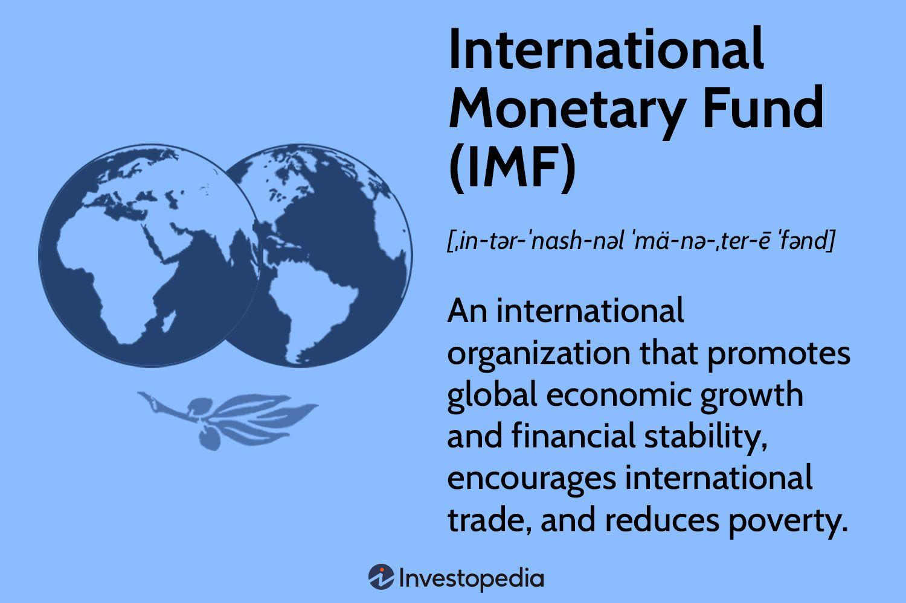

The International Monetary Fund (IMF) is a pivotal institution in the realm of global economics. Established in 1944 at the Bretton Woods Conference, the IMF's primary objectives are to secure financial stability, facilitate international trade, promote high employment and sustainable economic growth, and reduce poverty around the world. It does this through a variety of mechanisms including the surveillance of member economies, provision of financial assistance, and capacity development. The IMF's role in stabilizing international exchange rates has been crucial in shaping the economic policies of nations worldwide. Despite these achievements, the organization has faced criticisms and controversies over its policies, which some argue can lead to stringent economic conditions for borrowing nations.

Concurrently, the financial world has witnessed the growing dominance of algorithmic trading, fundamentally altering how markets operate. Algorithmic trading refers to the use of computer algorithms to automate trading decisions, and it has become increasingly prevalent due to its ability to execute trades at speeds and volumes impossible for human traders. Algorithms leverage vast datasets and complex mathematical models to optimize trading strategies, potentially improving market efficiency and liquidity. However, this rapid trading activity also introduces significant risks, such as market volatility and systemic vulnerabilities.



The intersection of IMF economic policies and algorithmic trading represents a dynamic and evolving landscape within global financial markets. As the IMF continues to influence economic policy across the globe, its interventions and economic forecasts are closely monitored by algorithmic traders, who adapt their strategies in response to this information. This creates a feedback loop wherein global economic policies and algorithmic trading practices influence and inform one another.

The purpose of this article is to explore this intricate relationship, examining both the IMF's continued influence on economic outcomes and the transformative impact of algorithmic trading on global economies. By understanding how these two major financial forces interact, we can gain insights into their collective impact on the world economy.

As we embark on this exploration, we pose a question to consider: How do these two major financial forces shape the world economy?

## Table of Contents

## Understanding the IMF and Its Role

The International Monetary Fund (IMF) was established in 1944 during the Bretton Woods Conference with the primary objective of creating a cooperative monetary framework for facilitating international trade, economic stability, and growth. Officially beginning operations in 1947, the IMF was designed to promote exchange rate stability, support the balanced growth of international trade, and provide resources to member countries facing balance of payments difficulties, allowing them to restore economic stability without resorting to measures destructive to national or international prosperity.

The IMF's key functions can be categorized into three main areas: surveillance, financial assistance, and capacity development. Through its surveillance mandate, the IMF monitors global, regional, and national economic and financial developments. It provides assessments and policy advice, aiming to prevent economic instability and crises. This involves the Annual Article IV consultations with member countries, where the IMF evaluates their economic health and advises on potential corrective actions.

Financial assistance is another pillar of the IMF's operation, offering financial resources to member countries experiencing actual or potential balance-of-payment problems. These resources are provided under flexible conditions through various lending programs, such as Stand-By Arrangements and Extended Fund Facility agreements. This financial support enables countries to implement necessary adjustment policies while minimizing economic disruption.

Capacity development is the third crucial function of the IMF. It involves providing technical assistance and training to member countries, reinforcing their ability to design and implement effective policies on fiscal management, monetary policy, exchange rate regimes, and financial regulation. This support helps build resilient economic institutions and enhances policymaking effectiveness in member states.

The IMF plays a critical role in stabilizing international exchange rates by operating within the framework of the Bretton Woods system initially and subsequently adapting to the floating exchange rate environment after its collapse in 1971. By offering a forum for cooperation on international monetary issues, the IMF promotes policies aimed at minimizing exchange rate misalignments and global imbalances, ultimately contributing to global economic stability.

Despite its significant role, the IMF has faced criticisms and controversies. Critics argue that the structural adjustment programs accompanying IMF financial assistance can impose harsh austerity measures, which may lead to social unrest and exacerbate poverty in borrowing countries. Additionally, some contend that the IMF's governance structure disproportionately favors Western advanced economies, which can lead to policies that prioritize creditor nations' interests over those of debtor countries. Moreover, the conditionalities imposed by the IMF have raised concerns over national sovereignty, with critics arguing that they can undermine local governance and social objectives. These controversies underscore ongoing debates about the IMF's approach to global economic governance and its prescribed policy measures.

## The Rise of Algorithmic Trading

Algorithmic trading, also known as algo trading, refers to the use of computer algorithms to automate the buying and selling of financial instruments in markets. These algorithms are designed to execute trades at high speed and frequency, based on predetermined criteria, without human intervention. The basic principles of [algorithmic trading](/wiki/algorithmic-trading) encompass the use of complex mathematical models and formulas to identify and exploit trading opportunities in the market.

The growth of algorithmic trading has been significant over the past few decades, particularly with the advancement of technology and increased access to high-frequency trading platforms. As of today, algorithmic trading accounts for a substantial portion of trading [volume](/wiki/volume-trading-strategy) in several of the world's largest financial markets. The proliferation of electronic trading venues has facilitated this expansion, enabling the rapid execution of orders and the ability to process vast amounts of market data.

Algorithmic trading strategies leverage various technologies and algorithms. Commonly used techniques include statistical [arbitrage](/wiki/arbitrage), where traders exploit price inefficiencies between correlated financial instruments, and market-making algorithms, which provide [liquidity](/wiki/liquidity-risk-premium) to the market by continuously quoting buy and sell prices. Machine learning and [artificial intelligence](/wiki/ai-artificial-intelligence) have also been increasingly integrated into trading algorithms, allowing systems to learn from historical data patterns and adapt to changing market conditions.

The benefits of algorithmic trading are notable. One of the primary advantages is efficiency; algorithms can process and react to market conditions much faster than human traders, often executing trades in fractions of a second. This speed can lead to tighter bid-ask spreads and increased market liquidity. Additionally, algorithmic trading reduces the emotional and psychological biases that can influence human decision-making, leading to more consistent and objective trading strategies.

Despite these advantages, algorithmic trading comes with its challenges and risks. High-frequency trading can contribute to market [volatility](/wiki/volatility-trading-strategies), as rapid trading can lead to sudden price swings, sometimes resulting in events like the "flash crash." Moreover, the complexity of algorithms raises concerns about their transparency and the potential for unintended consequences. Ethical considerations also arise, such as the fairness of markets dominated by entities with advanced technological capabilities versus individual investors. Furthermore, the reliance on sophisticated algorithms raises questions about accountability, especially when technical failures or poorly designed algorithms lead to financial losses.

Overall, while algorithmic trading has transformed the landscape of financial markets, it requires careful consideration of its risks and regulatory challenges. As the technology continues to evolve, so too does the need for balanced oversight to ensure that its benefits can be maximized while minimizing potential adverse effects on market stability.

## Interactions Between IMF Policies and Algorithmic Trading

The International Monetary Fund (IMF) plays a pivotal role in shaping global economic policies, which can substantially influence financial markets worldwide. These policies, in turn, affect algorithmic trading strategies utilized by traders to optimize performance and manage risk.

### IMF Economic Policies and Global Financial Markets

IMF policies are designed to ensure global monetary cooperation, stabilize exchange rates, and contribute to high employment and sustainable economic growth. Such policies can influence global financial markets in a number of ways. For example, when the IMF steps in with financial assistance or recommended austerity measures, it can lead to significant changes in investor confidence, affecting market liquidity and volatility. 

Algorithmic trading strategies often rely on the stability and predictability of market conditions. Economic measures or interventions by the IMF can introduce new variables that algorithms must [factor](/wiki/factor-investing) into their models. This might include shifts in interest rates or currency values that are critical to the trading algorithms based on [statistical arbitrage](/wiki/statistical-arbitrage), trend analysis, or [market making](/wiki/market-making).

### Case Studies of IMF Interventions 

Historically, IMF interventions have led to shifts in market dynamics. For instance, during the Eurozone crisis, the IMF's involvement in bailout packages for countries like Greece had wide-ranging effects on European bond markets. Algorithmic traders adjusted their strategies in response to changes in bond yields and credit spreads.

Another notable intervention was the IMF's role during the Asian financial crisis of the late 1990s. IMF policies and funding packages implemented in affected countries such as South Korea and Indonesia led to currency fluctuations and influenced trading patterns across Forex markets. Algorithmic trading systems had to recalibrate in response to heightened volatility and changing economic indicators.

### Regulatory Recommendations by the IMF

The IMF has recognized the growing significance of algorithmic trading and the complexities it introduces to financial markets. As part of their broader regulatory recommendations, the IMF has suggested stronger market surveillance and improved transparency to mitigate systemic risks posed by high-frequency and algorithmic trading. These recommendations aim to address concerns such as flash crashes and market manipulation.

### Impact of IMF Reports on Algorithmic Strategies

Traders implement economic forecasts and reports from the IMF in their algorithmic strategies, using them to predict market trends and develop trading signals. For example, an IMF report predicting GDP growth in emerging markets can be a cue for algorithms to adjust their portfolios towards assets within those regions. Conversely, reports cautious on economic downturns prompt risk-averse strategies, focusing on assets with historically lower volatilities.

Python Example: A simple moving average crossover strategy might be adjusted based on IMF economic forecasts.

```python
def moving_average_crossover_strategy(data, short_window=40, long_window=100):
    signals = pd.DataFrame(index=data.index)
    signals['price'] = data['price']
    signals['short_mavg'] = data['price'].rolling(window=short_window, min_periods=1, center=False).mean()
    signals['long_mavg'] = data['price'].rolling(window=long_window, min_periods=1, center=False).mean()
    signals['signal'] = 0.0
    signals['signal'][short_window:] = np.where(signals['short_mavg'][short_window:] > signals['long_mavg'][short_window:], 1.0, 0.0)
    # Adjust signal strength based on economic forecast
    signals['signal'] *= economy_forecast_factor(data['date'])
    return signals

def economy_forecast_factor(date):
    # Dummy function: In reality, factor values would be derived from IMF's economic reports
    return 1.0 if date < '2023-01-01' else 0.9  # Example: Lower factor for cautious growth forecasts
```

### Relationship Between Currency Market Interventions and Algo Trading

Currency market interventions by the IMF can have immediate effects on foreign exchange markets. Algorithmic trading systems must swiftly adjust their positions based on these interventions to manage risks associated with currency fluctuations. The dynamic relationship between IMF interventions and algorithmic trading can lead to complex feedback loops: IMF actions influence market conditions, which are then incorporated into trading algorithms that further impact market behavior. 

Thus, the interplay between IMF policies and algorithmic trading reflects a rapidly evolving landscape of global finance, where economic stability and market efficiency are continuously negotiated through the dual forces of organizational policy and technological innovation.

## Impacts on Global Economy

The International Monetary Fund (IMF) plays a critical role in shaping the global economy through its economic policies, particularly when examined in the context of algorithmic trading, which has become increasingly prevalent in financial markets. IMF policies can influence global economic trends, affecting algorithmic trading strategies that depend on such macroeconomic signals for decision-making.

Algorithmic trading, characterized by the use of complex algorithms to execute trades at high speeds, can enhance market efficiency by narrowing spreads and increasing liquidity. However, it also poses risks such as market volatility and systemic fragility. These risks are particularly pertinent when assessing the broad economic implications of IMF policies. For instance, when the IMF implements policy recommendations that stabilize exchange rates or adjust interest rates, algorithmic traders might rapidly adjust their strategies in response, which can lead to significant shorts in price movements and potential increased volatility.

Emerging markets face unique challenges and opportunities in their relationship with the IMF and the rise of algorithmic trading. These markets often rely on IMF assistance during financial crises, which can result in significant structural adjustments. Algorithmic trading can potentially amplify the volatility in these markets due to lower liquidity levels. The rapid in-and-out capital flows facilitated by algorithms may destabilize these economies, sometimes leading to financial crises unless managed carefully through appropriate regulatory frameworks.

Globally, the IMF’s policies influence monetary policy and financial regulation. Algorithmic trading offers the potential for improved price discovery and market efficiency, but it also necessitates robust regulatory oversight to prevent market distortions and ensure financial stability. For example, sudden policy shifts by the IMF might be met with rapid adjustments by algorithmic trading systems, causing ripple effects across global financial markets. This underscores the importance of harmonizing regulatory standards to prevent disjointed responses that could destabilize markets.

Moreover, algorithmic trading plays a significant role in economic growth and development strategies in alignment with IMF objectives. By enhancing market liquidity and efficiency, these automated systems can contribute to lower transaction costs and improved capital allocation. The interaction between IMF strategies and algorithmic trading underscores the importance of sustainable growth policies that incorporate technological advancements while ensuring financial market stability.

In conclusion, the intersection of IMF policies and algorithmic trading has profound implications for the global economy. Both entities must navigate a complex landscape, balancing the benefits of technology-driven efficiency with the need for financial stability and sound economic governance. As algorithmic trading continues to expand, the interaction between this trend and IMF strategies will likely have lasting impacts on global economic dynamics.

## Future Prospects and Challenges

The International Monetary Fund (IMF) faces a dynamic future as market technologies, particularly algorithmic trading, continue to evolve at an unprecedented pace. Advancements in technology present both opportunities and challenges for the IMF in fulfilling its role of maintaining global economic stability. As algorithmic trading becomes more sophisticated, it could potentially disrupt market mechanisms through rapid execution and vast data processing capabilities, posing challenges for traditional economic policy interventions.

One significant challenge the IMF may encounter is the need to adapt its surveillance and analysis methods to account for the increased complexity introduced by automated trading systems. These systems can execute trades in fractions of a second based on extensive data analysis, making market reactions more volatile and less predictable. This unpredictability could complicate the IMF's forecasting models and economic assessments, potentially hindering timely and effective policy deployment.

Technological advancements imply a paradigm shift in global economic governance. As financial markets become more interconnected through technology, the IMF, in collaboration with other financial regulatory bodies, must oversee a global framework that can accommodate these rapid innovations while ensuring market stability. The current landscape suggests a possible future where traditional regulatory mechanisms may need to be replaced or augmented by more agile, tech-savvy approaches.

Collaboration between international financial institutions like the IMF and technology companies could become increasingly crucial. Such partnerships might involve leveraging big data analytics and artificial intelligence to enhance the IMF's ability to monitor economic trends and assess risks more accurately. By incorporating cutting-edge technology into its operations, the IMF can elevate its capabilities in macroeconomic analysis and policy formulation. 

To adapt to these rapid technological advances, the IMF might consider several strategies. Firstly, investing in digital literacy and capacity-building initiatives within its organization could improve its ability to understand and manage the impact of financial technologies. Secondly, fostering an innovation-friendly regulatory environment that encourages ethical development while maintaining safeguards is essential. Lastly, engaging with tech companies to develop collaborative frameworks for data sharing and cybersecurity could further fortify global economic stability.

As the financial technology sector advances, the IMF's adaptability and forward-thinking approaches will be critical in ensuring it remains effective in its mission. Balancing the benefits of innovation with the necessity of regulation will define the future role of the IMF, shaping how it interacts with global economies influenced by algorithmic trading and other emerging technologies.

## Conclusion

The interplay between the International Monetary Fund (IMF), global economics, and algorithmic trading underscores the complexity and dynamism of today's financial markets. With the rapid advancement of artificial intelligence and technological innovations, IMF policies hold significant sway in determining economic trajectories. These policies are vital in ensuring that economies remain stable, especially as markets become increasingly driven by sophisticated algorithms.

In the age of AI, where algorithmic trading dominates large volumes of financial transactions, the need for a balanced approach to regulation and innovation is paramount. On one hand, regulation is necessary to ensure market stability and prevent systemic risks associated with high-speed trading. On the other hand, fostering innovation is crucial to maintain competitive and efficient markets. This delicate balance is fundamental for the development of resilient economies that can adapt to future technological advancements.

As such, there is an ongoing imperative for research and dialogue surrounding the IMF's evolving role. With technology reshaping financial landscapes at a rapid pace, exploring how the IMF can adapt and enhance its strategies is crucial. This adaptation will not only reinforce the stability of global economies but will also ensure that the benefits of technological advancements are harnessed equitably.

The responsibilities of global financial institutions like the IMF extend beyond crisis management. They encompass shaping a financial system that is robust, transparent, and capable of supporting sustainable economic growth. As we move forward, it is essential for these institutions to anticipate changes, adapt policies, and engage with various stakeholders—governments, tech companies, and market participants—to navigate the complexities of a technologically advanced market. This proactive approach will ensure that global economic governance remains effective in addressing the challenges and opportunities posed by continuous innovation in financial technology.

## References & Further Reading

[1]: ["The International Monetary Fund, its policies, and problems"](https://www.imf.org/en/About/Factsheets/IMF-at-a-Glance) by Graham Bird, William Loehr, & Robert Hampshire

[2]: Farrell, D. (2001). ["The real new economy."](https://hbr.org/2003/10/the-real-new-economy) McKinsey Quarterly, 3, 32-47.

[3]: ["Algorithmic Trading and the International Monetary Fund: Enhancing the Benefits of a Dual Relationship"](https://www.imf.org/en/Blogs/Articles/2024/01/14/ai-will-transform-the-global-economy-lets-make-sure-it-benefits-humanity) by Fabrice Royer

[4]: ["The IMF and its critics"](https://www.cambridge.org/core/books/imf-and-its-critics/685AB86AD82ACEB4C5076F08E0C9EB56/listing) by Joseph E. Stiglitz, World Development Volume 25, Issue 3, March 1997

[5]: Gomber, P., Koch, J.-A., & Siering, M. (2017). ["Digital Finance and FinTech: current research and future research directions."](https://link.springer.com/content/pdf/10.1007/s11573-017-0852-x.pdf) Journal of Business Economics, 87, 537–580. 

[6]: Narang, R. K. (2009). ["Inside the Black Box: The Simple Truth About Quantitative Trading."](https://www.amazon.com/Inside-Black-Box-Quantitative-Trading/dp/0470432063) Wiley Trading.