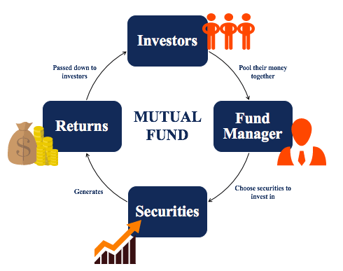

The financial landscape is undergoing significant changes, driven by the emergence and evolution of mutual funds and algorithmic trading. Mutual funds, managed by fund companies, have long been a cornerstone for both individual and institutional investors seeking diversification and professional management of their portfolios. These companies, such as Fidelity and Vanguard, play a crucial role in mitigating individual investment risks by offering a wide array of mutual fund options, each catering to different risk tolerances and investment objectives.

Algorithmic trading, on the other hand, represents a technological leap in fund management strategies. This approach harnesses the power of computer algorithms to execute trades at speeds and frequencies beyond human capability. As a result, it enhances liquidity and enables more precise and efficient trading, thereby offering fund companies a significant edge in asset management. The integration of algorithmic trading into mutual funds is transforming traditional investment practices by introducing a new level of precision and efficiency. 

Considering these advancements, this article will discuss how fund companies operate mutual funds while embedding algorithmic trading into their strategies. It will examine the benefits and challenges associated with these cutting-edge techniques, along with the prospects for future application and innovation in investment management.

## Table of Contents

## Understanding Fund Companies and Mutual Funds

A fund company operates as a corporate or trust entity dedicated to managing pooled capital for the purpose of investing in financial securities. These firms play a significant role in the financial sector by offering various investment vehicles, predominantly open-end and closed-end mutual funds. Open-end funds allow investors to enter and exit the fund at any time, with shares issued and redeemed as needed to meet investor demand. Closed-end funds, in contrast, issue a fixed number of shares, which are then traded on an exchange.

Prominent fund companies, such as Fidelity and Vanguard, are responsible for managing extensive portfolios while employing teams of experts to oversee and optimize investment strategies. These experts include portfolio managers and financial analysts who bring depth and insight into investment decisions, aiming to achieve the best possible returns for investors' capital.

Investors benefit significantly from mutual funds due to their inherent feature of portfolio diversification. By pooling resources, mutual funds are able to invest in a wide array of assets, which reduces the risk associated with individual investments. This diversification is guided by a strategic allocation across different asset classes, industries, and geographies. The principle here rests on the idea that if one asset class underperforms, gains in another can help mitigate overall portfolio losses, thus leveling out risk.

From a structural viewpoint, mutual funds offer professional management, [liquidity](/wiki/liquidity-risk-premium), and a diversified portfolio, making them an attractive option for both novice and experienced investors. Moreover, mutual funds are often easier and more cost-effective to manage compared to individually creating a comparable diversified portfolio.

In summary, fund companies are pivotal in offering investment vehicles like mutual funds, providing investors with access to diversified portfolios managed by experienced professionals, thereby serving as cornerstone institutions in contemporary asset management.

## The Operations of Investment in Mutual Funds

Fund companies employ a combination of portfolio managers, analysts, and advanced technology to effectively oversee their investment operations. This multifaceted approach ensures that they can manage substantial investment portfolios while aligning with the diverse financial objectives of their clients.

Active management is a primary strategy utilized by fund companies, involving the selection of specific stocks or securities with the aim of outperforming the broader market. This approach relies heavily on the expertise of portfolio managers and analysts who conduct extensive research and market analysis to identify lucrative investment opportunities. By contrast, passive management seeks to replicate the performance of a specific benchmark index, such as the S&P 500. This strategy typically involves investing in a diverse set of securities that mirror the index's composition, minimizing management costs and offering predictable returns aligned with the market.

Investors must pay attention to the fees and expenses associated with mutual funds, as these can significantly impact the net returns. Key components of these costs include management fees, which compensate the fund managers, and the expense ratio that comprises various operational costs as a percentage of assets under management. A higher expense ratio can eat into investment returns, making it crucial for investors to weigh these costs against potential performance benefits.

Fund companies offer a wide array of mutual funds designed to meet varying investment goals and risk appetites. These include equity funds focusing on stocks, fixed-income funds investing in bonds, and balanced funds that combine both equities and fixed income for a more diversified portfolio. Additionally, money market funds offer a safer, lower-risk option by investing in short-term, high-quality debt securities. Specialty funds, such as sector-specific or international funds, cater to investors interested in niche markets or geographical diversification.

By employing these strategies and tools, fund companies aim to optimize their portfolio management processes, ensuring that their mutual funds can meet the evolving needs of investors while navigating the complexities of the financial markets.

## Algorithmic Trading: A Game Changer in Fund Management

Algorithmic trading is a cutting-edge technique that utilizes computer programs to execute trades based on pre-defined strategies, operating at speeds and efficiencies beyond human capability. This method has revolutionized fund management by introducing several key advantages that align with the intricate demands of modern financial markets.

One significant benefit of [algorithmic trading](/wiki/algorithmic-trading) is its ability to execute trades with high precision and minimal latency. By operating based on set parameters, algorithms eliminate human error and emotional decision-making, which can often compromise trading effectiveness. This automation ensures that trades are consistently executed in line with the desired strategy, reducing discrepancies that often arise from manual trading processes.

Trend-following, [arbitrage](/wiki/arbitrage), and index fund rebalancing are some of the most common strategies employed in algorithmic trading. Trend-following strategies involve identifying and capitalizing on market [momentum](/wiki/momentum) by analyzing historical price data to predict future movements. Arbitrage takes advantage of price discrepancies in different markets or instruments, aiming to generate profit from these inefficiencies. Index fund rebalancing ensures that a fund stays aligned with its chosen market index by adjusting its holdings accordingly.

The implementation of algorithmic trading has also led to enhanced market liquidity. The sheer [volume](/wiki/volume-trading-strategy) of trades processed by algorithms contributes to a more dynamic market environment, facilitating easier entry and [exit](/wiki/exit-strategy) for investors. This increased liquidity can, in turn, lead to improved investment returns for mutual funds. By executing large volumes of trades efficiently, algorithmic trading helps manage orders in a way that minimizes market impact, thereby maintaining favorable stock prices for purchasing and selling.

Algorithmic trading tools are constantly evolving, leveraging advancements in data science and [machine learning](/wiki/machine-learning). These technologies enable the development of sophisticated algorithms that continuously learn and adapt to market conditions, enhancing decision-making processes. This synergy of technology and finance is pivotal in maintaining a competitive edge in fund management. 

In conclusion, algorithmic trading has emerged as a game changer in fund management, offering precision, efficiency, and improved liquidity. Its integration into mutual funds can potentially elevate performance and returns, marking a significant shift in investment strategy frameworks. This innovative approach continues to reshape the landscape of financial trading, driving the industry towards more data-driven and technology-oriented methodologies.

## Integrating Algo Trading with Mutual Funds

The synergy between mutual funds and algorithmic trading provides a pathway to enhanced portfolio performance. This integration is rooted in the ability of algorithms to make data-driven decisions that can execute trades with greater precision and optimize asset allocation effectively.

Algorithmic trading, by its nature, is equipped to tackle the complexities of large fund orders. These algorithms efficiently handle the execution of these orders, which is critical for mutual funds that often deal with extensive volumes of trades. The efficiency gained through algorithmic trading is primarily due to its capacity to process and analyze vast quantities of market data swiftly. This allows for the execution of trades at optimal times, thereby minimizing the market impact that large orders might typically have.

Moreover, algorithmic trading incorporates a range of strategies aimed at enhancing liquidity and profitability for mutual funds. Techniques such as trend-following, mean reversion, and [statistical arbitrage](/wiki/statistical-arbitrage) reduce the risks associated with human errors and emotional biases in trading decisions.

The combination of mutual funds and algorithmic trading thus represents a union of time-tested investment methodologies with cutting-edge technological tools. While mutual funds benefit from diversification and expert management, algorithmic trading introduces an element of precision and speed, driving potentially superior investment outcomes in an increasingly competitive financial landscape.

## Challenges and Considerations

Algorithmic trading, while transformative, is not without its challenges and considerations. One of the primary pitfalls is the risk of system failures, which can lead to significant financial losses. These failures may arise from hardware malfunctions, software bugs, or network disruptions. To mitigate such risks, robust system architecture and regular maintenance are essential.

Moreover, maintaining high data quality is critical. Poor data quality can lead to inaccurate models and erroneous trading decisions. Thus, fund companies must invest in reliable data sources and continuously monitor data integrity. Technological dependencies also play a key role; as algorithms rely on advanced computational power and server capabilities, ensuring that these technological resources are up-to-date and adequately maintained is crucial.

Regulatory compliance poses another significant challenge. Different regions impose varied regulatory standards on algorithmic trading, which can be complex and time-consuming for fund companies to navigate. Regulations such as the Markets in Financial Instruments Directive (MiFID II) in Europe demand transparency and aim to reduce systemic risk, requiring comprehensive reporting and monitoring systems.

To address these challenges, continuous [backtesting](/wiki/backtesting) of trading algorithms is necessary. Backtesting allows fund managers to evaluate the performance of their trading strategies against historical data, helping to identify and rectify potential weaknesses. Adaptation to market changes is equally essential. Markets are dynamic, and strategies that once were effective may become obsolete. Therefore, algorithmic models must be frequently updated to incorporate recent market developments and trends.

In conclusion, while algorithmic trading offers numerous advantages, careful management of system dependencies, regulatory adherence, and ongoing strategy refinement are imperative to harness its full potential. These practices not only enhance the effectiveness of trading strategies but also safeguard against the inherent risks associated with advanced financial technologies.

## Conclusion

The fusion of mutual funds and algorithmic trading represents a pivotal shift in investment management, setting the stage for a more dynamic and sophisticated approach to handling financial securities. By integrating algorithmic trading strategies, fund managers can achieve a strategic edge, harnessing the power of data and technology to enhance decision-making processes and optimize portfolio performance. This synergy not only facilitates efficient management of large fund orders but also minimizes market impact, thereby boosting overall returns.

For investors and fund managers, staying abreast of these technological advancements is crucial. Leveraging algorithmic trading tools requires an understanding of not merely the mechanics of these algorithms but also the broader market dynamics they are set into. Such education empowers stakeholders to navigate the evolving landscape of financial markets effectively.

As algorithmic trading continues to evolve, its influence on the management and trading of financial securities will become increasingly pronounced. This evolution calls for continuous adaptation, as strategies must be consistently backtested and refined to maintain their efficacy. Regulatory environments will also play a critical role, necessitating that traders and fund managers remain compliant while still innovating within these frameworks.

Ultimately, the ongoing development of algorithmic trading tools signifies a transformative period for mutual funds. It ushers in an era where data-driven, technology-enhanced strategies are not just advantageous but essential for those aiming to thrive in competitive markets. This trend underscores the importance of embracing technology to capitalize on the complex interplay of market forces, ensuring that mutual funds remain a robust and versatile investment vehicle for the future.

## References & Further Reading

Investopedia is a reliable resource for understanding the fundamentals and intricacies of mutual funds and algorithmic trading. It provides comprehensive guides on various investment concepts, helping readers grasp the nuances of portfolio management, the role of fund companies, and the mechanics of algorithmic trading strategies.

For those seeking a deeper academic perspective, exploring journals such as the "Journal of Finance" and "Journal of Financial Economics" can offer insights into state-of-the-art advancements and empirical research in investment strategies. These publications often cover topics related to the performance and efficiency of algorithmic trading, market impacts, and the evolving dynamics of fund management.

White papers from financial institutions or technology firms specializing in trading algorithms can also be valuable. These documents typically discuss innovative approaches, data analysis techniques, and the integration of technology with traditional investment practices. Companies like BlackRock and JP Morgan frequently publish reports that shed light on the intersection of finance and technology, which may be useful for individuals interested in future trends.

Additionally, "Algorithmic Trading and DMA" by Barry Johnson is a well-regarded book that covers practical aspects of implementing algorithmic strategies, including the development of trading systems and the consideration of market microstructure.

Utilizing platforms like SSRN (Social Science Research Network) can also be beneficial. SSRN hosts a plethora of research papers authored by academics and practitioners, providing insights into cutting-edge techniques and reviews of investment strategies that combine mutual funds with algorithmic trading.

