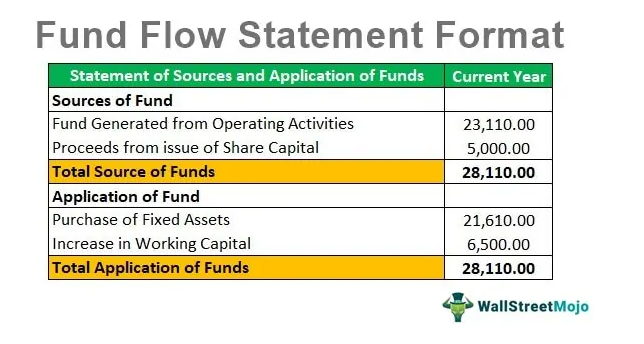

## Table of Contents

## What is fund flow and why is it important in financial analysis?

Fund flow refers to the movement of money in and out of various financial assets, such as stocks, bonds, and mutual funds. It shows how investors are putting their money into or taking it out of these investments over a certain period. Think of it like tracking the flow of water in a river; you can see where the water is coming from and where it's going. In financial terms, fund flow helps us understand if people are buying more of a certain type of investment or selling it.

Understanding fund flow is important in financial analysis because it gives us clues about what investors are thinking and doing. For example, if a lot of money is flowing into a particular stock, it might mean that investors believe the stock will do well in the future. On the other hand, if money is flowing out, it could signal that investors are worried about the stock's performance. By looking at fund flows, analysts can make better guesses about market trends and make smarter investment decisions.

## Can you explain the difference between fund flow and cash flow?

Fund flow and cash flow are two different concepts that help us understand money movement, but they focus on different things. Fund flow looks at the movement of money into and out of investments like stocks, bonds, and mutual funds. It tells us how much money investors are putting into or taking out of these investments over time. For example, if a lot of money is flowing into a mutual fund, it means more people are buying it, which can be a sign that they think it will do well.

Cash flow, on the other hand, is about the actual money coming in and going out of a business or a person's bank account. It's like keeping track of your wallet. If you earn money from your job and spend it on bills and groceries, that's your cash flow. Businesses use cash flow to see if they have enough money to pay their bills and keep running smoothly. While fund flow is more about investment trends, cash flow is about the day-to-day financial health of a business or individual.

## What are the main components of a fund flow statement?

A fund flow statement shows how money moves in and out of a business over a certain time. It helps us see where the money is coming from and where it's going. The main parts of a fund flow statement are the sources of funds and the uses of funds. Sources of funds are where the money comes from, like when a company makes a profit or sells some of its assets. Uses of funds are where the money goes, like when a company buys new equipment or pays off debts.

The statement also shows the changes in working capital, which is the money a business uses for its day-to-day operations. If a company has more money coming in than going out, its working capital goes up. If it's spending more than it's earning, the working capital goes down. By looking at these parts, we can understand if a business is doing well financially and how it's managing its money.

## How do you prepare a fund flow statement?

To prepare a fund flow statement, you start by looking at the balance sheets of a business at the beginning and end of a period, like a year. You need to find out how much money the business had at the start and how much it had at the end. Then, you figure out the changes in the business's assets, liabilities, and equity. Assets are things the business owns, like buildings or cash. Liabilities are what the business owes, like loans. Equity is the owner's share in the business. By comparing these, you can see where the money came from and where it went.

Next, you list all the sources of funds, which are the ways the business got money. This can be from profits, selling assets, or taking out loans. Then, you list all the uses of funds, which are the ways the business spent money, like buying new equipment or paying off debts. The difference between these sources and uses will show you the net change in the business's working capital. Working capital is the money used for daily operations. By putting all this together, you can create a fund flow statement that helps you understand how well the business is managing its money.

## What are some common sources and uses of funds in a business?

Common sources of funds for a business include the profits they make from selling their products or services. When a business earns more money than it spends, that extra money becomes a source of funds. Another source can be selling assets, like if a company decides to sell a building or a piece of equipment they no longer need. Borrowing money is also a common source of funds; businesses can take out loans from banks or issue bonds to investors. Sometimes, a business can also get money from its owners or shareholders, who might decide to put more money into the business.

On the other hand, businesses use funds for various things. One common use is buying new assets, like machinery or vehicles, which can help the business grow or operate more efficiently. Paying off debts is another big use of funds; if a business took out a loan, it needs to use some of its money to pay it back. Businesses also use funds to cover their day-to-day expenses, like paying employees, buying supplies, or keeping the lights on. Sometimes, they might use funds to pay dividends to shareholders, which is a way of sharing the company's profits with its owners.

## How can fund flow analysis help in understanding a company's liquidity?

Fund flow analysis can help us understand a company's liquidity by showing us how money moves in and out of the business. Liquidity is about how easily a company can turn its assets into cash to pay its bills. When we look at a fund flow statement, we can see if the company is getting more money from its operations, like selling products, or if it's relying on selling assets or borrowing money. If a company is making good profits and has enough money coming in to cover its expenses, it's a sign that it's liquid and can pay its bills easily.

On the other hand, if a company is spending more money than it's earning and its working capital is going down, it might have problems with liquidity. This means it might struggle to pay its bills on time. By looking at the sources and uses of funds, we can see if the company is using its money wisely or if it's in a tight spot. Fund flow analysis helps us understand these patterns and make better guesses about the company's financial health and its ability to stay liquid.

## What are the key indicators to look for in a fund flow statement?

When you look at a fund flow statement, one key thing to watch for is the change in working capital. Working capital is the money a business uses for its day-to-day activities. If the working capital is going up, it means the business is bringing in more money than it's spending, which is a good sign. If it's going down, it might mean the business is spending more than it's earning, which could be a problem.

Another important thing to look at is where the money is coming from and where it's going. If a business is getting most of its money from selling products or services, that's usually a good sign. But if it's relying a lot on selling assets or borrowing money, it might be struggling. Also, pay attention to how the business is using its money. If it's spending on things that help it grow, like new equipment, that's usually positive. But if it's using a lot of money to pay off debts or cover losses, it might be a warning sign.

By keeping an eye on these things, you can get a good idea of how well a business is managing its money and whether it's in a healthy financial position.

## How does fund flow analysis differ for different industries?

Fund flow analysis can look different depending on the industry a business is in. For example, in the tech industry, companies often spend a lot of money on research and development to create new products. This means their fund flow statements might show big uses of funds in these areas. They might also get money from investors who believe in their future growth, so their sources of funds could include a lot of investment money. On the other hand, a manufacturing company might show more money spent on buying machinery and raw materials, and their sources of funds might come more from selling their products.

In the retail industry, fund flow statements might focus a lot on inventory. Retail businesses need to keep a good stock of products to sell, so they might show a lot of money going into buying inventory. Their sources of funds often come from sales to customers. In contrast, a service industry like consulting might have fewer physical assets to buy, so their fund flow statements might show more money spent on salaries and less on equipment. Their sources of funds would mainly come from the fees they charge for their services. Each industry has its own way of making and spending money, which is why fund flow analysis can look so different from one industry to another.

## Can you provide an example of a fund flow statement for a manufacturing company?

Let's look at an example of a fund flow statement for a manufacturing company called ABC Manufacturing. At the start of the year, ABC had $500,000 in cash and by the end of the year, this had grown to $600,000. The company made a profit of $200,000 from selling their products. They also sold an old machine for $50,000, which added to their funds. On the other hand, ABC spent $100,000 on new machinery to help them make more products and $50,000 to pay off a loan they had taken out earlier. They also used $100,000 to buy raw materials needed for production.

When we look at the fund flow statement, we see that ABC Manufacturing's sources of funds were the profit from sales ($200,000) and the money from selling the old machine ($50,000), which together added up to $250,000. The uses of funds were the new machinery ($100,000), paying off the loan ($50,000), and buying raw materials ($100,000), which totaled $250,000. Even though the sources and uses of funds balanced out at $250,000, the company's cash increased by $100,000 because they started with $500,000 and ended with $600,000. This shows that ABC Manufacturing managed its money well and improved its liquidity over the year.

## How can fund flow analysis be used to predict future financial health?

Fund flow analysis can help predict a company's future financial health by showing where money is coming from and where it's going. If a company is making good profits and using that money to grow, like buying new equipment or investing in new projects, it's a sign that the company might do well in the future. On the other hand, if a company is always borrowing money or selling assets just to keep going, it might have trouble later on. By looking at these patterns, we can guess if the company will have enough money to keep running smoothly or if it might run into problems.

Another way fund flow analysis helps is by showing changes in working capital, which is the money a company uses for day-to-day operations. If the working capital is going up, it means the company is bringing in more money than it's spending, which is a good sign for the future. But if the working capital is going down, it might mean the company is spending more than it's earning, which could lead to problems paying bills or growing the business. By keeping an eye on these trends, we can get a better idea of whether the company will be financially healthy in the future.

## What are the limitations of fund flow analysis?

Fund flow analysis can be really helpful, but it has some limits. One big problem is that it only looks at money moving in and out, but it doesn't tell us everything about a company's financial health. For example, it doesn't show if the company is making money from its main business or if it's just selling off things to stay afloat. Also, fund flow statements are usually for a specific time, like a year, so they might not catch changes that happen faster or slower than that.

Another limit is that fund flow analysis can be tricky because it depends a lot on how well the numbers are put together. If there are mistakes or if someone tries to make the numbers look better than they really are, it can be hard to trust the analysis. Plus, different industries work in different ways, so what looks good for one kind of business might not be good for another. So, while fund flow analysis can give us clues about how a company is doing, we need to use other tools too to get the full picture.

## How can advanced statistical tools enhance the interpretation of fund flow data?

Advanced statistical tools can make understanding fund flow data a lot easier and more accurate. These tools help us find patterns and trends that might be hard to see just by looking at the numbers. For example, we can use regression analysis to see how different sources and uses of funds affect a company's working capital over time. This can help us predict how changes in the business might impact its future financial health. By using these tools, we can also compare a company's fund flow with others in the same industry to see if it's doing better or worse, which helps us make smarter decisions.

Another way statistical tools help is by making it easier to handle a lot of data. With big data and machine learning, we can quickly analyze huge amounts of fund flow information from different time periods and sources. This can uncover hidden patterns or unusual activities that might signal problems or opportunities. For instance, if we see a sudden change in how a company is using its money, these tools can help us figure out if it's a one-time thing or part of a bigger trend. By using advanced statistical tools, we get a clearer and more detailed picture of a company's financial situation, which can lead to better predictions and decisions.

## What are Investment Interpretation Strategies?

Investment interpretation is a critical component in the decision-making process for investors seeking to maximize returns while managing risk. This process requires not only an understanding of financial data but also the ability to discern market trends, economic indicators, and investor behaviors that influence asset prices.

### Fundamental Analysis

A primary strategy for investment interpretation is [fundamental analysis](/wiki/fundamental-analysis). This involves evaluating a company's financial statements, management, competitive advantages, and market conditions to estimate its intrinsic value. Key financial ratios such as the price-to-earnings (P/E) ratio, return on equity (ROE), and debt-to-equity ratio provide quantitative metrics that inform an investment's potential value. For instance, the intrinsic value can be calculated using the Dividend Discount Model (DDM), expressed as:

$$
P = \frac{D}{r - g}
$$

where $P$ is the price of the stock, $D$ is the dividend per share, $r$ is the required rate of return, and $g$ is the growth rate of dividends.

### Technical Analysis

Contrasting with fundamental analysis, technical analysis focuses on statistical trends gathered from trading activity, such as price movement and [volume](/wiki/volume-trading-strategy). This technique relies on chart patterns and indicators like moving averages and the Relative Strength Index (RSI) to identify potential market signals. By analyzing these metrics, investors can predict future price movements and make timely buy or sell decisions.

### Quantitative Analysis

Quantitative analysis employs mathematical models to evaluate investment opportunities. It involves creating algorithms that process historical data to identify patterns and correlations that can predict future movements. Python, a popular programming language among data scientists, is often used to implement these models. An example code snippet for calculating a simple moving average (SMA) is:

```python
import pandas as pd

def calculate_sma(data, window):
    return data.rolling(window=window).mean()

# Example usage
price_data = pd.Series([23, 25, 24, 26, 28, 27, 29])
sma = calculate_sma(price_data, window=3)
print(sma)
```

### Role of Technology and Data Analytics

The advent of technology and data analytics has significantly enhanced investment interpretation capabilities. Big data tools and [machine learning](/wiki/machine-learning) algorithms enable the processing of vast amounts of unstructured data to derive actionable insights. Predictive analytics models can incorporate various data sources, including social media sentiment and real-time market feeds, to forecast price movements more accurately.

Machine learning techniques such as linear regression, decision trees, and neural networks provide advanced frameworks for modeling financial data. These methods offer an adaptive approach to interpreting market signals, allowing investors to continuously refine their strategies based on evolving data patterns.

### Aligning Portfolios with Financial Goals

Investment strategies must align with an investor's financial goals, risk tolerance, and time horizon. Portfolio management tools use algorithms to optimize asset allocation according to these parameters, ensuring that investments are strategically positioned to achieve desired outcomes. The capital asset pricing model (CAPM), given by the formula:

$$
E(R_i) = R_f + \beta_i (E(R_m) - R_f)
$$

where $E(R_i)$ is the expected return on investment, $R_f$ is the risk-free rate, $\beta_i$ is the beta of the investment, and $E(R_m)$ is the expected market return, helps investors balance the trade-off between risk and return.

In conclusion, investment interpretation strategies encompass a range of techniques that, when combined with data analytics and technological tools, enhance the ability of investors to make informed decisions. This integrated approach facilitates the alignment of portfolios with specific financial objectives, ultimately contributing to more successful investment outcomes.

## References & Further Reading

[1]: Bergstra, J., Bardenet, R., Bengio, Y., & Kégl, B. (2011). ["Algorithms for Hyper-Parameter Optimization."](https://papers.nips.cc/paper/4443-algorithms-for-hyper-parameter-optimization) Advances in Neural Information Processing Systems 24.

[2]: Lopez de Prado, M. (2018). ["Advances in Financial Machine Learning."](https://www.amazon.com/Advances-Financial-Machine-Learning-Marcos/dp/1119482089) Wiley.

[3]: Aronson, D. R. (2006). ["Evidence-Based Technical Analysis: Applying the Scientific Method and Statistical Inference to Trading Signals."](https://www.amazon.com/Evidence-Based-Technical-Analysis-Scientific-Statistical/dp/0470008741) Wiley.

[4]: Jansen, S. (2020). ["Machine Learning for Algorithmic Trading: Second Edition."](https://github.com/stefan-jansen/machine-learning-for-trading) Packt Publishing.

[5]: Chan, E. P. (2008). ["Quantitative Trading: How to Build Your Own Algorithmic Trading Business."](https://github.com/ftvision/quant_trading_echan_book) Wiley Trading.