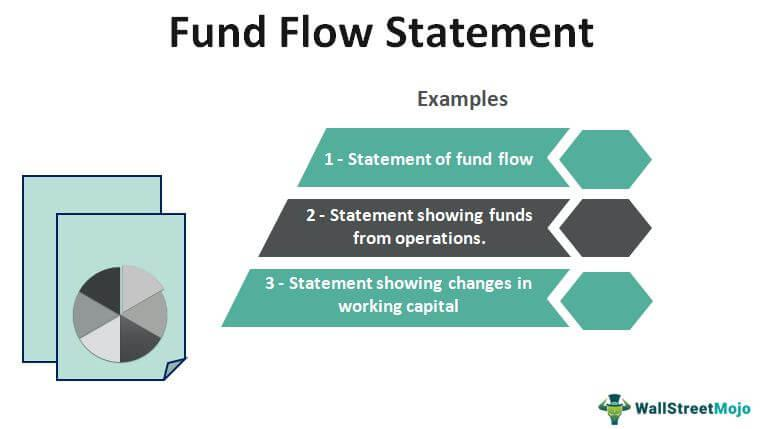

In today's rapidly evolving financial environment, understanding core concepts like financial analysis, fund flow, investment interpretation, and algorithmic trading has become increasingly critical for investors and traders. These elements are foundational to making informed decisions and navigate the complexities of modern financial markets, with each playing a distinct role in shaping market outcomes.

Financial analysis involves systematically evaluating a business's performance using its financial data, thereby enabling investors to determine the viability and competitive standing of potential investments. Tools such as financial ratios and trend analysis are commonly used methods in this process, providing insights that guide strategic decisions.



Fund flow, on the other hand, reveals the movement of capital within financial assets over a defined period, offering a window into investor sentiment and the collective behavior of market participants. Understanding fund flow is essential for gauging the attractiveness of investment vehicles like mutual funds and ETFs, and assessing overall economic health.

Investment interpretation strategies equip investors with the ability to decipher complex market signals and trends, aligning investments with their financial objectives. In this context, the use of technology and data analytics has revolutionized how market data is interpreted, offering enhanced precision and predictive capabilities.

Algorithmic trading represents a transformative advancement in executing market transactions. By leveraging automated software and complex algorithms, trades are executed based on predefined parameters with minimal human intervention. This approach not only improves the efficiency and speed of trades but also adds a quantitative dimension to strategic decision-making.

This article aims to explore how these components intersect, highlighting their significance and application in modern trading strategies. By examining the integration and mutual influence of these elements, readers will gain a comprehensive understanding of how they collectively shape investment decisions and market behaviors. The ongoing advancement of technology and analytical tools promises to further refine these practices, unlocking new possibilities in the financial domain.

## Table of Contents

## Understanding Financial Analysis

Financial analysis involves systematically examining businesses, projects, budgets, and other finance-related transactions, primarily to assess their performance and suitability. This evaluation process is crucial for making informed financial decisions and is typically drawn from the detailed examination of financial statements and ratios.

Financial statements represent the primary source of data in financial analysis, comprising the balance sheet, income statement, and cash flow statement. Each document provides insights into different aspects of a business's financial health. The balance sheet offers a snapshot of the entity's assets, liabilities, and equity at a given point, indicating the company's net worth. The income statement reveals performance over a period by detailing revenue, expenses, and profits or losses. The cash flow statement emphasizes [liquidity](/wiki/liquidity-risk-premium) by outlining cash inflows and outflows from operating, investing, and financing activities.

Financial ratios, derived from these statements, are instrumental in assessing a company's performance. Common ratios include:

1. **Liquidity Ratios**: These measure a company's ability to cover its short-term obligations. For example, the current ratio (Current Assets / Current Liabilities) and the quick ratio ((Current Assets - Inventories) / Current Liabilities) assess short-term financial health.

2. **Profitability Ratios**: These evaluate a company's ability to generate profit relative to sales, assets, and equity. The return on assets (ROA) ratio (Net Income / Total Assets) and return on equity (ROE) ratio (Net Income / Shareholder's Equity) are commonly used metrics.

3. **Leverage Ratios**: These indicate the extent of a company's financing from debt compared to equity. The debt-to-equity ratio (Total Debt / Total Equity) is a standard measure of a company’s capital structure.

4. **Efficiency Ratios**: These assess how effectively a company utilizes its assets. The inventory turnover ratio (Cost of Goods Sold / Average Inventory) and the accounts receivable turnover ratio (Net Credit Sales / Average Accounts Receivable) are significant indicators.

5. **Market Ratios**: These provide insights into the company's financial markets and valuation. The price-to-earnings ratio (P/E Ratio = Market Value per Share / Earnings per Share) is one commonly used metric in this category.

Beyond ratios, financial analysis may leverage more advanced tools and techniques. Discounted cash flow (DCF) analysis, for example, involves estimating the value of an investment based on its expected future cash flows, using a discount rate to account for the time value of money. Sensitivity and scenario analyses are also commonly employed to understand how different variables impact financial outcomes.

Technological advancements play a critical role in financial analysis. Software tools can automate data collection and analysis, increasing accuracy and efficiency. Python, with its powerful data analysis libraries such as Pandas and NumPy, is frequently used by financial analysts to perform complex calculations and model financial data. For instance, a basic Python snippet for calculating a liquidity ratio might look as follows:

```python
# Example: Calculating the Current Ratio using Python
current_assets = float(input("Enter the value for current assets: "))
current_liabilities = float(input("Enter the value for current liabilities: "))
current_ratio = current_assets / current_liabilities
print(f"The Current Ratio is: {current_ratio:.2f}")
```

This combination of financial theory and technology makes financial analysis a pivotal component of strategic planning and investment decision-making. By systematically analyzing financial data, investors and businesses can foresee trends, mitigate risks, and capitalize on growth opportunities.

## Decoding Fund Flow

Fund flow analysis is a crucial aspect of understanding the financial markets as it reflects the movement of funds into and out of financial assets over a specific timeframe. This cash flow information provides valuable insights into investor sentiment, allowing analysts to gauge whether investors are optimistic or pessimistic about the markets.

Fund flow can be considered a barometer of investor activity. Positive fund flow indicates that investors are putting more money into particular financial assets, suggesting increasing confidence and potential for price appreciation. Conversely, a negative fund flow suggests a withdrawal of funds, which may be indicative of declining investor confidence or a bearish market outlook.

In assessing financial health and performance, fund flow is particularly significant for investment vehicles such as mutual funds and exchange-traded funds (ETFs). These vehicles rely heavily on net inflows to sustain their investment strategies and enhance performance. Net inflow can denote not only the health of the fund itself but also its perceived attractiveness compared to alternatives in the market. For investors and analysts, tracking these flows can inform decisions about how and where to allocate resources most efficiently.

The mechanics of fund flow involve analyzing various factors, including the number of shares or units being purchased or redeemed, the total investment in monetary terms, and the specific time periods over which these transactions occur. By monitoring these metrics, market participants can gain insights into the broader market dynamics and potential future price movements.

Furthermore, fund flow analysis has broader implications for market dynamics. Significant inflows or outflows can affect the liquidity of certain assets, alter supply and demand dynamics, and influence asset prices. For instance, large inflows into an [ETF](/wiki/etf-trading-strategies) can increase demand for the securities it holds, thereby pushing up their prices. Conversely, substantial outflows require the fund to sell assets to meet redemption requests, potentially exerting downward pressure on prices.

Ultimately, fund flow serves as a vital analytical tool for financial professionals. By understanding these flows and their implications, market participants can develop more informed investment strategies, anticipate market trends, and mitigate potential risks.

## Investment Interpretation Strategies

Investment interpretation is a critical component in the decision-making process for investors seeking to maximize returns while managing risk. This process requires not only an understanding of financial data but also the ability to discern market trends, economic indicators, and investor behaviors that influence asset prices.

### Fundamental Analysis

A primary strategy for investment interpretation is [fundamental analysis](/wiki/fundamental-analysis). This involves evaluating a company's financial statements, management, competitive advantages, and market conditions to estimate its intrinsic value. Key financial ratios such as the price-to-earnings (P/E) ratio, return on equity (ROE), and debt-to-equity ratio provide quantitative metrics that inform an investment's potential value. For instance, the intrinsic value can be calculated using the Dividend Discount Model (DDM), expressed as:

$$
P = \frac{D}{r - g}
$$

where $P$ is the price of the stock, $D$ is the dividend per share, $r$ is the required rate of return, and $g$ is the growth rate of dividends.

### Technical Analysis

Contrasting with fundamental analysis, technical analysis focuses on statistical trends gathered from trading activity, such as price movement and [volume](/wiki/volume-trading-strategy). This technique relies on chart patterns and indicators like moving averages and the Relative Strength Index (RSI) to identify potential market signals. By analyzing these metrics, investors can predict future price movements and make timely buy or sell decisions.

### Quantitative Analysis

Quantitative analysis employs mathematical models to evaluate investment opportunities. It involves creating algorithms that process historical data to identify patterns and correlations that can predict future movements. Python, a popular programming language among data scientists, is often used to implement these models. An example code snippet for calculating a simple moving average (SMA) is:

```python
import pandas as pd

def calculate_sma(data, window):
    return data.rolling(window=window).mean()

# Example usage
price_data = pd.Series([23, 25, 24, 26, 28, 27, 29])
sma = calculate_sma(price_data, window=3)
print(sma)
```

### Role of Technology and Data Analytics

The advent of technology and data analytics has significantly enhanced investment interpretation capabilities. Big data tools and [machine learning](/wiki/machine-learning) algorithms enable the processing of vast amounts of unstructured data to derive actionable insights. Predictive analytics models can incorporate various data sources, including social media sentiment and real-time market feeds, to forecast price movements more accurately.

Machine learning techniques such as linear regression, decision trees, and neural networks provide advanced frameworks for modeling financial data. These methods offer an adaptive approach to interpreting market signals, allowing investors to continuously refine their strategies based on evolving data patterns.

### Aligning Portfolios with Financial Goals

Investment strategies must align with an investor's financial goals, risk tolerance, and time horizon. Portfolio management tools use algorithms to optimize asset allocation according to these parameters, ensuring that investments are strategically positioned to achieve desired outcomes. The capital asset pricing model (CAPM), given by the formula:

$$
E(R_i) = R_f + \beta_i (E(R_m) - R_f)
$$

where $E(R_i)$ is the expected return on investment, $R_f$ is the risk-free rate, $\beta_i$ is the beta of the investment, and $E(R_m)$ is the expected market return, helps investors balance the trade-off between risk and return.

In conclusion, investment interpretation strategies encompass a range of techniques that, when combined with data analytics and technological tools, enhance the ability of investors to make informed decisions. This integrated approach facilitates the alignment of portfolios with specific financial objectives, ultimately contributing to more successful investment outcomes.

## Algorithmic Trading: Revolutionizing Market Transactions

Algorithmic trading, also known as algo trading, refers to the use of computer algorithms to automate trading decisions with minimal human intervention. This methodology is fundamentally transforming market transactions by introducing unprecedented levels of speed, precision, and efficiency in executing trades. At its core, [algorithmic trading](/wiki/algorithmic-trading) relies on complex mathematical models and formulas to make decisions about buying or selling financial instruments based on predetermined criteria. 

### Benefits of Algorithmic Trading

1. **Speed and Efficiency**: One of the most significant advantages of algorithmic trading is its ability to execute orders much faster than any human trader could. This swiftness is critical in markets where prices can change within milliseconds. Algorithms can scan and react to multiple market conditions simultaneously, allowing for high-frequency trading (HFT), where trades are executed at incredibly high speeds.

2. **Accuracy and Reduced Errors**: With precise programming, algorithmic trading minimizes human errors related to manual execution. The trading decisions are based on quantitative data and predefined rules, ensuring consistency and eliminating the emotional biases that often affect human traders.

3. **Backtesting and Optimization**: Algorithms can be backtested using historical data to determine their viability before being applied in live markets. This process of optimization allows traders to refine their strategies for better performance and reduced risks.

4. **Market Impact**: Algorithmic trading can help reduce market impact by breaking down large orders into smaller ones, executed gradually over time or across multiple venues. This strategy, known as slicing, minimizes the chance of significant price shifts due to large single trades.

### Risks of Algorithmic Trading

Despite its advantages, algorithmic trading carries certain risks that need to be acknowledged:

1. **Technical Failures**: Reliance on technology means that any software bugs, network downtimes, or hardware failures could severely impact trade outcomes. Consequently, robust risk management protocols and fail-safes are essential.

2. **Market Volatility**: The rapid execution and high volume of trades associated with algorithmic trading can contribute to market volatility. In some instances, they may exacerbate price swings, as was observed during the 2010 Flash Crash.

3. **Over-Optimization**: An overly optimized algorithm, tailored to historical data, might not perform well in live markets. This phenomenon, known as overfitting, can lead to substantial losses if the market dynamics differ from historical trends.

### Technological Advancements

The rise of algorithmic trading is closely linked to technological advancements, particularly in computing power and data analytics:

1. **Increased Computational Power**: The continuous improvement in computational power and hardware affordability enables the development and execution of complex algorithms capable of handling massive volumes of data.

2. **Machine Learning and AI**: Recent trends incorporate machine learning and artificial intelligence to adaptively enhance trading strategies. These technologies enable algorithms to learn from market behavior and improve over time, potentially identifying and exploiting patterns that static algorithms might miss.

3. **Big Data**: The availability of vast datasets allows for more nuanced analysis and strategy development. With big data analytics, traders can incorporate diverse inputs, from market feeds to economic indicators, enhancing the robustness of algorithmic strategies.

### Impact on Traditional Trading

Algorithmic trading has significantly reshaped traditional trading practices. By automating repetitive tasks and rapidly analyzing market conditions, it allows traders to focus on strategic decision-making. However, it also increases competition, as individuals and institutions without access to sophisticated algorithms or necessary infrastructure may find themselves at a disadvantage.

In conclusion, while algorithmic trading presents considerable benefits in terms of efficiency and speed, its successful implementation requires careful consideration of the risks and technological dependencies involved. The integration of innovative technologies continues to drive change in market structures, offering new opportunities and challenges for all market participants.

## Integrating Fund Flow Analysis in Algo Trading

Analyzing fund flow is a critical task for algorithmic traders aiming to understand market sentiment and liquidity, as these factors can significantly influence trading decisions. Fund flow data, which tracks the net inflow and outflow of funds from investment vehicles over a period, offers valuable insights into investor behavior and prevailing market trends. By integrating this data into algorithmic trading models, traders can develop a more nuanced understanding of potential market movements and optimize their strategies accordingly.

Incorporating fund flow data into algorithmic models allows for the anticipation of price movements by identifying trends in capital allocation. For instance, a sustained influx of funds into a particular sector might signal increased investor confidence, potentially driving prices upward. Conversely, consistent outflows might indicate waning interest and potential price declines. Quantitative models, therefore, consider these fund flow patterns to make predictions about future market dynamics.

Machine learning algorithms enhance fund flow analysis by identifying complex patterns and correlations that may not be immediately apparent through traditional analytical methods. These algorithms can process vast datasets, extracting subtle signals from fund flows that could inform trading strategies. For example, by using supervised learning techniques, traders can train models to recognize historical flow patterns associated with specific market conditions and predict similar scenarios in the future.

In practice, a Python-based approach might involve using libraries such as pandas and scikit-learn to handle and analyze fund flow data. Below is a simplified example that illustrates how one might model fund flow data to predict market trends:

```python
import pandas as pd
from sklearn.model_selection import train_test_split
from sklearn.ensemble import RandomForestClassifier
from sklearn.metrics import accuracy_score

# Load fund flow data and market indicators
data = pd.read_csv('fund_flow_data.csv')

# Preprocess data
# Assume fund_flows and market_trend are columns in the dataset
X = data[['fund_flows', 'other_features']]
y = data['market_trend']

# Split data into train and test sets
X_train, X_test, y_train, y_test = train_test_split(X, y, test_size=0.2, random_state=42)

# Initialize and train Random Forest model
model = RandomForestClassifier(n_estimators=100, random_state=42)
model.fit(X_train, y_train)

# Predict market trends
y_pred = model.predict(X_test)

# Evaluate model accuracy
accuracy = accuracy_score(y_test, y_pred)
print(f"Model Accuracy: {accuracy:.2f}")
```

This basic model could be refined and expanded by incorporating additional features and using more sophisticated machine learning techniques. Overall, the integration of fund flow analysis within algorithmic trading frameworks can provide traders with a significant edge, enabling more accurate predictions and improved trading performance. As technology continues to advance, the capability to use comprehensive data analytics and machine learning will become increasingly essential in the development of cutting-edge trading algorithms.

## The Role of Data and Technology

Modern trading and investment have undergone a significant transformation, driven largely by rapid advancements in data analytics and technology. The sheer volume of financial data generated daily necessitates sophisticated tools and infrastructure to analyze and derive actionable insights, reshaping trading strategies and investment decisions.

Historically, financial markets relied on traditional data such as price charts and economic indicators. However, with the exponential growth of data sources—ranging from social media sentiment to high-frequency trading ([HFT](/wiki/high-frequency-trading-strategies)) data streams—there is a pressing need for advanced analytics to harness this information effectively. Data analytics in financial markets has evolved from simple statistical analyses to complex models incorporating various data types, providing deeper insights into market dynamics and investor behavior.

AI and big data technologies play a pivotal role in this evolution. Machine learning algorithms, for instance, are extensively used to uncover patterns and predict market trends based on historical and real-time data. These models can process vast datasets, identifying subtle correlations and anomalies that humans might overlook. Python, with its rich ecosystem of libraries like pandas, NumPy, Scikit-learn, and TensorFlow, is often used for building and testing these predictive models. Consider the following simple example of using Python to predict stock prices:

```python
import pandas as pd
from sklearn.ensemble import RandomForestRegressor

# Load historical stock data
data = pd.read_csv('stock_data.csv')
features = data[['feature1', 'feature2', 'feature3']]  # example features
target = data['target']  # stock prices

# Create and train the model
model = RandomForestRegressor()
model.fit(features, target)

# Predict future stock prices
predictions = model.predict(features)
```

The integration of big data analytics enables investors to interpret complex datasets efficiently, enhancing investment outcomes and operational efficiencies. For example, fund managers can now analyze customer sentiment data to adjust portfolio strategies proactively, thereby optimizing returns while managing risks.

In addition to AI, the advent of cloud computing has revolutionized data processing capabilities. Cloud platforms offer scalable resources that facilitate the ingestion, storage, and processing of massive datasets, supporting real-time analytics and decision-making processes. This democratization of computational resources allows both individual investors and large financial institutions to exploit data-driven insights without the need for substantial infrastructure investments.

Moreover, blockchain technology is emerging as a critical component in ensuring data integrity and transparency within the financial sector. By providing a secure and decentralized ledger system, blockchain enhances trust in financial transactions and processes, potentially reducing fraud and operational risks.

As the financial industry continues to embrace these technological advancements, the synergy between data analytics and cutting-edge technology will undoubtedly lead to more informed and strategic investment approaches. This evolution not only improves market efficiency but also democratizes financial analysis, making it accessible to a broader audience beyond traditional financial professionals. Consequently, adopting these technologies is no longer optional but a necessity for any entity seeking to remain competitive in the modern financial landscape.

## Conclusion

Financial analysis, fund flow, investment interpretation, and algorithmic trading are integral components of the modern financial landscape, each playing a crucial role in shaping investment strategies and trading behaviors. Financial analysis provides the foundational understanding of a financial asset's health and potential, enabling informed decision-making through the evaluation of financial statements and ratios. This critical analysis helps investors identify opportunities and risks within their portfolios.

Fund flow analysis sheds light on investor sentiment and market dynamics by tracking the movement of cash across various investment vehicles. This enables investors to gauge market trends and adjust their strategies accordingly. The insights derived from fund flow data can influence both short-term trading decisions and long-term investment planning, ultimately impacting market behaviors.

Investment interpretation further enhances the decision-making process by utilizing financial data and market trends to develop strategic insights. As markets grow increasingly complex, technology and data analytics play an essential role in refining these interpretations, allowing for more precise alignment of investment portfolios with financial goals. Leveraging data analytics and modern technologies such as [artificial intelligence](/wiki/ai-artificial-intelligence) can significantly enhance the accuracy and effectiveness of investment strategies.

Algorithmic trading represents a paradigm shift in trading practices, driven by the need for speed, efficiency, and accuracy in market transactions. By employing automated systems to execute trades based on predefined criteria, algorithmic trading minimizes human error and maximizes market efficiency. The integration of fund flow analysis within algorithmic models further optimizes trading strategies by predicting market movements with enhanced accuracy.

As technology and data analytics continue to evolve, their impact on financial markets will only grow. The fusion of data-driven insights and technology-driven execution offers investors and traders new tools to navigate market complexities and increase their potential for success. The ongoing advancement in these fields promises to refine and expand the capabilities of financial practices, pushing the boundaries of what is achievable in the financial markets. By embracing these interconnected elements, investors and traders can position themselves to take advantage of emerging opportunities and mitigate potential risks, thus ensuring a more robust and informed approach to financial decision-making.

## References & Further Reading

[1]: Bergstra, J., Bardenet, R., Bengio, Y., & Kégl, B. (2011). ["Algorithms for Hyper-Parameter Optimization."](https://papers.nips.cc/paper/4443-algorithms-for-hyper-parameter-optimization) Advances in Neural Information Processing Systems 24.

[2]: Lopez de Prado, M. (2018). ["Advances in Financial Machine Learning."](https://www.amazon.com/Advances-Financial-Machine-Learning-Marcos/dp/1119482089) Wiley.

[3]: Aronson, D. R. (2006). ["Evidence-Based Technical Analysis: Applying the Scientific Method and Statistical Inference to Trading Signals."](https://www.amazon.com/Evidence-Based-Technical-Analysis-Scientific-Statistical/dp/0470008741) Wiley.

[4]: Jansen, S. (2020). ["Machine Learning for Algorithmic Trading: Second Edition."](https://github.com/stefan-jansen/machine-learning-for-trading) Packt Publishing.

[5]: Chan, E. P. (2008). ["Quantitative Trading: How to Build Your Own Algorithmic Trading Business."](https://github.com/ftvision/quant_trading_echan_book) Wiley Trading.