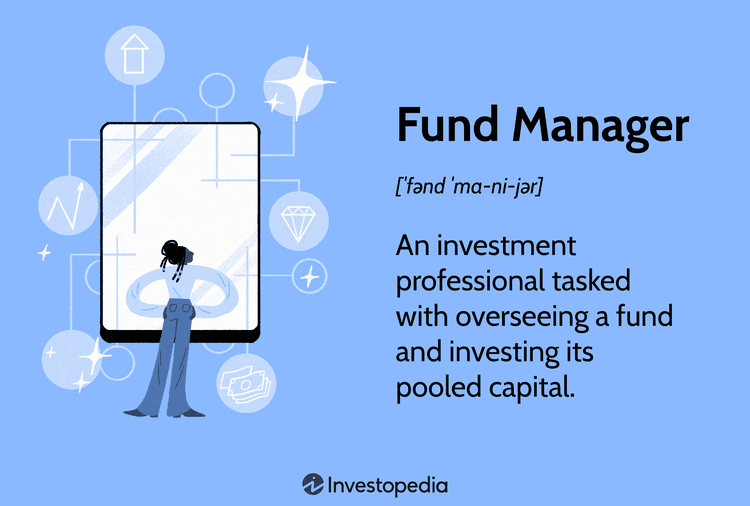

A fund manager is a financial professional responsible for managing investment portfolios on behalf of clients. This role is pivotal in the financial sector as fund managers make decisions about asset allocation and investment strategy to optimize returns while mitigating risks. Their expertise helps clients, ranging from individual investors to large institutions, achieve their financial objectives.

Understanding the responsibilities of a fund manager is increasingly important in today’s dynamic market environment. The financial markets are characterized by rapid changes due to economic shifts, geopolitical events, and technological advancements. As a result, fund managers must be adept at navigating these challenges to maintain and enhance portfolio value. This involves performing thorough risk assessments, conducting rigorous market analyses, and staying informed about regulatory developments to ensure compliance and ethical management of funds.

Algorithmic trading is emerging as a transformative force in the investment landscape. By utilizing complex algorithms and high-speed data processing, algorithmic trading enables fund managers to execute trades efficiently, often capitalizing on minute market inefficiencies much faster than traditional methods. This technological advancement is reshaping investment strategies by allowing for more precise decision-making and optimization of trading processes.

This article provides a comprehensive exploration of the responsibilities and career path of fund managers, alongside examining the impact of algorithmic trading and the integration of technology in investment strategies. The importance of fund management in today’s financial world cannot be overstated, as these professionals are crucial in guiding investment decisions and contributing to the economic growth and stability of financial markets.

The growing influence of technology, coupled with the need for astute decision-making and client management, underscores the value of fund managers in the modern financial landscape. This career path offers dynamic opportunities for those who can adapt to evolving challenges and leverage technological advancements. As the financial industry continues to evolve, the role of the fund manager is becoming increasingly critical, presenting numerous opportunities for growth and specialization.

## Table of Contents

## Understanding Fund Manager Investment Responsibilities

A fund manager is primarily responsible for overseeing investment portfolios, ensuring they meet specific financial objectives, and aligning them with the investment strategies of their clients or institutions. This role mandates a keen understanding of portfolio management and asset allocation. Portfolio management involves selecting a variety of investment vehicles such as stocks, bonds, real estate, or other assets to optimize returns while minimizing risk. Asset allocation, on the other hand, is the strategic distribution of assets across these various categories to achieve a balanced risk-return profile. This process is often informed by modern portfolio theory (MPT), which suggests that for any given level of return, diversification can help reduce portfolio risk.

Risk assessment and mitigation form a cornerstone of fund management. Fund managers must identify potential risks that could impact portfolio performance, such as market [volatility](/wiki/volatility-trading-strategies), [interest rate](/wiki/interest-rate-trading-strategies) changes, or geopolitical events. Mitigation strategies might include using hedging techniques, such as futures or options, or reallocating assets to less volatile sectors. An accurate risk assessment ensures that the portfolio can withstand unfavorable market conditions and still meet investment goals.

Client relationship management and communication are critical for fund managers. It is essential to maintain transparency and build trust by keeping clients informed about investment decisions, portfolio performance, and potential risks. Effective communication involves regular updates and tailored advice that considers clients' financial goals and risk tolerance.

Regulatory compliance and ethical considerations are also paramount. Fund managers must navigate a complex landscape of regulations set by entities such as the Securities and Exchange Commission (SEC) in the United States. Compliance ensures not only the legality of investment activities but also protects clients from fraud and malpractice. Ethical considerations guide fund managers to act in the best interest of their clients, adhering to principles of fairness and honesty.

The responsibilities of fund managers have evolved with technological advancements. The integration of sophisticated analytics, [artificial intelligence](/wiki/ai-artificial-intelligence), and [machine learning](/wiki/machine-learning) tools enables more data-driven decision-making processes. Technologies like blockchain and fintech solutions offer new avenues for improving efficiency and transparency in fund management. As these technologies advance, fund managers must adapt continually, acquiring new skills to leverage these tools effectively while maintaining the human element vital for nuanced investment decisions.

## Career Path of a Fund Manager

The path to becoming a fund manager typically begins with entry-level positions in the financial industry. Often, individuals start as financial analysts, gaining experience in assessing investment opportunities and understanding market dynamics. These roles provide a foundational comprehension of financial statements, economic indicators, and valuation methods, essential for more advanced responsibilities in fund management.

Educational qualifications are crucial for aspiring fund managers. A bachelor's degree in finance, economics, or a related field is often the minimum requirement. However, many successful fund managers hold advanced degrees such as a Master of Business Administration (MBA) or a Master’s in Finance. Additionally, obtaining certifications can significantly bolster a candidate’s credentials. The Chartered Financial Analyst (CFA) designation is highly respected and demonstrates a deep knowledge of investment analysis, portfolio management, and ethical practices. Other relevant certifications include the Certified Financial Planner (CFP) and Financial Risk Manager (FRM) designations, which emphasize planning and risk assessment skills.

Key skills like analytical thinking, decision-making, and leadership are indispensable for fund managers. Analytical skills are necessary for evaluating investment opportunities and risks. Decision-making capabilities allow fund managers to make informed choices that impact the performance of investment portfolios. Leadership skills are crucial for managing teams and communicating effectively with clients and other stakeholders.

Fund management offers various career advancements and specialization opportunities. As professionals gain experience, they may progress to senior analyst roles, portfolio managers, and eventually, fund managers overseeing significant assets. Specializations may include focusing on specific asset classes, such as equities, fixed income, or alternative investments, and engaging in sustainable or socially responsible investing.

Current trends in the financial industry create numerous opportunities for fund managers. The growing emphasis on environmental, social, and governance ([ESG](/wiki/esg-investing)) criteria has opened new avenues for those skilled in sustainable investments. Additionally, the increasing role of technology, such as data analytics and [algorithmic trading](/wiki/algorithmic-trading), by which fund managers can leverage computer-driven models to enhance investment strategies, offers unique prospects for future-oriented professionals. As the industry evolves, the ability to adapt to technological advancements and changing market preferences becomes more critical, presenting a dynamic and rewarding career path for aspiring fund managers.

## The Role and Influence of Algorithmic Trading

Algorithmic trading, often referred to as algo trading, is a systematic approach to executing orders using pre-programmed trading instructions. These instructions take into account variables such as price, timing, and [volume](/wiki/volume-trading-strategy), and are powered by mathematical models and algorithms. This method of trading is revolutionizing investment strategies by offering the potential for increased trading efficiency and reduced transaction costs.

### Advantages of Integrating Algorithmic Trading for Fund Managers

1. **Efficiency and Speed**: Algorithmic trading enables fund managers to execute orders at speeds and frequencies that are impossible for human traders. This rapid execution facilitates the taking advantage of minute price differences and short-term market inefficiencies, ultimately leading to potentially higher returns.

2. **Cost Reduction**: By minimizing human intervention in trading, algorithmic systems can significantly lower transaction costs. Algorithms also help in optimizing order execution, ensuring trades are completed at the best possible prices, thereby reducing market impact costs.

3. **Elimination of Human Error**: Automation in trading minimizes the likelihood of human errors, such as those caused by emotional decision-making. This leads to more consistent and objective trading strategies.

4. **Backtesting Capabilities**: Algorithmic strategies allow fund managers to backtest their models on historical data, providing insights into how strategies would have performed in different market conditions. This is crucial for refining trading systems before actual deployment.

### Challenges and Limitations Associated with Algo Trading

Despite its benefits, algorithmic trading is not devoid of challenges. One significant limitation is the potential for technical failures, such as software bugs or network issues, which can lead to substantial financial losses. Additionally, algorithms can also contribute to increased market volatility, as evidenced during events like the 2010 Flash Crash.

Another challenge lies in the complex nature of writing robust and adaptive algorithms. Developing a successful trading algorithm requires not only strong programming skills but also deep market insights and accurate forecasting abilities.

### Case Studies of Successful Fund Managers Utilizing Algorithmic Trading

Several fund managers have successfully integrated algorithmic trading into their investment strategies. Renaissance Technologies, for example, is renowned for its Medallion Fund, which relies heavily on high-frequency trading ([HFT](/wiki/high-frequency-trading-strategies)) and algorithmic models to achieve extraordinary returns. Similarly, Two Sigma Investments utilizes machine learning and sophisticated algorithms to analyze large datasets and drive its trading decisions.

### Future Prospects of Algorithmic Trading in Fund Management

The future of algorithmic trading in fund management is poised for substantial growth, driven by advancements in technology such as machine learning and artificial intelligence. These tools offer the potential to improve the predictive power of trading models, thus enhancing the ability of fund managers to generate consistent returns. Additionally, the increasing availability of big data provides fund managers with deeper insights into market trends and consumer behavior, further enriching algorithmic models.

As regulatory frameworks continue to evolve, there will be an emphasis on ensuring that algorithmic trading contributes positively to market stability. Fund managers who are adept at balancing these technological advancements with prudent risk management practices are likely to succeed in this rapidly changing environment.

## Integrating Technology in Fund Management

Technology has become a cornerstone in fund management, significantly enhancing decision-making and operational efficiency. By leveraging advanced algorithms and data analytics, fund managers can make more informed investment decisions and optimize portfolio performance.

Emerging financial technologies are rapidly transforming fund management. Artificial intelligence (AI) and machine learning (ML) algorithms enable managers to predict market trends and behaviors with improved accuracy. These technologies analyze vast datasets to identify patterns and anomalies that human analysts might overlook, thereby facilitating proactive investment strategies. Blockchain technology is also influencing fund management by enhancing transparency and security. It allows real-time validation of transactions, reducing the risk of fraud and improving trust among stakeholders.

Adopting technological solutions in fund management requires careful consideration. Fund managers must assess the integration costs, potential disruptions to existing systems, and the training needs of their staff. It is crucial to ensure that these technologies align with the fund's overarching strategy and compliance requirements. Furthermore, cybersecurity measures must be strengthened to protect sensitive financial data from potential breaches.

Balancing traditional investment methods with new technological tools is imperative for fund managers. While technology offers numerous advantages, the human element remains essential in interpreting complex market dynamics and making judgments that machines cannot. A hybrid approach that combines quantitative data analysis with qualitative insights is often ideal. For instance, a Python-based quantitative model can provide a baseline analysis, but a manager's expertise is invaluable in adjusting for geopolitical or economic shifts not fully captured in the data.

The future outlook for technology in fund management is promising, with continuous advancements expected to redefine the industry. Innovations such as quantum computing might eventually solve currently unsolvable financial calculations, opening up new avenues for risk assessment and portfolio optimization. As technology evolves, fund managers will need to embrace these innovations and continue learning to maintain a competitive edge. The successful integration of technology will likely lead to more agile and efficient fund management practices, ultimately benefiting investors and contributors alike.

## Conclusion

In the rapidly evolving financial landscape, fund managers occupy a crucial role, balancing traditional investment responsibilities with the dynamic shifts brought about by technology. As discussed, fund managers are tasked with the intricate responsibilities of portfolio management, risk assessment, client relationship management, and regulatory compliance. These responsibilities require not only a deep understanding of financial markets but also an astute approach to risk mitigation and asset allocation.

The career path of a fund manager is marked by a journey from entry-level positions to more advanced roles, requiring a robust blend of educational qualifications, certifications, and essential skills such as analytical thinking and decision-making. As financial markets continue to evolve, so too do the opportunities and specializations available within fund management.

Algorithmic trading represents one of the most significant advancements influencing fund management today. It offers more precise, efficient, and data-driven investment strategies but also presents challenges in terms of ethical considerations and regulatory compliance. Successful integration of algorithmic trading can enhance a fund manager's ability to optimize investment strategies, although it necessitates a careful balance between traditional and algorithmic methods.

Looking ahead, technology is poised to further transform fund management. Emerging financial technologies promise to enhance decision-making processes and improve operational efficiencies. Yet, the adoption of these technological tools must be balanced with traditional investment practices to ensure comprehensive and effective fund management strategies.

The future of fund management in a tech-driven world highlights the importance of continuous learning and adaptation. Aspiring fund managers are encouraged to embrace the challenges and opportunities posed by technological advancements. As the financial sector continues to evolve, a commitment to ongoing education and flexibility will be key to navigating the complexities of modern fund management.

## References & Further Reading

[1]: Bergstra, J., Bardenet, R., Bengio, Y., & Kégl, B. (2011). ["Algorithms for Hyper-Parameter Optimization."](https://papers.nips.cc/paper/4443-algorithms-for-hyper-parameter-optimization) Advances in Neural Information Processing Systems 24.

[2]: ["Advances in Financial Machine Learning"](https://www.amazon.com/Advances-Financial-Machine-Learning-Marcos/dp/1119482089) by Marcos Lopez de Prado

[3]: ["Evidence-Based Technical Analysis: Applying the Scientific Method and Statistical Inference to Trading Signals"](https://www.amazon.com/Evidence-Based-Technical-Analysis-Scientific-Statistical/dp/0470008741) by David Aronson

[4]: ["Machine Learning for Algorithmic Trading"](https://github.com/stefan-jansen/machine-learning-for-trading) by Stefan Jansen

[5]: ["Quantitative Trading: How to Build Your Own Algorithmic Trading Business"](https://www.amazon.com/Quantitative-Trading-Build-Algorithmic-Business/dp/1119800064) by Ernest P. Chan

[6]: ["Modern Portfolio Theory and Investment Analysis"](https://books.google.com/books/about/Modern_Portfolio_Theory_and_Investment_A.html?id=181CEAAAQBAJ) by Edwin J. Elton, Martin J. Gruber, Stephen J. Brown, and William N. Goetzmann

[7]: Pardo, R. (1992). ["Design, Testing, and Optimization of Trading Systems."](https://archive.org/details/designtestingopt0000pard) John Wiley & Sons.

[8]: Aldridge, I. (2013). ["High-Frequency Trading: A Practical Guide to Algorithmic Strategies and Trading Systems."](https://onlinelibrary.wiley.com/doi/pdf/10.1002/9781119203803.fmatter) Wiley Trading.