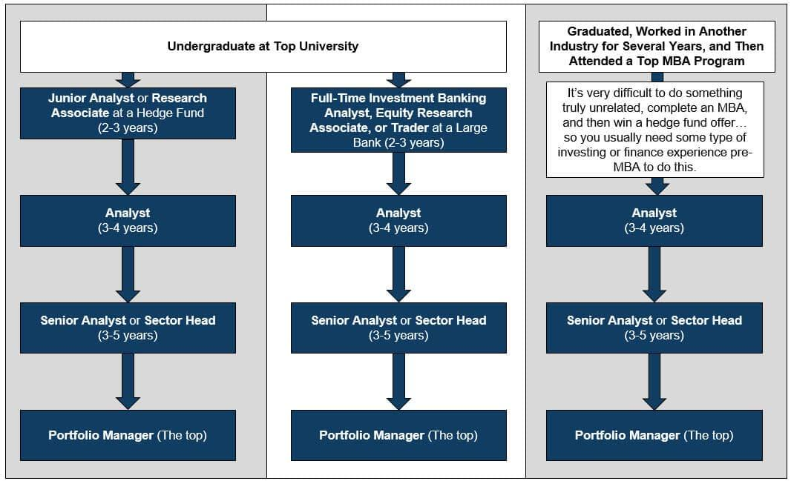

## Table of Contents

## What is a fund manager?

A fund manager is a person or a team that takes care of a pool of money from many investors. This money is called a fund, and the fund manager's job is to invest it in different things like stocks, bonds, or real estate. The goal is to make the fund grow and earn money for the investors. Fund managers use their knowledge and skills to decide where to put the money, always trying to pick the best options.

Fund managers work for different types of funds, like mutual funds or hedge funds. They have to keep an eye on the market and make changes to the investments when needed. This means they might buy new things or sell old ones to keep the fund performing well. They also need to follow rules and laws about how to manage the money, to make sure everything is done correctly and fairly.

## What are the primary responsibilities of a fund manager?

A fund manager's main job is to take care of the money that people have put into a fund. This means they decide where to invest the money, like in stocks, bonds, or other things. They use their knowledge to pick the best places to put the money so that it can grow and make more money for the people who invested. They also need to watch the market all the time to see if they should change their investments. If something is not doing well, they might sell it and buy something else that they think will do better.

Another big part of a fund manager's job is to follow the rules and laws about managing money. They have to make sure they are doing everything the right way and being fair to all the investors. This includes keeping good records and being able to explain their choices. They also need to talk to the investors and tell them how the fund is doing. This helps the investors feel confident that their money is in good hands.

## What qualifications are needed to become a fund manager?

To become a fund manager, you usually need a strong education in finance or a related field. Most fund managers have at least a bachelor's degree in finance, economics, business, or something similar. Many also have a master's degree, like an MBA or a Master's in Finance. Besides school, it's important to get some experience working in finance. This could be through internships or jobs in areas like investment analysis, portfolio management, or financial planning. Having a good understanding of the markets and how to analyze investments is key.

Another important part of becoming a fund manager is getting the right licenses and certifications. In many places, you need to pass exams to get a license to manage investments. For example, in the United States, you might need to pass the Series 65 or Series 66 exams. Some fund managers also get certifications like the Chartered Financial Analyst (CFA) designation, which shows they have a deep knowledge of investment management. Being good at talking to people and explaining things clearly is also helpful, because fund managers need to communicate well with their investors.

## How does one start a career as a fund manager?

Starting a career as a fund manager usually begins with getting a good education. You should aim for a bachelor's degree in finance, economics, or business. After that, many people go on to get a master's degree, like an MBA or a Master's in Finance. This extra education can help you understand the markets and investments better. While you're in school, try to get internships or part-time jobs in the finance world. This will give you hands-on experience and help you learn how things work in the industry.

Once you have your education and some experience, you'll need to get the right licenses and certifications. In many places, you need to pass exams to be allowed to manage investments. For example, in the United States, you might need to pass the Series 65 or Series 66 exams. Getting a certification like the Chartered Financial Analyst (CFA) can also be very helpful. It shows that you have a deep understanding of investment management. As you start your career, you might begin in a role like an investment analyst or a junior portfolio manager. Over time, with hard work and good results, you can move up to become a fund manager.

## What skills are essential for a successful fund manager?

A successful fund manager needs strong analytical skills. They have to look at lots of information about different investments and figure out which ones are the best choices. They use numbers and data to make smart decisions about where to put the money. They also need to be good at understanding the markets and how they change over time. This helps them know when to buy or sell investments to make the most money for their investors.

Good communication skills are also very important for a fund manager. They need to explain their choices and how the fund is doing to the people who have invested their money. They should be able to talk about complicated things in a way that is easy to understand. Besides that, a fund manager should be able to work well with others. They often work in teams and need to share ideas and make decisions together. Being able to work well with others helps them do a better job managing the fund.

Lastly, a fund manager must be disciplined and patient. Managing a fund means making long-term plans and sticking to them, even when the market goes up and down. They need to keep calm and not make quick, emotional decisions. Being disciplined helps them follow their strategy and make the best choices for the fund over time. Patience is key because good investments can take a while to pay off.

## What is the typical day-to-day work of a fund manager?

A fund manager's typical day starts early, often checking the latest news and market updates to stay on top of any changes that might affect their investments. They spend a lot of time analyzing data and reports to see how their current investments are doing. This might involve looking at stock prices, economic indicators, and company earnings reports. Based on this information, they decide if they need to buy new investments or sell some of the old ones. They also meet with their team to discuss strategies and share ideas on how to improve the fund's performance.

In the afternoon, a fund manager might have meetings with investors to update them on how the fund is doing and answer any questions they have. They need to explain things clearly so that investors understand what's happening with their money. Besides meetings, they spend time on administrative tasks like writing reports and keeping records. They also need to make sure they are following all the rules and regulations about managing money. At the end of the day, they might review their plans for the next day and make any last-minute adjustments based on new information that came in.

## How do fund managers make investment decisions?

Fund managers make investment decisions by looking at a lot of information. They study things like stock prices, company earnings, and economic reports. They use this data to figure out which investments might do well in the future. They also think about the overall market and what's happening in the world that could affect their investments. Sometimes, they use computer programs to help them analyze all this information and find the best opportunities.

Once they have all the information, fund managers decide where to put the money. They might choose to buy stocks, bonds, or other types of investments. They think about how much risk they want to take and how much money they want to make. They also consider the goals of the fund and what the investors are looking for. After making their choices, they keep watching the investments to see if they need to make changes. If something isn't working out, they might sell it and buy something else that they think will do better.

## What are the different types of funds a manager might oversee?

Fund managers can oversee different types of funds, each with its own way of investing money. One common type is a mutual fund, where lots of people pool their money together. The fund manager then uses this money to buy a mix of stocks, bonds, or other investments. The goal is to grow the money over time, and it's a popular choice for people saving for things like retirement. Another type is an exchange-traded fund ([ETF](/wiki/etf-trading-strategies)), which is similar to a mutual fund but can be bought and sold like a stock on a stock exchange. ETFs often try to match the performance of a specific market index, like the S&P 500.

Another kind of fund is a [hedge fund](/wiki/hedge-fund-trading-strategies), which is usually for richer people or big investors. Hedge funds can use more risky strategies to try to make a lot of money quickly. They might use things like borrowing money to invest more or betting that certain investments will go down in value. Pension funds are another type, where the money comes from people's retirement savings. The fund manager's job is to invest this money safely to make sure there's enough for people when they retire. Each type of fund has its own rules and goals, so the fund manager needs to understand these well to do a good job.

## How is the performance of a fund manager evaluated?

The performance of a fund manager is usually looked at by how well the fund they manage does over time. People check if the fund makes more money than other similar funds or if it does better than the market as a whole. They also look at how much risk the fund manager takes to get those results. If the fund does well without taking too much risk, that's a good sign. Investors and the company that runs the fund use numbers like the fund's return and something called the Sharpe ratio to see if the fund manager is doing a good job.

Besides looking at numbers, people also think about other things when judging a fund manager. They see if the manager sticks to the fund's goals and rules. For example, if the fund is supposed to be safe and steady, the manager shouldn't be taking big risks. They also check if the manager is good at talking to investors and explaining what they're doing. If investors trust the manager and feel happy with how things are going, that's a big plus. In the end, a fund manager's performance is about both making money and doing things the right way.

## What are the challenges faced by fund managers in the current market?

Fund managers face a lot of challenges in today's market. One big challenge is dealing with all the ups and downs in the market. The economy can change quickly because of things like new laws, big world events, or even social media trends. Fund managers have to keep up with all these changes and decide what to do with their investments. It's hard to predict what will happen next, so they have to be ready to change their plans fast.

Another challenge is competition. There are so many funds out there, and everyone wants to do better than the others. Fund managers have to find ways to make their fund stand out and attract more investors. They also have to keep their current investors happy, which means they need to keep making good returns without taking too many risks. It's a tough balance to keep, and it takes a lot of hard work and smart thinking.

## How can a fund manager advance in their career?

To advance in their career, a fund manager needs to keep learning and getting better at their job. They should always be looking for new ways to understand the market and make smart investment choices. Getting more education, like a master's degree or a certification like the CFA, can help them stand out. They also need to build a good track record of making money for their investors. If they can show that they are good at managing a fund and making it grow, they might get promoted to manage bigger funds or take on more important roles.

Another way to move up is by networking and building relationships in the industry. Fund managers should go to conferences, join professional groups, and talk to other people in finance. This can help them learn from others and find new opportunities. They might also get a chance to work on different types of funds or move to a bigger company. Being good at talking to people and explaining their ideas clearly can also help them advance. If they can show that they are trustworthy and good at their job, they are more likely to get ahead in their career.

## What are the ethical considerations and regulatory requirements for fund managers?

Fund managers have to follow a lot of rules and be very careful about doing things the right way. They need to make sure they are always being fair to all the people who have put money into their fund. This means they can't use the fund's money for their own gain or give special treatment to some investors over others. They also have to be honest about how the fund is doing and not hide any important information. If they don't follow these rules, they could get in big trouble and lose their job.

There are also a lot of laws that fund managers have to follow. These laws are there to protect the people who invest their money in funds. In the United States, for example, fund managers need to get licenses like the Series 65 or Series 66 to show they know the rules. They also have to follow rules from the Securities and Exchange Commission (SEC) and other groups. These rules make sure that fund managers are doing everything the right way and not taking too many risks with other people's money. If a fund manager breaks these rules, they could face fines or even go to jail.

## References & Further Reading

[1]: Bergstra, J., Bardenet, R., Bengio, Y., & Kégl, B. (2011). ["Algorithms for Hyper-Parameter Optimization."](https://papers.nips.cc/paper/4443-algorithms-for-hyper-parameter-optimization) Advances in Neural Information Processing Systems 24.

[2]: ["Advances in Financial Machine Learning"](https://www.amazon.com/Advances-Financial-Machine-Learning-Marcos/dp/1119482089) by Marcos Lopez de Prado

[3]: ["Evidence-Based Technical Analysis: Applying the Scientific Method and Statistical Inference to Trading Signals"](https://www.amazon.com/Evidence-Based-Technical-Analysis-Scientific-Statistical/dp/0470008741) by David Aronson

[4]: ["Machine Learning for Algorithmic Trading"](https://github.com/stefan-jansen/machine-learning-for-trading) by Stefan Jansen

[5]: ["Quantitative Trading: How to Build Your Own Algorithmic Trading Business"](https://www.amazon.com/Quantitative-Trading-Build-Algorithmic-Business/dp/1119800064) by Ernest P. Chan

[6]: ["Modern Portfolio Theory and Investment Analysis"](https://books.google.com/books/about/Modern_Portfolio_Theory_and_Investment_A.html?id=181CEAAAQBAJ) by Edwin J. Elton, Martin J. Gruber, Stephen J. Brown, and William N. Goetzmann

[7]: Pardo, R. (1992). ["Design, Testing, and Optimization of Trading Systems."](https://archive.org/details/designtestingopt0000pard) John Wiley & Sons.

[8]: Aldridge, I. (2013). ["High-Frequency Trading: A Practical Guide to Algorithmic Strategies and Trading Systems."](https://onlinelibrary.wiley.com/doi/pdf/10.1002/9781119203803.fmatter) Wiley Trading.