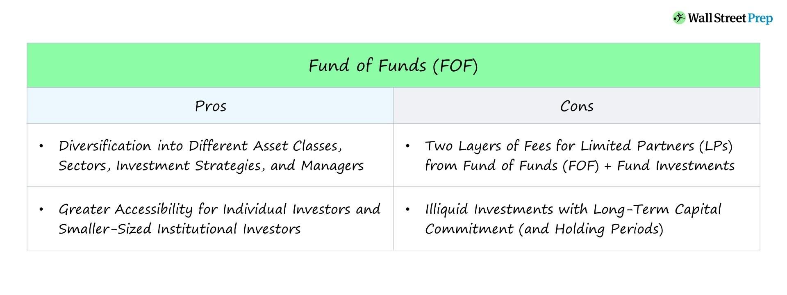

## Table of Contents

## What is a Fund of Funds (FoF)?

A Fund of Funds (FoF) is a type of investment fund that invests in other funds instead of directly investing in stocks, bonds, or other securities. This means that when you put your money into a FoF, your money is used to buy shares in different mutual funds, hedge funds, or private equity funds. The idea behind a FoF is to spread out the risk by investing in a variety of funds managed by different investment managers.

FoFs can be a good choice for investors who want to diversify their investments without having to pick individual funds themselves. By investing in a FoF, you get exposure to a range of investment strategies and asset classes, which can help reduce the impact of any single fund performing poorly. However, FoFs often come with higher fees because you are paying for the management of the FoF itself, as well as the fees of the underlying funds it invests in.

## How does a Fund of Funds work?

A Fund of Funds (FoF) works by pooling money from many investors and using that money to buy shares in other investment funds. Instead of directly buying stocks or bonds, the FoF invests in a variety of mutual funds, hedge funds, or private equity funds. This means that when you invest in a FoF, your money is spread across many different funds, which are managed by different investment managers.

The main goal of a FoF is to help investors diversify their investments without having to choose individual funds themselves. By investing in a FoF, you get to benefit from a mix of different investment strategies and types of assets. This can help lower the risk because if one fund does not perform well, the other funds might balance it out. However, FoFs can be more expensive because you have to pay fees for the FoF itself, plus the fees of all the other funds it invests in.

## What are the benefits of investing in a Fund of Funds for small investors?

Investing in a Fund of Funds (FoF) can be a good choice for small investors because it helps them spread their money across many different funds. This means they don't have to pick each fund themselves, which can be hard and take a lot of time. By investing in a FoF, small investors can get a mix of different types of investments, like stocks, bonds, and other assets. This can help lower the risk because if one fund does not do well, the other funds might help balance it out.

Another benefit for small investors is that FoFs are managed by professionals who know a lot about investing. These managers choose the funds to invest in, so small investors can feel more confident that their money is being handled well. However, it's important to know that FoFs can be more expensive because you have to pay fees for the FoF itself, plus the fees of all the other funds it invests in. Even with the higher costs, many small investors find that the benefits of diversification and professional management make FoFs a good choice for them.

## What are the potential risks associated with Fund of Funds?

One of the main risks of investing in a Fund of Funds (FoF) is the higher fees. When you invest in a FoF, you're not just paying for the management of the FoF itself, but also for the fees of all the other funds it invests in. These extra costs can add up and might eat into the returns you get from your investment. So, even if the funds inside the FoF do well, the higher fees could mean you don't make as much money as you hoped.

Another risk is that you might not have as much control over your investments. When you invest in a FoF, you're trusting the managers to pick the right mix of funds for you. If they make bad choices, or if the funds they choose don't perform well, your investment could suffer. Plus, because FoFs invest in other funds, it can be harder to know exactly where your money is going and how it's being used.

Lastly, there's the risk of over-diversification. While diversification is good because it can help spread out risk, too much of it can mean your investment doesn't grow as much as it could. If a FoF spreads your money across too many different funds, it might end up balancing out the highs and lows so much that your overall returns are just average. This could be frustrating if you were hoping for bigger gains.

## How can small investors access Fund of Funds?

Small investors can access Fund of Funds (FoF) through many investment platforms and financial institutions. They can go online to websites like those of big banks or investment companies, where they can set up an account and start investing in a FoF. Some platforms even let you invest small amounts of money, so you don't need a lot to get started. It's a good idea to look around and compare different FoFs to find one that fits what you want and how much risk you're okay with.

Another way to access FoFs is by talking to a financial advisor. These are people who know a lot about investing and can help you choose the right FoF for your needs. They can explain how FoFs work and help you understand the fees and risks. A financial advisor might charge a fee for their services, but having their help can make you feel more confident about your investment choices.

## What are the typical fees involved in investing in a Fund of Funds?

When you invest in a Fund of Funds (FoF), you usually have to pay two main types of fees. The first fee is for managing the FoF itself. This is called the management fee, and it's a percentage of the money you invest. The second fee comes from the other funds that the FoF invests in. These are called underlying fund fees, and you have to pay them because the FoF is buying shares in those funds. So, you end up paying fees to the FoF manager and also to the managers of all the other funds.

These fees can add up and make investing in a FoF more expensive than investing directly in individual funds. For example, if the management fee for the FoF is 1% and the average fee for the underlying funds is also 1%, you might end up paying around 2% in total fees each year. This is higher than what you might pay if you just invested in one fund directly. It's important for small investors to understand these fees because they can affect how much money you make from your investment over time.

## How does the performance of a Fund of Funds compare to direct investments?

The performance of a Fund of Funds (FoF) can be different from direct investments in a few ways. When you invest in a FoF, your money is spread across many different funds, which means it's more diversified. This can help lower the risk because if one fund doesn't do well, the others might balance it out. But, this diversification can also mean that your overall returns might not be as high as they could be if you picked a single fund that did really well. Also, FoFs usually have higher fees because you pay for the management of the FoF and the fees of all the other funds it invests in. These extra costs can eat into your returns and make the performance of a FoF less than what you might get from a direct investment in a single fund.

On the other hand, direct investments can be riskier because you're putting all your money into one place. If that one investment doesn't do well, you could lose more money than if you had spread it out across many funds like a FoF does. But, if you pick the right investment, you could also make more money than you would with a FoF. Direct investments also usually have lower fees because you're not paying for the management of a FoF on top of the fund itself. So, the performance of a FoF compared to direct investments depends a lot on how well the funds inside the FoF do, how much you pay in fees, and how well you can pick investments on your own.

## What diversification benefits do Fund of Funds offer to small investors?

Fund of Funds (FoFs) offer small investors a big advantage by spreading their money across many different funds. This means that instead of putting all your money into one fund, a FoF splits it up into lots of different funds. This can help lower the risk because if one fund doesn't do well, the other funds might balance it out. It's like not putting all your eggs in one basket. For small investors who might not have a lot of money to invest, this can be a good way to get a mix of different types of investments, like stocks, bonds, and other assets, without having to pick each one themselves.

Another benefit of FoFs for small investors is that they can get access to a variety of investment strategies and asset classes that they might not be able to invest in directly. This can include things like hedge funds or private equity funds, which often need a lot of money to invest in directly. By investing in a FoF, small investors can still get a piece of these types of investments. This can help them build a more balanced and diverse investment portfolio, which can be good for their long-term financial goals.

## How do regulatory requirements affect Fund of Funds and their accessibility?

Regulatory requirements can make it harder or easier for small investors to access Fund of Funds (FoFs). Different countries have different rules about who can invest in FoFs and how they need to be managed. For example, some places might say that only people with a certain amount of money can invest in FoFs, which can make it tough for small investors to get in. Also, the rules might require FoFs to share a lot of information about what they're investing in and how they're doing, which can help small investors feel more confident but can also make things more complicated.

On the other hand, regulations can also help protect small investors by making sure FoFs are run fairly and safely. For instance, rules might limit how much a FoF can charge in fees or how much risk they can take with the money they manage. This can make FoFs a safer choice for small investors who might not know a lot about investing. But, these rules can also mean that FoFs have to spend more time and money following the regulations, which might make them more expensive or less available to small investors.

## What are some strategies for selecting the right Fund of Funds for a small investor?

When [picking](/wiki/asset-class-picking) a Fund of Funds (FoF), small investors should start by looking at their own goals and how much risk they're okay with. If you want to grow your money over a long time, you might pick a FoF that focuses on growth funds. If you want something safer, you might choose one that invests more in bonds. It's also good to think about how much money you can put in and how long you plan to keep it invested. Understanding your own needs will help you find a FoF that fits you well.

Next, small investors should check the fees of the FoF. FoFs can be more expensive because you pay for the management of the FoF itself and also the fees of all the other funds it invests in. Look for a FoF with lower fees because these costs can eat into your returns over time. It's also smart to look at the past performance of the FoF, but remember that what happened before doesn't always mean the same will happen in the future. Reading reviews and talking to a financial advisor can give you more info to help you decide.

## How do Fund of Funds fit into a broader investment portfolio for small investors?

Fund of Funds (FoFs) can be a good part of a small investor's overall investment plan. They help spread out the risk by investing in many different funds at once. This means that if one fund doesn't do well, the others might help balance it out. For small investors who don't have a lot of money to invest, FoFs can be a way to get into different types of investments, like stocks, bonds, and even things like hedge funds or private equity, without having to pick each one themselves. This can make their investment plan more diverse and help them reach their long-term money goals.

When adding a FoF to their investment plan, small investors should think about how it fits with their other investments. If they already have a lot of money in stocks, they might want a FoF that focuses more on bonds to balance things out. They should also look at the fees because FoFs can be more expensive than investing directly in one fund. But, the benefits of having a professional pick a mix of funds for them and spreading out the risk can make FoFs a smart choice for small investors who want to grow their money safely over time.

## What are the future trends and developments expected in the Fund of Funds market for small investors?

The Fund of Funds (FoF) market is expected to keep growing and changing in ways that can help small investors. One big trend is that more FoFs are using technology to make investing easier and cheaper. This means small investors might be able to get into FoFs with less money and lower fees than before. Also, there's a push for more clear and easy-to-understand information about FoFs, so small investors can make better choices. As more people learn about FoFs and how they can help spread out risk, we might see more small investors using them as part of their overall investment plans.

Another trend is that FoFs are starting to focus more on things like environmental, social, and governance ([ESG](/wiki/esg-investing)) factors. This means they're picking funds that not only aim to make money but also do good for the world. Small investors who care about these issues might find FoFs that match their values and goals. Plus, as regulations keep changing, FoFs might become more accessible to small investors in different countries. This could open up new chances for small investors to use FoFs to grow their money safely over time.

## References & Further Reading

[1]: Bergstra, J., Bardenet, R., Bengio, Y., & Kégl, B. (2011). ["Algorithms for Hyper-Parameter Optimization."](https://dl.acm.org/doi/10.5555/2986459.2986743) Advances in Neural Information Processing Systems 24.

[2]: ["Advances in Financial Machine Learning"](https://www.amazon.com/Advances-Financial-Machine-Learning-Marcos/dp/1119482089) by Marcos Lopez de Prado

[3]: ["Evidence-Based Technical Analysis: Applying the Scientific Method and Statistical Inference to Trading Signals"](https://www.amazon.com/Evidence-Based-Technical-Analysis-Scientific-Statistical/dp/0470008741) by David Aronson

[4]: ["Machine Learning for Algorithmic Trading"](https://github.com/stefan-jansen/machine-learning-for-trading) by Stefan Jansen

[5]: ["Quantitative Trading: How to Build Your Own Algorithmic Trading Business"](https://www.amazon.com/Quantitative-Trading-Build-Algorithmic-Business/dp/1119800064) by Ernest P. Chan