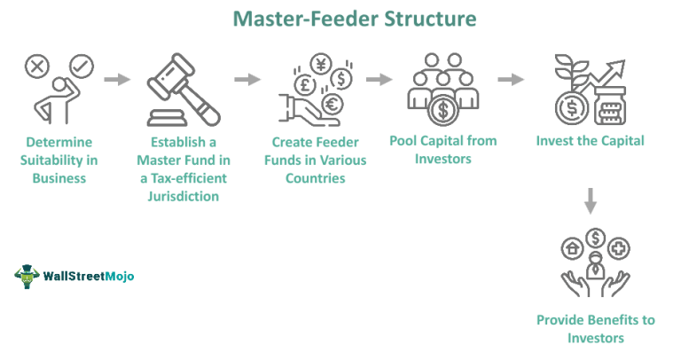

The integration of technology has significantly transformed the world of investing. In particular, this transformation has sparked discussions about investment accessibility, a topic of increasing importance as more individuals, especially those with limited capital, seek to diversify their portfolios. Technological advancements are not only reshaping investment landscapes but also democratizing access to diverse investment opportunities previously reserved for institutional investors or wealthy individuals.

One key development is the emergence of funds of funds (FOFs) as a viable investment vehicle for small investors. FOFs invest in a collection of mutual funds rather than individual securities, offering immediate diversification benefits. This structure is particularly advantageous for small investors who may lack the capital required for direct investment in multiple mutual funds. By amalgamating various mutual funds, FOFs mitigate individual investment risks while allowing access to professional fund management.



Another promising trend is the use of algorithmic trading, which utilizes pre-defined computer algorithms to execute trading decisions. This method offers several benefits to small investors, such as enhanced efficiency, speed, and the elimination of emotional biases from trading decisions. Furthermore, algorithmic trading enables continuous market monitoring and engagement, ensuring investors can act on market trends at any hour. Though there are potential pitfalls, the accessibility of algorithmic trading tools marks a significant step towards leveling the investment playing field.

Overall, the advent of these innovative investment strategies highlights a shift from traditional methods, offering high-level investment approaches to a broader audience. This article will examine how funds of funds and algorithmic trading facilitate greater investment accessibility for small investors, and assess their wider implications for average investors seeking diversified and well-managed portfolios.

## Table of Contents

## Understanding Fund of Funds

A fund of funds (FOF) represents a pooled investment vehicle that allocates its assets by investing in a variety of mutual funds rather than in individual securities such as stocks or bonds. This structure provides investors with immediate diversification across different fund managers, asset classes, and investment strategies, thereby spreading risk.

FOFs are particularly beneficial for small investors who might lack the substantial capital required to meet the minimum investment thresholds set by numerous individual mutual funds. By investing in a fund of funds, these investors can access a diversified portfolio with a relatively smaller initial outlay. This is advantageous because it allows them to partake in the benefits of diversification, reducing the unsystematic risk associated with individual securities. Unsystematic risk pertains to the company-specific or sector-specific risks that affect an individual asset or certain group of assets.

An added advantage of investing in FOFs is the professional management provided. The fund is managed by experienced managers who are responsible for selecting the constituent mutual funds, monitoring their performance, and making necessary adjustments. This management can result in better fund selections based on comprehensive market analysis and expert judgment, potentially leading to enhanced returns over time. For investors who lack the expertise or time to manage an array of individual investments, this professional oversight plays a crucial role.

However, the convenience and accessibility of FOFs come with certain drawbacks. One of the primary concerns is the higher fee structure associated with FOFs. Since investors are effectively paying fees at two levels—once for the management of the FOF itself and then for the underlying mutual funds—these costs can accumulate, thus potentially reducing net returns. This phenomenon is often referred to as a "double-layer" of fees.

Additionally, FOF investors may encounter issues related to overlapping investments. Since FOFs aggregate multiple mutual funds, there is a possibility that these constituent funds may hold similar positions or securities. This overlapping can diminish the intended diversification benefits and inadvertently amplify exposure to certain securities or market segments. Investors must thus conduct due diligence to ensure that the FOF's underlying funds align with their risk tolerance and investment goals.

Overall, while FOFs present a promising option for attaining diversified investment exposure with professional management, it is imperative for investors to remain cognizant of the associated fees and potential for overlapping investments. Balancing these aspects can help maximize the benefits while mitigating the downsides inherent in a fund of funds structure.

## Algorithmic Trading: A New Frontier for Small Investors

Algorithmic trading, often referred to as algo trading, is the process of using computer algorithms to automatically execute a large number of trades on financial markets. These pre-defined algorithms use a series of complex instructions based on variables such as timing, price, quantity, or other mathematical models. The primary purpose of [algorithmic trading](/wiki/algorithmic-trading) is to leverage computers' capabilities to trade at high speed and frequency, which is otherwise impossible for human traders.

For small investors, algorithmic trading offers significant advantages. One of the most notable benefits is increased efficiency. Computers can process and execute trades in milliseconds, far surpassing human speed. This rapid execution minimizes the chance of significant market changes between decision-making and transaction completion, allowing small investors to capitalize on fleeting opportunities. Moreover, trades are executed with minimal errors, ensuring consistency and precision.

Another advantage of algorithmic trading lies in its ability to remove emotions from trading decisions. Human traders are often swayed by emotions like fear or greed, which can lead to irrational decision-making. Algorithms, however, operate solely on the basis of pre-set rules and data, ensuring objectivity in every trade made. This emotion-free approach helps small investors stick to their investment strategies without being derailed by market fluctuations or psychological biases.

Additionally, algorithmic trading allows for 24/7 market surveillance, which is a significant boon for small investors who may not have the resources or time to monitor markets continuously. With algo trading, investors can engage with multiple global markets simultaneously, identifying and acting on opportunities that arise at any time of day or night. This constant market engagement not only increases the potential for profit but also ensures that investors do not miss advantageous trading windows simply due to time constraints.

However, the landscape of algorithmic trading is not without pitfalls. One of the primary concerns is the over-reliance on technology. Algorithms are only as good as their design and the accuracy of the data input. Inaccuracies or unforeseen market events can lead to substantial losses if not carefully managed and monitored. Consequently, small investors must have a robust understanding of the financial markets and the specific algorithms they employ. Without this understanding, they could mistakenly place excessive trust in flawed systems.

Furthermore, while algorithms minimize emotional trading, they require detailed oversight and risk management to address unforeseen circumstances and market anomalies. Small investors must ensure their strategies include comprehensive risk assessments and contingencies for extreme market conditions.

In conclusion, algorithmic trading represents a novel opportunity for small investors by providing streamlined, efficient, and rational methods of engaging with financial markets. However, its successful implementation demands a balance between technological reliance and human oversight, ensuring that the benefits of speed and emotion-free decisions are not overshadowed by potential risks.

## Investment Accessibility and Democratization

Modern technology and innovative investment strategies have revolutionized the landscape of investing, significantly reducing traditional barriers for small investors. Historically, investing required significant capital and access to professional advice, often excluding smaller investors. However, technological advancements have democratized this field, offering unprecedented access and opportunities.

Technology-driven platforms now facilitate investment processes by offering low minimum investments and advanced analytical tools. These platforms employ user-friendly interfaces and educational resources to empower investors who may lack extensive financial knowledge. For instance, robo-advisors provide automated portfolio management services with minimal fees and initial investment requirements. Such platforms assess an investor's risk profile and financial goals to construct and manage diversified portfolios, thus simplifying access to sophisticated investing methodologies once reserved for high-net-worth individuals.

The advent of Fund of Funds (FOFs) and algorithmic trading highlights a transformation from conventional investment strategies. FOFs, by pooling capital to invest in a variety of mutual funds, provide diversification and professional management without necessitating substantial individual investments. Particularly, they offer small investors a chance to tap into a wide array of funds, effectively spreading investment risk over a broad spectrum of assets. This approach is especially advantageous when individual mutual fund minimums are prohibitive for smaller investors.

Algorithmic trading, on the other hand, automates trading decisions based on pre-set criteria, offering efficiency and speed beyond human capability. For small investors, algorithmic trading presents the opportunity to engage with dynamic markets around the clock, often without the emotional bias that can accompany manual trading. This level of automation facilitates informed decision-making, quick execution, and the ability to seize market opportunities globally.

Both FOFs and algorithmic trading signify a shift away from traditional investment methods. Their integration reflects a broader trend of adopting technology to enhance investment accessibility. By minimizing entry costs and democratizing access to sophisticated tools, these modern investment avenues have paved the way for broader participation across diverse investor demographics. This democratization not only empowers individuals but also fosters a more inclusive financial ecosystem, setting the stage for potentially improved financial outcomes for small investors.

## Case Studies and Real-World Applications

### Case Studies and Real-World Applications

The integration of technology in investment strategies such as fund of funds (FOFs) and algorithmic trading has notably benefitted small investors, providing them access to diversified and sophisticated investment avenues previously dominated by large financial institutions.

#### Successful Fund of Funds Examples

A notable example of a successful fund of funds is the Vanguard STAR Fund. It comprises investments in approximately 25 underlying mutual funds, allowing investors to benefit from diversification across asset classes with a relatively low minimum investment threshold. This structure enables small investors to achieve diversified portfolios without needing the significant capital typically required to invest directly in several individual mutual funds.

The Vanguard STAR Fund has shown consistent performance over the years, demonstrating how small investors can access professional management and diversification benefits through FOFs. According to data from Vanguard, this fund has delivered competitive returns with moderate risk, showcasing the potential for FOFs to enhance investor outcomes (Vanguard, 2023).

Despite the success, FOFs can present issues such as overlapping investments and higher expense ratios due to the additional layer of management fees. However, these can be mitigated by careful fund selection and awareness of fee structures.

#### Algorithmic Trading for Small Investors

The rise of algorithmic trading platforms, such as Wealthfront and QuantConnect, has also opened new opportunities for small investors. Wealthfront, for instance, employs automated financial planning tools and low-cost exchange-traded fund ([ETF](/wiki/etf-trading-strategies)) portfolios using algorithms to optimize returns and minimize taxes. This robo-advisor model makes high-level investment strategies accessible, affordable, and efficient for individual investors.

QuantConnect, an open-source platform for algorithmic trading, allows users to design, test, and deploy trading strategies across multiple asset classes. The platform's flexibility encourages small investors to engage actively with algorithmic models and experiment with strategies typically used by hedge funds and institutional investors.

#### Evolving Investment Strategies

Recent trends indicate a shift towards integrating [machine learning](/wiki/machine-learning) and [artificial intelligence](/wiki/ai-artificial-intelligence) into algorithmic trading, enhancing adaptability to market fluctuations. As these technologies advance, algorithmic trading strategies become increasingly sophisticated, better equipped to handle complexities such as sudden market changes and [volatility](/wiki/volatility-trading-strategies).

Platforms like CloudQuant offer simulation environments where individual investors can refine their algorithms using historical data, thus improving their strategies' effectiveness in live markets. These advancements exemplify how technological progress continues transforming investment strategies, making them more accessible and tailored to individual investor needs.

In summary, both FOFs and algorithmic trading platforms exemplify how modern investment strategies are evolving, enabling small investors to benefit from diversification, professional management, and automated trading techniques. By reducing barriers and democratizing access to sophisticated financial tools, these approaches have empowered small investors to improve their financial outcomes in increasingly dynamic market environments.

## Challenges and Considerations for Small Investors

Small investors engaging with funds of funds (FOFs) and algorithmic trading face several challenges that necessitate careful consideration and prudent management. One of the primary concerns is the understanding of fee structures. FOFs typically involve higher fees compared to traditional mutual funds because they encompass both the management fees of the underlying funds and the additional management fee of the FOF itself. These fees can erode the returns, making it crucial for investors to assess whether the potential diversification benefits justify the cost.

Market volatility is another significant challenge. Algorithmic trading, while offering speed and efficiency, operates in highly volatile environments where market conditions can shift rapidly. Small investors must be cognizant of the risks associated with sudden market movements that can adversely affect their portfolios. The potential for algorithmic trading to amplify these risks requires investors to have a clear understanding of market dynamics and the inherent volatility.

Ongoing portfolio assessment is vital for managing these investments effectively. Investors need to regularly evaluate the performance of their FOFs and algorithmic strategies, adjusting as necessary to align with changing market conditions and personal financial goals. This continuous review process helps mitigate risks and optimize returns.

Furthermore, balancing technology with human oversight and intuition is essential in investment decisions. While algorithmic trading can process vast amounts of data and execute trades without emotional biases, human judgment plays a critical role in adapting to unforeseen market events and making strategic decisions outside the scope of predefined algorithms. Investors should integrate algorithmic tools with their insights and market knowledge to enhance decision-making quality.

In conclusion, small investors must navigate the complexities of fees, market volatility, and the integration of technology with human judgment. By doing so, they can better position themselves to capitalize on the opportunities presented by FOFs and algorithmic trading while minimizing potential risks.

## The Future of Small Investment Opportunities

The landscape of small investment opportunities is poised for transformative growth, driven by technological advancements and evolving investment strategies. As technology continues to influence financial markets, small investors are likely to experience significant participation in alternative investment methods such as Funds of Funds (FOFs) and algorithmic trading. These innovations are not only increasing accessibility but also reshaping how investors manage their portfolios.

Predictive analytics, utilizing big data and machine learning, stands out as a key trend likely to dominate future investment strategies. By harnessing these technologies, small investors can expect enhanced decision-making tools that offer predictive insights into market movements. As algorithms become more sophisticated, they may incorporate a wide range of data points—from financial metrics to social media trends—enabling investors to make informed decisions. This, in tandem with increased computational power, suggests a future where algorithmic trading platforms can offer personalized strategies tailored to an investor's specific risk tolerance and investment goals. 

Moreover, the diminishing cost of technology is likely to encourage more small investors to engage in sophisticated trading practices. Platforms that once required significant capital are now accessible with minimal investments, lowering entry barriers and democratizing access to strategies that were traditionally available to institutional investors. As these platforms evolve, they may incorporate features such as automated rebalancing and tax optimization strategies, further empowering small investors.

The growth of FOFs is also anticipated to continue, as they provide an easy pathway for diversification without the need for extensive capital. The rise of robo-advisors plays a crucial role here, offering cost-effective and accessible fund management options that are particularly appealing to new and small-scale investors. These advancements allow investors to gain exposure to a broad spectrum of assets, reducing unsystematic risk and enhancing portfolio resilience.

Python's versatility in financial analysis is also worth noting. Tools like NumPy and pandas libraries enable investors to process and analyze financial data efficiently, supporting the development of personalized investment models. Below is an example of how Python can be used to model a simple moving average strategy:

```python
import pandas as pd

# Load historical price data
data = pd.read_csv('stock_prices.csv')

# Calculate the moving average
data['SMA_50'] = data['Close'].rolling(window=50).mean()
data['SMA_200'] = data['Close'].rolling(window=200).mean()

# Generate buy/sell signals
data['Signal'] = 0
data['Signal'][50:] = np.where(data['SMA_50'][50:] > data['SMA_200'][50:], 1, 0)
data['Position'] = data['Signal'].diff()

# Output strategy results
print(data[['Date', 'Close', 'SMA_50', 'SMA_200', 'Signal', 'Position']])
```

As we look to the future, it is clear that enhanced accessibility through these advanced platforms and strategies will likely lead to more robust financial planning for small investors. There is substantial potential for growth as technological innovations continue to simplify complex investment processes. By removing traditional financial barriers and equipping small investors with sophisticated tools, a democratized financial market becomes attainable. Ultimately, this evolution is expected to foster greater financial literacy, resilience, and independence among small investors, offering a bright horizon for those willing to embrace these opportunities.

## References & Further Reading

[1]: Bergstra, J., Bardenet, R., Bengio, Y., & Kégl, B. (2011). ["Algorithms for Hyper-Parameter Optimization."](https://dl.acm.org/doi/10.5555/2986459.2986743) Advances in Neural Information Processing Systems 24.

[2]: ["Advances in Financial Machine Learning"](https://www.amazon.com/Advances-Financial-Machine-Learning-Marcos/dp/1119482089) by Marcos Lopez de Prado

[3]: ["Evidence-Based Technical Analysis: Applying the Scientific Method and Statistical Inference to Trading Signals"](https://www.amazon.com/Evidence-Based-Technical-Analysis-Scientific-Statistical/dp/0470008741) by David Aronson

[4]: ["Machine Learning for Algorithmic Trading"](https://github.com/stefan-jansen/machine-learning-for-trading) by Stefan Jansen

[5]: ["Quantitative Trading: How to Build Your Own Algorithmic Trading Business"](https://www.amazon.com/Quantitative-Trading-Build-Algorithmic-Business/dp/1119800064) by Ernest P. Chan