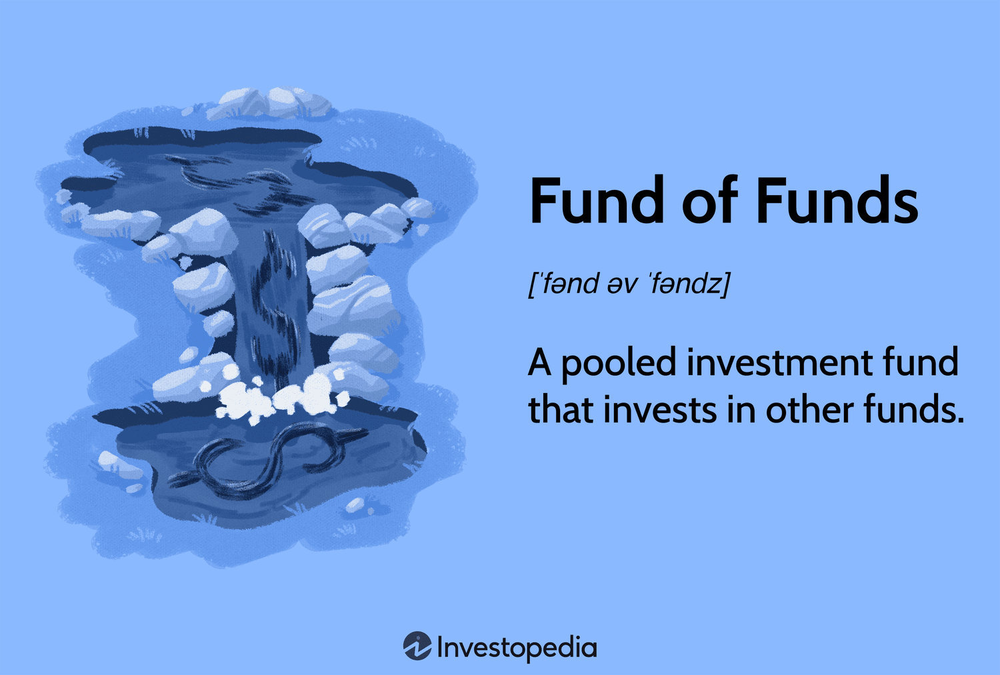

In today's rapidly evolving financial markets, investors are constantly on the lookout for strategies that maximize returns while minimizing risk. One such strategy is the 'Fund of Funds' (FOF), a type of investment vehicle that pools capital into a diversified collection of other investment funds. By investing in various funds, FOFs offer investors the benefit of diversification, thereby spreading risk across multiple asset classes and reducing the impact of any single investment's poor performance. This strategy also provides access to funds managed by seasoned professionals with diverse approaches and specialties.

Another complementary approach involves algorithmic trading, which utilizes computer programs to execute trades at speeds and frequencies impossible for human traders. Algorithmic trading, also known as algo-trading, leverages advanced mathematical models and software to automate the trading process. This method is designed to achieve better price outcomes and greater execution efficiency by reacting instantly to market conditions and exploiting short-lived trading opportunities. The inherent advantage of algorithmic trading lies not just in its speed but also in its capacity to process vast volumes of market data, removing the emotional biases that often affect human traders.



In this article, we explore the synergistic potential of combining a Fund of Funds investment strategy with algorithmic trading techniques. Both strategies complement each other by addressing distinct aspects of investment management; FOFs provide broad diversification and professional fund management, while algorithmic trading optimizes trade execution and market timing. The integration of these two sophisticated strategies offers unique opportunities and challenges in the financial landscape, providing a framework for investors seeking to enhance returns while effectively managing risk. By harnessing the strengths of each approach, it becomes possible to construct a more robust investment portfolio capable of navigating the complexities of modern financial markets.

## Table of Contents

## Understanding Fund of Funds (FOF)

A Fund of Funds (FOF) is an investment strategy designed to allocate capital into a portfolio composed of multiple underlying investment funds. This multi-layered approach provides investors with a highly diversified exposure, spanning a wide array of asset classes such as equities, bonds, real estate, and other alternative investments. By leveraging the expertise of professional fund managers at each level of the investment hierarchy, FOFs aim to optimize returns while managing risk effectively. 

A key advantage of FOFs is their ability to offer broad market exposure, achieved by distributing investments across different funds, each with its own unique strategies and objectives. This diversification can serve as a buffer against systemic risk, as it diminishes the potential impact of adverse performance from any single asset class or market sector. Consequently, FOFs are often perceived as a more resilient investment option capable of withstanding market volatility.

However, the added benefits of diversification and professional management in FOFs come with increased costs. Investors may encounter higher expense ratios due to the multiple layers of management fees inherent in FOF structures. These fees encompass both the management fees of the underlying funds and additional fees associated with managing the FOF itself. Despite these costs, investors are often willing to bear them given the potential advantages of risk reduction and access to sought-after investment opportunities that FOFs provide.

FOFs appeal to investors seeking to enhance their risk-adjusted returns by tapping into the capabilities of seasoned fund managers. Through risk distribution and strategic fund selection, FOFs offer a medley of investment opportunities that might not be readily available to individual investors or smaller funds. By pooling resources, FOFs negotiate access to high-performance funds, which might otherwise necessitate significant minimum investment thresholds, thus leveraging premium investment opportunities that can contribute to optimized financial outcomes.

## The Role of Algorithmic Trading

Algorithmic trading, also known as algo-trading or black-box trading, utilizes computer algorithms to automate trading activities. These algorithms can be crafted to adhere to predefined strategies, executing orders at optimal prices and times, thereby eliminating the influence of human emotions in trading decisions. This systematic approach allows traders to execute high volumes of trades with consistent precision, a feat unachievable through manual trading.

The primary benefits of [algorithmic trading](/wiki/algorithmic-trading) include enhanced execution speed and reduced transaction costs. The swift processing of orders allows traders to capitalize on market opportunities that are often transient; milliseconds can mean significant differences in profitability. Additionally, the computational power of these algorithms enables the analysis of expansive datasets promptly, which facilitates more informed and data-driven trading decisions. For example, algorithms can swiftly conduct technical analysis using indicators like moving averages or relative strength index (RSI), and execute trades based on such analysis.

Consider a basic moving average crossover strategy implemented in Python:

```python
import pandas as pd

def moving_average_crossover(data, short_window, long_window):
    data['Short_MA'] = data['Close'].rolling(window=short_window).mean()
    data['Long_MA'] = data['Close'].rolling(window=long_window).mean()

    data['Signal'] = 0
    data['Signal'][short_window:] = (data['Short_MA'][short_window:] > data['Long_MA'][short_window:]).astype(int)

    data['Position'] = data['Signal'].diff()
    return data

# Sample usage with hypothetical 'data' DataFrame
# data = pd.read_csv('stock_prices.csv')
# result = moving_average_crossover(data, short_window=20, long_window=50)
```

In this example, the function calculates short and long moving averages and generates signals based on their crossover, illustrating a rudimentary algorithmic trade strategy.

However, algorithmic trading is not without its challenges. It heavily relies on technology, making it susceptible to errors from software bugs or hardware malfunctions. Moreover, regulatory concerns present hurdles as market oversight bodies continually update rules addressing the risks posed by high-frequency trading. Market [volatility](/wiki/volatility-trading-strategies) is another area of concern, with algorithms sometimes exacerbating price fluctuations, leading to events like flash crashes.

In the context of a Fund of Funds (FOF), algorithmic trading could substantially enhance the overarching investment strategy by optimally managing trades within the diversified portfolio. It aligns trades with strategic asset allocations and ensures precision in balancing by swiftly responding to market signals. This integration of technology-driven execution within a multi-fund investment structure could yield higher efficiency and finer risk management, resulting in enhanced portfolio performance.

## Combining FOF and Algorithmic Trading for Optimal Results

When Fund of Funds (FOFs) and algorithmic trading are integrated, the combined strategy leverages the distinct advantages of each approach and mitigates their respective drawbacks. This synergy enhances the investment process by optimizing trade execution and providing a robust diversification framework.

Algorithmic trading, with its ability to execute trades at speeds unattainable by human traders, can be deployed within FOFs to refine the timing and precision of transactions across the various underlying funds. By utilizing algorithmic strategies, FOF managers can react swiftly to market changes, optimize entry and [exit](/wiki/exit-strategy) points, and reduce the influence of human emotions on trading decisions. This precision is crucial in capital allocation, as it ensures efficient use of resources and maximizes potential returns.

FOFs inherently offer diversification, spreading systemic risk across different asset classes and fund managers. This broad exposure mitigates the impact of adverse movements in any single market or sector. When combined with algorithmic trading, this diversification is complemented by the ability to systematically monitor and adjust the fund's composition, maintaining an optimal balance in response to market dynamics.

However, to achieve optimal results, it is imperative for investors to align their algorithmic strategies with the specific risk profiles and investment objectives of the FOF. Mismatched strategies could lead to suboptimal performance or increased risk exposure. Robust risk management frameworks are essential to ensure that the combined strategy adheres to the intended investment mandates and tolerances.

Implementing this strategic integration requires meticulous planning and a solid technological infrastructure capable of handling the complexities involved. The integration of FOFs with algorithmic trading demands not only sophisticated software and hardware solutions but also expertise in data analytics and financial markets. Advanced systems must be in place to process large volumes of data, execute trades with minimal latency, and continuously monitor market conditions.

In conclusion, combining FOFs with algorithmic trading represents a forward-thinking investment approach that maximizes diversification benefits while injecting speed and precision into trade execution. When executed prudently, this strategy holds the potential to significantly enhance financial performance for investors willing to harness the power of technology and complex investment structures.

## Challenges and Considerations

Combining a Fund of Funds (FOF) strategy with algorithmic trading introduces certain complexities and considerations that must be addressed for effective implementation. One significant challenge lies in increased complexity, primarily due to the integration of numerous heterogeneous systems and processes. This complexity can lead to higher operational costs and requires a robust infrastructure capable of handling algorithmic precision in diverse market scenarios.

Higher costs are an inherent issue, owing to the multiple management layers associated with FOFs and the technological expenses tied to maintaining advanced algorithmic platforms. Investors need to ensure that these additional costs are justified by improved net returns. Detailed financial modeling and analysis, including projections and historical data evaluations, should be conducted to determine the potential net gain from this strategic combination.

The risk of over-diversification is another concern. While diversification is one of the primary advantages of FOFs, excessive diversification can dilute potential returns. It is essential to balance diversification benefits with the possibility of managing too many underlying funds, which may negatively impact performance consistency.

Transparency in algorithmic trading and understanding the investment strategies employed by the FOFs are critical to maintaining investor trust. Investors must have clarity on the algorithmic strategies used, their decision-making criteria, and risk management protocols. This transparency will help in assessing how algo-trading complements the overarching investment strategy of the FOF.

Conducting a rigorous due diligence process is crucial for evaluating both the performance of FOFs and the algorithmic strategies employed. Such due diligence involves analyzing past performance, understanding the algorithmic logic, stress testing against varied market conditions, and assessing the alignment with investment goals. It is advisable for investors to engage with financial experts and analysts who can provide insights and evaluations of the complex interactions between FOFs and algorithmic tools.

Finally, staying informed about regulatory changes affecting both FOFs and algorithmic trading is imperative. The financial industry is subject to frequent regulatory updates that can impact trading practices, risk management frameworks, and reporting requirements. Compliance not only ensures operational legality but also fosters investor confidence in adopting these advanced investment strategies.

## The Future Outlook

As financial markets continue to undergo technological transformation, the adoption of Fund of Funds (FOF) investments combined with algorithmic trading strategies is expected to become increasingly widespread. This shift is largely driven by advancements in [artificial intelligence](/wiki/ai-artificial-intelligence) (AI) and [machine learning](/wiki/machine-learning) (ML), which hold the potential to significantly enhance the effectiveness of algorithmic trading within FOF frameworks.

With AI and ML, trading algorithms are becoming more sophisticated, capable of analyzing vast amounts of data in real time to identify patterns and predict movements with greater accuracy. These technologies can improve the efficiency of trade execution, optimize asset allocation, and adapt strategies dynamically in response to changing market conditions. For example, ML algorithms can be trained to learn from past data, refining trading models that are more responsive to market volatility and thereby potentially increasing returns while managing risks more effectively.

The regulatory landscape surrounding financial markets is also evolving, influencing how FOFs and algorithmic trading strategies are implemented and managed. As regulators introduce new guidelines to ensure market stability and investor protection, investment firms must stay informed and compliant. These changes necessitate continuous adaptation and integration of regulatory requirements into trading systems, ensuring that strategies remain viable and legally compliant.

Investors aiming to stay ahead in the modern financial environment must adopt a flexible approach, continually exploring opportunities to integrate new technologies into traditional investment strategies. The fusion of FOFs with algorithmic trading exemplifies a forward-thinking approach, aligning with the objectives of optimizing returns and managing risk more effectively. By leveraging technological advancements and adopting innovative tools, investors can enhance their decision-making processes, ultimately leading to improved portfolio performance in a competitive landscape.

In conclusion, the combination of Fund of Funds with algorithmic trading represents a progressive investment strategy. As technology continues to advance, and as regulatory landscapes evolve, these integrated approaches will provide investors with enhanced capabilities to navigate and capitalize on market opportunities efficiently.

## Conclusion

The financial landscape is fast-evolving, with investors increasingly looking to sophisticated strategies for optimal performance. Combining a Fund of Funds approach with algorithmic trading offers unique advantages in terms of diversification, efficiency, and systematic risk management. Diversification through Fund of Funds (FOFs) allows investors to spread their investment across various asset classes and fund managers. This can reduce volatility and enhance stability across market fluctuations. Algorithmic trading, on the other hand, offers precision, speed, and the ability to process large datasets, enabling better decision-making and optimized trade execution.

Despite these advantages, challenges persist. The integration of FOFs and algorithmic trading demands a comprehensive understanding of both the macroeconomic environment and individual market dynamics. Additionally, the increased complexity and potential costs associated with this combination, such as management fees and technological investments, necessitate careful evaluation to ensure that the net returns justify the expenses.

Future innovation in algorithmic capabilities and investment structures will further enrich the applicability and benefits of this combination. As AI and machine learning continue to advance, we anticipate enhanced predictive models and trading strategies, which can lead to more robust and adaptive portfolio management. These improvements could help in refining the execution of trades and optimizing allocations within FOFs.

For investors willing to embrace complexity and technology, the synergy between FOFs and algorithmic trading holds the promise of enhanced financial performance. It offers a forward-thinking approach that maximizes the strengths of both strategies. By leveraging technology and maintaining rigorous oversight, investors can potentially achieve superior results, balancing risk and return in ways previously beyond reach.

## References & Further Reading

[1]: Bergstra, J., Bardenet, R., Bengio, Y., & Kégl, B. (2011). ["Algorithms for Hyper-Parameter Optimization."](https://dl.acm.org/doi/10.5555/2986459.2986743) Advances in Neural Information Processing Systems 24.

[2]: ["Advances in Financial Machine Learning"](https://www.amazon.com/Advances-Financial-Machine-Learning-Marcos/dp/1119482089) by Marcos Lopez de Prado

[3]: ["Evidence-Based Technical Analysis: Applying the Scientific Method and Statistical Inference to Trading Signals"](https://www.amazon.com/Evidence-Based-Technical-Analysis-Scientific-Statistical/dp/0470008741) by David Aronson

[4]: ["Machine Learning for Algorithmic Trading"](https://github.com/stefan-jansen/machine-learning-for-trading) by Stefan Jansen

[5]: ["Quantitative Trading: How to Build Your Own Algorithmic Trading Business"](https://www.amazon.com/Quantitative-Trading-Build-Algorithmic-Business/dp/1119800064) by Ernest P. Chan

[6]: Fung, W., & Hsieh, D. A. (1999). ["A Primer on Hedge Funds."](https://www.sciencedirect.com/science/article/pii/S0927539899000067) National Bureau of Economic Research.

[7]: Hasbrouck, J., & Saar, G. (2013). ["Low-latency trading."](https://papers.ssrn.com/sol3/papers.cfm?abstract_id=1695460) Journal of Financial Markets, 16(4), 646-684.

[8]: "Introduction to Algorithms" by Thomas H. Cormen, Charles E. Leiserson, Ronald L. Rivest, and Clifford Stein. 

[9]: Ang, A. (2014). ["Asset Management: A Systematic Approach to Factor Investing."](https://academic.oup.com/book/3342) Oxford University Press.