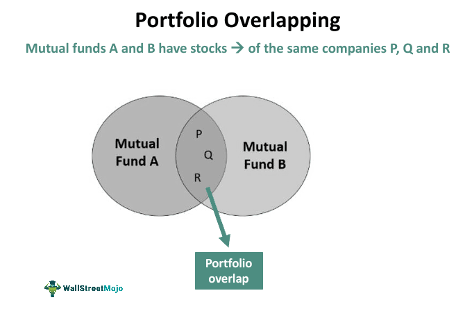

## Table of Contents

## What is fund overlap in investment strategy?

Fund overlap in investment strategy refers to when two or more investment funds hold the same stocks or assets in their portfolios. This can happen when an investor owns multiple funds, like mutual funds or ETFs, that have similar investment goals or focus on the same sectors or companies. When there is a lot of overlap, it can mean that an investor's portfolio is not as diverse as they might think, because they are essentially holding the same investments multiple times through different funds.

Understanding fund overlap is important because it can affect the overall risk and return of an investor's portfolio. If too many funds overlap, it can increase the risk because the portfolio becomes more dependent on the performance of a few stocks or sectors. To manage this, investors can look at the holdings of their funds and try to choose funds that complement each other rather than duplicate investments. This way, they can achieve a more balanced and diversified portfolio, which can help to spread out risk and potentially improve returns.

## Why is it important to understand fund overlap?

Understanding fund overlap is important because it helps investors see if they are spreading their money too thinly across the same kinds of investments. When you own different funds, you might think you're diversifying your portfolio, but if those funds hold a lot of the same stocks or assets, you're not really diversifying. This can be risky because if those shared investments do poorly, it can hurt your whole portfolio a lot.

By knowing about fund overlap, you can make smarter choices about which funds to buy. You can pick funds that hold different kinds of investments, which can help balance out your portfolio. This way, if one part of your portfolio goes down, other parts might go up, helping to protect your overall investment. So, understanding fund overlap can lead to a healthier and more resilient investment strategy.

## How can fund overlap affect an investment portfolio?

Fund overlap can make an investment portfolio riskier. If you own several funds that hold the same stocks or assets, you're not spreading out your investments as much as you might think. This means that if those shared investments do badly, it can hurt your whole portfolio a lot more than if your funds were different from each other. Imagine if you owned three different funds, but they all had a big chunk of their money in the same company. If that company's stock price drops, all three funds lose value at the same time, which can really affect your overall investment.

On the flip side, understanding and managing fund overlap can help you build a stronger and more balanced portfolio. By choosing funds that hold different kinds of investments, you can spread out your risk better. This way, if one part of your portfolio goes down, other parts might go up, which can help protect your money. So, paying attention to fund overlap lets you make smarter choices about which funds to buy, leading to a healthier investment strategy overall.

## What are common methods to identify fund overlap?

One common way to spot fund overlap is by looking at the list of stocks or assets that each fund owns. Many investment websites and fund companies provide a breakdown of what's in their funds. You can compare these lists to see if the same stocks or assets show up in more than one of your funds. If you see a lot of the same names, that's a sign of overlap.

Another way is to use special tools and software designed for investors. These tools can quickly analyze your funds and show you how much they overlap. Some financial apps and websites have features that can do this for you, making it easier to see where your investments might be too similar. By using these tools, you can get a clear picture of your portfolio and make adjustments if needed.

## Can you explain the difference between direct and indirect fund overlap?

Direct fund overlap happens when two or more funds you own have the exact same stocks or assets in their portfolios. For example, if you own two funds and both of them have Apple stock, that's direct overlap. It's easy to spot because you can see the same company names listed in the holdings of different funds. When you have direct overlap, it means your investments are not as spread out as you might think, because you're holding the same stocks multiple times.

Indirect fund overlap is a bit trickier. It happens when funds you own have stocks or assets that are related to each other, even if they're not the exact same. For instance, if one fund has Apple stock and another fund has stocks of companies that make parts for Apple, that's indirect overlap. These connections are not always obvious and can be harder to find. But they still mean your investments might be more similar than you realize, which can affect how well your portfolio is diversified.

## How does fund overlap impact diversification?

Fund overlap can make your investment portfolio less diverse than you think. When you own different funds, you might believe you're spreading your money across many different stocks or assets. But if those funds hold a lot of the same things, you're not really diversifying. It's like having the same bet placed in different spots. If those shared investments do badly, it can hurt your whole portfolio a lot more because your money is tied up in the same places over and over.

Understanding and managing fund overlap can help you build a healthier and more balanced portfolio. By choosing funds that hold different kinds of investments, you can spread out your risk better. This means if one part of your portfolio goes down, other parts might go up, which can help protect your money. So, paying attention to fund overlap and picking funds that don't overlap too much can lead to a more diverse and resilient investment strategy.

## What tools or software can help in analyzing fund overlap?

There are several tools and software that can help you figure out if your funds are too similar. One popular tool is Morningstar's X-Ray feature. It lets you put in all the funds you own and then shows you a detailed report on how much they overlap. This can help you see if you're holding the same stocks in different funds. Another tool is Personal Capital's Investment Checkup, which not only shows overlap but also gives you advice on how to make your portfolio better.

Another useful software is YCharts, which has a feature called the Overlap Analysis tool. It helps you compare the holdings of different funds side by side, making it easy to spot where they are the same. For those who like to dig deeper, Excel can be a good choice too. You can download the holdings of your funds and use Excel to compare them yourself. This way, you can see exactly where your funds overlap and make changes to your investments to spread out your risk better.

## What are the potential risks associated with high fund overlap?

High fund overlap can make your investment portfolio riskier. If you own many funds that hold the same stocks or assets, your money isn't spread out as much as you might think. This means if those shared investments do badly, it can hurt your whole portfolio a lot. Imagine if you owned three different funds, but they all had a lot of money in the same company. If that company's stock price goes down, all three funds lose value at the same time, which can really affect your overall investment.

Another risk is that you might miss out on other good investments. When your funds overlap a lot, you're not getting the full benefit of different kinds of investments that could help balance out your portfolio. If one part of your portfolio goes down, other parts might go up, but with high overlap, that's less likely to happen. So, paying attention to fund overlap can help you make smarter choices about which funds to buy, leading to a healthier investment strategy overall.

## How can investors minimize the negative effects of fund overlap?

Investors can minimize the negative effects of fund overlap by carefully choosing which funds to buy. They should look at the list of stocks or assets in each fund and pick ones that hold different kinds of investments. This way, they can spread out their money better and not have too much of it tied up in the same places. Using tools like Morningstar's X-Ray or Personal Capital's Investment Checkup can help them see where their funds overlap and make better choices.

Another way to reduce the impact of fund overlap is to regularly check their portfolio and make changes if needed. If an investor notices that their funds are too similar, they can sell some of them and buy new ones that hold different stocks or assets. This helps keep their portfolio balanced and reduces the risk of losing a lot of money if one investment does badly. By keeping an eye on fund overlap and making smart adjustments, investors can build a stronger and more diverse investment strategy.

## What role does fund overlap play in sector-specific investing?

Fund overlap can be really important when you're investing in specific sectors, like tech or health care. If you own a bunch of funds that focus on the same sector, there's a good chance they will have a lot of the same stocks. This means your money isn't spread out as much as you might think, because you're betting on the same companies over and over. If that sector does badly, all your funds could lose value at the same time, which can hurt your whole portfolio a lot.

To avoid this, you need to look closely at what each fund holds. If you see a lot of the same stocks in different funds, you might want to choose funds that focus on different parts of the sector or mix in funds from other sectors. This way, you can still invest in the areas you like, but you'll have a more balanced portfolio. By managing fund overlap, you can make your investments in specific sectors safer and potentially more rewarding.

## How do professional fund managers typically handle fund overlap?

Professional fund managers usually keep a close eye on fund overlap to make sure their portfolios are as diverse as possible. They look at the stocks or assets each fund holds and try to pick ones that don't have too many of the same things. This way, they can spread out the risk better. If they see a lot of overlap, they might sell some funds and buy others that hold different investments. This helps them keep the portfolio balanced and reduces the chance of big losses if one investment does badly.

Sometimes, fund managers use special tools and software to help them spot overlap quickly. These tools can show them exactly where their funds are too similar, making it easier to make changes. By managing fund overlap well, they can build a stronger and more resilient portfolio for their investors. This careful approach helps them meet their investment goals and keep their clients' money safer.

## Can advanced statistical models improve the management of fund overlap in large portfolios?

Advanced statistical models can definitely help manage fund overlap better in large portfolios. These models can look at lots of data from different funds and find patterns that might be hard to see otherwise. They can tell you exactly how much your funds overlap and show you which stocks or assets are causing it. By using these models, fund managers can make smarter choices about which funds to keep and which ones to sell. This helps them spread out their investments better and avoid putting too much money in the same places.

These models also help by predicting how changes in one fund might affect the whole portfolio. They can run different scenarios to see what would happen if they bought or sold certain funds. This lets fund managers plan ahead and make changes before problems happen. By using advanced statistical models, they can keep their portfolios balanced and reduce the risk of big losses. This makes their investment strategy stronger and more likely to meet their goals.

## What are Portfolio Management Strategies?

Portfolio management involves diversifying investments across different assets to mitigate risk. Diversification is a key principle, as it reduces the potential impact of poor performance from any single asset on the overall portfolio. The basis for diversification hinges on the concept of correlation, where combining assets with low or negative correlations can smooth overall returns and decrease [volatility](/wiki/volatility-trading-strategies).

Investors can choose between active and passive management strategies when constructing their portfolios. Active management involves selecting securities with the aim of outperforming a benchmark index, requiring in-depth research and a keen understanding of market dynamics. In contrast, passive management, often associated with index funds, aims to replicate the performance of a market index by holding a similar composition of securities, thus minimizing management costs and capitalizing on broader market moves.

A critical component of portfolio management is understanding the risk-return trade-off. This trade-off encapsulates the idea that potential returns rise with an increase in risk. Investors need to balance their desire for the highest possible return against their ability to tolerate risk. Tools like the Capital Asset Pricing Model (CAPM) are fundamental in this context. CAPM is used to estimate the expected return of an asset based on its systematic risk, represented by the formula:

$$
E(R_i) = R_f + \beta_i (E(R_m) - R_f)
$$

Where $E(R_i)$ is the expected return on the investment, $R_f$ is the risk-free rate, $\beta_i$ is the beta of the investment (a measure of its volatility compared to the market), and $E(R_m)$ is the expected return of the market.

Additionally, the investment time horizon is a vital [factor](/wiki/factor-investing) in portfolio management. It influences risk tolerance and the choice between growth-oriented or income-focused assets. Short-term horizons often necessitate a more conservative approach to preserve capital, while longer horizons can justify taking on higher risk with potential for significant growth.

In summary, effective portfolio management requires a strategic balance of asset diversification, management style, risk assessment, and time horizon considerations. These elements collectively help investors achieve their financial goals while managing the inherent risks associated with financial markets.

## How can algorithmic trading be integrated with portfolio management?

Algorithmic trading utilizes computer algorithms capable of executing trades at speeds and precisions unachievable through manual methods. This approach significantly enhances trading efficiency by minimizing the time delays involved in traditional trading processes. The primary advantages of [algorithmic trading](/wiki/algorithmic-trading) include the ability to manage large orders with minimal market impact and to achieve optimal execution prices through rapid responses to market conditions.

These algorithms leverage mathematical models and statistical analyses to inform data-driven decision-making. One common model used within algorithmic trading frameworks is the mean-variance optimization technique, which aims to maximize expected returns for a given level of risk. This is expressed through the formula:

$$
\text{Maximize } \quad \mu^T w - \frac{\lambda}{2} w^T \Sigma w
$$

Where:
- $\mu$ is the vector of expected asset returns,
- $w$ is the vector of weights assigned to each asset,
- $\lambda$ is the risk aversion coefficient,
- $\Sigma$ is the covariance matrix of asset returns.

Algorithmic trading also allows for dynamic adaptation of asset allocation, which is crucial in volatile markets. By continuously analyzing real-time data, algorithms can adjust portfolios to align with current market trends and risk tolerances. This dynamic reallocation optimizes portfolio performance by balancing risk exposure and return potential.

Integrating algorithmic trading with traditional portfolio management methods offers a balanced investment strategy. Traditional strategies often focus on qualitative factors and long-term goals, whereas algorithmic trading provides quantitative analysis and precise execution. Combining these approaches allows for strategic flexibility, enabling investors to benefit from both long-term value investing and short-term trading opportunities.

The integration also reduces emotional biases in trading decisions, as algorithms operate based on predefined rules and criteria. This methodical approach helps in maintaining discipline and consistency in executing trades. Furthermore, algorithmic trading supports [backtesting](/wiki/backtesting) strategies, where historical data is used to validate trading models before actual capital deployment. This ensures that strategies are robust and resilient to changing market conditions.

Overall, incorporating algorithmic trading into portfolio management strategies equips investors with enhanced tools to navigate the complexities of modern financial markets, thus potentially improving investment outcomes.

## What are some references and further reading materials?

Statman, M. explores the efficiencies of index funds and index-based investment strategies, highlighting their impact on investment performance. His work is instrumental for understanding the simplicity and cost-effectiveness of passive investing methodologies, which have become increasingly popular among investors seeking to minimize management fees and achieve market-average returns.

Sharpe, W. F.'s 'Capital Asset Prices: A Theory of Market Equilibrium Under Conditions of Risk' introduces the Capital Asset Pricing Model (CAPM), a foundational concept in finance that describes the relationship between systematic risk and expected return for assets, particularly stocks. CAPM is a crucial tool in assessing the expected return of an asset, taking into account the asset's sensitivity to market movements, denoted as beta (β). The formula is:

$$
E(R_i) = R_f + \beta_i \times (E(R_m) - R_f)
$$

Where $E(R_i)$ is the expected return on the asset, $R_f$ is the risk-free rate, $\beta_i$ is the beta of the investment, and $E(R_m)$ is the expected return of the market.

Elton, E. J., & Gruber, M. J.'s 'Modern Portfolio Theory and Investment Analysis' provides a comprehensive framework for understanding portfolio management. It presents concepts such as diversification and efficient frontier, which are essential for constructing an optimal portfolio that maximizes return for a given level of risk. The book emphasizes the importance of correlations among asset returns and the benefits of diversification in reducing unsystematic risk.

For those interested in the intersection of finance and technology, there are numerous resources available that cover advances in algorithmic trading and portfolio management. These materials delve into the development and implementation of trading algorithms, the role of [artificial intelligence](/wiki/ai-artificial-intelligence) and [machine learning](/wiki/machine-learning) in investment strategies, and the implications of high-frequency trading. They underscore the increasing relevance of data-driven approaches in making informed investment decisions and effectively managing portfolios in dynamic market environments.

## References & Further Reading

Statman, M. explores the efficiencies of index funds and index-based investment strategies, highlighting their impact on investment performance. His work is instrumental for understanding the simplicity and cost-effectiveness of passive investing methodologies, which have become increasingly popular among investors seeking to minimize management fees and achieve market-average returns.

Sharpe, W. F.'s 'Capital Asset Prices: A Theory of Market Equilibrium Under Conditions of Risk' introduces the Capital Asset Pricing Model (CAPM), a foundational concept in finance that describes the relationship between systematic risk and expected return for assets, particularly stocks. CAPM is a crucial tool in assessing the expected return of an asset, taking into account the asset's sensitivity to market movements, denoted as beta (β). The formula is:

$$
E(R_i) = R_f + \beta_i \times (E(R_m) - R_f)
$$

Where $E(R_i)$ is the expected return on the asset, $R_f$ is the risk-free rate, $\beta_i$ is the beta of the investment, and $E(R_m)$ is the expected return of the market.

Elton, E. J., & Gruber, M. J.'s 'Modern Portfolio Theory and Investment Analysis' provides a comprehensive framework for understanding portfolio management. It presents concepts such as diversification and efficient frontier, which are essential for constructing an optimal portfolio that maximizes return for a given level of risk. The book emphasizes the importance of correlations among asset returns and the benefits of diversification in reducing unsystematic risk.

For those interested in the intersection of finance and technology, there are numerous resources available that cover advances in algorithmic trading and portfolio management. These materials delve into the development and implementation of trading algorithms, the role of [artificial intelligence](/wiki/ai-artificial-intelligence) and [machine learning](/wiki/machine-learning) in investment strategies, and the implications of high-frequency trading. They underscore the increasing relevance of data-driven approaches in making informed investment decisions and effectively managing portfolios in dynamic market environments.

