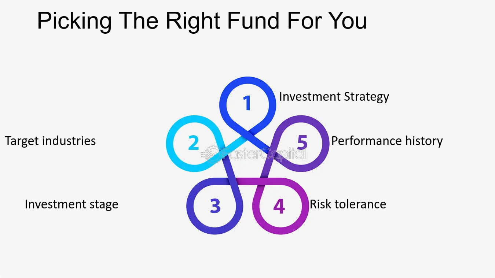

In recent years, many investors have turned to algorithmic trading and fund selection measures as tools to optimize their investment portfolios and enhance performance outcomes. Fund Picking, the process of identifying and selecting funds with strong potential for growth and stability, has become a crucial component in this approach. Through strategic use of algorithms, investors can evaluate vast amounts of data in order to pinpoint which funds or fund managers are likely to deliver consistent value.

Combining the analytical power of algorithmic trading with effective Fund Picking strategies provides investors with a foundational approach to navigate complex financial markets. Algorithmic tools help in the analysis of past performance data, risk metrics, and market trends, allowing investors to make informed choices about their fund selections. Such systematic techniques can aid in assessing fund performance potential, forecasting risk-adjusted returns, and creating a more resilient investment strategy.



Furthermore, the just-in-time analysis offered by algorithmic tools allows for ongoing optimization and adaptation of investment strategies. This dynamic method translates into potential opportunities for better returns and reduced exposure to risk. By gaining insights into the nuances of fund selection and employing algorithmic technologies, investors not only aim to enhance their portfolio performance but also aspire to achieve a balanced and diversified investment approach in an ever-evolving market landscape.


## Table of Contents


## Understanding Fund Picking

Fund Picking refers to the process of selecting fund managers who consistently deliver value to investors over time. This complex process is akin to Stock Picking, requiring a robust analysis and deep understanding of market dynamics. Successful Fund Picking not only hinges on identifying managers with a proven track record but also on assessing their ability to adapt to evolving market conditions.

Warren Buffet's insightful observation, "Unlike God the Father, markets do not forgive those who do not know what they are doing," underscores the criticality of informed decision-making in investment. An investor must navigate through various market [factor](/wiki/factor-investing)s, regulations, and economic indicators to make informed choices. This is where incorporating advanced analytical tools becomes paramount. These tools can significantly enhance the effectiveness of Fund Picking by providing quantitative insights and reducing human bias. 

For instance, algorithmic models can analyze vast datasets to identify patterns and predict fund performance. Tools such as machine learning can help in assessing the risk-adjusted returns of funds, evaluating performance metrics, and comparing historical data against current market trends. As a practical example, Python libraries such as NumPy and Pandas can be utilized to perform data analysis, enabling investors to process large [volume](/wiki/volume-trading-strategy)s of financial data efficiently and derive meaningful insights. Here's a simple Python snippet illustrating how data from funds can be analyzed:

```python
import pandas as pd
import numpy as np

# Sample Data: Historical returns of different funds
data = {
    'Fund_A': [0.02, 0.01, 0.03, -0.01, 0.05],
    'Fund_B': [0.01, 0.02, 0.02, 0.00, 0.04],
    'Fund_C': [-0.01, 0.00, 0.01, 0.02, 0.03]
}

# Create a DataFrame
funds_df = pd.DataFrame(data)

# Calculate mean returns
mean_returns = funds_df.mean()

# Calculate standard deviation of returns to assess risk
risk = funds_df.std()

# Display results
print("Mean Returns:\n", mean_returns)
print("\nRisk (Standard Deviation):\n", risk)
```

By transforming raw financial data into actionable insights through effective use of technology, investors can make better informed decisions about which fund managers are likely to deliver value in the future. In essence, advanced analytical tools empower investors to apply a scientific approach to Fund Picking, reducing the reliance on intuition and subjective judgment.


## Methodologies for Effective Fund Picking

A well-rounded approach to Fund Picking, akin to the MAGDAE methodology, encompasses several critical phases to enhance fund selection accuracy. 

1. **Fundamental Analysis**: This phase involves evaluating the intrinsic value and security potential of various asset classes by scrutinizing economic fundamentals. It looks at macroeconomic indicators such as GDP growth, interest rates, and inflation, alongside company-specific factors, to assess the inherent worth and potential risks associated with an asset. This analysis helps in understanding whether a fund's underlying assets are likely to appreciate in value, thereby contributing to overall fund performance.

2. **Team Audit**: Evaluating the capability and robustness of the fund management team is crucial. This phase emphasizes examining the tenure, experience, and past performance of fund managers. A team with a solid track record and extensive experience is more likely to navigate market fluctuations successfully. The audit also assesses the team's investment philosophy, decision-making process, and adherence to stated strategies, ensuring that the fund’s future performance aligns with investor expectations.

3. **Performance Control**: Consistent monitoring of a fund’s performance against its objectives is key to ensuring sustained success. By continuously analyzing performance metrics, investors can determine how well the fund adapts during market volatility and whether it meets the strategic goals set at its inception. This phase provides deeper insights into necessary adjustments or shifts in strategy to maintain robust performance and manage risks effectively.

These structured methodologies provide a framework for investors to make informed decisions, leveraging technology and comprehensive analysis to optimize fund selection and investment outcomes. Through diligent application of these phases, investors can significantly increase their chances of selecting funds that consistently deliver value.


## Fund Selection Measures

Fund selection measures are vital tools for predicting fund performance with greater reliability. Among these, daily return [volatility](/wiki/volatility-trading-strategies), daily six-factor alpha, and minimum churn rate stand out as key indicators. 

Daily return volatility provides insight into the stability of a fund's returns over time. Lower return volatility often correlates with superior performance, as it reflects the fund managers' proficient stock [picking](/wiki/asset-class-picking) and prudent trading skills. This relationship underscores the importance of volatility in assessing a fund's risk-adjusted performance, where lower volatility is generally favorable. Researchers have consistently found that funds exhibiting lower volatility are more likely to sustain superior returns compared to their high-volatility counterparts.

The daily six-factor alpha is another crucial measure. This metric accounts for various market factors such as size, value, and [momentum](/wiki/momentum), offering a more detailed evaluation of a fund manager's performance above a certain benchmark. By considering this six-factor model, investors can better discern whether a fund manager's success is due to skillful management rather than mere exposure to favorable market conditions.

Minimum churn rate is yet another important consideration. It indicates the frequency with which fund managers alter their portfolio holdings. A lower churn rate may signify a disciplined investment approach, reducing transaction costs and enhancing net returns. This measure helps investors gauge the conviction level of fund managers in their selected assets.

An effective assessment of these measures should consider both portfolio holdings and trading performance. By examining portfolio holdings, investors can evaluate the strength of the fund manager's stock selection. Meanwhile, trading performance sheds light on the manager's ability to capitalize on short-term market opportunities and manage [liquidity](/wiki/liquidity-risk-premium).

In conclusion, integrating daily return volatility, daily six-factor alpha, and minimum churn rate into fund selection processes can lead to more comprehensive evaluations. These measures, when used together, provide a multi-dimensional view of fund performance, allowing investors to make more informed decisions and potentially achieve superior investment outcomes.


## Role of Stock Picking vs. Trading Skill

Stock picking and trading skill are essential components in fund performance, but studies consistently highlight that stock picking is the more significant factor. This insight unveils a critical understanding for investors: the ability of a fund manager to select winning stocks significantly impacts the overall success of the fund.

The performance of a fund’s portfolio holdings often serves as the main driver of success. This means that the intrinsic value derived from the stocks chosen by the fund manager outweighs the gains potentially realized from their trading acumen. Research supports this view, indicating that a portfolio's long-term performance is closely linked to the quality of the stocks it holds rather than the frequency or skill involved in trading them.

Mathematically, the contribution of stock picking versus trading skill can be expressed through attribution analysis. Consider a simplified model where the fund’s return $R_f$ can be decomposed into components attributable to stock picking and trading skill:

$$
R_f = \alpha + \sum_{i=1}^{n} w_i R_i + \epsilon
$$

Here, $\alpha$ represents the manager’s stock picking skill as a return component independent of market movements, $w_i$ and $R_i$ denote the weight and return of each stock, respectively, and $\epsilon$ captures the residual performance attributable to trading actions and timing decisions.

Investors should therefore prioritize fund managers who demonstrate a consistent track record of selecting profitable stocks. This consistency often indicates a thorough understanding of the companies and industries in which they are investing, as well as the broader economic environment. In contrast, while trading skill is valuable for optimizing entry and [exit](/wiki/exit-strategy) points to maximize short-term gains or minimize losses, it does not compensate for poor stock selection.

To harness this principle effectively, investors can focus on fund selection measures that highlight stock picking ability, such as examining the returns of underlying portfolio holdings over several market cycles, rather than just short-term trading success. By aligning investment strategies with a fund manager's proven stock picking prowess, investors can significantly enhance the probability of achieving superior long-term returns.


## Challenges in Fund Picking

Fund Picking is a vital part of [algorithmic trading](/wiki/algorithmic-trading), but it comes with its share of challenges. One major challenge is identifying fund managers who genuinely adhere to their stated investment philosophies. It's crucial for investors to ensure that a fund manager's actions align with the investment strategies they've communicated. Mismatches between stated and actual strategies can lead to decisions that do not align with an investor’s expectations or risk tolerance.

Another significant challenge is that original funds might underperform when compared to their copycat versions. This underperformance often stems from deficits in trading skill. Copycat funds, which mimic successful strategies, may sometimes outperform original funds, particularly if they are managed by more adept traders who can execute trades more efficiently or react to market changes more swiftly. This paradox highlights the need for thorough and continuous audits of fund managers, assessing both their investment decisions and trading prowess.

To navigate these challenges, investors must develop robust strategies. This includes conducting comprehensive evaluations of fund managers, focusing not only on past performance but also on their decision-making processes and consistency with stated philosophies. Additionally, investors should consider employing advanced analytical tools to assess a fund manager's trading skills and strategy adherence.

By understanding these challenges, investors can mitigate risks and enhance their investment outcomes. Implementing strategies that focus on the alignment of philosophy and practice can create more predictable and reliable investment results, ensuring that chosen funds meet investor expectations and financial goals.


## Conclusion

Mastering Fund Picking is a crucial skill in algo trading, requiring both technological support and meticulous market analysis. The landscape of algorithmic trading is relentlessly evolving, and the ability to discern quality funds demands a systematic approach driven by robust data analysis and market insights. Employing advanced computational tools can offer an edge by processing large volumes of data and identifying patterns that are not immediately apparent.

The proper application of fund selection methodologies significantly increases the probability of choosing funds with high potential for performance. Applying techniques like Fundamental Analysis, Team Audit, and Performance Control allows investors to scrutinize the intrinsic value of assets, evaluate the fund management team's capabilities, and monitor the fund's performance continuously. These methodologies provide a structured framework that aligns investment choices with long-term financial goals while adapting to market fluctuations.

By focusing on stock picking skills and leveraging fund performance measures effectively, investors enhance their strategic investment capacity. It's essential to prioritize the ability of a fund to consistently select profitable stocks, as evidence suggests this has a more substantial impact on success than mere trading proficiency. Investors should employ comprehensive fund selection measures, such as assessing return volatility and alpha generation, to predict potential performance reliably.

In conclusion, a meticulous approach to Fund Picking, supported by cutting-edge algorithms and insightful market analysis, empowers investors to make informed decisions. Leveraging both technological advancements and in-depth analysis ensures a robust strategy for navigating the complexities of modern financial markets.


## References & Further Reading

[1]: Bergstra, J., Bardenet, R., Bengio, Y., & Kégl, B. (2011). ["Algorithms for Hyper-Parameter Optimization."](https://papers.nips.cc/paper_files/paper/2011/hash/86e8f7ab32cfd12577bc2619bc635690-Abstract.html) Advances in Neural Information Processing Systems 24.

[2]: ["Advances in Financial Machine Learning"](https://www.amazon.com/Advances-Financial-Machine-Learning-Marcos/dp/1119482089) by Marcos Lopez de Prado

[3]: ["Evidence-Based Technical Analysis: Applying the Scientific Method and Statistical Inference to Trading Signals"](https://www.wiley.com/en-gb/Evidence+Based+Technical+Analysis:+Applying+the+Scientific+Method+and+Statistical+Inference+to+Trading+Signals-p-9780470008744) by David Aronson

[4]: ["Machine Learning for Algorithmic Trading"](https://www.amazon.com/Machine-Learning-Algorithmic-Trading-intelligence/dp/9918608013) by Stefan Jansen

[5]: ["Quantitative Trading: How to Build Your Own Algorithmic Trading Business"](https://www.amazon.com/Quantitative-Trading-Build-Algorithmic-Business/dp/0470284889) by Ernest P. Chan