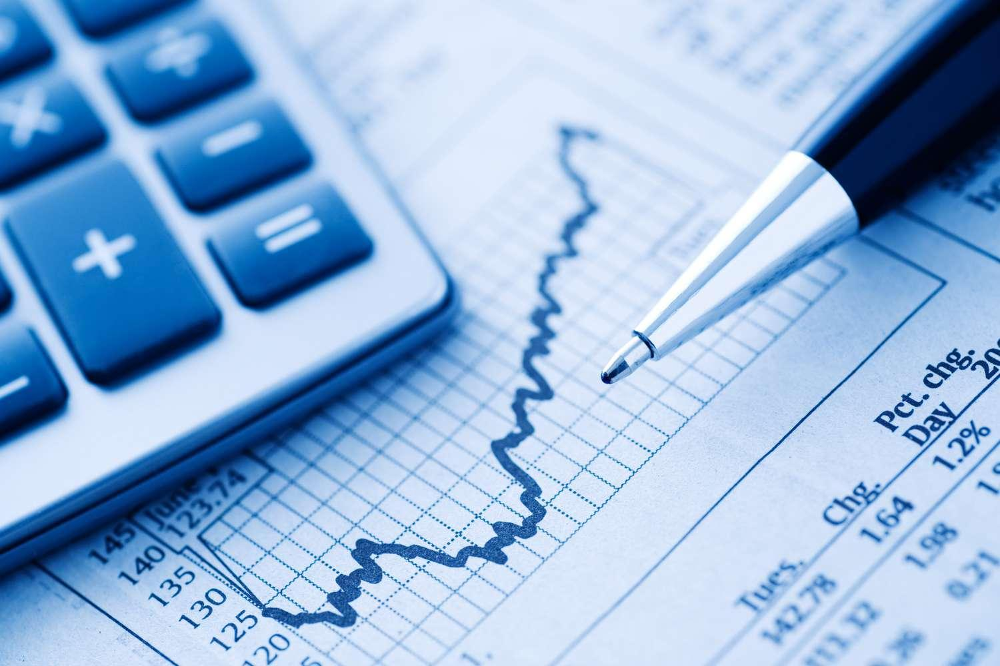

## Table of Contents

## What is fund picking and why is it important for investors?

Fund picking is when investors choose specific mutual funds or exchange-traded funds (ETFs) to invest their money in. These funds are managed by professionals who decide which stocks, bonds, or other assets to buy and sell. The goal is to pick funds that will grow in value over time and help investors reach their financial goals, like saving for retirement or buying a house.

It's important for investors to pick the right funds because it can make a big difference in how much money they make. If they choose funds that perform well, their investments can grow faster. On the other hand, if they pick funds that don't do well, they might lose money or not make as much as they could have. By doing research and understanding their own financial goals, investors can make better choices and increase their chances of success.

## How does fund picking differ from stock picking?

Fund picking and stock picking are two different ways to invest money. Fund picking means choosing mutual funds or ETFs, which are collections of different stocks, bonds, or other assets. When you pick a fund, you're letting a professional manager decide which specific stocks or bonds to buy and sell within that fund. This can be easier for people who don't have the time or knowledge to pick individual stocks themselves.

Stock [picking](/wiki/asset-class-picking), on the other hand, is when an investor chooses individual stocks to buy. This means they are directly picking which companies they want to invest in. Stock picking can be more risky because it depends a lot on how well the investor can predict which companies will do well. It requires more research and understanding of the market, but it also gives the investor more control over their investments.

Both methods have their own advantages and challenges. Fund picking can offer diversification and professional management, which can be less risky and easier to manage. Stock picking, however, can potentially lead to higher returns if the investor makes good choices, but it also comes with the risk of bigger losses if they pick the wrong stocks. Ultimately, the choice between [fund picking](/wiki/fund-picking) and stock picking depends on an investor's goals, knowledge, and how much risk they are willing to take.

## What are the key factors to consider when picking a fund?

When picking a fund, one of the first things to think about is the fund's performance. This means looking at how well the fund has done in the past. While past performance doesn't guarantee future results, it can give you an idea of how the fund has been managed. You should also consider the fees the fund charges. These fees can eat into your returns, so it's good to pick a fund with low fees. Another important [factor](/wiki/factor-investing) is the fund's investment strategy. Some funds focus on growth, while others aim for income or stability. Make sure the fund's strategy matches your own investment goals.

Another key factor is the level of risk you're comfortable with. Some funds are riskier than others, and they might go up and down a lot in value. If you don't like taking big risks, you might want to pick a fund that's more stable. It's also a good idea to look at the fund manager's experience and track record. A good manager can make a big difference in how well the fund does. Finally, think about how the fund fits into your overall investment plan. Diversifying your investments by picking different types of funds can help spread out your risk and increase your chances of success.

## How can beginners start with fund picking?

If you're new to investing, starting with fund picking can feel a bit scary, but it doesn't have to be. The first step is to figure out what you want to achieve with your money. Are you saving for something in the future, like a house or retirement? Once you know your goals, you can start looking for funds that match what you want. A good place to begin is by looking at index funds or ETFs that follow a big group of stocks, like the S&P 500. These funds are often a safe and easy way to start because they spread your money across many different companies.

Next, you should learn about the fees that come with the funds you're thinking about. Fees can make a big difference in how much money you keep over time, so try to pick funds with low fees. You can also use online tools and apps that help you pick funds based on your goals and how much risk you're okay with. It's a good idea to start small and add more money as you get more comfortable. Remember, it's okay to ask for help from a financial advisor or to do more research if you're not sure about something.

## What are the different types of funds available for picking?

There are many different types of funds that you can pick from. One common type is the mutual fund. This is where lots of people put their money together, and a professional manager uses it to buy a mix of stocks, bonds, or other things. Another type is the exchange-traded fund, or [ETF](/wiki/etf-trading-strategies). ETFs are similar to mutual funds, but you can buy and sell them throughout the day like stocks. There are also index funds, which try to match the performance of a specific market index, like the S&P 500. These are often a good choice for beginners because they're simple and usually have low fees.

Another kind of fund is the bond fund, which focuses on investing in bonds. These can be a good choice if you want to earn regular income from your investments. There are also sector funds, which invest in specific parts of the economy, like technology or healthcare. These can be riskier because they focus on just one area. Finally, there are target-date funds, which are designed to change their investments over time to become less risky as you get closer to a certain date, like when you plan to retire. Each type of fund has its own way of working and its own level of risk, so it's important to pick the one that fits your goals and how much risk you're okay with.

## How do you evaluate the performance of a fund?

Evaluating the performance of a fund is important to see if it's a good choice for your money. One way to do this is by looking at the fund's returns over time. You can check how much the fund has grown in the past few years. Remember, past performance doesn't tell you what will happen in the future, but it can give you an idea of how well the fund has been managed. You should also compare the fund's returns to a benchmark, like a market index. If the fund does better than the benchmark, it's a good sign.

Another thing to look at is the risk the fund takes. Some funds go up and down a lot in value, which can be scary if you don't like taking big risks. You can measure this by looking at the fund's [volatility](/wiki/volatility-trading-strategies), which shows how much the fund's value changes over time. It's also important to consider the fees you have to pay. High fees can eat into your returns, so a fund with lower fees might be a better choice even if its returns are a bit lower. By looking at these things, you can get a better idea of whether a fund is right for you.

## What role does risk assessment play in fund picking?

Risk assessment is a big part of picking funds. It helps you figure out how much your money might go up and down. Some funds are riskier because they invest in things that can change a lot in value. If you don't like taking big risks, you might want to pick funds that are more stable. By understanding the risk, you can choose funds that match how much you're okay with your money changing.

When you're looking at funds, you can see how risky they are by checking their volatility. Volatility tells you how much the fund's value moves around. A fund with high volatility might make more money, but it can also lose more. If you're saving for something important and don't want to lose a lot, you might pick a fund with lower volatility. This way, you can feel more comfortable with your choices and know that they fit with your plans for the future.

## How important is the fund manager’s track record in your decision?

The fund manager's track record is very important when you're picking a fund. It shows how good they are at making choices about what to buy and sell. If a manager has done well in the past, it might mean they know how to pick things that will go up in value. But remember, just because they did well before doesn't mean they will always do well. It's still a good idea to look at other things like the fund's fees and how much risk it takes.

Even though the manager's track record is important, it's not the only thing to think about. You should also see if their way of managing the fund matches what you want. Some managers might be good at making money grow, while others might be better at keeping your money safe. By looking at everything together, you can make a better choice about which fund to pick.

## Can you explain how diversification impacts fund picking strategies?

Diversification is really important when you're picking funds. It means spreading your money across different kinds of investments, like stocks, bonds, and maybe even things like real estate. When you pick funds, you can choose ones that focus on different areas of the market. This way, if one part of the market goes down, the other parts might stay the same or even go up. So, your overall investment doesn't get hurt as much. It's like not putting all your eggs in one basket.

By using diversification in your fund picking, you can make your investments safer. For example, you might pick one fund that invests in big companies and another that focuses on smaller ones. Or you could pick a fund that invests in different countries. This helps because if something bad happens in one place or with one type of investment, the others might still do okay. Diversification can help you feel more secure and might help you make more money over time because it balances out the risks.

## What are some common mistakes to avoid when picking funds?

One common mistake people make when picking funds is not paying attention to fees. Every fund charges fees, and these can really add up over time. If you pick a fund with high fees, it can eat into the money you make from your investment. Always look for funds with lower fees because they can help you keep more of your money in the long run.

Another mistake is chasing past performance. Just because a fund did well last year doesn't mean it will do well next year. It's easy to get excited about a fund that's been doing great, but it's important to look at other things too, like how much risk the fund takes and if it fits with your goals. Don't just pick a fund because it did well in the past; make sure it's right for your future plans.

Lastly, people often forget about diversification. Putting all your money into one type of fund can be risky. If that part of the market goes down, you could lose a lot. It's better to spread your money across different kinds of funds, like ones that invest in stocks, bonds, and maybe even different countries. This way, you can balance out the risks and have a better chance of making money over time.

## How can advanced tools and analytics improve fund picking?

Advanced tools and analytics can really help when you're picking funds. These tools can look at a lot of information quickly and find patterns that might be hard for you to see on your own. For example, they can use things like big data and [machine learning](/wiki/machine-learning) to guess how a fund might do in the future. They can also help you see how much risk a fund takes and how it compares to other funds. This way, you can make smarter choices about which funds to pick.

Another way these tools help is by making it easier to keep track of your investments. They can give you reports and charts that show you how your funds are doing over time. They can also send you alerts if something important happens with your funds. By using these tools, you can stay on top of your investments and make changes if you need to. This can help you do better in the long run and reach your financial goals.

## What are the latest trends and innovations in fund picking for expert investors?

Expert investors are now using more advanced tools and technologies to pick funds. One big trend is the use of [artificial intelligence](/wiki/ai-artificial-intelligence) and machine learning. These technologies can look at a lot of data quickly and find patterns that might be hard to see otherwise. They can help guess how funds might do in the future and figure out the best times to buy or sell. Another trend is using big data to make better choices. By looking at a lot of information from different places, investors can get a clearer picture of what's happening in the market and pick funds that fit their goals.

Another innovation is the use of robo-advisors. These are computer programs that can pick funds for you based on your goals and how much risk you want to take. They can manage your investments and make changes as needed, which can save you time and help you do better. Also, there's a growing interest in sustainable and [ESG](/wiki/esg-investing) (environmental, social, and governance) investing. More investors are picking funds that focus on companies that are good for the planet and society. This not only helps them feel good about their investments but can also lead to good returns as more people care about these issues.

## What is the role of stock picking compared to trading skill?

Stock picking and trading skill are essential components in fund performance, but studies consistently highlight that stock picking is the more significant factor. This insight unveils a critical understanding for investors: the ability of a fund manager to select winning stocks significantly impacts the overall success of the fund.

The performance of a fund’s portfolio holdings often serves as the main driver of success. This means that the intrinsic value derived from the stocks chosen by the fund manager outweighs the gains potentially realized from their trading acumen. Research supports this view, indicating that a portfolio's long-term performance is closely linked to the quality of the stocks it holds rather than the frequency or skill involved in trading them.

Mathematically, the contribution of stock picking versus trading skill can be expressed through attribution analysis. Consider a simplified model where the fund’s return $R_f$ can be decomposed into components attributable to stock picking and trading skill:

$$
R_f = \alpha + \sum_{i=1}^{n} w_i R_i + \epsilon
$$

Here, $\alpha$ represents the manager’s stock picking skill as a return component independent of market movements, $w_i$ and $R_i$ denote the weight and return of each stock, respectively, and $\epsilon$ captures the residual performance attributable to trading actions and timing decisions.

Investors should therefore prioritize fund managers who demonstrate a consistent track record of selecting profitable stocks. This consistency often indicates a thorough understanding of the companies and industries in which they are investing, as well as the broader economic environment. In contrast, while trading skill is valuable for optimizing entry and [exit](/wiki/exit-strategy) points to maximize short-term gains or minimize losses, it does not compensate for poor stock selection.

To harness this principle effectively, investors can focus on fund selection measures that highlight stock picking ability, such as examining the returns of underlying portfolio holdings over several market cycles, rather than just short-term trading success. By aligning investment strategies with a fund manager's proven stock picking prowess, investors can significantly enhance the probability of achieving superior long-term returns.

## References & Further Reading

[1]: Bergstra, J., Bardenet, R., Bengio, Y., & Kégl, B. (2011). ["Algorithms for Hyper-Parameter Optimization."](https://papers.nips.cc/paper_files/paper/2011/hash/86e8f7ab32cfd12577bc2619bc635690-Abstract.html) Advances in Neural Information Processing Systems 24.

[2]: ["Advances in Financial Machine Learning"](https://www.amazon.com/Advances-Financial-Machine-Learning-Marcos/dp/1119482089) by Marcos Lopez de Prado

[3]: ["Evidence-Based Technical Analysis: Applying the Scientific Method and Statistical Inference to Trading Signals"](https://www.wiley.com/en-gb/Evidence+Based+Technical+Analysis:+Applying+the+Scientific+Method+and+Statistical+Inference+to+Trading+Signals-p-9780470008744) by David Aronson

[4]: ["Machine Learning for Algorithmic Trading"](https://www.amazon.com/Machine-Learning-Algorithmic-Trading-intelligence/dp/9918608013) by Stefan Jansen

[5]: ["Quantitative Trading: How to Build Your Own Algorithmic Trading Business"](https://www.amazon.com/Quantitative-Trading-Build-Algorithmic-Business/dp/0470284889) by Ernest P. Chan