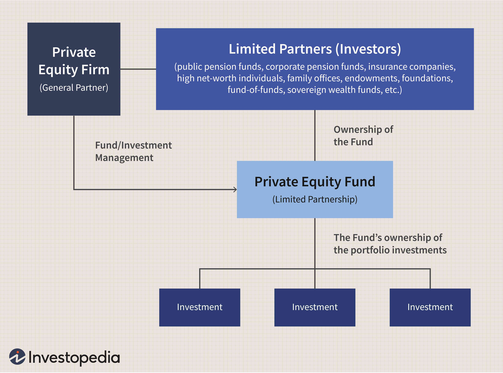

In the fast-paced world of finance, the digital revolution has transformed traditional practices, introducing both challenges and opportunities. Investment funds are at the forefront of this transformation, leveraging technological advancements to utilize algorithms that optimize trading strategies. These algorithms are designed to analyze vast amounts of data quickly, enabling fund managers to make informed decisions with greater precision and agility compared to conventional methods.

The intersection of fund runs, financial panics, and algorithmic trading represents a significant area of interest within this evolving landscape. Fund runs—events where a large number of investors withdraw their money simultaneously—can lead to severe market disruptions. Historically, these runs have been triggered by loss of confidence and financial panic, often exacerbated by economic crises such as the Great Depression and the 2008 financial crisis. In today's interconnected markets, the potential for rapid shifts in investor behavior is heightened by technological platforms that facilitate the swift execution of trades.

Financial panics, fueled by psychological and behavioral responses, can have cascading effects on markets. The proliferation of digital communication and trading platforms has increased the speed and scale of such panics, leading to amplified volatility. Algorithmic trading plays a complex role within this context, able to both mitigate and exacerbate market instability. On one hand, algorithms can identify and respond to patterns of stress in the market with remarkable speed, potentially stabilizing volatile conditions. On the other hand, they can also trigger sudden market movements, as seen in events like flash crashes.

This article aims to provide insights into how these dynamics influence investment strategies and market stability. By exploring the relationships between fund runs, financial panics, and algorithmic trading, the discussion seeks to offer a clearer understanding of how these factors are reshaping the financial landscape. This understanding is critical for investors, regulators, and financial professionals who must navigate the increased volatility and complexity introduced by technological advancements. Addressing these challenges will require a careful balance of innovation, regulation, and risk management in pursuing market stability and investor confidence.

## Table of Contents

## Understanding Fund Runs: Causes and Consequences

Fund runs represent a critical phenomenon in financial markets, occurring when a large number of investors withdraw their money from an investment fund simultaneously. This can be triggered by various factors, often linked to panic or a substantial loss of confidence in the fund's ability to maintain its value or liquidity. Historical instances of fund runs have provided valuable lessons and insights into their causes, consequences, and potential mitigation strategies.

### Historical Perspective of Fund Runs

The concept of fund runs dates back to the early 20th century, notably during the Great Depression. Financial institutions experienced catastrophic withdrawals leading to numerous bank failures. A more recent example is the 2008 financial crisis, which saw a significant downturn in confidence within the financial system. During these periods, the interconnectedness of global financial markets amplified the speed and severity of fund withdrawals, as evidenced by the run on money market mutual funds following the bankruptcy of Lehman Brothers in September 2008.

### Triggers of Fund Runs in the Current Financial Ecosystem

Several factors could instigate fund runs today. These include:

1. **Economic Uncertainty**: Events such as geopolitical tensions, economic recession fears, or unexpected market shocks can lead to a mass withdrawal of funds.

2. **Fund Performance and Reputation**: Poor performance or negative news about a fund manager or company may erode investor confidence.

3. **Market Conditions**: Volatile markets could drive investors to pull their investments in search of stability.

4. **Technological Advancements**: Increased access to information and faster transaction capabilities can accelerate investment fund withdrawals.

### Consequences of Fund Runs

The impact of fund runs on financial markets and the broader economy can be severe. For investment funds, sudden outflows can lead to forced asset sales at suboptimal prices, further depressing asset values and creating a feedback loop of losses and withdrawals. This can exacerbate existing market instability and lead to widespread economic issues, as [liquidity](/wiki/liquidity-risk-premium) dries up and confidence diminishes. For the broader economy, the knock-on effects may include reduced investment, lower economic growth, and increased unemployment.

### Preventive Measures and Safeguards

To mitigate the risk of fund runs, several preventative measures and safeguards have been implemented:

1. **Liquidity Buffers**: Funds maintain higher levels of liquid assets to accommodate redemptions without resorting to asset fire sales.

2. **Redemption Gates and Fees**: Implementing temporary restrictions or fees on withdrawals can help curb mass exodus during panic situations.

3. **Communication Strategies**: Transparent communication from fund managers about the state of the fund and its investment strategy can help maintain investor confidence.

4. **Regulatory Oversight**: Stricter regulations and oversight from financial authorities help ensure that funds are resilient to shocks and maintain sound management practices.

5. **Stress Testing and Scenario Analysis**: Regular stress testing of funds helps prepare for various adverse scenarios, ensuring they remain robust under different market conditions.

Understanding and addressing the dynamics of fund runs are essential for maintaining market stability and protecting investor interests. Through strategic management, effective communication, and robust regulatory frameworks, the risks associated with fund runs can be significantly mitigated.

## Financial Panic: Influence and Ripple Effects

Financial panic serves as a critical accelerant in financial markets, exacerbating fund runs and creating a downward spiral of selling pressure and asset devaluation. This precarious phenomenon often stems from a loss of confidence, driving investors to liquidate their positions en masse, thereby intensifying market instability.

### Psychological and Behavioral Aspects

The psychological and behavioral dimensions of financial panic are crucial in understanding its implications. Panic often results from a herd mentality, where investors, driven by fear, mimic the actions of others without fully considering the underlying fundamentals. This behavior aligns with the prospect theory, which suggests that individuals value losses more than equivalent gains, prompting disproportionate reactions to negative news. As a consequence, even small triggers can lead to massive sell-offs, with investors racing to minimize perceived losses.

### Historical Examples and Long-term Effects

History offers numerous instances of financial panic impacting market structures. The Panic of 1907 is a significant example, where the lack of liquidity led to bank runs and stock market crashes. Similarly, the Black Monday crash of 1987 illustrated how panic can lead to rapid market downturns, with the Dow Jones Industrial Average dropping by over 22% in a single day. Such events often lead to long-term regulatory changes and market reforms aimed at preventing similar occurrences in the future. For instance, the Panic of 1907 was a catalyst for the establishment of the Federal Reserve System in 1913.

### Modern Communication and Digital Platforms

The advent of modern communication and digital trading platforms has transformed the speed and scale at which financial panic can propagate. Information travels instantaneously through the internet and social media, often amplifying fear and uncertainty. Algorithmic trading systems, which execute trades at high speeds based on pre-defined criteria, can further exacerbate these dynamics by responding to negative signals and contributing to the selling pressure. Consequently, market reactions are faster and potentially more severe, broadening the impact of financial panic.

### Strategies for Managing Investor Behavior

To manage investor behavior during times of panic, fund managers employ various strategies. One approach is to maintain open and transparent communication with investors, providing regular updates and reassurance to mitigate fear and uncertainty. Diversification of assets can also reduce the impact of market [volatility](/wiki/volatility-trading-strategies) on portfolios, minimizing the need for hasty liquidation. Imposing temporary restrictions on withdrawals, although controversial, can prevent panic-induced sell-offs. Additionally, employing algorithmic systems with built-in circuit breakers helps stabilize trading activities by pausing or slowing down transactions during extreme volatility.

In conclusion, understanding the influence and ripple effects of financial panic is essential for developing effective investment strategies and enhancing market resilience. By recognizing the psychological drivers and leveraging modern technology and risk management techniques, financial markets can better withstand the adverse impacts of panic-driven dynamics.

## Algorithmic Trading: Revolutionizing Financial Markets

Algorithmic trading has become a cornerstone of modern financial markets, representing a paradigm shift in how investment funds are managed. By leveraging complex algorithms to automate trading decisions, investment firms can execute large volumes of trades with precision and at unprecedented speed. This technological advancement not only enhances the operational efficiency of trading activities but also offers a range of strategic advantages.

Algorithms employed in trading operations can be categorized into several types, each serving distinct purposes:

1. **Trend-Following Algorithms**: These algorithms analyze market trends, leveraging statistical models to identify and follow existing price movements. They are particularly useful in momentum trading and are employed to capture gains from persistent market movements.

2. **Arbitrage Algorithms**: Designed to exploit price discrepancies across different markets or financial instruments, arbitrage algorithms operate under the principle that identical assets should not trade at different prices. By identifying these inefficiencies, these algorithms execute simultaneous buy and sell orders to profit from the price difference.

3. **Market Making Algorithms**: These algorithms provide liquidity to the markets by constantly quoting both buy and sell prices, thus enabling smoother price discovery. They earn profits from the spread between bid and ask prices and are integral to maintaining market fluidity.

4. **Execution Algorithms**: Used to minimize the market impact of large trades, execution algorithms break down large orders into smaller parts and execute them over a period, adhering to strategies like VWAP (Volume Weighted Average Price) or TWAP (Time Weighted Average Price).

The advantages of [algorithmic trading](/wiki/algorithmic-trading) include remarkable speed and efficiency. Algorithms can process vast datasets and execute trades in microseconds, far exceeding the capabilities of human traders. This not only reduces transaction costs but also significantly diminishes the possibility of human error, leading to more consistent trading outcomes.

Despite these benefits, algorithmic trading also poses certain risks and challenges. One significant concern is the occurrence of flash crashes, where rapid selling triggers abrupt market declines within minutes, often exacerbated by the speed of automated trading systems. The 2010 Flash Crash is a notable example, where major U.S. stock indices dropped and recovered within minutes, underscoring potential vulnerabilities in algorithmic systems.

Real-world examples further illustrate the impact of algorithmic trading on market movements and stability. For instance, in 2019, an algorithmic error by a large international bank resulted in unintended trades amounting to nearly €28 billion, causing substantial market disruptions. Such incidents highlight the necessity for robust risk management frameworks and stringent regulatory oversight to mitigate potential systemic risks associated with algorithmic trading.

In conclusion, while algorithmic trading provides considerable advantages to financial markets through improved speed and accuracy, it requires careful management to address the risks associated with automated decision-making. Its evolving role continues to challenge traditional market structures, offering both opportunities and responsibilities for market participants.

## Algorithmic Trading in the Context of Financial Panic

Algorithmic trading, characterized by the use of complex algorithms to execute trades rapidly and efficiently, plays a dual role during periods of financial panic. On one hand, algorithmic trading can exacerbate market volatility because automated systems might react similarly to market signals, thereby amplifying price fluctuations. For example, during a sudden downturn, algorithms programmed with stop-loss orders may trigger en masse, creating a cascade effect that further drives down asset prices. This phenomenon was witness during the "Flash Crash" of May 6, 2010, where the Dow Jones Industrial Average plummeted nearly 1,000 points within minutes, only to recover quickly thereafter. Investigations revealed that algorithmic trades, including high-frequency trading ([HFT](/wiki/high-frequency-trading-strategies)), contributed to this unprecedented market turbulence by intensifying the selling pressure.

Conversely, algorithmic trading can also mitigate the effects of financial panic. Certain algorithms are designed to stabilize markets by identifying and exploiting [arbitrage](/wiki/arbitrage) opportunities or by providing liquidity during periods of market distress. For instance, liquidity-providing algorithms can act as a counterbalance to selling pressures by purchasing assets at undervalued prices, thereby helping to restore market equilibrium.

The balance between algorithmic decision-making and human oversight is crucial in preventing market disruptions during volatile periods. Human oversight is vital in settings where market conditions deviate from normal patterns, as algorithms can sometimes lack the adaptability to react prudently to unforeseen anomalies. Traders and fund managers typically implement circuit breakers or other safeguards to pause trading and allow human evaluation of the situation. Such measures are intended to prevent algorithm-induced spirals of panic-driven trades.

Regulatory bodies worldwide have responded to the challenges posed by algorithmic trading with a mix of existing and new frameworks aimed at ensuring market stability. The Securities and Exchange Commission (SEC) in the United States, for example, has adopted measures to strengthen market infrastructure, such as mandating robust system testing and risk controls for firms engaged in significant algorithmic trading activities. Similarly, the European Securities and Markets Authority (ESMA) under the Markets in Financial Instruments Directive II (MiFID II) enforces transparency and accountability standards to enhance oversight of algorithmic trading practices.

Looking forward, the development and regulation of algorithmic trading technologies must emphasize both innovation and risk management. Emerging areas of interest include leveraging [artificial intelligence](/wiki/ai-artificial-intelligence) and [machine learning](/wiki/machine-learning) to create more adaptive and intelligent trading systems that can better handle market anomalies. However, with greater computational power comes the necessity for stringent ethical and practical regulatory frameworks to address concerns such as data privacy, market fairness, and systemic risk.

In conclusion, while algorithmic trading's rapid and efficient reaction to market stimuli holds the potential to dampen financial panic, it also presents challenges that require thoughtful oversight and regulation. A balanced approach that incorporates advanced technological solutions with regulatory vigilance and human oversight is paramount in ensuring that algorithmic trading contributes positively to market stability even in times of financial stress.

## Conclusion

The intricate relationship between fund runs, financial panic, and algorithmic trading is significantly reshaping the investment landscape. As traditional and emergent financial mechanisms intertwine, investment funds increasingly rely on technological solutions to manage the complexities of financial volatility. This reliance on algorithms and their rapid-decision capabilities exemplifies a shift toward a more technologically-driven approach to navigating economic uncertainties.

Understanding the dynamics of these elements is essential for investors, regulators, and financial professionals. Investors must recognize the potential impact of algorithmic trading, which, while offering efficiency and reduced error, can also amplify market volatility during periods of financial panic. Regulators face the challenge of crafting policies that balance innovation with protective measures. Financial professionals, particularly fund managers, need strategies that reconcile human judgment with algorithmic insights to mitigate risks associated with fund runs and market disruptions.

The current financial era presents opportunities alongside risks. Algorithms can create efficient markets, but they also pose risks such as flash crashes, where the speed of algorithmic trading can lead to sudden, severe market fluctuations. Thus, stakeholders must proactively seek to understand these risks and opportunities, fostering resilience in financial systems.

This era calls for continued research, regulation, and innovation. Research should focus on advancing algorithmic trading strategies that enhance stability. Effective regulation must evolve alongside technology to protect market integrity. Innovation in financial technologies should aim to support investor confidence and market stability, ensuring that technological advancements serve the broader economic good.

Ultimately, this convergence of fund runs, financial panic, and algorithmic trading demands a comprehensive approach. Collaborative efforts among stakeholders are vital to navigating the evolving financial environment, balancing the imperatives of efficiency, stability, and investor trust.

## References & Further Reading

[1]: The Financial Crisis Inquiry Commission. (2011). ["The Financial Crisis Inquiry Report: Final Report of the National Commission on the Causes of the Financial and Economic Crisis in the United States."](https://www.govinfo.gov/app/details/GPO-FCIC/) U.S. Government Printing Office.

[2]: Kirilenko, A. A., Kyle, A. S., Samadi, M., & Tuzun, T. (2017). ["The Flash Crash: The Impact of High Frequency Trading on an Electronic Market."](https://www.jstor.org/stable/26652722) Journal of Finance.

[3]: Carlin, B. I., & Robinson, D. T. (2012). ["Financial Education and Timely Decision Support: Lessons from Junior Achievement on Project Graduation."](https://www.itm-conferences.org/articles/itmconf/ref/2024/11/itmconf_icaetm2024_01034/itmconf_icaetm2024_01034.html) Economic Letters.

[4]: Pozsar, Z., Adrian, T., Ashcraft, A., & Boesky, H. (2013). ["Shadow Banking."](https://www.newyorkfed.org/medialibrary/media/research/staff_reports/sr458.pdf) Review of Financial Studies, 28(1), 14-63.

[5]: Hansen, L. P., & Sargent, T. J. (2012). ["Three Types of Ambiguity."](https://home.uchicago.edu/~lhansen/three%20types%20of%20ambiguity.pdf) Journal of Monetary Economics, 59(5), 422-445.