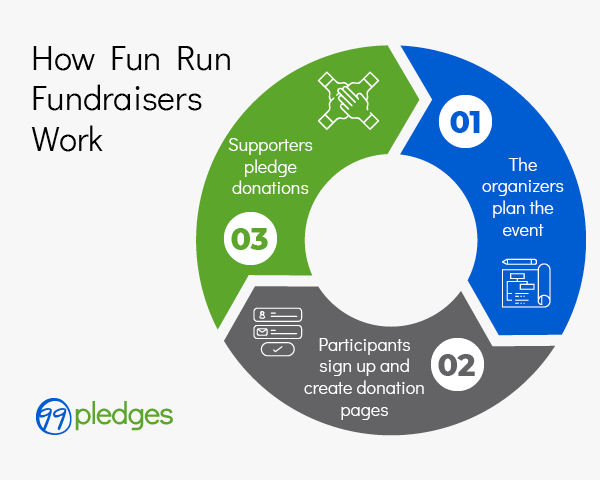

## Table of Contents

## What is a Fund Run?

A Fund Run is an event where people run, walk, or jog to raise money for a cause or organization. It's like a fun race where instead of winning prizes, everyone helps to collect money for something important. Schools, charities, and community groups often organize these events to support their projects or programs.

During a Fund Run, participants usually get sponsors who pledge to give money based on how far they run or just a fixed amount. This makes it fun and motivating because the more you run, the more money you can raise. It's a great way to bring people together, stay active, and help make a difference in the community.

## Why are Fund Runs important for businesses?

Fund Runs are important for businesses because they help show that the company cares about the community. When a business sponsors or participates in a Fund Run, it can make people feel good about the company. Customers and employees see that the business is not just about making money, but also about helping others. This can make the business more popular and trusted in the community.

Also, Fund Runs can be a fun way for businesses to bring their team together. When employees run together for a good cause, it can make them feel more connected to each other and to the company. This can make the workplace happier and more productive. Plus, it's a chance for businesses to meet other people in the community and make new friends or partners.

## How does a Fund Run work?

A Fund Run is a special event where people run, walk, or jog to raise money for a cause. It's like a big party where everyone helps to collect money for something important. Schools, charities, and community groups often organize these events. To join in, people usually find sponsors who promise to give money based on how far they run or just a fixed amount. This makes it fun because the more you run, the more money you can raise for the cause.

During the event, everyone gathers at a starting point and then sets off on the run. There might be different distances to choose from, so people can pick what works best for them. Along the way, there are often cheering crowds, music, and sometimes even snacks to keep everyone motivated. At the end, everyone celebrates together, knowing they've helped make a difference. It's a great way to bring people together, stay active, and support a good cause.

## What are the key components of a Fund Run?

A Fund Run is an event where people run, walk, or jog to raise money for a cause. It needs a few important things to work well. First, there has to be a clear reason for the run, like helping a school or a charity. People need to know what they are running for. Second, you need people to join in. They sign up and often get sponsors who promise to give money based on how far they run or just a fixed amount. This makes it fun and helps raise more money.

The event itself needs a good place to start and a clear path to follow. It can be a short loop around a park or a longer route through the city. There should be signs to show the way and maybe some helpers to keep everyone safe. During the run, it's nice to have cheering crowds, music, and maybe even some snacks to keep everyone going. At the end, everyone comes together to celebrate and see how much money they raised. It's all about having fun while helping a good cause.

## Can you provide a simple example of a Fund Run?

Imagine a school wants to raise money for new playground equipment. They decide to organize a Fund Run. The school sends out flyers to all the students and their families, asking them to join in. Each student finds people to sponsor them. The sponsors promise to give money for every lap the student runs around the school field. The day of the run, everyone gathers at the school. There's music playing, and parents and teachers cheer as the students start running.

The students run as many laps as they can. Some run a lot, and some run a little, but everyone has fun. After the run, everyone comes together to count the laps and the money raised. They find out they raised enough for the new playground equipment! The students feel proud and happy because they helped their school while having a great time running together.

## What are the different types of Fund Runs?

Fund Runs come in different types, each with its own way of raising money for a good cause. One common type is the Pledge Run, where people get sponsors who promise to give money for every mile or lap they run. This makes it exciting because the more you run, the more money you raise. Another type is the Flat Fee Run, where people pay a set amount to join the run, and all the money goes to the cause. This is simple and everyone knows exactly how much they are giving.

There are also Fun Runs, which are more about having a good time than running fast. These events often have costumes, music, and fun stops along the way. People of all ages can join in and enjoy the party atmosphere while helping a cause. Lastly, there are Virtual Runs, where people can run anywhere they want and track their distance with an app. This type of run is great because it lets people participate from anywhere, making it easier for more people to join in and support the cause.

## How do Fund Runs differ from other fundraising methods?

Fund Runs are different from other fundraising methods because they mix fun and exercise with giving. Unlike just asking for donations or selling things, Fund Runs get people moving and having a good time while they help a cause. People sign up, find sponsors, and then run, walk, or jog together. This makes it exciting because the more you run, the more money you can raise. It's a way to bring the community together, stay active, and support something important all at once.

Other fundraising methods, like selling cookies or holding a raffle, don't usually involve physical activity or community events in the same way. With Fund Runs, everyone can see and feel the energy of the event, which can make people more excited to give. Plus, Fund Runs often have a festive atmosphere with music, cheering, and sometimes even costumes, which makes them more memorable and enjoyable than just handing over money or buying a ticket. This can lead to more people wanting to join in and help out.

## What are the potential risks associated with Fund Runs?

Fund Runs can be a lot of fun, but they also come with some risks. One big risk is that people might get hurt while running. They could trip and fall, or maybe run too hard and hurt their muscles. It's important for everyone to be careful and know their limits. Another risk is the weather. If it's too hot, people could get too warm and feel sick. If it's raining, the paths might get slippery and cause accidents. Organizers need to think about the weather and maybe change the plans if it's not safe.

Another thing to watch out for is money. Sometimes, not enough people sign up or give money, and the Fund Run might not raise as much as hoped. This can be disappointing for everyone involved. Also, there's a chance that the money collected might not be used the right way. It's important to trust the people in charge and make sure the money goes to the cause it's meant for. By being careful and planning well, Fund Runs can be safe and successful.

## How can a company prepare for a successful Fund Run?

To prepare for a successful Fund Run, a company should start by choosing a clear and meaningful cause that everyone can get behind. This could be something like helping a local school or supporting a charity. Once the cause is picked, the company needs to spread the word. They can use posters, emails, and social media to tell everyone about the event and why it's important. It's also a good idea to get people excited by sharing stories about how the money will help.

Next, the company should plan the event carefully. They need to pick a safe and fun place for the run, like a park or around the company's building. They should also think about the weather and have a backup plan if it's too hot or rainy. During the run, having music, snacks, and cheering crowds can keep everyone motivated. After the run, the company should celebrate with everyone and share how much money was raised. This helps everyone feel proud of what they did together.

## What metrics should be used to evaluate the success of a Fund Run?

To see if a Fund Run was successful, the first thing to look at is how much money was raised. This is the main goal of the event, so it's important to know if the total amount met or went over what was hoped for. Another thing to check is how many people joined in. If lots of people ran or walked, it shows that the event was popular and got a lot of support from the community.

It's also good to see how happy people were with the event. You can do this by asking them to fill out a short survey or by listening to what they say after the run. If people had fun and felt good about helping the cause, that's a big sign of success. Finally, think about if the Fund Run helped the company or group look good in the community. If more people now know about and like the company because of the event, that's another way to know it was a success.

## How do regulatory environments affect Fund Runs?

Regulatory environments can have a big impact on Fund Runs. Different places have different rules about how events like these can be run. For example, some places might need a special permit to hold a Fund Run in a public space. This means the organizers have to apply for the permit and follow certain rules to keep everyone safe. Also, there might be rules about how money is collected and used. The organizers need to make sure they follow these rules so the money goes to the right place and everyone trusts the event.

Another way regulatory environments affect Fund Runs is through safety and health regulations. These rules are there to make sure everyone stays safe during the event. For instance, there might be rules about having enough water stations, first aid, and people to help if someone gets hurt. Organizers have to plan carefully to meet these requirements. If they don't follow the rules, the event might be canceled or they could get in trouble. So, understanding and following the local regulations is really important for a successful Fund Run.

## What advanced strategies can be employed to optimize a Fund Run?

To make a Fund Run even better, companies can use some smart ideas. One good idea is to use technology to help with the event. They can make an app where people can sign up, track their runs, and see how much money they are raising. This makes it easier for everyone and can make the event more exciting. Another idea is to get businesses to sponsor the event. If companies give money or prizes, it can help raise more money and make the event more fun. Also, using social media to share stories and updates about the Fund Run can get more people interested and involved.

Another way to make a Fund Run better is to think about what people want. For example, having different distances for the run can let more people join in, no matter how far they can run. Adding fun things like music, games, and food can make the event more enjoyable. It's also a good idea to keep in touch with everyone after the run. Sending thank you notes or updates on how the money is being used can make people feel good about what they did and want to help again next time. By using these smart ideas, a Fund Run can be more successful and fun for everyone.

## References & Further Reading

[1]: The Financial Crisis Inquiry Commission. (2011). ["The Financial Crisis Inquiry Report: Final Report of the National Commission on the Causes of the Financial and Economic Crisis in the United States."](https://www.govinfo.gov/app/details/GPO-FCIC/) U.S. Government Printing Office.

[2]: Kirilenko, A. A., Kyle, A. S., Samadi, M., & Tuzun, T. (2017). ["The Flash Crash: The Impact of High Frequency Trading on an Electronic Market."](https://www.jstor.org/stable/26652722) Journal of Finance.

[3]: Carlin, B. I., & Robinson, D. T. (2012). ["Financial Education and Timely Decision Support: Lessons from Junior Achievement on Project Graduation."](https://www.itm-conferences.org/articles/itmconf/ref/2024/11/itmconf_icaetm2024_01034/itmconf_icaetm2024_01034.html) Economic Letters.

[4]: Pozsar, Z., Adrian, T., Ashcraft, A., & Boesky, H. (2013). ["Shadow Banking."](https://www.newyorkfed.org/medialibrary/media/research/staff_reports/sr458.pdf) Review of Financial Studies, 28(1), 14-63.

[5]: Hansen, L. P., & Sargent, T. J. (2012). ["Three Types of Ambiguity."](https://home.uchicago.edu/~lhansen/three%20types%20of%20ambiguity.pdf) Journal of Monetary Economics, 59(5), 422-445.