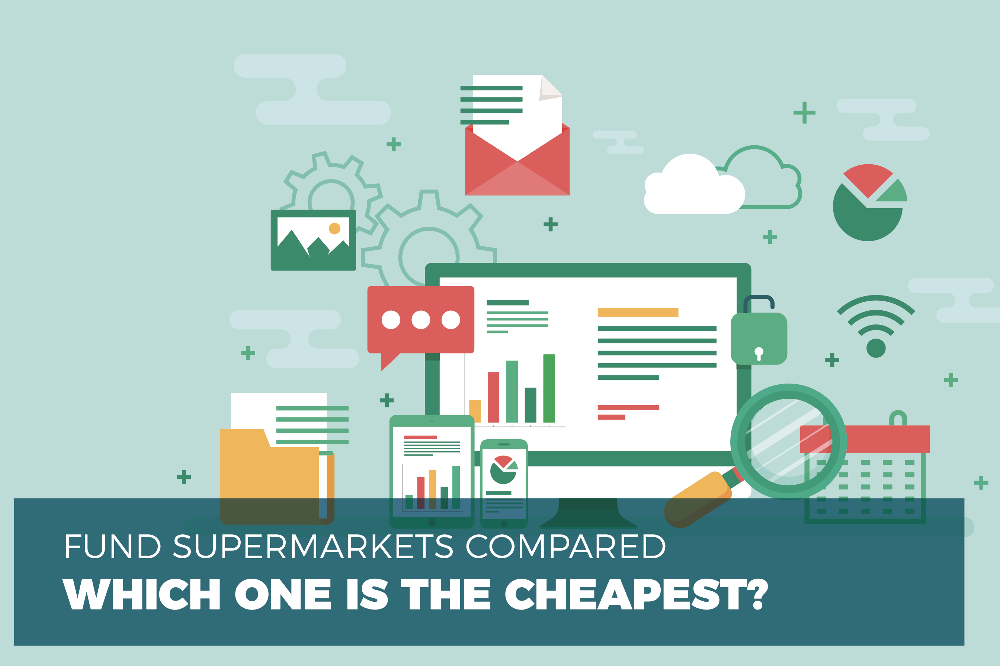

## Table of Contents

## What is a fund supermarket?

A fund supermarket is a platform where you can buy and sell different types of investment funds from various companies all in one place. It's like a big store where you can choose from many different funds, just like you would pick items from different shelves in a supermarket. This makes it easier for you to manage your investments without having to deal with multiple companies directly.

These platforms are often provided by banks or financial service companies. They offer a wide range of funds, including mutual funds, exchange-traded funds (ETFs), and more. By using a fund supermarket, you can compare different funds, see their performance, and decide which ones to invest in, all from one convenient location. This can save you time and help you make better investment choices.

## How does a fund supermarket work?

A fund supermarket works by letting you buy and sell different investment funds from many companies all in one place. It's like a big store where you can pick from lots of different funds. You can see all the funds available, compare them, and choose which ones you want to invest in. The platform shows you important information like how the funds have performed in the past, what they invest in, and any fees you might have to pay.

Once you decide on a fund, you can buy it through the platform. You'll need to have money in your account to make the purchase. After you buy a fund, you can keep track of how it's doing and decide if you want to buy more, sell some, or switch to a different fund. The fund supermarket handles all the transactions for you, making it easy to manage your investments without having to deal with each fund company separately.

## What are the benefits of using a fund supermarket?

Using a fund supermarket makes it easy for you to manage your investments. You can see many different funds from lots of companies all in one place. This means you don't have to go to different websites or deal with different companies to buy and sell funds. It saves you time and makes it simpler to keep track of your money.

Another benefit is that you can compare different funds easily. The platform shows you how each fund has done in the past, what they invest in, and how much they cost. This helps you make better choices about where to put your money. Plus, you can switch between funds without having to move your money around a lot, which can save you money on fees.

## What types of funds can be found in a fund supermarket?

A fund supermarket offers a variety of funds that you can invest in. You can find mutual funds, which are popular because they let you invest in a mix of stocks, bonds, or other assets. Exchange-traded funds (ETFs) are also common; these funds track an index, like the S&P 500, and you can buy and sell them throughout the day just like stocks.

In addition to mutual funds and ETFs, you might also see index funds, which are a type of mutual fund that tracks a specific market index. Some fund supermarkets also offer actively managed funds, where a professional manager picks the investments to try to beat the market. There are also sector funds, which focus on specific industries like technology or healthcare, and bond funds, which invest in different types of bonds.

Overall, a fund supermarket gives you lots of choices so you can find the right funds for your investment goals. Whether you're looking for something safe and steady or something that might grow faster but is riskier, you can usually find it all in one place.

## How do fees and charges work in a fund supermarket?

Fees and charges in a fund supermarket can be a bit tricky, but they're important to understand. When you buy and sell funds, you might have to pay a fee to the fund supermarket for using their platform. This is called a platform fee or service fee. It's usually a small percentage of the money you invest or a flat fee each year. Some fund supermarkets might also charge you for buying or selling funds, which is called a transaction fee.

On top of the fees from the fund supermarket, the funds themselves also have their own fees. These are called expense ratios, and they cover the costs of managing the fund. The expense ratio is a percentage of your investment that you pay each year. Some funds might also have sales charges, known as loads, which you pay when you buy or sell the fund. It's important to look at all these fees because they can add up and affect how much money you make from your investments.

## What are the differences between a fund supermarket and a traditional investment platform?

A fund supermarket and a traditional investment platform are both places where you can buy and sell investments, but they work a bit differently. A fund supermarket is like a big store where you can choose from lots of different funds all in one place. These funds come from many different companies, and you can see all the options, compare them, and make your choices easily. A traditional investment platform might offer fewer choices and focus more on specific types of investments, like stocks or bonds. It might not have as many funds from different companies, and you might need to go to different places to find what you want.

The other big difference is how they handle fees and services. Fund supermarkets usually charge a platform fee for using their service, which can be a small percentage of your investment or a flat fee each year. They might also have transaction fees when you buy or sell funds. Traditional investment platforms can have different fee structures, sometimes charging more for certain types of investments or offering different levels of service. With a fund supermarket, you get the convenience of managing everything in one place, which can save you time and help you keep track of your investments more easily.

## How can one start investing through a fund supermarket?

To start investing through a fund supermarket, you first need to choose a fund supermarket that suits your needs. You can do this by looking at different platforms online and comparing them. Once you've picked one, you'll need to sign up for an account. This usually involves filling out some personal information and maybe answering a few questions about your investment goals and how much risk you're willing to take. After your account is set up, you'll need to add money to it. You can do this by transferring money from your bank account to your fund supermarket account.

Once you have money in your account, you can start looking at the different funds available on the platform. Take your time to read about the funds, how they've performed in the past, and what they invest in. You can also see the fees for each fund. When you find a fund you like, you can buy it through the platform. Just enter how much money you want to invest, and the platform will handle the rest. After you've made your investment, you can keep an eye on how it's doing and decide if you want to buy more, sell some, or switch to a different fund.

## What should beginners consider when choosing a fund supermarket?

When choosing a fund supermarket, beginners should first think about the variety of funds available. A good fund supermarket will offer a wide range of options, including mutual funds, ETFs, and more. This variety helps you find funds that match your investment goals and how much risk you're willing to take. It's also important to look at the fees. Fund supermarkets charge different fees for using their platform and for buying or selling funds. Make sure you understand these fees because they can affect how much money you make from your investments.

Another thing to consider is how easy the platform is to use. A user-friendly platform can make it simpler for you to manage your investments, especially if you're new to investing. Look for a platform that has clear information about the funds and tools to help you make good choices. Customer support is also important. If you have questions or need help, it's good to know that you can reach someone who can assist you. By thinking about these things, you can choose a fund supermarket that will help you start investing with confidence.

## How do fund supermarkets handle tax implications for investors?

Fund supermarkets help investors understand the tax implications of their investments by providing information about the tax status of the funds they offer. When you buy and sell funds, you might have to pay taxes on any money you make. The fund supermarket will usually show you if a fund is tax-efficient, which means it's designed to help you pay less in taxes. They might also give you reports or statements that show how much money you've made and what taxes you might owe.

It's important to know that the tax rules can be different depending on where you live and the type of funds you invest in. Some funds might give you dividends or interest, which can be taxed differently than if you sell a fund and make a profit. The fund supermarket can't give you personal tax advice, but they can point you to resources or suggest you talk to a tax professional. This way, you can make sure you're following the tax laws and not paying more than you need to.

## What advanced features do fund supermarkets offer to experienced investors?

Fund supermarkets offer advanced features that can help experienced investors manage their portfolios more effectively. One key feature is the ability to set up automatic rebalancing, which means the platform can automatically adjust your investments to keep them in line with your chosen asset allocation. This can save time and help maintain your investment strategy without constant manual adjustments. Another useful tool is the access to detailed analytics and performance metrics, allowing investors to dive deep into how their funds are doing compared to benchmarks and other funds. This can help in making more informed decisions about buying, selling, or switching funds.

Additionally, fund supermarkets often provide advanced trading options, such as limit orders and stop-loss orders, which give experienced investors more control over when and how they buy and sell funds. These features can help manage risk and potentially improve returns. Some platforms also offer tax optimization tools, which can suggest ways to minimize tax liabilities by strategically selling or holding funds. By using these advanced features, experienced investors can tailor their investment strategies to better meet their financial goals and adapt to changing market conditions.

## How do fund supermarkets ensure the security of investments?

Fund supermarkets take several steps to make sure your investments are safe. They use strong security measures like encryption to protect your personal information and your money. This means your data is turned into a secret code that only the fund supermarket can read. They also have systems in place to watch for anything suspicious, like someone trying to log into your account without permission. If they see something strange, they can stop it before it causes any harm.

Another way fund supermarkets keep your investments secure is by following strict rules and regulations. They are watched by government agencies that make sure they are doing everything right. These agencies check that the fund supermarket is keeping your money safe and not taking any unnecessary risks with it. By following these rules, fund supermarkets help make sure your investments are protected and that you can trust them with your money.

## What trends are shaping the future of fund supermarkets?

One big trend shaping the future of fund supermarkets is the use of technology. More and more, fund supermarkets are using fancy computer programs and [artificial intelligence](/wiki/ai-artificial-intelligence) to help people make better investment choices. These tools can look at a lot of information quickly and suggest which funds might be good to buy or sell. They can also make it easier for people to manage their investments on their phones or computers, no matter where they are. This means that even if you're new to investing, you can still use these tools to help you make smart decisions.

Another trend is that fund supermarkets are starting to offer more types of investments. Besides the usual funds like mutual funds and ETFs, they are adding things like cryptocurrencies and sustainable investments that focus on helping the environment. This gives people more choices and lets them invest in things they care about. As more people want to invest in different ways, fund supermarkets are trying to keep up by offering a wider range of options. This can make investing more interesting and help people reach their financial goals in new ways.

## References & Further Reading

[1]: Bergstra, J., Bardenet, R., Bengio, Y., & Kégl, B. (2011). ["Algorithms for Hyper-Parameter Optimization."](https://dl.acm.org/doi/10.5555/2986459.2986743) Advances in Neural Information Processing Systems 24.

[2]: ["Advances in Financial Machine Learning"](https://www.amazon.com/Advances-Financial-Machine-Learning-Marcos/dp/1119482089) by Marcos Lopez de Prado

[3]: ["Evidence-Based Technical Analysis: Applying the Scientific Method and Statistical Inference to Trading Signals"](https://www.amazon.com/Evidence-Based-Technical-Analysis-Scientific-Statistical/dp/0470008741) by David Aronson

[4]: ["Machine Learning for Algorithmic Trading"](https://github.com/stefan-jansen/machine-learning-for-trading) by Stefan Jansen

[5]: ["Quantitative Trading: How to Build Your Own Algorithmic Trading Business"](https://github.com/LucindaYa/quant-resources/blob/master/Quantitative%20Trading%20How%20to%20Build%20Your%20Own%20Algorithmic%20Trading%20Business.pdf) by Ernest P. Chan

[6]: French, K. R. (2008). ["The Cost of Active Investing."](https://papers.ssrn.com/sol3/papers.cfm?abstract_id=1105775) The Journal of Finance, 63(4), 1537-1573.

[7]: Sharpe, W. F. (1991). ["The Arithmetic of Active Management."](https://web.stanford.edu/~wfsharpe/art/active/active.htm) Financial Analysts Journal, 47(1), 7-9.

[8]: Bogle, J. C. (2017). ["The Little Book of Common Sense Investing: The Only Way to Guarantee Your Fair Share of Stock Market Returns."](https://www.amazon.com/Little-Book-Common-Sense-Investing/dp/1119404509) 

[9]: Aldridge, I. (2013). ["High-Frequency Trading: A Practical Guide to Algorithmic Strategies and Trading Systems."](https://www.amazon.com/High-Frequency-Trading-Practical-Algorithmic-Strategies/dp/1118343506) 

[10]: Lhabitant, F. S. (2004). ["Hedge Funds: Quantitative Insights."](https://www.wiley.com/en-us/Hedge+Funds%3A+Quantitative+Insights-p-9780470687772)