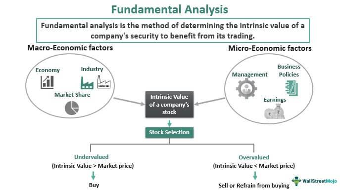

Fundamental analysis, trading strategies, and algorithmic trading form the backbone of financial market operations. These components are pivotal in guiding traders and investors towards making informed decisions. Fundamental analysis involves evaluating a company's financial health, which provides an understanding of its intrinsic value. This process aids investors in identifying undervalued stocks, allowing for more strategic asset allocation. Key indicators within fundamental analysis, such as earnings reports, cash flow statements, and industry trends, offer critical insights into a company’s future performance.

Algorithmic trading, on the other hand, represents a technological advancement in the financial markets. It allows for trades to be executed at speeds and frequencies impossible for human traders, thus leveraging market inefficiencies. This method of trading helps eliminate emotional biases, leading to more objective decision-making. Algorithmic trading strategies, like momentum trading and statistical arbitrage, capitalize on short-term market movements and spread trades.



A comprehensive overview of trading strategies is essential to understanding the varied approaches used by successful traders. Strategies such as trend following, mean reversion, and arbitrage consist of different risk-reward profiles, allowing traders to select strategies that align with their market outlook and risk tolerance. Each of these strategies has its own set of rules and methodology that guides when to enter and exit trades.

This article provides insights into how these components intersect and contribute to trading efficiency and decision-making in financial markets. By exploring the advantages and challenges associated with fundamental analysis, the transformative impact of algorithmic trading, and the variety of trading strategies, traders can better navigate the complexities of global markets.

## Table of Contents

## Understanding Financial Markets

Financial markets serve as platforms for the exchange of financial securities and commodities. These markets can be broadly classified into several types, including stocks, bonds, commodities, and derivatives. Each market plays a distinct role in the financial ecosystem and offers unique opportunities and challenges to traders and investors.

Stock markets are perhaps the most well-known, involving the buying and selling of shares in publicly traded companies. This market allows companies to raise capital by issuing shares to the public while giving investors a chance to own a portion of these companies. Stock prices are influenced by various factors, including company performance, economic indicators, and market sentiment, which can create opportunities for trading strategies such as value investing and momentum trading.

Bond markets involve the trade of debt securities issued by corporations, governments, or other entities. Bonds are essentially loans made by investors to the issuer in exchange for periodic interest payments and the return of the bond's face value upon maturity. The bond market is sensitive to interest rates and credit risk, with changes in these factors affecting bond prices and yields. Consequently, traders need a deep understanding of macroeconomic indicators and fiscal policies to navigate this market effectively.

Commodity markets deal with the trading of raw materials such as oil, gold, and agricultural products. These markets are heavily influenced by supply and demand dynamics, geopolitical events, and natural phenomena. Traders in commodity markets often use strategies like hedging and speculation to manage risk and profit from price fluctuations.

The derivatives market consists of financial instruments whose value is derived from an underlying asset, such as stocks, bonds, or commodities. This market includes options and futures contracts, allowing traders to hedge risk or speculate on the future price movements of the underlying assets. The complexity and inherent leverage in derivatives trading require sophisticated strategies and robust risk management techniques.

Understanding the dynamics of these markets is crucial for developing effective trading strategies. Market dynamics refer to the factors that influence price movements, including supply and demand, investor sentiment, and macroeconomic indicators. Market participants, such as institutional investors, hedge funds, and retail traders, often employ technical analysis to identify patterns and trends that can inform trading decisions. This involves analyzing historical price data and using statistical tools to predict future price movements.

Financial literacy and staying informed about market trends are vital components of successful trading. Traders should continuously educate themselves on the fundamentals of economics, financial instruments, and market mechanisms. Keeping abreast of news and developments in global economies, industries, and specific companies enables traders to make informed decisions and adapt to changing market conditions. Additionally, leveraging technology and data analytics can provide significant advantages in identifying opportunities and mitigating risks in the dynamic environment of financial markets.

## Fundamental Analysis in Trading

Fundamental analysis is a critical approach used by traders and investors to assess the intrinsic value of an asset, particularly stocks, by examining various economic, financial, and qualitative factors. This analysis is predicated on the notion that markets may misprice a security in the short term but that the "correct" price will be revealed over the long term. It is instrumental in identifying investments that are undervalued or overvalued by the market.

The mechanics of fundamental trading involve evaluating a company's overall financial health. This includes a thorough assessment of financial statements, industry conditions, management quality, and other factors that could affect the firm's performance. A key tool used in [fundamental analysis](/wiki/fundamental-analysis) is the evaluation of a company's financial statements—namely, the balance sheet, income statement, and cash flow statement. These documents provide vital insights into a company's revenue, expenses, profits, and financial position.

Key indicators used in fundamental analysis include earnings, cash flow, and industry trends. Earnings are perhaps the most critical indicator, as they are a primary driver of stock prices. Analysts often use metrics such as the Price-to-Earnings (P/E) ratio to determine how a stock’s price compares with its earnings. Cash flow, particularly free cash flow, is another crucial indicator as it provides insight into a company's ability to generate cash after capital expenditures, indicating financial health and potential for growth or dividends. Understanding industry trends is also essential, as it helps place a company’s performance in context within its sector and the broader economic environment.

For instance, fundamental analysis might reveal that a company's earnings are increasing steadily, suggesting potential for future growth. If industry trends indicate that demand for the company’s products is likely to rise, and the firm’s financial statements show a strong balance sheet and healthy cash flow, an investment decision might be made favorably towards the company. Conversely, if a company scores poorly on these metrics, an investor might decide to sell or avoid purchasing its stock.

Integrating these indicators, traders can make informed decisions about buying, holding, or selling stocks. While fundamental analysis primarily informs long-term investment strategies, it can also be pivotal in maximizing short-term opportunities, giving traders a comprehensive view of a company's true worth and its potential to generate returns compared to its current market price.

## Trading Strategies

Trading strategies play a crucial role in financial markets by providing structured approaches for investors and traders to capitalize on market movements. Three widely recognized trading strategies are [trend following](/wiki/trend-following), mean reversion, and [arbitrage](/wiki/arbitrage). Each of these strategies carries distinct advantages and inherent risks, and their suitability depends on market conditions and an individual's risk tolerance.

**Trend Following**

Trend following is a strategy based on the idea that prices tend to move in persistent directions or 'trends' for certain periods. Traders using this strategy aim to capture gains by aligning their trades with established market trends, whether upward or downward. For this approach, technical analysis tools like moving averages, trendlines, or the Relative Strength Index (RSI) are commonly used to identify trends.

*Advantages*: 
- Potential for large profits if a strong trend is identified and followed.
- Simplicity, as the strategy is straightforward to implement with technical indicators.

*Risks*: 
- Vulnerable to sudden trend reversals or 'whipsaws' that can result in losses.
- Requires disciplined adherence to trend signals, which can be psychologically challenging.

```python
# Example: Simple Moving Average Crossover in Python for Trend Following

import pandas as pd

def moving_average(df, n):
    MA = pd.Series(df['Close'].rolling(n, min_periods=n).mean(), name=f'SMA_{n}')
    df = df.join(MA)
    return df

# Assuming 'data' is a DataFrame with datetime index and a 'Close' column
data = moving_average(data, 50)
data = moving_average(data, 200)

# Entry point: When short-term average crosses above the long-term average
data['Signal'] = 0
data.loc[data['SMA_50'] > data['SMA_200'], 'Signal'] = 1
```

**Mean Reversion**

Mean reversion is predicated on the belief that prices and returns eventually revert to their historical mean or average level. This strategy looks for overbought or oversold conditions, assuming that prices will retrace back to their historical average. Traders typically use indicators like Bollinger Bands or the RSI to identify these extremes.

*Advantages*: 
- Consistent with the statistical phenomenon of regression to the mean.
- Potentially profitable in range-bound or stable markets.

*Risks*:
- Might incur significant losses if a strong trend emerges against the trader's position.
- Reliant on market conditions that may change unpredictably.

**Arbitrage**

Arbitrage exploits price inefficiencies or discrepancies across different markets or instruments. By simultaneously buying and selling an asset in different markets, traders can lock in risk-free profits. This strategy is common in [forex](/wiki/forex-system), stock, and [cryptocurrency](/wiki/cryptocurrency) markets.

*Advantages*:
- Generally considered low risk since it seeks profit from pricing discrepancies.
- Potential for profit in both rising and falling markets.

*Risks*:
- Requires lightning-fast execution and advanced technology to be effective.
- Profits are often minimal, necessitating large capital or leverage to be meaningful.

**Choosing the Right Trading Strategy**

Deciding which strategy to employ depends on current market conditions, such as [volatility](/wiki/volatility-trading-strategies) and [liquidity](/wiki/liquidity-risk-premium), as well as individual factors like risk tolerance and capital availability. For example, trend following might be more suitable in trending markets, while mean reversion could thrive in sideways markets.

**Role of Diversification**

Diversification is a key aspect of successful trading strategies. By spreading investments across various assets or strategies, traders can mitigate risks tied to individual market movements. A well-diversified portfolio enhances risk-adjusted returns by lowering exposure to any single investment’s adverse performance. Integrating multiple strategies can cater to varying market conditions and provide more stable results over time.

In sum, understanding and effectively implementing trading strategies, while considering associated risks and personal investment profiles, is vital for trading success in financial markets.

## Algorithmic Trading: The Future of Trading

Algorithmic trading, also referred to as "algo trading", has become a cornerstone of modern financial markets. It involves the use of computer algorithms to execute trades at speeds and efficiencies that are far beyond the capabilities of human traders. These algorithms can analyze vast datasets and execute orders in a matter of milliseconds, which can lead to significant advantages in highly competitive trading environments.

One of the main benefits of [algorithmic trading](/wiki/algorithmic-trading) is its speed. The ability to execute trades in milliseconds allows traders to exploit short-lived market inefficiencies and capitalize on price discrepancies. Efficiency is another key advantage; algorithms can process large volumes of data with speed and precision, reducing the likelihood of errors that are common in manual trading processes. Furthermore, algorithmic trading eliminates emotional bias, a common pitfall in decision-making processes, by adhering strictly to predefined rules and conditions.

Among the various strategies employed in algorithmic trading, [momentum](/wiki/momentum) trading and [statistical arbitrage](/wiki/statistical-arbitrage) are two popular approaches. Momentum trading involves algorithms that detect and trade on stocks showing a strong trend. The underlying hypothesis is that securities which have performed well in the past will continue to do so in the short term. Statistical arbitrage, on the other hand, uses statistical methods and mathematical models to identify price inefficiencies between related financial instruments, aiming to profit from such discrepancies.

Designing an effective algorithmic trading system presents several challenges. Firstly, there is the need for robust data management systems to process and analyze market data in real-time. This requires substantial computational resources and sophisticated data handling techniques. The quality of data is crucial, as any inaccuracies can lead to flawed trading decisions. Moreover, developing a reliable [backtesting](/wiki/backtesting) framework is essential to evaluate the performance of trading algorithms using historical data. However, caution must be exercised to avoid overfitting, where algorithms may perform well on historical data but fail in live markets.

Additionally, regulatory considerations cannot be overlooked. The use of algorithmic trading raises concerns regarding market stability and fairness. Regulators around the world have instituted guidelines to ensure that these algorithms do not destabilize markets or give rise to unfair advantages.

In conclusion, while algorithmic trading offers numerous benefits, including speed, efficiency, and the removal of emotional biases, it also requires careful design and execution. By leveraging strategies like momentum trading and statistical arbitrage, traders can potentially enhance their returns. Nonetheless, challenges such as data management, regulatory compliance, and system reliability must be thoroughly addressed to ensure the long-term success of algorithmic trading systems.

## Integrating Fundamental and Technical Analysis

Integrating both fundamental and technical analysis can enhance trading decisions by providing a comprehensive view of the market and individual securities. Fundamental analysis focuses on understanding a company's financial health through factors such as earnings, revenue, and industry trends, whereas technical analysis uses historical price data and [volume](/wiki/volume-trading-strategy) to predict future movements. By combining these approaches, traders can gather insights that may not be apparent when using just one method.

To illustrate, consider a scenario where a company's stock is fundamentally strong, with rising earnings and favorable industry prospects, but technical analysis indicates a recent price dip, possibly due to short-term market reactions. This situation might present a buying opportunity, as the technical dip does not reflect the company's underlying value, possibly allowing traders to time their entry more effectively.

Further, real-time data analysis plays a crucial role in merging fundamental and technical insights. Modern trading platforms provide access to live financial data and trends, enabling traders to respond swiftly to new information. For example, real-time financial news may reveal a regulatory change affecting a specific sector. A trader might use technical charts to pinpoint optimal trading points just as the fundamental impact becomes known, allowing them to exploit short-term price inefficiencies.

Incorporating both kinds of analysis requires an understanding of how each contributes to a holistic view. Fundamental analysis provides a long-term perspective by assessing intrinsic value, while technical analysis aids in identifying patterns and market sentiment. By using both, traders can make more informed decisions, aligning their strategic objectives with current market conditions.

## Risk Management in Trading

Risk management is crucial in trading for preserving capital and ensuring long-term success. By employing effective risk management techniques, traders can protect their investments from adverse market movements and enhance their overall performance.

One fundamental aspect of risk management is the use of stop-loss orders. These orders allow traders to set a predetermined price at which their position will be automatically closed, limiting potential losses. For instance, if a trader buys a stock at $100 and sets a stop-loss at $90, their maximum loss will be contained to $10 per share, assuming no slippage in volatile markets.

Position sizing is another key technique. It involves determining the appropriate amount of capital to allocate to a particular trade based on the trader’s risk tolerance. A commonly used method is the percentage risk model, where a trader might decide to risk 1-2% of their total capital on a single trade. This way, even a string of losses won't significantly deplete the trader’s account balance.

Diversification is also critical in managing risk. By spreading investments across various asset classes, industries, or geographical regions, traders can reduce the impact of a poor performance in any single investment. This technique lowers the overall risk profile of the trading portfolio.

Statistical tools play an essential role in risk assessment and management. Tools such as Value-at-Risk (VaR) help estimate the potential loss in a portfolio over a given time frame, under normal market conditions. For example, if a portfolio has a daily VaR of $5,000 at a 95% confidence level, it means that there is a 5% chance that losses will exceed $5,000 in a day.

Implementing risk metrics like the Sharpe Ratio can aid in evaluating the risk-adjusted return of a portfolio. The Sharpe Ratio is calculated as:

$$
\text{Sharpe Ratio} = \frac{E[R] - R_f}{\sigma}
$$

where $E[R]$ is the expected return of the portfolio, $R_f$ is the risk-free rate, and $\sigma$ is the standard deviation of the portfolio's excess return.

Python can be used to automate and calculate these [statistics](/wiki/bayesian-statistics). For instance, calculating the Sharpe Ratio can be implemented as follows:

```python
import numpy as np

def calculate_sharpe_ratio(returns, risk_free_rate):
    excess_returns = returns - risk_free_rate
    return np.mean(excess_returns) / np.std(excess_returns)

# Example usage
returns = np.array([0.05, 0.02, 0.04, -0.01, 0.03])  # Example portfolio returns
risk_free_rate = 0.01  # Example risk-free rate (1%)
sharpe_ratio = calculate_sharpe_ratio(returns, risk_free_rate)
print("Sharpe Ratio:", sharpe_ratio)
```

In sum, effective risk management practices, including stop-loss orders, responsible position sizing, diversification, and the application of statistical tools, are indispensable for a successful trading strategy. These elements work together to mitigate potential losses and secure long-term profitability in volatile financial markets.

## The Psychological Aspect of Trading

The psychological aspect of trading plays a crucial role in a trader’s success, with emotions such as fear and overconfidence posing significant challenges. Fear can lead traders to make premature decisions, potentially missing out on profitable opportunities, while overconfidence can result in excessive risk-taking and insufficient due diligence. 

To address these cognitive biases, traders can adopt various strategies to enhance their discipline. One effective approach is developing a robust trading plan and consistently adhering to it. This can help mitigate impulsive decisions driven by emotions. Additionally, employing a systematic approach, such as algorithmic trading, can aid in reducing emotional biases. By leveraging technology to execute trades, algorithmic systems can enforce discipline by following predetermined rules without emotional interference.

Mindfulness and self-awareness practices can also help traders recognize and manage their emotions. Regularly reviewing trading performance and maintaining a trading journal can provide insights into emotional triggers and patterns, allowing traders to adjust their strategies accordingly. Stress management techniques, such as exercise and meditation, can further improve emotional regulation, enhancing decision-making capabilities.

Another critical aspect is maintaining a long-term perspective. Short-term market fluctuations can often lead to emotional reactions, prompting impulsive trading decisions. By focusing on long-term goals and strategies, traders can better withstand market volatility and avoid making hasty choices driven by short-term market movements. 

Patience and resilience are vital attributes for traders aiming to overcome psychological challenges. By focusing on continuous learning and adapting to changing market conditions, traders can build the mental fortitude necessary for sustained success in the financial markets.

## Conclusion

In examining the amalgamation of fundamental analysis, trading strategies, and algorithmic trading, we observed several crucial insights. Fundamental analysis remains a cornerstone of informed trading decisions. By evaluating the economic and financial factors affecting an asset, traders can discern its intrinsic value and make more educated decisions. Key indicators, such as earnings reports, industry trends, and macroeconomic data, provide a basis for assessing future price movements. These form the backbone of many traditional trading strategies, offering a solid foundation for understanding market behavior.

Trading strategies themselves are diverse, ranging from trend following and mean reversion to arbitrage. Each strategy offers its own unique set of benefits and risks. Trend following capitalizes on sustained market momentum, whereas mean reversion bets on retraction to the mean. Arbitrage exploits the price inefficiencies across different markets. Choosing the right strategy hinges on the trader’s risk tolerance, market conditions, and personal preferences. Diversification across strategies can mitigate risks and enhance returns.

Algorithmic trading is a pivotal element of contemporary financial markets. Its primary advantage lies in the ability to execute trades with unparalleled speed and precision, thereby eliminating emotional bias—a frequent hindrance in manual trading. Algorithmic strategies like momentum trading and statistical arbitrage leverage computational power to analyze and act on large sets of data in real-time. However, crafting a robust algorithmic trading system requires careful consideration of market dynamics and the risk of systemic failures.

In conclusion, successful trading in financial markets benefits significantly from a balanced approach that integrates fundamental and technical analysis with algorithmic tools. This balanced methodology enhances decision-making and adapts to the ever-evolving market landscape. Traders are encouraged to continuously expand their knowledge base and remain agile in adapting to new market paradigms. Embracing this holistic approach not only aids in navigating the complexities of modern trading but also increases potential for long-term success.

## References & Further Reading

[1]: Bergstra, J., Bardenet, R., Bengio, Y., & Kégl, B. (2011). ["Algorithms for Hyper-Parameter Optimization."](https://dl.acm.org/doi/10.5555/2986459.2986743) Advances in Neural Information Processing Systems 24.

[2]: ["Advances in Financial Machine Learning"](https://www.amazon.com/Advances-Financial-Machine-Learning-Marcos/dp/1119482089) by Marcos Lopez de Prado

[3]: ["Evidence-Based Technical Analysis: Applying the Scientific Method and Statistical Inference to Trading Signals"](https://www.amazon.com/Evidence-Based-Technical-Analysis-Scientific-Statistical/dp/0470008741) by David Aronson

[4]: ["Machine Learning for Algorithmic Trading"](https://github.com/stefan-jansen/machine-learning-for-trading) by Stefan Jansen

[5]: ["Quantitative Trading: How to Build Your Own Algorithmic Trading Business"](https://github.com/LucindaYa/quant-resources/blob/master/Quantitative%20Trading%20How%20to%20Build%20Your%20Own%20Algorithmic%20Trading%20Business.pdf) by Ernest P. Chan