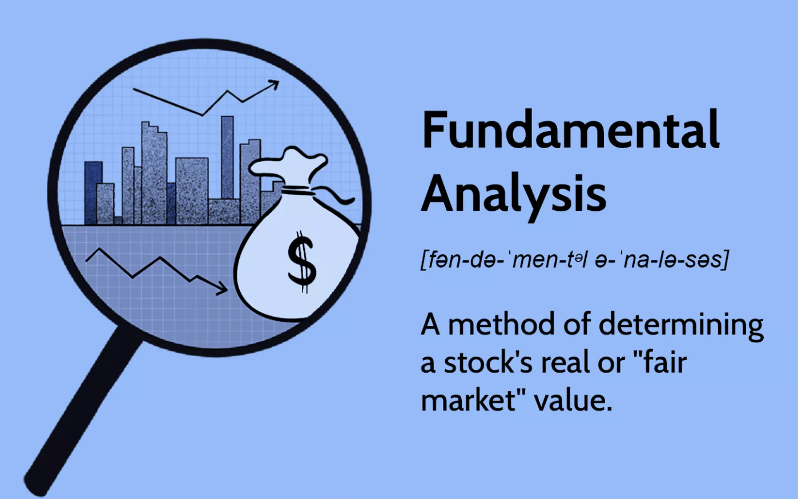

Fundamental analysis is a crucial method in trading that involves assessing a company's intrinsic value by examining related economic, financial, and other qualitative and quantitative factors. This type of analysis is pivotal for investors looking to understand a company's actual worth through factors like financial statements, earnings reports, and market conditions, ultimately aiding in making informed investment decisions. By focusing on the underlying factors that influence an asset’s price, fundamental analysis aims to identify securities currently undervalued or overvalued. Unlike short-term-focused trading techniques, such as technical analysis, fundamental analysis tends to offer insights into the long-term viability and growth prospects of a company.

Traditional fundamental trading, as historically practiced, entailed a manual review of financial data and economic indicators to make investment decisions. Traders and analysts spent considerable time analyzing earnings reports, balance sheets, and broader economic trends to forecast future market conditions. This approach, while comprehensive, often lacked speed and efficiency due to the sheer volume of available data and the time required for thorough analysis.



With the rise of algorithmic trading, integrating fundamental analysis into algo trading has become increasingly feasible and advantageous. Algorithmic trading uses computational algorithms to execute trades at speeds and frequencies that are imperceptible to human traders. By embedding fundamental analysis into these algorithms, traders can automate the process of analyzing key financial metrics and macroeconomic indicators, thereby bridging the gap between comprehensive data analysis and high-frequency trading. This integration allows traders to capitalize on both the depth of fundamental data and the efficiency of automated trading systems.

Incorporating fundamental analysis into algo trading involves transforming qualitative data into machine-readable formats, allowing algorithms to process vast datasets swiftly and recognize trading opportunities that align with fundamental criteria. This fusion of traditional valuation methods with advanced trading technology has the potential to enhance decision-making accuracy while mitigating human biases and error, positioning traders to better navigate complex financial markets.


## Table of Contents


## Understanding Fundamental Analysis

Fundamental analysis is an essential approach in evaluating an asset's intrinsic value by examining related economic, financial, and other qualitative and quantitative [factor](/wiki/factor-investing)s. Unlike technical analysis, which focuses on price movement and patterns often used for short-term trading decisions, [fundamental analysis](/wiki/fundamental-analysis) provides insights into the underlying health and long-term potential of a company or asset. This method involves assessing components like financial statements, [earning](/wiki/earning-announcement)s reports, and economic indicators, which collectively offer a comprehensive picture of an entity's performance and market value.

**Components of Fundamental Analysis**

1. **Financial Statements**: These are the backbone of fundamental analysis, providing vital data about a company's financial health. Key financial statements include the balance sheet, income statement, and cash flow statement. The balance sheet reveals a company's assets, liabilities, and shareholders' equity, offering insights into the company’s financial structure. The income statement shows the company’s profitability over a specific period, detailing revenues and expenses. Cash flow statements focus on liquidity, showing how cash moves in and out of the business, which is critical for assessing solvency.

2. **Earnings Reports**: These periodic financial documents disclose a company's profitability and enable investors to evaluate past performance while estimating future profitability. Key metrics include earnings per share (EPS), which is calculated as:

$$
\text{EPS} = \frac{\text{Net Income} - \text{Dividends on Preferred Stock}}{\text{Average Outstanding Shares}}
$$

EPS is a fundamental indicator of profitability, signaling how well the company utilizes its resources for shareholder benefit.

3. **Economic Indicators**: Macroeconomic factors such as inflation rates, employment statistics, interest rates, and GDP growth can significantly impact a company's performance and are thus integral to fundamental analysis. These indicators help predict economic conditions that could affect a company’s prospects and market demand for its products or services.

**Contrast with Technical Analysis**

While technical analysis relies on chart patterns and statistical figures from past market activity to predict future price movements, fundamental analysis offers a wider perspective by focusing on factors that influence a company's value over a longer horizon. Technical analysis might be more suited for traders looking for quick gains based on market trends, whereas fundamental analysis appeals to those interested in investment based on intrinsic value and the company's potential growth trajectory.

**Broader Perspective on Company Health**

Fundamental analysis is indispensable for investors looking to make informed decisions by thoroughly understanding a company’s capacity for growth and profitability. It goes beyond surface-level metrics, delving into managerial effectiveness, competitive advantages, market conditions, and operational efficiency, providing investors with a comprehensive overview of the company’s potential for sustainable success. By emphasizing these elements, fundamental analysis becomes critical for assessing a company's long-term health and future prospects, making it a powerful tool for value investors.

In summary, fundamental analysis is essential for developing insights into a company's value and market position. By incorporating detailed financial data, earnings projections, and economic trends, it allows investors to forecast potential performance, ensuring informed decision-making and strategic investment planning.


## The Role of Fundamental Analysis in Algo Trading

The transformation of fundamental analysis into machine-readable formats has become increasingly vital in [algorithmic trading](/wiki/algorithmic-trading), where speed and accuracy are paramount. Fundamental analysis traditionally involves evaluating a company's financial health, market position, and economic environment, but converting this qualitative data into quantitative formats allows algorithms to incorporate it seamlessly into trading strategies.

One significant component of this transition is the use of earnings reports, which provide key metrics such as earnings per share (EPS), revenue growth, and net income. Algorithmic systems can now parse these reports automatically upon release, extracting figures and comparing them against historical data to predict market reactions. For instance, if an algorithm detects an EPS higher than expected, it might trigger buy orders anticipating a positive market response.

Economic indicators, such as GDP growth rates and unemployment figures, also play a critical role. Algorithmic systems ingest these data points, often using APIs provided by statistical agencies, to assess broader economic trends. For example, a sudden spike in unemployment might lead algorithms to anticipate market downturns, adjusting trading positions accordingly.

News sentiment analysis is another pivotal aspect where natural language processing (NLP) techniques are applied to interpret the tone of news articles, social media, and analyst reports. This involves parsing sentences and identifying whether they convey positive, negative, or neutral sentiment towards specific stocks or the market in general. By quantifying sentiment, algorithms can execute trades based on anticipated market sentiment shifts. For instance, consistently negative news sentiment towards a company might prompt a sell strategy.

Comparing fundamental-driven algo strategies with their technical-driven counterparts reveals key differences. Fundamental strategies rely on the qualitative aspects of a company's performance, as well as broader economic conditions, to determine value and potential growth. In contrast, technical strategies focus on price movements, patterns, and statistical indicators like moving averages. While technical analysis might look at a stock's [momentum](/wiki/momentum) to predict short-term price changes, fundamental analysis considers overall company value to inform longer-term positions.

Utilizing fundamental analysis within algo trading enables a more comprehensive understanding of market dynamics by incorporating a company's intrinsic value into trading decisions. This creates an opportunity to leverage both deep qualitative insights and quantitative precision, enhancing the strategic dimension of algorithmic trading.


## Data Sources for Fundamental Analysis

When embarking on fundamental analysis for algorithmic trading, having access to accurate and comprehensive data is crucial. Reliable sources ensure you base your trading decisions on factual and up-to-date information, which significantly impacts the performance and credibility of your algorithmic strategies. Here are some of the most reputable sources for fundamental data:

1. **Quandl**: As a favorite among algorithmic traders, Quandl offers a wide array of financial and economic datasets. It provides users with historical stock market data, corporate financials, and economic indicators, all in a machine-readable format. This platform is particularly favored for its API capabilities which facilitate seamless integration with trading algorithms.

2. **Bloomberg**: Bloomberg is a leading source known for its comprehensive financial information. Though costly, it offers extensive data covering everything from stock prices to economic indicators, news, and detailed company financials. Bloomberg Terminal users benefit from real-time data, ensuring their strategies are informed by the most current information available.

3. **SEC.gov**: The Securities and Exchange Commission (SEC) provides direct access to corporate filings in the United States through its EDGAR database. It includes annual reports (10-Ks), quarterly reports (10-Qs), earnings statements, and more. For traders focusing on U.S. stocks, SEC.gov is imperative for acquiring official and regulatory-compliant financial data.

### Importance of Data Accuracy and Robustness

Accuracy and robustness are the pillars of any successful algo trading strategy. Suppose your strategy relies on incorrect data, for example, misstated earnings or outdated economic forecasts. In that case, it can lead to false signals and poor trading decisions, ultimately affecting your portfolio's performance. Thus, ensuring data is as current and accurate as possible is non-negotiable in maintaining a competitive edge.

### Potential Pitfalls

Relying on fundamental data is not without its risks. One primary issue is data inaccuracies. These can arise from erroneous data entry, time lags in reporting, or misinterpretations of complex financial information. Furthermore, inconsistent reporting standards across different regions and companies can pose challenges in data uniformity which is crucial for cross-comparison and analytical consistency.

Another pitfall is the potential latency in the availability of fundamental data. Unlike technical indicators that update in real-time, fundamental data, such as quarterly earnings, is released at specific intervals. This non-continuous nature may hinder the timely execution of trading strategies, hence necessitating robust algorithms to manage the time gaps efficiently.

In summary, selecting reputable data sources and ensuring the integrity and timeliness of the data are foundational in integrating fundamental analysis within algorithmic trading systems. These factors are essential for making sound financial decisions and constructing algorithms that can withstand the dynamic nature of financial markets.


## Developing a Fundamental-Based Algo Trading Strategy

To develop a fundamental-based algorithmic trading strategy, it's essential to identify and utilize specific criteria that reflect the intrinsic value and financial health of a company. Common criteria include financial ratios such as the Price-to-Earnings (P/E) ratio, market capitalization, return on equity (ROE), and earnings per share (EPS). These metrics help in evaluating whether a company's stock is undervalued or overvalued based on its financial performance relative to its market price.

### Strategy Definition Using Selective Criteria

Begin by selecting key fundamental indicators that align with your trading objectives. For instance, a fundamental trader might prioritize companies with a low P/E ratio, suggesting undervaluation, coupled with high ROE, indicating efficient management. The criteria can form the basis of a screening process to filter stocks for potential investment. A sample Python snippet for selecting stocks based on P/E ratio and market capitalization could look like this:

```python
import pandas as pd

# Assuming 'data' is a DataFrame with stock information
# Filter based on P/E ratio and market capitalization
filtered_stocks = data[(data['P/E Ratio'] < 15) & (data['Market Cap'] > 1e9)]
```

### Incorporating Risk Management Parameters

Integrating risk management into your trading strategy is crucial to safeguard against potential losses. This can involve setting stop-loss orders, diversifying across different sectors, or limiting the maximum investment in a single stock. Additionally, employing position sizing strategies, such as the Kelly Criterion, can help optimize the allocation of capital to minimize risk.

### Case Study: Quantopian Strategy Using Morningstar Data

Quantopian, an algorithmic trading platform, once offered a strategy that utilized Morningstar data to inform investment decisions. This strategy employed quantitative filters and backtested them using past data to simulate performance. For example, using Morningstar's comprehensive financial datasets, a trader could develop a screening model that selects companies with consistently growing EPS and a low debt-to-equity ratio, providing a solid basis for long-term investment.

In essence, developing a fundamental-based algo trading strategy involves combining rigorous financial analysis with technology-driven tools to make informed investment decisions. It requires continual refinement and adaptation to incorporate new data sources and market conditions, maintaining a balance between risk management and achieving desirable returns.


## Risks and Challenges

When integrating fundamental analysis into algorithmic trading, traders face several potential risks, including reliance on incorrect data and unforeseen market events. Correct and timely data is critical in fundamental analysis. If the data fed into an algorithm is inaccurate, incomplete, or outdated due to errors from data providers or input mistakes, it can lead to suboptimal or incorrect trading decisions. Given the influential role of fundamental indicators, such as earnings reports or economic [statistics](/wiki/bayesian-statistics), inaccurate data can significantly impact a strategy's performance.

Market events that are unpredictable, like geopolitical tensions, natural disasters, or unexpected economic policy changes, also [carry](/wiki/carry-trading) risk. Although algorithms can be designed to respond to certain types of news, unforeseen events often don’t follow historical patterns, leading to potential losses.

Backtesting poses additional challenges, particularly for fundamental strategies. Unlike technical data, fundamental data does not update as frequently, leading to potential gaps where the strategy's effectiveness cannot be tested accurately. This infrequent updating can skew results and present a misleading picture of a strategy's prospective performance. 

To mitigate these risks and improve strategy robustness, traders should focus on using high-quality and diversified data sources. Ensuring the integrity and accuracy of data, perhaps through cross-referencing multiple sources, is paramount. Additionally, algorithms should be designed to handle and respond to unexpected data discrepancies and anomalies. Implementing [machine learning](/wiki/machine-learning) techniques, such as anomaly detection algorithms, can be a useful way to identify and filter out erroneous data.

Furthermore, when addressing unforeseen market events, traders can incorporate risk management protocols like stop-loss orders or develop contingency algorithms designed to temporarily halt trading activities during extreme market [volatility](/wiki/volatility-trading-strategies).

For [backtesting](/wiki/backtesting), it's crucial to incorporate conservative modeling to compensate for the data infrequency. Approaches such as Monte Carlo simulations can project the potential outcomes of a strategy based on existing data and anticipated market scenarios. Reinforcing strategies with robust testing frameworks allows for more adaptive response mechanisms to rare but impactful market movements.

Ultimately, consistent monitoring and updating of the trading models, combined with the flexibility to adapt strategies based on changing fundamental data and market conditions, are essential practices to manage risks effectively.


## Backtesting and Optimisation

Backtesting is a critical step in validating a fundamental-based algorithmic trading strategy. It enables traders to assess how their strategies would have performed using historical data, providing insights into their viability before risking actual capital. This step helps identify potential flaws or weaknesses in the strategy and refines it for better performance.

When backtesting a fundamental-based algorithmic strategy, several key metrics are essential to evaluate. Return on Investment (ROI) is one of the primary metrics and is calculated as:

$$
\text{ROI} = \left( \frac{\text{Net Profit}}{\text{Cost of Investment}} \right) \times 100
$$

ROI helps in assessing the profitability of the strategy. Alongside ROI, traders must consider drawdowns, which measure the decline from a peak to a trough in the equity curve before a new peak is achieved. This is crucial for understanding the risk component of the strategy and how much loss a trader is exposed to during drawdown periods.

Drawdowns can be further examined using the Maximum Drawdown (MDD) metric:

$$
\text{MDD} = \frac{\text{Highest Peak Value} - \text{Lowest Trough Value}}{\text{Highest Peak Value}} \times 100
$$

This metric provides an understanding of the worst possible loss an investor could have faced historically, aiding in setting expectations for potential future risks.

For long-term success, continuous optimisation and monitoring of the algorithmic strategy are indispensable. Markets are dynamic, with changes influenced by numerous factors including economic conditions, policy changes, and emerging trends. This means a strategy that performed well historically might not maintain its performance unless it is regularly updated and optimised to adapt to new data and market conditions.

Optimization involves tweaking various parameters and variables within the strategy to enhance its performance. This could require re-evaluating fundamental data inputs such as P/E ratios, revising risk management parameters, or incorporating more recent market insights. Additionally, monitoring the performance in live market conditions is critical, as it ensures that the strategy aligns with expected outcomes.

By continuously refining the strategy through backtesting and optimization, traders can potentially improve its robustness and adaptability, increasing the likelihood of achieving sustainable long-term returns.


## Conclusion

Fundamental analysis proves to be invaluable in refining algorithmic trading strategies, offering a depth of understanding and a broad perspective critical in making informed trading decisions. By integrating financial statements, economic indicators, and qualitative data into algorithms, traders can substantially enhance the robustness and sophistication of their trading models. This approach allows for a comprehensive view of underlying asset health and future prospects, making it a potent tool alongside technical analysis.

Leveraging technology and data analytics is crucial in making the most of fundamental analysis. Technologies such as natural language processing (NLP) and machine learning greatly aid in converting qualitative data such as news articles and earnings reports into actionable insights. This transformation to machine-readable formats can enhance predictive accuracy and decision-making speed, aligning with the fast-paced nature of market trading.

Furthermore, the field of algorithmic trading is dynamic and requires a commitment to ongoing learning and adaptation. Markets are constantly evolving with new data sources and technological advancements. Hence, staying abreast of these changes and continuously fine-tuning trading strategies is vital for maintaining a competitive edge. This can involve regular backtesting and strategy optimisation to ensure that algorithms remain relevant and effective in capturing market opportunities.

Overall, integrating fundamental analysis into algorithmic trading is not just an enhancement but a necessity for traders aiming for long-term success and adaptability in ever-changing financial markets.


## References & Further Reading

[1]: ["Advances in Financial Machine Learning"](https://www.amazon.com/Advances-Financial-Machine-Learning-Marcos/dp/1119482089) by Marcos Lopez de Prado

[2]: ["Quantitative Trading: How to Build Your Own Algorithmic Trading Business"](https://www.amazon.com/Quantitative-Trading-Build-Algorithmic-Business/dp/0470284889) by Ernest P. Chan

[3]: ["Machine Learning for Algorithmic Trading"](https://www.amazon.com/Machine-Learning-Algorithmic-Trading-intelligence/dp/9918608013) by Stefan Jansen

[4]: ["Fundamental Analysis For Dummies"](https://www.amazon.com/Fundamental-Analysis-Dummies-Matthew-Krantz/dp/0470506458) by Matt Krantz

[5]: Bloomberg. ["Bloomberg Terminal."](https://www.bloomberg.com/professional/solution/bloomberg-terminal/)

[6]: Quandl. ["Quandl: Financial and Economic Data."](https://www.quandl.com/)

[7]: Securities and Exchange Commission (SEC). ["EDGAR Database."](https://www.sec.gov/edgar.shtml)