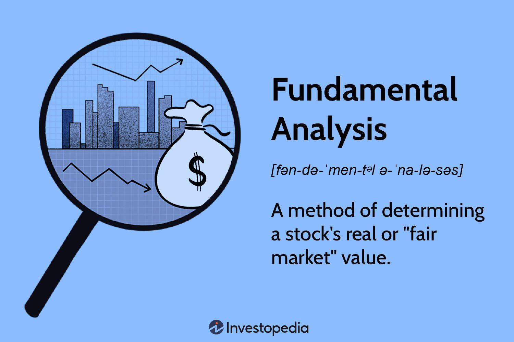

## Table of Contents

## What is fundamental analysis?

Fundamental analysis is a way to figure out if a company or an investment is worth buying. It's like doing a health check-up on a company by looking at its financial reports, how it's run, and what's happening in the world around it. People use this method to see if a company's stock price is a good deal or too expensive compared to what the company is really worth.

When doing fundamental analysis, people look at things like how much money the company makes, its debts, and how it's growing. They also check out the company's leaders and their plans for the future. By putting all this information together, investors can make smarter choices about whether to buy, sell, or hold onto a stock. It's a bit like being a detective, piecing together clues to see the bigger picture of a company's value.

## How does fundamental analysis differ from technical analysis?

Fundamental analysis and technical analysis are two different ways to look at investments like stocks. Fundamental analysis is all about understanding the real value of a company. It looks at things like how much money the company is making, its debts, and how well it's run. It also considers what's happening in the world that might affect the company. The goal is to figure out if the stock price is a good deal compared to what the company is actually worth. It's like checking the health and potential of a company before deciding to invest in it.

On the other hand, technical analysis doesn't care about the company's financials or the world around it. Instead, it focuses on the stock's price movements and trading patterns over time. Technical analysts use charts and other tools to spot trends and predict where the stock price might go next. They believe that all the important information about a company is already shown in its stock price and trading [volume](/wiki/volume-trading-strategy). So, they try to find the best times to buy or sell based on these patterns, without worrying about the company's actual value.

In short, fundamental analysis is about the company's health and worth, while technical analysis is about the stock's price behavior. Both methods can help investors make decisions, but they do it in very different ways.

## What are the key components of fundamental analysis?

Fundamental analysis looks at different parts of a company to see if it's a good investment. One big part is financial statements, which show how much money the company makes, how much it spends, and how much it owes. Investors look at things like earnings, revenue, and profit margins to see if the company is doing well. They also check out the company's balance sheet to see its assets and liabilities. Ratios like price-to-earnings (P/E) and debt-to-equity help compare the company to others and see if its stock is priced right.

Another part of fundamental analysis is looking at the company's management and business model. Investors want to know if the people running the company are good at their jobs and have a smart plan for the future. They also think about the company's industry and how it's doing. Is the company's product or service something people will keep buying? Are there new competitors or technologies that could hurt the company? Understanding these things helps investors guess how the company might do in the future.

Lastly, fundamental analysis considers what's happening in the world that could affect the company. This includes things like the economy, interest rates, and laws that might change how the company does business. For example, if the economy is growing, people might spend more money, which could be good for the company. But if there's a recession, people might spend less, which could be bad. By looking at all these pieces together, investors can make a better guess about whether the company's stock is a good buy.

## Why is understanding a company's financial statements important in fundamental analysis?

Understanding a company's financial statements is super important in fundamental analysis because it tells you how the company is doing money-wise. These statements show you things like how much money the company is making, how much it's spending, and how much it owes. By looking at this stuff, you can see if the company is making a profit or losing money. You can also see if it has a lot of debt, which could be risky. All of this helps you figure out if the company is healthy and if its stock is a good deal.

Financial statements also help you compare the company to others in the same industry. For example, you can use ratios like the price-to-earnings (P/E) ratio to see if the company's stock is priced higher or lower than similar companies. If the P/E ratio is low, it might mean the stock is a bargain. If it's high, the stock might be overpriced. By understanding these numbers, you can make smarter choices about whether to buy, sell, or hold onto the stock. It's like having a roadmap to help you navigate your investment decisions.

## What role do economic indicators play in fundamental analysis?

Economic indicators are really important in fundamental analysis because they help investors understand what's happening in the world that could affect a company. Things like unemployment rates, inflation, and interest rates can change how well a company does. For example, if the economy is growing and people are spending more money, a company might sell more of its products and make more profit. But if the economy is in a recession and people are buying less, the company might struggle. By keeping an eye on these indicators, investors can guess how a company might do in the future and make better investment decisions.

These indicators also help investors see the bigger picture. For instance, if inflation is high, it might mean that the cost of making things goes up, which could squeeze a company's profits. Or if interest rates go up, it might be harder for a company to borrow money to grow. By understanding these economic trends, investors can figure out if a company's stock is a good buy right now or if they should wait. It's like using a weather report to decide if you need an umbrella—economic indicators help investors prepare for what might happen next.

## How can ratios like P/E, P/B, and D/E be used in fundamental analysis?

Ratios like P/E, P/B, and D/E are super useful tools in fundamental analysis because they help investors understand a company's value and financial health in a quick way. The P/E ratio, or price-to-earnings ratio, tells you how much you're paying for each dollar of the company's earnings. A lower P/E might mean the stock is a good deal, while a higher P/E could mean it's expensive. The P/B ratio, or price-to-book ratio, compares the stock price to the company's book value, which is what the company would be worth if it sold all its assets and paid off its debts. A low P/B ratio might suggest the stock is undervalued. The D/E ratio, or debt-to-equity ratio, shows how much the company relies on debt to finance its operations. A high D/E ratio could mean the company is risky because it has a lot of debt.

By using these ratios, investors can compare a company to others in the same industry and see if it's a good investment. For example, if a company's P/E ratio is lower than its competitors, it might be a bargain. If its P/B ratio is low, it could mean the market isn't giving the company enough credit for its assets. And if the D/E ratio is high, it might be a warning sign that the company could struggle if things get tough. By looking at these ratios together, investors get a clearer picture of whether the company's stock is priced right and if it's a safe bet for their money.

## What is the significance of a company's earnings and revenue growth in fundamental analysis?

A company's earnings and revenue growth are really important when doing fundamental analysis. Earnings are how much money a company makes after paying all its bills. Revenue is the total amount of money the company brings in from selling its products or services. When these numbers are going up, it usually means the company is doing well. Investors love to see this because it shows the company is getting bigger and more successful. If earnings and revenue are growing fast, it might mean the company's stock is a good buy because the company is on the right track.

But it's not just about the numbers going up. Investors also want to see if the growth is steady and if it's likely to keep going. Sometimes a company can have a big jump in earnings or revenue one year, but if it can't keep that up, it might not be a good long-term investment. That's why investors look at trends over time and compare the company to others in the same industry. If a company's growth is better than its competitors, it could be a sign that the company is doing something right and might be worth investing in.

## How do qualitative factors such as management quality and industry conditions affect fundamental analysis?

Qualitative factors like how good the management is and what's happening in the industry can really change how investors see a company in fundamental analysis. Management quality is all about whether the people running the company are smart and good at their jobs. If they have a clear plan for the future and have done well in the past, investors might feel more confident that the company will keep growing. But if the leaders seem unsure or have made bad choices before, it could make investors worried about the company's future.

Industry conditions are also super important. This means looking at things like how much people want the company's products or services, and if there are new laws or technologies that could help or hurt the company. If the industry is growing and the company is doing well in it, that's a good sign. But if the industry is shrinking or facing big challenges, even a well-run company might struggle. By thinking about these qualitative factors, investors get a fuller picture of whether a company's stock is a good buy.

## Can you explain how to conduct a discounted cash flow (DCF) analysis?

A discounted cash flow (DCF) analysis is a way to figure out what a company is really worth by looking at the money it will make in the future. You start by guessing how much money the company will bring in each year for the next few years. This is called the cash flow. Then, you need to think about how much that future money is worth today. Money you get in the future is worth less than money you have now because you could invest it and make more money. So, you "discount" the future cash flows using a rate that shows how much you could earn if you invested that money somewhere else. This rate is called the discount rate.

Once you have your guesses about future cash flows and the discount rate, you use a formula to figure out the present value of all those future cash flows. You add up all these present values to get the total value of the company. This total value is what you think the company is really worth. If the company's stock price is lower than this value, it might be a good buy because you're getting it for less than what it's worth. But remember, DCF analysis depends a lot on your guesses about the future, so it's not always perfect. It's just one tool to help you make smarter investment choices.

## What are the limitations and challenges of using fundamental analysis?

Fundamental analysis has some limitations and challenges that investors need to keep in mind. One big challenge is that it relies a lot on guesses about the future. You have to predict how much money a company will make, what the economy will do, and how the industry will change. If your guesses are wrong, your analysis might be off, too. Another problem is that it can take a lot of time and effort to dig into a company's financial statements and understand all the numbers. Not everyone has the time or the skills to do this well.

Another limitation is that fundamental analysis might not catch short-term changes in the stock market. The stock price can go up or down because of things like news events or what other investors are doing, and these things can be hard to predict with fundamental analysis. Also, different people might look at the same information and come to different conclusions. What one person thinks is a good investment, another person might see as a bad one. So, while fundamental analysis is a useful tool, it's not perfect and should be used with other methods to make the best investment decisions.

## How does fundamental analysis apply to different asset classes like stocks, bonds, and real estate?

Fundamental analysis can be used to look at different kinds of investments like stocks, bonds, and real estate, but the way you do it changes a bit for each one. For stocks, you look at the company's financial statements, how much money it makes, and how well it's run. You also think about what's happening in the world that could affect the company. By putting all this together, you can guess if the stock is a good buy or not. For bonds, you look at things like how likely the company or government is to pay back the money they borrowed, and what [interest rate](/wiki/interest-rate-trading-strategies) they're offering. If the bond issuer is in good shape and the interest rate is high, the bond might be a good investment.

When it comes to real estate, fundamental analysis means looking at things like where the property is, how much people want to live or work there, and what other properties in the area are selling for. You also think about how much money you could make from renting it out and how much it would cost to keep it up. By understanding these things, you can figure out if the property is a good deal. Even though the details are different for each type of investment, the main idea of fundamental analysis is the same: you're trying to see if the investment is worth the price by looking at all the important factors.

## What advanced techniques can be used to refine fundamental analysis for expert investors?

Expert investors can use advanced techniques like scenario analysis to make their fundamental analysis better. Scenario analysis means thinking about different things that could happen in the future and how they might affect a company. For example, an investor might look at what would happen if the economy grows a lot, stays the same, or goes into a recession. By figuring out how the company would do in each scenario, the investor can get a clearer picture of how risky the investment is and if it's a good buy.

Another advanced technique is using more detailed financial models, like the Monte Carlo simulation. This method uses math to run lots of different possible outcomes for a company's future cash flows. It helps investors see not just one guess about the future, but a whole range of possibilities. This can give a better idea of how likely it is that the company will do well or struggle. By using these advanced techniques, expert investors can make smarter choices about where to put their money.

## What is Fundamental Analysis and How Can It Be Understood?

Fundamental analysis is an essential approach in evaluating an asset's intrinsic value by examining related economic, financial, and other qualitative and quantitative [factor](/wiki/factor-investing)s. Unlike technical analysis, which focuses on price movement and patterns often used for short-term trading decisions, [fundamental analysis](/wiki/fundamental-analysis) provides insights into the underlying health and long-term potential of a company or asset. This method involves assessing components like financial statements, [earning](/wiki/earning-announcement)s reports, and economic indicators, which collectively offer a comprehensive picture of an entity's performance and market value.

**Components of Fundamental Analysis**

1. **Financial Statements**: These are the backbone of fundamental analysis, providing vital data about a company's financial health. Key financial statements include the balance sheet, income statement, and cash flow statement. The balance sheet reveals a company's assets, liabilities, and shareholders' equity, offering insights into the company’s financial structure. The income statement shows the company’s profitability over a specific period, detailing revenues and expenses. Cash flow statements focus on liquidity, showing how cash moves in and out of the business, which is critical for assessing solvency.

2. **Earnings Reports**: These periodic financial documents disclose a company's profitability and enable investors to evaluate past performance while estimating future profitability. Key metrics include earnings per share (EPS), which is calculated as:

$$
\text{EPS} = \frac{\text{Net Income} - \text{Dividends on Preferred Stock}}{\text{Average Outstanding Shares}}
$$

EPS is a fundamental indicator of profitability, signaling how well the company utilizes its resources for shareholder benefit.

3. **Economic Indicators**: Macroeconomic factors such as inflation rates, employment statistics, interest rates, and GDP growth can significantly impact a company's performance and are thus integral to fundamental analysis. These indicators help predict economic conditions that could affect a company’s prospects and market demand for its products or services.

**Contrast with Technical Analysis**

While technical analysis relies on chart patterns and statistical figures from past market activity to predict future price movements, fundamental analysis offers a wider perspective by focusing on factors that influence a company's value over a longer horizon. Technical analysis might be more suited for traders looking for quick gains based on market trends, whereas fundamental analysis appeals to those interested in investment based on intrinsic value and the company's potential growth trajectory.

**Broader Perspective on Company Health**

Fundamental analysis is indispensable for investors looking to make informed decisions by thoroughly understanding a company’s capacity for growth and profitability. It goes beyond surface-level metrics, delving into managerial effectiveness, competitive advantages, market conditions, and operational efficiency, providing investors with a comprehensive overview of the company’s potential for sustainable success. By emphasizing these elements, fundamental analysis becomes critical for assessing a company's long-term health and future prospects, making it a powerful tool for value investors.

In summary, fundamental analysis is essential for developing insights into a company's value and market position. By incorporating detailed financial data, earnings projections, and economic trends, it allows investors to forecast potential performance, ensuring informed decision-making and strategic investment planning.

## What is Backtesting and Optimisation?

Backtesting is a critical step in validating a fundamental-based [algorithmic trading](/wiki/algorithmic-trading) strategy. It enables traders to assess how their strategies would have performed using historical data, providing insights into their viability before risking actual capital. This step helps identify potential flaws or weaknesses in the strategy and refines it for better performance.

When [backtesting](/wiki/backtesting) a fundamental-based algorithmic strategy, several key metrics are essential to evaluate. Return on Investment (ROI) is one of the primary metrics and is calculated as:

$$
\text{ROI} = \left( \frac{\text{Net Profit}}{\text{Cost of Investment}} \right) \times 100
$$

ROI helps in assessing the profitability of the strategy. Alongside ROI, traders must consider drawdowns, which measure the decline from a peak to a trough in the equity curve before a new peak is achieved. This is crucial for understanding the risk component of the strategy and how much loss a trader is exposed to during drawdown periods.

Drawdowns can be further examined using the Maximum Drawdown (MDD) metric:

$$
\text{MDD} = \frac{\text{Highest Peak Value} - \text{Lowest Trough Value}}{\text{Highest Peak Value}} \times 100
$$

This metric provides an understanding of the worst possible loss an investor could have faced historically, aiding in setting expectations for potential future risks.

For long-term success, continuous optimisation and monitoring of the algorithmic strategy are indispensable. Markets are dynamic, with changes influenced by numerous factors including economic conditions, policy changes, and emerging trends. This means a strategy that performed well historically might not maintain its performance unless it is regularly updated and optimised to adapt to new data and market conditions.

Optimization involves tweaking various parameters and variables within the strategy to enhance its performance. This could require re-evaluating fundamental data inputs such as P/E ratios, revising risk management parameters, or incorporating more recent market insights. Additionally, monitoring the performance in live market conditions is critical, as it ensures that the strategy aligns with expected outcomes.

By continuously refining the strategy through backtesting and optimization, traders can potentially improve its robustness and adaptability, increasing the likelihood of achieving sustainable long-term returns.

## References & Further Reading

[1]: ["Advances in Financial Machine Learning"](https://www.amazon.com/Advances-Financial-Machine-Learning-Marcos/dp/1119482089) by Marcos Lopez de Prado

[2]: ["Quantitative Trading: How to Build Your Own Algorithmic Trading Business"](https://www.amazon.com/Quantitative-Trading-Build-Algorithmic-Business/dp/0470284889) by Ernest P. Chan

[3]: ["Machine Learning for Algorithmic Trading"](https://www.amazon.com/Machine-Learning-Algorithmic-Trading-intelligence/dp/9918608013) by Stefan Jansen

[4]: ["Fundamental Analysis For Dummies"](https://www.amazon.com/Fundamental-Analysis-Dummies-Matthew-Krantz/dp/0470506458) by Matt Krantz

[5]: Bloomberg. ["Bloomberg Terminal."](https://www.bloomberg.com/professional/solution/bloomberg-terminal/)

[6]: Quandl. ["Quandl: Financial and Economic Data."](https://www.quandl.com/)

[7]: Securities and Exchange Commission (SEC). ["EDGAR Database."](https://www.sec.gov/edgar.shtml)