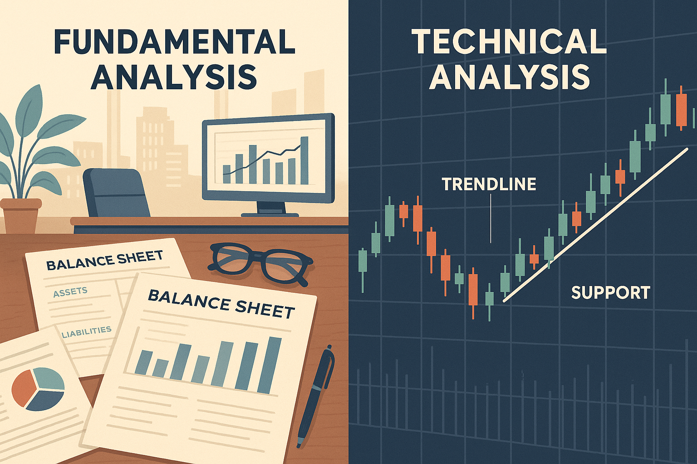

**Fundamental analysis** is an approach to evaluating investments by examining the underlying financial and economic factors that determine a company’s **intrinsic value**. Instead of focusing on short-term market fluctuations, fundamental analysts study **business fundamentals** – things like earnings, assets, liabilities, competitive position, and industry trends – to estimate what a stock is truly worth. By comparing this intrinsic value to the current market price, investors can identify stocks that appear **undervalued** or **overvalued**, guiding buy or sell decisions. It’s a bit like assessing a house’s worth by inspecting its foundation, structure, and neighborhood, rather than just watching the day-to-day changes in its Zillow price. This educational guide provides a comprehensive, yet accessible, overview of fundamental analysis, covering core concepts, valuation models, key financial ratios, qualitative factors, industry-specific insights, and how it compares to other approaches like technical analysis. We’ll also look at practical examples of fundamental analysis in action, helping you connect theory with real-world application.

## Table of Contents

## What Is Fundamental Analysis?

Fundamental analysis is a method of evaluating the **intrinsic value** of an asset (typically a stock) by delving into the *“fundamentals”* of the business and broader economy. This means analyzing a company’s financial statements, performance metrics, management quality, industry conditions, and macroeconomic indicators. The goal is to determine what the company is really worth based on its **assets, earnings, and growth prospects**, and then compare that value to the current market price. If the intrinsic value is higher than the market price, the stock may be undervalued (a potential *buy*); if it’s lower, the stock may be overvalued (a warning or *sell* signal).

Fundamental analysis provides a **long-term, value-focused perspective**. Unlike technical analysis – which looks at chart patterns and price momentum – fundamental analysis is all about a company’s **business health and future potential**. It involves answering questions like: *How profitable is the company? How fast are its revenues and earnings growing? What assets and debts does it have? How competitive is its industry position?* By synthesizing this information, an analyst estimates a fair value for the stock, essentially asking, *“Given this company’s fundamentals, what price should its stock be trading at?”*

It’s important to note that fundamental analysis can be applied not only to individual companies, but also to evaluate entire **sectors or even economies**. For example, an investor might analyze economic indicators (interest rates, GDP growth, consumer trends) to decide which industries look promising, then drill down to find the most fundamentally solid companies within those industries.

**Components of Fundamental Analysis**

1. **Financial Statements**: These are the backbone of fundamental analysis, providing vital data about a company's financial health. Key financial statements include the balance sheet, income statement, and cash flow statement. The balance sheet reveals a company's assets, liabilities, and shareholders' equity, offering insights into the company’s financial structure. The income statement shows the company’s profitability over a specific period, detailing revenues and expenses. Cash flow statements focus on liquidity, showing how cash moves in and out of the business, which is critical for assessing solvency.

2. **Earnings Reports**: These periodic financial documents disclose a company's profitability and enable investors to evaluate past performance while estimating future profitability. Key metrics include earnings per share (EPS), which is calculated as:

$$
\text{EPS} = \frac{\text{Net Income} - \text{Dividends on Preferred Stock}}{\text{Average Outstanding Shares}}
$$

EPS is a fundamental indicator of profitability, signaling how well the company utilizes its resources for shareholder benefit.

3. **Economic Indicators**: Macroeconomic factors such as inflation rates, employment statistics, interest rates, and GDP growth can significantly impact a company's performance and are thus integral to fundamental analysis. These indicators help predict economic conditions that could affect a company’s prospects and market demand for its products or services.

**Contrast with Technical Analysis**

While technical analysis relies on chart patterns and statistical figures from past market activity to predict future price movements, fundamental analysis offers a wider perspective by focusing on factors that influence a company's value over a longer horizon. Technical analysis might be more suited for traders looking for quick gains based on market trends, whereas fundamental analysis appeals to those interested in investment based on intrinsic value and the company's potential growth trajectory.

**Broader Perspective on Company Health**

Fundamental analysis is indispensable for investors looking to make informed decisions by thoroughly understanding a company’s capacity for growth and profitability. It goes beyond surface-level metrics, delving into managerial effectiveness, competitive advantages, market conditions, and operational efficiency, providing investors with a comprehensive overview of the company’s potential for sustainable success. By emphasizing these elements, fundamental analysis becomes critical for assessing a company's long-term health and future prospects, making it a powerful tool for value investors.

In summary, fundamental analysis is essential for developing insights into a company's value and market position. By incorporating detailed financial data, earnings projections, and economic trends, it allows investors to forecast potential performance, ensuring informed decision-making and strategic investment planning.

## Core Concepts and Principles

At the heart of fundamental analysis are a few key concepts:

**Intrinsic Value:**

This is the cornerstone idea that every asset has a true underlying value based on its fundamentals, independent of its current market price. Intrinsic value represents what a stock *should* be worth if all available information and reasonable forecasts are considered. If market prices deviate from this intrinsic value, it creates an opportunity for investors (either to buy undervalued stocks or sell overvalued ones). Value investors like Benjamin Graham and Warren Buffett famously look for a *“margin of safety,”* meaning they seek stocks trading well below their estimated intrinsic value to allow for a buffer against errors in analysis.

**Quantitative vs. Qualitative Factors:**

Fundamental analysis examines both hard numbers and softer aspects. **Quantitative factors** are measurable financial data – revenue, profits, assets, expenses, cash flow, and so on – usually obtained from financial statements and market statistics. **Qualitative factors** are the non-numeric, subjective elements that affect a company’s value – for instance, the quality of the management team, the strength of the brand, patents or proprietary technology, customer loyalty, or the regulatory environment. A comprehensive analysis blends both: the numbers tell *what* is happening, while qualitative insights tell *why* and whether those trends are likely to continue.

**Long-Term Focus:**

Fundamental analysis typically adopts a longer-term investment horizon. It’s based on the premise that, over time, stock prices will gravitate toward their intrinsic values. This can require patience – a stock might remain mispriced for months or even years. Fundamental analysts often remind themselves that *“in the short run the market is a voting machine, but in the long run it’s a weighing machine,”* meaning short-term prices can swing on popularity and sentiment, but eventually a company’s real weight (value) will prevail. This long-term, *“buy-and-hold”* orientation of fundamental analysis makes it especially popular among investors aiming to build wealth over years, not day-traders looking for quick wins.

**Top-Down vs. Bottom-Up Approaches:**

There are a couple of ways to perform fundamental analysis. In a **top-down approach**, an investor might start by looking at macroeconomic factors (e.g. economic growth, interest rates, inflation), then identify attractive industries, and finally pick well-positioned companies within those industries. In a **bottom-up approach**, the investor starts at the company level, focusing on a firm’s fundamentals first and foremost, regardless of broader economic or industry trends. Both approaches are valid; many analysts use a mix, ensuring they understand the big picture while digging into specific stock details.

## Quantitative Factors: Financial Statements and Metrics

At its core, fundamental analysis relies heavily on **financial data**. The primary sources for this data are a company’s financial statements – namely the **income statement**, **balance sheet**, and **cash flow statement** – which are typically found in its quarterly and annual reports (10-Q and 10-K filings for U.S. companies). By scrutinizing these statements, investors can gauge a firm’s profitability, financial stability, and operational efficiency.

* **Income Statement:** This statement (also known as the profit & loss statement) shows the company’s revenues, expenses, and profits over a period (quarter or year). It tells you *how much money the company earned, and how much it spent* to earn it. Key line items include revenue (the top line), various costs (cost of goods sold, operating expenses, etc.), and net income (the bottom line profit after all expenses). By examining the income statement, an analyst can determine **profit margins** (what percentage of revenue is kept as profit) and trends in sales or expenses. For example, rising revenues coupled with controlled costs indicate growing profitability, whereas shrinking margins might signal rising costs or pricing pressure.

* **Balance Sheet:** The balance sheet provides a snapshot of what the company **owns (assets)** and **owes (liabilities)** at a specific point in time, as well as the shareholders’ equity (the net assets belonging to shareholders after liabilities). Assets include things like cash, investments, inventory, equipment, and intangibles; liabilities cover loans, accounts payable, bonds, etc. The balance sheet is fundamental for assessing a company’s **financial health and stability**. Investors often look at the company’s *liquidity* (how easily can it meet short-term obligations? – e.g. via metrics like the current ratio) and *leverage* (how much debt is the company using to finance its operations? – e.g. debt-to-equity ratio). A company with a strong asset base and moderate liabilities is usually more robust, whereas one loaded with excessive debt might be riskier.

* **Cash Flow Statement:** Profitability on paper doesn’t always equate to cash in the bank. The cash flow statement details the actual **cash inflows and outflows** from three activities: operating activities (cash generated by the business operations), investing activities (cash used for investments like purchasing equipment or acquiring another company), and financing activities (cash from issuing debt/equity or paying dividends, etc.). This statement helps analysts assess a company’s **liquidity and cash management**. Positive operating cash flow is vital, as it indicates the company’s core business is actually generating cash (as opposed to just accounting profits). The cash flow statement can reveal if a company is burning cash, which could be a red flag even if the income statement looks positive (for instance, a startup might show accounting profits but still have negative cash flow due to aggressive growth investments).

From these financial statements, analysts derive a variety of **financial ratios** and metrics to evaluate performance. Here are some of the most commonly used metrics in fundamental analysis:

* **Earnings Per Share (EPS):** Net income divided by the number of outstanding shares. This tells how much profit the company made for each share of stock. Growing EPS over time is a positive sign, and EPS is used in other valuations like the P/E ratio.

* **Price-to-Earnings Ratio (P/E):** Perhaps the most famous valuation ratio, P/E = (Share Price) / (Earnings per Share). It shows how much investors are willing to pay for each dollar of the company’s earnings. A high P/E can indicate that investors expect high growth in the future (thus are willing to pay a premium), whereas a low P/E might suggest the stock is undervalued or that the company is facing challenges. For example, if a stock is \$50 and its EPS is \$5, the P/E is 10. We can then compare that 10x ratio to the broader market or competitors: is 10x higher or lower than average? As of mid-2025, many stocks in the S\&P 500 traded around 20-25x earnings, but there were also large companies like General Motors trading at a trailing P/E near 7 – an unusually low ratio that fundamental analysts might interpret as a potential value opportunity if the company’s fundamentals are solid.

* **Price-to-Book Ratio (P/B):** P/B = (Share Price) / (Book Value per Share). Book value per share is essentially (total assets – total liabilities) divided by shares, i.e. the net assets per share. P/B compares the market price to the company’s accounting book value. A P/B of 1 means the stock is trading exactly at book value; less than 1 can indicate the market values the company at less than its net assets (possibly an undervaluation, or it could mean those assets are of low quality or the company is expected to earn poor returns). Many stable, asset-heavy companies (like banks or utilities) trade in the 1-2x book range. Tech or service companies with fewer tangible assets often have higher P/B ratios. *Key insight:* a low P/B might signal a bargain, but it’s important to dig deeper – sometimes assets on the books may be outdated or impaired, or the company might have low profitability.

* **Price-to-Sales (P/S):** P/S = (Market Cap) / (Annual Sales). This measures how the market values each dollar of the company’s sales. It’s useful for companies that are not yet profitable (like early-stage tech firms) where P/E might not be meaningful. Lower P/S relative to peers could indicate undervaluation. For instance, in early 2023 some high-growth tech stocks traded at P/S multiples above 10 or 15, whereas more mature retailers might trade at P/S of 1 or less.

* **Price/Earnings-to-Growth (PEG) Ratio:** This adjusts the P/E ratio by the company’s growth rate (PEG = P/E divided by annual EPS growth rate, usually expressed as a whole number, not a percentage). A PEG of 1 is often considered fair value (P/E is in line with growth), PEG above 1 could mean a stock is overpriced relative to its growth, and PEG below 1 might signal undervalued (high growth not fully priced in). For example, a company with P/E 30 that’s growing earnings 30% a year would have PEG \~1. If the same P/E 30 company is only growing 10% a year, PEG is 3 – which might be a red flag for overvaluation.

* **Profitability Ratios:** These tell how good the company is at turning resources into profit:

  * **Gross Margin:** (Revenue – Cost of Goods Sold) / Revenue. It indicates the basic profitability of the product or service before overhead. Say a company has \$1,000 million in sales and \$600 million in direct costs, the gross profit is \$400 million, so gross margin = \$400/\$1,000 = **40%**. Higher gross margin than industry peers can mean a strong product pricing or lower production cost.
  * **Operating Margin:** Operating income (profit after operating expenses) divided by revenue. In the same example, if operating income is \$200 million, operating margin = \$200/\$1,000 = **20%**. This reflects the efficiency after accounting for overhead and operating expenses.
  * **Net Margin:** Net income divided by revenue. If net income was \$150 million, net margin = 15%. This is the bottom-line profitability – how much of each dollar of sales is ultimately kept as profit.

  These margins help compare profitability across companies of different sizes and across time. Consistently high or rising margins often signal competitive advantages or good cost control, whereas declining margins might indicate rising costs or competitive pressures.

  * **Return on Equity (ROE):** Net income divided by shareholders’ equity. ROE measures how effectively a company uses the money invested by shareholders to generate profit. For instance, if that company “ABC” had \$150 million in net income and \$1,000 million in equity, its ROE would be **15%**. An ROE of 15% means that for every \$1 of equity, the company produced \$0.15 in profit over the year. Comparisons of ROE are typically within industries – what’s considered good for a utility might differ from what’s good for a tech firm. High ROE can indicate efficient management and profitable use of equity, though extremely high ROE might also be a result of high leverage (debt).

  * **Return on Assets (ROA):** Net income divided by total assets. This shows how efficient the company is at using all its assets to generate profit. A higher ROA means the company squeezes more profit out of each dollar of assets. ROA is often lower for asset-intensive businesses (like manufacturing) and higher for asset-light businesses (like software companies).

* **Liquidity and Solvency Ratios:** These assess a company’s ability to meet obligations:

  * **Current Ratio:** Current assets / current liabilities. A current ratio of 1.5 or 2 is often considered healthy, meaning the company has \$1.50-\$2.00 in short-term assets for every \$1 of short-term debt. Much lower than 1 indicates potential liquidity issues (not enough cash to cover upcoming bills), while an extremely high current ratio might suggest inefficient use of assets.
  * **Debt-to-Equity Ratio:** Total debt / shareholders’ equity. This gauges financial leverage. A D/E of 1.0 means the company’s debt equals its equity. A higher D/E (>1) means more debt relative to equity (which can boost returns in good times but adds risk), while a lower D/E indicates less debt (which could mean a more stable balance sheet, but perhaps the company is not taking advantage of leverage for growth).
  * **Interest Coverage:** Operating profit (or EBITDA) / interest expense. This indicates how easily the company can pay its interest obligations from its earnings. An interest coverage ratio below 2 might be a red flag (earnings barely cover interest), whereas a high ratio (5, 10 or more) means the company comfortably services its debt.

* **Cash Flow Ratios:** e.g. **Free Cash Flow (FCF)** which is operating cash flow minus capital expenditures. Free cash flow represents the cash a company generates that can be used to pay dividends, buy back shares, or reinvest in the business. Some analysts look at **Price-to-Cash-Flow** or **Price-to-Free-Cash-Flow** ratios analogous to P/E, especially for companies where earnings might be distorted by accounting but cash flow is strong.

In summary, these financial metrics help build a quantitative picture of a company. They answer questions like: *Is the company growing? Is it profitable? Is it financially stable?* By comparing ratios to the company’s past performance, to other companies in the same industry, and to the market as a whole, analysts can spot strengths and weaknesses. For instance, if a company’s P/E and P/B are significantly lower than peers, yet its growth and profitability are on par, that could signal a mispricing worth investigating (perhaps an undervalued stock). **Many top ratios are straightforward and offer plenty of insight – P/E and PEG focus on earnings, P/B looks at net assets, while others consider cash flow and sales.** No single number tells the whole story, but together, these metrics are powerful tools in the fundamental analyst’s toolbox.

## Qualitative Factors: Beyond the Numbers

Numbers alone don’t capture everything that affects a company’s value. **Qualitative factors** – the more subjective, human, or situational aspects of a business – are a critical part of fundamental analysis. Here are some of the key qualitative areas analysts consider:

**Management Quality and Governance:**

The competence and integrity of a company’s management team can make or break its success. A company led by experienced, visionary leaders with a track record of smart decisions often merits a premium. Analysts may look at the CEO’s and executives’ backgrounds, their strategy and execution, and how they have navigated past challenges. Consistency in meeting targets, transparent communication with shareholders, and prudent capital allocation (how management invests the company’s money) are all positive signs. On the flip side, frequent executive turnover, scandals, or a management team that over-promises and under-delivers are red flags. It’s also important to assess corporate governance – is the board of directors independent and effective at overseeing management? Are executive compensation and incentives aligned with shareholder interests? Strong governance can prevent value-destroying decisions.

**Brand Strength and Competitive Moat:**

Does the company have a well-known and trusted brand? Brand equity can translate into pricing power – customers might pay a premium for a product because of the name (think Apple or Coca-Cola). Beyond brand, analysts consider whether the company has a **competitive moat** – durable advantages that protect it from competition. This could be proprietary technology, patents, network effects, a large user base, cost advantages, or high switching costs that keep customers loyal. For example, a firm like Google has a moat in search engines due to its algorithms and scale of data. A strong moat often means a company can sustain high returns for longer because competitors can’t easily steal market share.

**Industry Conditions and Market Position:**

The context of the company’s industry is vital. An investor will examine if the industry is growing and how intense the competition is. Questions to ask: *Is the company a leader in a growing market, or a smaller player in a saturated or declining industry?* Fundamental analysis involves understanding market **supply and demand dynamics**. For instance, an oil producer’s prospects are tied to oil prices and reserves; a smartphone maker’s prospects depend on tech trends and consumer preferences. Being the **market leader** or having a unique niche can significantly affect a company’s future earnings. Industry analysis also looks at things like barriers to entry (how easy is it for new competitors to emerge?), supplier and customer power, and any regulatory or technological changes on the horizon that could shake things up (for example, how electric vehicle adoption might affect traditional auto companies).

**Innovation and R\&D:**

In sectors like technology, pharmaceuticals, or any fast-evolving field, a company’s pipeline of new products and innovation is crucial. A strong commitment to R\&D (research and development) can indicate future growth drivers. Investors might look at how much the company spends on R\&D and what the results have been (new patents, products launched, etc.). However, this must be weighed against the risk – not all R\&D leads to success, but a company that never innovates could be left behind.

**Customer Satisfaction and Corporate Culture:**

Though harder to measure, things like customer loyalty and company culture can provide hints about long-term performance. High customer satisfaction (sometimes gauged by surveys or repeat business metrics) can lead to sustainable revenue. A positive corporate culture can improve productivity and retention of top talent, which in turn supports better execution of the company’s strategy. Reviews on job sites or industry reputation can give a peek into the culture.

**Regulatory and Legal Environment:**

Companies in heavily regulated industries (finance, healthcare, utilities, etc.) face unique risks and constraints. Fundamental analysis entails being aware of the regulatory backdrop – e.g., a pharmaceutical company’s fortunes can rise or fall based on FDA approvals or patent law changes; a bank’s growth is influenced by capital requirements set by regulators. Legal issues such as ongoing lawsuits or the potential for new regulations (like stricter environmental rules for an oil company) also factor into the qualitative assessment.

**Macro-economic and Geopolitical Factors:**

While often considered a separate layer above individual company analysis, macro factors do bleed into qualitative analysis of a company. For example, a company’s fundamental prospects could be affected by interest rate trends (higher rates might hurt companies relying on debt financing), trade policies (tariffs could affect exporters), or geopolitical stability (operations in certain countries could be riskier). If analyzing a multinational corporation, an investor will consider currency exchange rates, political risks in key markets, and global economic trends that impact demand for the company’s products.

In practice, fundamental analysts piece together these qualitative insights with the quantitative data. For instance, strong financial numbers might not be sustainable if qualitative factors are poor (maybe the company had great past profits but is now facing a wave of new competition or lost a key patent). Conversely, a company might look weak in past financial performance but have excellent new management and a game-changing product coming – a qualitative angle suggesting future improvement. **By examining factors like management, brand value, competitive position, and industry health, fundamental analysis goes beyond the numbers to understand the *story* of the business.** Especially for beginners, it’s useful to remember that behind every stock ticker is an actual company with people, products, and a place in the economy – those human and strategic elements often explain *why* the financial numbers are what they are.

## Valuation Methods in Fundamental Analysis

A key objective of fundamental analysis is to derive an estimate of a company’s intrinsic value. To do this, analysts use various **valuation models and techniques**. These methods range from very detailed, calculating the present value of future cash flows, to simpler relative comparisons with other companies. Below are some of the most common valuation approaches:

* **Discounted Cash Flow (DCF) Analysis:** DCF is a cornerstone of fundamental valuation. It involves projecting a company’s future cash flows (often 5-10 years into the future, plus a terminal value at the end) and then **discounting** those future cash flows back to the present using a required rate of return (often the company’s weighted average cost of capital). The sum of these discounted cash flows equals the estimated intrinsic value of the company (or its equity). In essence, *a stock is worth the present value of all the cash you expect it to generate in the future*. If this DCF-derived value is higher than the current market price, the stock might be undervalued (and vice versa). For example, if we expect a company to generate \$100 million of cash per year growing slightly over time, we’d discount each of those amounts back (to account for the time value of money and risk). **DCF analysis is a blend of science and art** – the formula is precise, but the inputs (growth rates, discount rate, etc.) involve assumptions. It’s powerful because it forces analysts to think about drivers of value (earnings, growth, risk) in a structured way. *Key point:* **“Discounted cash flow helps determine the value of an investment based on its future cash flows”**, but it heavily depends on estimates. One major advantage of DCF is that it is an *“absolute”* valuation method – it doesn’t depend on how other companies are valued; it purely tries to compute intrinsic worth. A noted disadvantage is that if your forecasts are off, the DCF valuation can be quite wrong (garbage in, garbage out). Despite its challenges, many analysts and investors (from Wall Street equity researchers to Warren Buffett) use DCF as a central tool for valuing companies, especially those with relatively predictable cash flows.

* **Relative Valuation (Comparables):** This approach looks at how similar companies are valued by the market to infer the target company’s value. Rather than calculating intrinsic value from scratch, you **compare financial ratios** (like P/E, P/B, EV/EBITDA, etc.) across companies. For instance, if a peer group of companies in the same industry trade at an average P/E of 15 and our company’s earnings are \$2 per share, a *“fair”* price might be around \$30 (i.e. 15 × \$2). If the stock is currently trading at \$20 (P/E 10), one might conclude it’s undervalued relative to peers. There are many ratios used for comparables:

  * **P/E comparisons:** as described, useful especially for companies with steady earnings. You might adjust for growth rates too (a company growing faster might deserve a higher P/E).
  * **Enterprise Value/EBITDA:** EV is market cap plus debt minus cash (a measure of total company value), and EBITDA is a proxy for operating cash flow. EV/EBITDA is often used to compare across companies with different debt levels or to value companies in acquisition scenarios.
  * **Price-to-sales or EV/Sales:** good for companies that are not profitable yet.
  * **Price-to-book:** often used in banking and finance, where assets and book values are key.

  Relative valuation is generally easier and faster than a full DCF and reflects current market sentiment (since it’s based on current market multiples). However, it can be skewed if the whole sector is mispriced. If *everyone* in an industry is overvalued, comparables might still tell you a stock is “fairly” priced relative to peers, yet all could be overpriced in absolute terms. Therefore, savvy analysts use relative valuation along with an absolute measure. **A relative valuation model estimates a company’s worth by comparing it to other companies, using financial ratios or multiples of similar businesses.** It’s essentially saying, *“Given how the market values similar companies, what should this one be worth?”*

* **Asset-Based Valuation:** In some cases, especially for companies that are asset-heavy or being considered for liquidation, analysts look at the value of the firm’s assets directly. **Book value** (from the balance sheet) is a starting point, but often adjustments are made to reflect current market values of assets. A famous asset-based valuation metric is the **Net Current Asset Value** (NCAV) or Graham’s formula, which takes current assets minus all liabilities (essentially liquidation value of a company’s current assets) and compares that to the market cap – Benjamin Graham often looked for stocks trading below their NCAV as deep value opportunities. While asset-based valuation isn’t typically used for ongoing profitable companies (earnings power usually far exceeds liquidation value), it can set a **floor value**. For example, in distressed situations one might ask, “if we sold off all the company’s assets and paid off debts, what’s left for shareholders?” If a stock trades below that figure, it might be a bargain (provided those asset values can be realized).

* **Dividend Discount Models (DDM):** For companies that pay dividends, especially stable, mature firms (like many utilities or consumer staples), a valuation can be done by projecting future dividends and discounting them back (similar to DCF but focusing on cash returned to shareholders). The simplest form is the **Gordon Growth Model**, which values a stock as `Dividend_next_year / (required_return – dividend_growth_rate)`. If a company pays a \$2 dividend per year, you expect that to grow 4% annually, and you require a 10% return, the stock might be valued at \$2 / (0.10 – 0.04) = \$33.33. If it’s trading at \$25, it looks undervalued by this model. DDM is essentially a DCF on dividends instead of full cash flows. It’s very sensitive to the assumptions about growth and required return.

* **Earnings Power / Residual Income Models:** Another approach is to value a company based on the idea of “earnings power.” One might normalize a company’s earnings (adjust for one-time items or cyclicality) and then apply a capitalization rate (inverse of a P/E) to that normalized earnings. Similarly, **Residual Income Models** value a company based on the idea that value = current book value + present value of future residual incomes (where residual income is the profit above a required return on equity). These models are used in academic settings and by some analysts because they can handle cases where a company doesn’t pay dividends and where DCF might be tricky, but they require detailed accounting of returns on capital.

Each of these methods has its pros and cons, and in practice, many analysts will use **multiple valuation methods** to cross-check each other. For example, one might do a DCF and also look at P/E multiples of peers and maybe consider what the stock’s value is as a percentage of sales or book. If all methods point to the stock being undervalued, that strengthens the conviction. If they diverge, it warrants digging into why – maybe the DCF is optimistic, or the comparables are not truly comparable, etc.

It’s worth noting too that different sectors favor different valuation metrics. For instance, REITs (real estate investment trusts) often use metrics like NAV (net asset value) or funds-from-operation multiples, startups might be valued on user-base or revenue multiples if they have no profits, and banks are often valued on book value and earnings combined. We’ll cover more on sector-specific insights next.

In summary, **valuation is as much art as science**. Fundamental analysis gives you the toolbox – DCF, comparables, etc. – but it also requires sound judgment in choosing assumptions and interpreting results. The goal is to avoid overpaying for hype and to spot **value that others might be overlooking** by doing careful, reasoned analysis.

## Industry and Sector Considerations

One important reality of fundamental analysis is that **each industry has its own dynamics and benchmarks**. Financial metrics that are normal for one sector might be red flags in another. Thus, analyzing a company also means understanding the context of its sector and sometimes tailoring the analysis to industry-specific factors. As one investment guide aptly put it, *“the way you assess a company’s value will depend on the sector it belongs to”*. Here are a few examples of sector-specific insights and metrics:

**Technology & High Growth Companies:**

Tech companies often have rapid growth, high valuations, and sometimes no current profits. For these, investors might emphasize metrics like **revenue growth rate**, **user/subscriber growth**, or **market share**. Profit-based metrics (P/E, ROE) might be less meaningful if the company is reinvesting everything for growth. Instead, **price-to-sales (P/S)** or even ratios like *Enterprise Value per User* (for social media or platform companies) could be considered. Also, tech firms’ value can hinge on **intangible assets** (patents, algorithms, network effects). For example, a software-as-a-service (SaaS) company might track **annual recurring revenue (ARR)** and customer **churn rate** (how many customers leave) as key fundamentals. A high churn could signal customer dissatisfaction, whereas strong ARR growth with low churn indicates a solid, potentially undervalued business even if current earnings are small.

**Financial Institutions (Banks, Insurance):**

Traditional industrial ratios can be misleading for banks. Analysts here focus on things like **net interest margin (NIM)** – essentially the spread between interest earned on loans and interest paid on deposits, which drives bank profits. **Loan loss reserves** and asset quality are critical: a bank might look profitable until loan defaults hit, so one must examine the bank’s balance sheet for non-performing loans. Capital ratios (Tier 1 capital, etc.) measure stability. For insurance companies, metrics like the **combined ratio** (claims and expenses divided by premiums collected) tell you if underwriting is profitable (<100% is good). Book value is often a significant metric – many banks trade around or below book value. So a bank with a P/B of 0.8 might be seen as a bargain *if* its assets are truly solid. **Regulatory changes** and interest rate trends heavily influence this sector’s fundamentals as well.

**Retail & Consumer Goods:**

For retail companies (like chain stores, e-commerce, etc.), **same-store sales** growth is a vital metric. Same-store sales (or comparable sales) measure sales growth in existing stores and exclude new store openings – it shows organic growth and the health of established locations. Inventory turnover and **gross margins** are also key: retail is often a low-margin, high-volume business, so small margin improvements can be big. **Foot traffic** or online **active customer counts** are other indicators. Brand strength and consumer trends (e.g., a shift to online shopping) can dramatically affect fundamentals. When analyzing, say, a clothing retailer, an investor will watch fashion trends and consumer sentiment as much as the raw numbers.

**Energy & Commodities:**

For oil, gas, mining companies, fundamentals are tied to commodity prices and reserves. You’ll often see analysts discuss **reserves** (proved reserves of oil/gas in the ground) and **production costs** (cost per barrel, etc.). A company with lower cost of production has an edge when commodity prices fall. Debt levels are crucial here too, since commodities can be volatile – if prices drop, a highly leveraged oil producer might struggle. Valuation might use metrics like EV/Reserves or EV/Production (e.g., how much an investor pays per barrel of oil equivalent in the ground or per flowing barrel produced). Also, **geopolitical risk** is a factor (where are the mines or oil fields located? Stable countries or conflict zones?).

**Utilities and Infrastructure:**

These tend to be stable, regulated businesses with steady cash flows and high dividends. Key metrics include the **dividend yield**, the payout ratio (what percentage of earnings is paid as dividends), and the regulated asset base. They often carry a lot of debt (which is normal for them), so analysts focus on interest coverage and regulatory allowed returns. Valuation might lean on DDM (since dividends are a big part of investor returns) or P/E relative to other utilities. Growth is usually slow, so a utility with unusually high growth might be looked at with skepticism unless there’s a clear reason.

**Cyclical Industries:**

Some industries like automotive, airlines, construction, or commodities are highly cyclical – they boom and bust with the economic cycle. For these, a fundamental analyst will **normalize earnings** (average out the ups and downs) to avoid getting fooled by peak earnings. For example, an auto manufacturer might have a low P/E at the top of a cycle (because earnings are temporarily high) – a rookie investor might think it’s cheap, but a seasoned analyst knows to expect earnings to fall in the next downturn, meaning the stock isn’t truly cheap. Thus, looking at **average or peak-to-trough earnings**, order backlogs (in aerospace, say), and economic indicators (housing starts for construction companies, etc.) becomes part of fundamental analysis.

In all cases, **context matters**. Comparing a company to its direct peers is often more illuminating than broad market comparisons. A 5% profit margin might be terrible for a software company but excellent for a grocery store. A P/E of 30 might be unjustifiable in a slow-growth utility, but normal for a biotech growing at 50% a year. **Remember: no two sectors are the same – each requires a tailored approach when doing fundamental analysis.** It’s often wise for investors to specialize or at least be aware of the norms in a few sectors rather than try to analyze every industry with the same lens.

One practical tip is to use industry-specific metrics alongside standard ratios. For example, **investors analyzing bank stocks will check the bank’s net interest margin and loan growth**, **those looking at retail will check same-store sales**, and **those looking at subscription-based businesses examine churn rates and lifetime value of customers**. Many stock research reports and company investor presentations highlight these key operating metrics, as they often predict future financial results.

By incorporating industry-specific insight, fundamental analysts can make more nuanced judgments. This sector knowledge helps avoid mistakes like valuing a stock highly just because its P/E is low without realizing its industry is in structural decline, or overlooking a stock with a high P/E that is actually reasonable given its industry-leading growth and moat.

## Fundamental Analysis vs. Technical Analysis

Fundamental analysis and technical analysis are often seen as two very different schools of thought in investing. We’ve discussed how fundamental analysis focuses on intrinsic value and business fundamentals. **Technical analysis**, on the other hand, focuses purely on market data – primarily price and volume – to gauge investor sentiment and predict future price movements. Let’s briefly compare and contrast the two:

* **Focus and Methodology:** Fundamental analysts evaluate *securities* by measuring their intrinsic value, looking at financial and economic factors (earnings, assets, industry trends, etc.). Technical analysts evaluate *market activity*, looking for patterns in stock price charts, trading volumes, and momentum indicators. In other words, fundamental analysis asks *“Is this stock’s price justified by its earnings and growth?”*, while technical analysis asks *“What do the charts and trading patterns suggest about where the price is heading?”*.

* **Time Horizon:** Fundamental analysis usually has a long-term orientation. It seeks to identify stocks that will be good investments over months or years as the market eventually recognizes their true value. Technical analysis often has a shorter-term focus, from day-trading up to a few months, aiming to time entry and exit points based on patterns (though some technical traders look at long-term trends too). Fundamental investors might tolerate short-term price volatility if they are confident in the fundamentals, whereas technical traders might sell on a chart downturn even if the fundamental story is intact.

* **Information Used:** Fundamental analysts dig into financial statements, management discussions, news releases, economic reports, etc. Technical analysts typically tune out the news about a company’s products or profits – they concentrate on **price charts, moving averages, trend lines, support and resistance levels, and technical indicators** (like RSI, MACD, etc.). The core assumption in technical analysis is that all fundamental information is already reflected in the price, and thus studying the price itself is the best way to gauge supply/demand and investor psychology. Fundamental analysis assumes that by studying information (some of which the market may have underappreciated or misinterpreted) one can gain an edge.

* **Strengths and Weaknesses:** Fundamental analysis provides deep insight into *why* a stock might be a good investment and typically leads to confidence in long-term holding – you have a thesis based on value. Its weakness is that it’s time-consuming and not always great for timing trades; a stock can remain undervalued or overvalued for a long time (the market can “stay irrational longer than you can stay solvent,” as the saying goes). Technical analysis’s strength is in timing and emotion – it can signal when a stock is gaining momentum or when a reversal might occur, capturing shorter-term swings. Its weakness is that it can sometimes be a self-fulfilling prophecy and may not account for fundamental shifts; purely technical traders might miss the forest (big fundamental picture) for the trees (short-term patterns).

Rather than viewing fundamental vs. technical as a strict either/or, many modern investors use a **combination** of both. For example, an investor might use fundamental analysis to create a list of stocks that are fundamentally sound and potentially undervalued (identifying *what* to buy), then use technical analysis to decide *when* to buy or sell those stocks (for instance, waiting for an upward price trend before buying into a value stock). In fact, **both methods have their adherents and critics, and each offers different insights – fundamental analysis evaluates a security’s intrinsic value, while technical analysis focuses on statistical trends in price and volume**. Understanding both can give a more well-rounded view.

For beginners, it’s often advised to learn fundamental analysis first (since it deals with business basics and investing logic), and then dabble in technical analysis if short-term trading or timing interests you. But this depends on one’s goals – a long-term investor may only use fundamentals, and a day-trader may only use technicals. Ultimately, the *best* approach is the one that matches your strategy and psychology.

**Bottom line:** Fundamental analysis tells you *what* to buy by answering if a stock is worth its price; technical analysis can help indicate *when* to buy or sell by analyzing market sentiment. Both are tools in the investor’s toolkit, and when used together, they can complement each other – for instance, you might avoid buying an “undervalued” stock that is in a free-fall downtrend until technical signs of a bottom emerge. Many successful investors indeed blend aspects of both to make informed decisions.

## Limitations of Fundamental Analysis

While fundamental analysis is a powerful approach, it’s not without its **limitations and challenges**. Both new and experienced investors should be aware of these potential pitfalls:

**Time-Consuming and Data-Intensive:**

Doing thorough fundamental analysis requires gathering and sifting through a lot of information – financial reports, industry data, economic forecasts, etc. It’s **detailed and time-consuming**, which can be daunting for individual investors. There is a reason equity research analysts and fund managers often specialize in specific sectors: becoming an expert on an industry and its companies takes time. For a retail investor analyzing one company, you might need to read hundreds of pages of filings and articles to feel truly informed. Not everyone has the time or desire to do this deep dive for every stock they consider.

**Subjectivity and Assumption-Risk:**

Although many aspects of fundamental analysis rely on hard data, there is a lot of judgment involved. Analysts must make assumptions about the future – growth rates, profit margins, interest rates, etc. – and these assumptions may turn out wrong. Even things like evaluating management quality or a company’s competitive advantage have subjective elements. **Valuation models like DCF are sensitive to inputs**, and two analysts can come up with very different values for the same stock depending on their outlook. This means fundamental analysis is as much an art as a science. As one source notes, when forecasting, *“you often have to make assumptions about variables (interest rates, policy changes, etc.) that are entirely subjective”*. Good analysts try to mitigate this by using conservative assumptions or doing scenario analysis (best case, worst case, base case), but uncertainty is unavoidable.

**Lagging Indicator & Historical Bias:**

Fundamental analysis often uses **historical data** (past earnings, past growth, etc.) as the basis for projections. This can be a limitation because the future might not resemble the past. Also, by the time a change in fundamentals shows up in financial statements, the stock price might have already reacted. In this sense, fundamental analysis can be a **lagging indicator**. For example, if a company’s business deteriorates, you might only see it clearly once quarterly results are out – but perhaps the stock has been sliding in anticipation. Or conversely, a turnaround might not be evident in the financials yet, though savvy investors catch early qualitative signs. In rapidly changing industries, relying on old financial metrics without understanding the technological shifts can lead to misjudgment.

**Market Can Defy Fundamentals (for a While):**

Even if your analysis is correct about a company’s value, there is no guarantee the market will recognize that value anytime soon. A stock can remain undervalued for years (sometimes called a “value trap”) or overvalued for a long time (e.g., during bubbles) due to investor sentiment, momentum, or manipulation. **Fundamental analysis is geared towards the long-term** and can miss short-term trading opportunities. If you need quick gains or have a short horizon, fundamental picks might test your patience. Moreover, in the short term, stock prices are influenced by many factors – macroeconomic news, geopolitical events, market sentiment – that might overwhelm company-specific fundamentals.

**Inaccurate or Misleading Data:**

Fundamental analysis is only as good as the data behind it. If a company’s accounting is questionable, or if management is painting an overly rosy picture in financial statements (within legal bounds or sometimes fraudulently beyond them), an unwary fundamental analyst can be led astray. Cases like Enron or more recently Wirecard showed that even published financial statements can hide truths. Also, companies can have one-time events or accounting adjustments that complicate analysis. Analysts must often adjust earnings for “extraordinary items” or be cautious of aggressive accounting practices. Additionally, because much information comes from the companies themselves, **there’s always a spin** – investor relations departments highlight the positives. It’s wise to take management’s claims “with a grain of salt” and cross-verify with independent research when possible.

**Intangible Factors Hard to Quantify:**

As mentioned earlier, some qualitative factors (brand, patents, human capital) are crucial but not easily quantified. A purely numbers-driven analysis might undervalue a company with an extremely valuable intangible asset – for instance, the network effect of a social media platform – because it doesn’t fully show up on the balance sheet. Conversely, a numbers-only approach might overvalue a company that looks good on paper but is losing relevance due to shifting consumer tastes or technological obsolescence (e.g., a company making a once-popular product that’s slowly being replaced by something new). **Intangibles and rapid innovation can make fundamental analysis challenging**, as these are not neatly captured in historical financials.

**Macro Factors and Black Swans:**

Fundamental models usually assume a relatively stable economic environment aside from built-in growth rates. They often don’t predict sudden economic crises or **“black swan”** events. For example, an auto analyst in 2019 might not have predicted a global pandemic in 2020 that shuttered dealerships and factories. Such events can render even the best fundamental projections moot in the short term. Diversification and risk management are thus important – a fundamentally great stock can still plunge due to an external shock or recession, so one shouldn’t put all eggs in one basket solely because analysis indicated a large margin of safety.

Despite these limitations, fundamental analysis remains a cornerstone of investing because, in the end, **stock prices do gravitate towards fundamentals** over the long run. But practitioners must be humble about the uncertainties and ensure they’re not blindly trusting their models. A common practice is to build in a *margin of safety* – for instance, only buying if a stock looks significantly undervalued rather than just slightly – to allow room for error in analysis. It’s also wise to stay updated: fundamentals can change, so a stock that was a great buy two years ago based on its fundamentals might not be today if the business took a turn. Continuous learning and monitoring are part of the process.

In summary, fundamental analysis is a powerful approach for understanding value, but it’s not foolproof. By being aware of its limitations – from the effort required to the potential for human bias and unpredictable events – investors can take steps to mitigate these issues, such as combining fundamental analysis with other tools (like technical trends or risk management strategies), and staying adaptable to new information.

## Practical Example: Applying Fundamental Analysis

To illustrate how fundamental analysis comes together, let’s walk through a simplified **example of analyzing a company**. We’ll use a fictional company, **XYZ Corp**, to demonstrate the process an investor might go through:

**1. Understanding the Business:** XYZ Corp is, say, a mid-sized technology company that makes software for online education platforms. You, as an investor, start by understanding what XYZ does – its products, how it makes money, who its customers are, and what its competitive landscape looks like. You find that XYZ sells annual software subscriptions to universities and businesses for remote learning, and demand has been growing. It competes with a few other firms, but XYZ has a strong reputation for an easy-to-use platform and good customer support. This qualitative assessment gives context: XYZ is in a growing niche (online education) and appears to have some competitive advantage in user experience.

**2. Gathering Financial Data:** You pull XYZ’s latest financial statements (perhaps from its annual report or an SEC filing). You note last year’s key figures: Revenue was \$500 million, up 20% from prior year. Net income was \$50 million (so net margin 10%). XYZ has manageable debt, with a debt-to-equity ratio of 0.5, and a current ratio of 2 (plenty of liquidity). Operating cash flow was strong at \$60 million, and capital expenditures were only \$10 million, leaving \$50 million in free cash flow. XYZ even initiated a small dividend last year, paying out \$10 million in total to shareholders, which is only 20% of its earnings (so plenty of room to grow the dividend). These numbers show a growing, profitable company with a solid balance sheet.

**3. Analyzing Performance and Ratios:** Next, you calculate some ratios:

* EPS (earnings per share) was, say, \$2.00 (if there are 25 million shares and \$50m earnings).
* The stock is currently trading at \$40, which means the P/E ratio is \$40 / \$2 = **20**. You compare this P/E to similar software companies – perhaps the average P/E in the industry is around 25-30 given the growth rates. So on P/E, XYZ seems a bit cheaper than peers.
* You compute ROE: net income \$50m over equity (say equity is \$250m) gives **ROE = 20%**, which is pretty robust and indicates effective use of capital.
* Gross margin (you find gross profit was \$300m on \$500m revenue) = **60%**, and operating margin (operating income \$80m on \$500m) = **16%**. These margins are good for software, but you also note R\&D expenses are significant (which is expected in tech).
* Debt/Equity = 0.5 as noted; interest coverage ratio (EBIT \$80m vs interest maybe \$10m) is 8x – no issues servicing debt.
* The dividend yield at current price is \$10m/25m shares = \$0.40 per share dividend, which is 1% yield at \$40 stock price. Not high, but this is a growth-oriented company so a low dividend is fine; they’re retaining most earnings to expand.

**4. Qualitative Check:** You also look at qualitative factors: The CEO and co-founder has been with the company since inception and has a clear growth strategy targeting international markets next. Employee reviews suggest it’s a good place to work with an innovative culture. Customers renew at a high rate (90% renewal, meaning low churn – a crucial metric for subscription businesses). Competitors are present, but none have significantly better offerings; in fact, XYZ’s platform consistently ranks top in user-friendliness. One concern: a giant tech company has announced plans to possibly enter online education software – that could be a risk looming on the horizon (a qualitative point to keep in mind for future growth prospects).

**5. Valuation:** Now you attempt a simple valuation. Using a **DCF approach**, you project that XYZ could grow cash flows about 15% annually for the next 5 years then taper to 5% long-term. Discounting those at a 10% rate, you come up with an intrinsic value per share of around \$50 (just as an example figure). You cross-check with a **relative valuation**: if peers trade at 25x earnings and you believe XYZ’s earnings will be \$3 per share in a couple of years (given growth), then a fair price in a couple years might be \$75 (25 × \$3). Even discounting that back or being conservative, XYZ might be worth \$50-\$60 today in your estimation. All indications are that at the current price of \$40, the stock is undervalued by perhaps 20-50%.

**6. Decision and Monitoring:** Based on this analysis, you conclude XYZ Corp is a fundamentally strong company with good growth prospects, trading at a reasonable valuation. It appears **undervalued** relative to its intrinsic value and peers. You decide to invest in the stock, expecting that over the next few years the market will realize XYZ’s strength and bid the price up closer to your target value. After investing, you keep an eye on both the company’s quarterly results and any news (like that potential giant competitor’s moves, or new large customer wins by XYZ). You might also set some risk management, such as if the fundamental thesis breaks (say, suddenly XYZ’s customer renewals drop or a new tech makes its product obsolete), you’d reconsider the investment.

This hypothetical illustrates the fundamental analysis thought process: start from business basics, gather numbers, crunch key ratios, compare with benchmarks, assess qualitative factors, then estimate value and make a reasoned judgment. In the real world, one might also use technical analysis at the end to pick a buying moment – e.g., wait for the stock price to stabilize if it’s been in a downtrend – but the *core decision* to buy is driven by the fundamental belief that **“this company is worth more than its current price.”**

For a real-world example, consider how value investors identified opportunities in 2020 when the pandemic hit: many solid companies (say, in travel or hospitality) saw their stocks plunge far below what fundamental analysts thought their long-term intrinsic values were. Those who did their homework – analyzing balance sheets to ensure the companies could survive the downturn and recognizing that demand would eventually return – were able to buy at depressed prices. Over the following years, many of those stocks recovered as fundamentals improved. Conversely, fundamental analysis can also warn investors away from *glamour stocks* that are soaring on hype but have weak financials. The famous case in early 2021 of GameStop saw its stock skyrocket due to a short squeeze and social media frenzy; fundamental analysts noted the company’s earnings and cash flows didn’t justify the extreme price, a caution that eventually the stock did come back down.

In practice, you’d rinse and repeat this process for any stock you consider: fundamental analysis is a skill that gets sharper with use. The more companies you analyze, the better you become at spotting what matters and what might be too good to be true. It also teaches you a lot about business and the economy in general. Whether you’re evaluating a blue-chip company or the latest IPO, the fundamental approach remains a reliable way to anchor your investment decisions in **reality** – focusing on revenue, profits, and assets rather than rumors, tips, or impulses.

## Conclusion

Fundamental analysis is a foundational tool for investors who want to understand the true value of their investments. By digging into financial statements, calculating key ratios, and evaluating the qualitative strengths and weaknesses of a company, you form a *complete picture* of what you’re investing in. This empowers you to make informed decisions – aiming to buy stocks that are *worth more than they cost* and avoid those that are overpriced relative to their actual worth.

It’s equally important to remain **up-to-date and open-minded**. Markets evolve, industries change, and new information can alter a company’s fundamentals. Successful fundamental investors combine diligence (doing the homework) with discipline (sticking to a strategy and not getting swept up by market euphoria or panic). They also respect the limitations of their analysis, often using a **margin of safety** and diversifying to manage risk.

In contrast to approaches that treat stocks like lottery tickets or lines on a chart, fundamental analysis appeals to those who see stocks as **pieces of real businesses**. It aligns investing with a mindset of being a business owner: you wouldn’t buy a whole company without examining its books and market position, so why buy a share of one blindly? This focus on intrinsic value and long-term prospects has been the hallmark of legendary investors from Benjamin Graham to Warren Buffett.

That said, there’s no law that says you must only use fundamental analysis. Many investors successfully blend it with technical analysis or quantitative models to improve timing and broaden perspective. The key is finding an approach that makes sense to you and helps you meet your financial goals. Fundamental analysis, even at a basic level, is an excellent starting point because it builds your understanding of *why* a company might succeed or fail, and what a reasonable price is for its stock.

As you continue learning, you might explore more advanced fundamental concepts (like economic moats, discounted cash flow modeling in depth, or reading footnotes of financial reports), but even the basic skills of reading an income statement or calculating a P/E ratio can dramatically improve your investment decision-making. With practice, you’ll get faster and more confident in separating the signal from the noise.

In closing, think of fundamental analysis as doing your **due diligence**. It’s putting in the effort to know what you own (or plan to own). By adhering to sound fundamental principles, staying curious about the businesses behind the stocks, and keeping an eye on value, you position yourself to invest wisely and potentially spot opportunities the market hasn’t yet recognized. Over the long run, that can stack the odds in your favor in the challenging but rewarding game of investing.

## References & Further Reading

[1]: ["Advances in Financial Machine Learning"](https://www.amazon.com/Advances-Financial-Machine-Learning-Marcos/dp/1119482089) by Marcos Lopez de Prado

[2]: ["Quantitative Trading: How to Build Your Own Algorithmic Trading Business"](https://www.amazon.com/Quantitative-Trading-Build-Algorithmic-Business/dp/0470284889) by Ernest P. Chan

[3]: ["Machine Learning for Algorithmic Trading"](https://www.amazon.com/Machine-Learning-Algorithmic-Trading-intelligence/dp/9918608013) by Stefan Jansen

[4]: ["Fundamental Analysis For Dummies"](https://www.amazon.com/Fundamental-Analysis-Dummies-Matthew-Krantz/dp/0470506458) by Matt Krantz

[5]: Bloomberg. ["Bloomberg Terminal."](https://www.bloomberg.com/professional/solution/bloomberg-terminal/)

[6]: Quandl. ["Quandl: Financial and Economic Data."](https://www.quandl.com/)

[7]: Securities and Exchange Commission (SEC). ["EDGAR Database."](https://www.sec.gov/edgar.shtml)