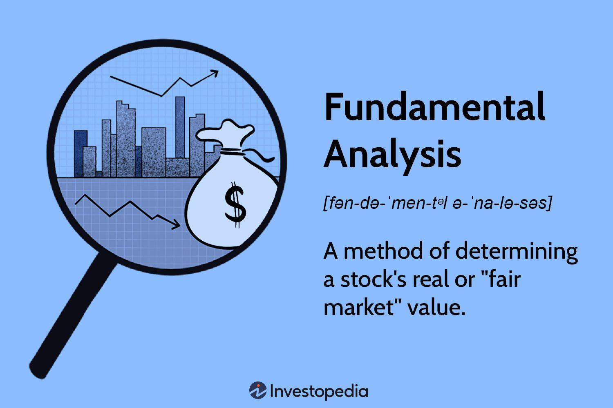

Algorithmic trading refers to the use of computer programs to execute trades based on pre-defined criteria. It is well-regarded for its speed and precision, significantly enhancing the efficiency of trading processes. One of the key pillars of successful algorithmic trading is the use of fundamental data. This type of data encompasses critical information about a company's financial health and market position. It includes earnings reports, dividends, corporate announcements, and financial statements. By offering insights into a company's intrinsic value, fundamental data becomes a valuable input for traders who design algorithms tailored to make informed trading decisions.

The integration of fundamental data into algorithmic trading enables the development of more sophisticated strategies that account for both quantitative financial metrics and qualitative market sentiment. Fundamental data can be leveraged to create algorithms that are capable of reacting to specific financial indicators, such as earnings momentum or changes in a company's financial outlook, thereby guiding more precise buy or sell decisions.



In this article, we examine how fundamental data is utilized within algorithmic trading. We will explore methods for accessing this data and various strategies that incorporate its use, addressing both the opportunities it presents and the challenges it poses for traders seeking to optimize their algorithmic strategies.

## Table of Contents

## Understanding Fundamental Data

Fundamental data encompasses a wide array of metrics and reports that offer a detailed view of a company's financial standing and operational performance. Key components of fundamental data include earnings reports, which outline a company's profitability over a specific period, dividends that indicate the portion of earnings distributed to shareholders, corporate announcements such as mergers or acquisitions that may affect future business operations, and financial statements including balance sheets, income statements, and cash flow statements that provide comprehensive information on financial health.

Fundamental data is distinct from technical data, which primarily focuses on market price and trading [volume](/wiki/volume-trading-strategy) metrics to evaluate trading patterns. Instead, fundamental data serves as a window into the intrinsic value of a security, providing an essential foundation for differentiating between undervalued and overvalued stocks. By analyzing fundamental data, traders can align their trading decisions with the actual economic value and potential of a company, rather than relying solely on historical market trends.

For instance, traders might use the Price-to-Earnings (P/E) ratio, a common fundamental metric, to determine if a stock is overvalued or undervalued relative to its earnings. The P/E ratio is calculated as:

$$
\text{P/E Ratio} = \frac{\text{Market Price per Share}}{\text{Earnings per Share (EPS)}}
$$

A comparison of a company's P/E ratio against industry standards or historical averages can suggest potential buy or sell actions.

Moreover, understanding a company's fundamentals enhances the development of trading strategies that integrate broader economic contexts and future business prospects, reducing the inherent risks associated with strategies purely based on historical price movements. For example, a thorough evaluation of a company's upcoming product releases or expansion plans can signal future profitability changes, allowing traders to forecast potential stock performance before corresponding price movements occur in the market.

Incorporating these insights, traders can construct more robust strategies that align investment moves with both present financial realities and anticipated market shifts, thus contributing to potentially more informed and profitable trading decisions.

## Role of Fundamental Data in Algorithmic Trading

Integrating fundamental data into [algorithmic trading](/wiki/algorithmic-trading) allows traders to create sophisticated strategies that incorporate a deep understanding of a company's financial health and their broader market sentiment. This integration provides a more nuanced approach compared to solely relying on technical indicators like price and volume.

Fundamental data, such as earnings reports, offers critical insights that can significantly influence market behavior. For example, strategies like earnings [momentum](/wiki/momentum) focus on trading stocks based on changes in earnings expectations. Earnings momentum strategies involve executing trades when a company's reported or expected earnings differ from previous periods or analyst forecasts. The basic premise is that stocks with increasing earnings expectations are likely to attract more investors, potentially driving the price up, while those with declining expectations could experience a price drop.

Algorithmic trading systems can be designed to automatically respond to fundamental news events, such as quarterly earnings announcements. These systems are often programmed to parse textual information or structured data feeds, identify relevant changes, and make trading decisions based on predefined criteria. For instance, an algorithm might be set to buy a stock if its earnings per share increase by a certain percentage compared to the previous quarter, or sell if the reported earnings fall short of market expectations.

An illustrative example of such a strategy could involve coding an algorithm in Python to react to earnings announcements. Using Python libraries such as `pandas` and `yfinance`, one could write a script to fetch the latest earnings data, compare it against analyst forecasts, and execute buy or sell orders accordingly. Here's a simplified pseudo-code example:

```python
import yfinance as yf  # For more datasets, visit: https://paperswithbacktest.com/datasets

# Define stocks and threshold for earnings surprise
stocks = ['AAPL', 'MSFT']
earnings_surprise_threshold = 0.05

for stock in stocks:
    data = yf.Ticker(stock)
    earnings_data = data.earnings
    actual_earnings = earnings_data['Actual']
    expected_earnings = earnings_data['Expected']

    # Calculate earnings surprise
    earnings_surprise = (actual_earnings - expected_earnings) / expected_earnings

    # Decide to buy or sell based on earnings surprise
    if earnings_surprise > earnings_surprise_threshold:
        print(f"Buy {stock}")
    elif earnings_surprise < -earnings_surprise_threshold:
        print(f"Sell {stock}")
```

Integrating fundamental data into algorithmic trading strategies offers the potential for more informed trading decisions. Through the systematic analysis of earnings surprises and other financial metrics, traders can develop algorithms designed to take advantage of these fundamental insights, potentially leading to more profitable outcomes.

## Accessing Fundamental Data

Platforms like `yfinance` have revolutionized the way traders interact with fundamental data, offering streamlined access to a wealth of financial information essential for crafting algorithmic trading strategies. This platform provides a simple interface to retrieve data on stocks, including historical prices, earnings reports, dividends, and more, all of which are integral to [fundamental analysis](/wiki/fundamental-analysis).

Traders typically utilize Python libraries in conjunction with `yfinance` to download and efficiently manage this data. The Python ecosystem is rich with tools that facilitate data handling, with Pandas being one of the most popular libraries for data manipulation due to its powerful data structures. By leveraging these tools, traders can create functions to automate the downloading, updating, and storage of data, thus maintaining a robust dataset for their algorithms.

One common practice is to store downloaded data in the HDF5 file format. HDF5 is a versatile data model that supports the creation, manipulation, and sharing of scientific data. Its ability to efficiently manage large datasets makes it particularly suitable for algorithmic traders who require quick access to comprehensive data. The hierarchical nature of HDF5 also allows for the organization of data in a way that mirrors its natural logical structure.

Maintaining up-to-date data is crucial for the success of trading algorithms. Traders often implement automated scripts to periodically check for new data, compare it with existing records, and update the datasets as necessary. This proactive approach ensures that their algorithms operate using the latest available information, which is critical for responding accurately to market dynamics.

The integration of such data practices not only enhances the performance of trading models but also facilitates more sophisticated analytical processes, enabling traders to focus on strategy development without being mired in data retrieval and management complexities.

## Challenges in Using Fundamental Data

Using fundamental data in algorithmic trading entails several challenges, primarily related to data compatibility and management. One significant challenge is ensuring compatibility and resolving naming convention conflicts, particularly when interfacing with databases like PyTables, which is often used to handle large datasets in trading systems. PyTables is a package for managing hierarchical datasets designed to efficiently and flexibly handle large amounts of data. Issues can arise when different data providers use varying naming conventions, leading to discrepancies that can affect data integration processes. It's crucial to establish a standardized naming system within the algorithmic trading framework to mitigate these inconsistencies.

Another challenge is the serialization of complex data types before storage. Serialization involves converting data into a format that can be easily stored and retrieved later. When dealing with fundamental data, which might include a wide array of financial metrics and corporate elements, it's important to structure this data efficiently. Careful data management practices are required to ensure that complex data types are serialized without loss of information or integrity. This might involve the use of structured data formats like JSON or binary formats such as Protocol Buffers, each offering different benefits in terms of readability and storage efficiency.

Implementing retry logic is essential for overcoming disruptions caused by network issues or API rate limits when downloading data. Algorithmic trading heavily relies on continuous and timely data feeds; any interruption can lead to inaccurate trade executions. Network issues might result in missed data packets, while API rate limits set by data providers could restrict the number of requests made within a given timeframe. To handle such scenarios, traders implement retry logic in their algorithms. 

For example, an implementation in Python might look like this:

```python
import requests
import time

def fetch_data_with_retry(url, retries=3, delay=5):
    for attempt in range(retries):
        try:
            response = requests.get(url)
            response.raise_for_status()
            return response.json()
        except requests.exceptions.RequestException as e:
            print(f"Attempt {attempt+1} Failed: {e}")
            time.sleep(delay)
    raise Exception("Max retries exceeded")

# Usage
data = fetch_data_with_retry("https://api.example.com/fundamental-data")
```

This logic retries the data fetch operation a specified number of times with a delay between each attempt, thereby increasing the reliability of data downloads even in the face of transient network issues or strict API constraints. By addressing these challenges, traders can more effectively harness fundamental data for algorithmic strategies, ensuring robust and resilient trading systems.

## Example: Using Fundamental Data for Algorithmic Strategies

A practical example of utilizing fundamental data in algorithmic strategies involves using earnings per share (EPS) growth as a signal for making buy or sell decisions. In this framework, the strategy might be configured to execute a 'buy' order when the EPS growth rate surpasses a specified threshold, signaling improved financial performance and potential upward price movement. Conversely, a 'sell' order could be triggered when the EPS growth falls below a certain limit, indicating potential underperformance.

To implement such a strategy, traders typically need to automate the monitoring of EPS growth data and integrate it into trading algorithms. For instance, a Python function might query EPS data from a financial database or API, evaluating whether the growth rate meets predefined criteria. The following pseudo-Python code illustrates this concept:

```python
def trading_signal(eps_growth, buy_threshold, sell_threshold):
    if eps_growth > buy_threshold:
        return 'buy'
    elif eps_growth < sell_threshold:
        return 'sell'
    else:
        return 'hold'

eps_growth = fetch_eps_growth(ticker='AAPL')
signal = trading_signal(eps_growth, buy_threshold=0.05, sell_threshold=0.02)
```

In this snippet, `fetch_eps_growth` would be a function designed to retrieve the latest EPS growth data for a given stock ticker. The `trading_signal` function then determines the trading action based on the growth rate compared to the pre-set thresholds.

Beyond calculation and decision-making, these strategies necessitate robust [backtesting](/wiki/backtesting) to evaluate their effectiveness across various market conditions. This involves simulating the strategy using historical data to assess potential returns and risks. Through backtesting, traders can optimize their algorithms by adjusting parameters like the buy/sell thresholds, ensuring that the strategy can adapt to different market environments.

Backtesting might employ libraries such as `pandas` for data manipulation and `numpy` for numerical operations, providing a comprehensive view of the strategy's historical performance. An example implementation might look like the following:

```python
import numpy as np
import pandas as pd

def backtest_strategy(price_data, eps_data, buy_threshold, sell_threshold):
    trades = []
    for date, eps in eps_data.iterrows():
        eps_growth = eps['growth']
        price = price_data.loc[date, 'close_price']
        action = trading_signal(eps_growth, buy_threshold, sell_threshold)
        trades.append({'date': date, 'action': action, 'price': price})

    # Calculate performance metrics
    performance = calculate_performance(trades)
    return performance

# Example usage
price_data = pd.DataFrame(...)  # Load price data
eps_data = pd.DataFrame(...)    # Load EPS data
performance = backtest_strategy(price_data, eps_data, 0.05, 0.02)
```

By adopting a systematic approach incorporating EPS growth and ensuring rigorous testing, traders can leverage fundamental data to create algorithmic trading strategies that are not solely dependent on technical indicators, potentially leading to more informed and profitable trading decisions.

## Conclusion

Incorporating fundamental data into algorithmic trading strategies provides traders with a more holistic view of the market, potentially leading to more informed and profitable trades. Fundamental data, such as earnings reports and financial statements, enhances the ability of algorithms to evaluate intrinsic stock values, thereby informing more strategic decision-making. 

The integration of this data into trading algorithms is becoming increasingly feasible due to advancements in software and data accessibility. With platforms like `yfinance`, traders have convenient access to comprehensive datasets, supporting the efficient assimilation of fundamental data in their strategies. These advancements reduce entry barriers and allow for the development of more sophisticated trading systems that can process and analyze vast quantities of data in real-time.

Further, leveraging tools like Python enables the manipulation and analysis of fundamental data with greater flexibility and precision. Python libraries facilitate the downloading, storing, and updating of financial data, addressing traditional challenges associated with data serialization, compatibility, and retrieval. For instance, traders can automate processes to ensure their algorithms operate with current data, enhancing responsiveness to market changes.

By harnessing the power of such technologies, traders can effectively integrate fundamental data into algorithmic frameworks, enhancing the accuracy and efficacy of trading strategies. This enables a deeper understanding of market dynamics and lays the groundwork for achieving consistent trading success.

## References & Further Reading

[1]: ["Advances in Financial Machine Learning"](https://www.amazon.com/Advances-Financial-Machine-Learning-Marcos/dp/1119482089) by Marcos Lopez de Prado

[2]: ["Machine Learning for Algorithmic Trading"](https://github.com/PacktPublishing/Machine-Learning-for-Algorithmic-Trading-Second-Edition) by Stefan Jansen

[3]: ["Quantitative Trading: How to Build Your Own Algorithmic Trading Business"](https://books.google.com/books/about/Quantitative_Trading.html?id=j70yEAAAQBAJ) by Ernest P. Chan

[4]: ["Evidence-Based Technical Analysis: Applying the Scientific Method and Statistical Inference to Trading Signals"](https://www.amazon.com/Evidence-Based-Technical-Analysis-Scientific-Statistical/dp/0470008741) by David Aronson

[5]: Bergstra, J., Bardenet, R., Bengio, Y., & Kégl, B. (2011). ["Algorithms for Hyper-Parameter Optimization."](https://proceedings.neurips.cc/paper/2011/file/86e8f7ab32cfd12577bc2619bc635690-Paper.pdf) Advances in Neural Information Processing Systems 24.

[6]: Hougan, M., & Borović, D. (2018). ["Algorithmic Trading: The $342 Billion Dollar Opportunity."](https://brookespublishing.com/fundamentals-of-literacy-instruction-assessment/) CFA Institute.

[7]: Jagerson, J., & Hansen, W. (2011). ["All About Investing in Gold."](https://www.mhebooklibrary.com/doi/book/10.1036/9780071768351) McGraw-Hill Education.