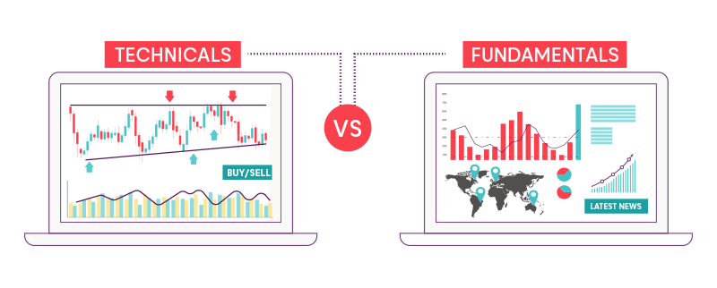

## Table of Contents

## What is fundamental trading?

Fundamental trading is a way of investing in stocks by looking at the basic financial health and performance of a company. Instead of guessing which way the stock price will move next, fundamental traders study things like how much money the company is making, how much debt it has, and how well it's growing. They use this information to decide if a stock is a good buy or if it's overpriced.

By understanding the company's fundamentals, traders can make more informed decisions about whether to buy, hold, or sell a stock. For example, if a company is making more profit and growing quickly, its stock might be a good investment. On the other hand, if a company is losing money and has a lot of debt, its stock might not be a good choice. Fundamental trading helps investors focus on the long-term value of a company rather than short-term price changes.

## How does fundamental trading differ from technical trading?

Fundamental trading and technical trading are two different ways to decide whether to buy or sell stocks. Fundamental trading looks at the actual health of a company. Traders who use this method study things like how much money the company makes, its debts, and how fast it's growing. They want to know if the company is doing well and if its stock is a good value. For example, if a company is making more profit and growing, a fundamental trader might think its stock is a good buy.

Technical trading, on the other hand, doesn't care about the company's health. Instead, it focuses on the stock's price movements and patterns. Technical traders use charts and graphs to spot trends and predict where the stock price might go next. They believe that all the information they need is in the price history of the stock. For example, if a stock's price has been going up and up, a technical trader might decide to buy it, hoping the trend will continue.

In short, fundamental trading is about understanding the company, while technical trading is about understanding the stock's price movements. Both methods have their own fans, and some traders even use a mix of both to make their decisions.

## What are the key financial statements used in fundamental analysis?

The main financial statements used in [fundamental analysis](/wiki/fundamental-analysis) are the income statement, the balance sheet, and the cash flow statement. The income statement shows how much money a company made and spent over a period of time, like a year or a quarter. It tells you if the company made a profit or a loss by showing its revenues, costs, and expenses. This helps investors see if the company is good at making money.

The balance sheet is like a snapshot of what the company owns and owes at a specific point in time. It lists the company's assets, like cash and equipment, and its liabilities, like loans and debts. By looking at the balance sheet, investors can see if the company has enough assets to cover its debts and how healthy its finances are.

The cash flow statement tracks the actual cash coming in and going out of the company. It shows how the company is managing its cash from its main business activities, investments, and financing. This statement is important because it shows if the company can pay its bills and if it's generating enough cash to grow. Together, these three statements give a full picture of the company's financial health, which is crucial for fundamental analysis.

## What ratios and metrics are important for evaluating a company's financial health?

When looking at a company's financial health, some key ratios and metrics to consider are the price-to-earnings (P/E) ratio, the debt-to-equity ratio, and the return on equity (ROE). The P/E ratio tells you how much investors are willing to pay for each dollar of the company's earnings. A high P/E might mean the stock is expensive or that people expect the company to grow a lot. The debt-to-equity ratio shows how much the company relies on borrowed money compared to money from shareholders. A high ratio can mean the company is risky because it has a lot of debt. ROE measures how well the company is using the money shareholders have invested to make a profit. A higher ROE is usually better.

Other important metrics include the current ratio and the gross profit margin. The current ratio shows if the company can pay its short-term bills by comparing its current assets to its current liabilities. A ratio above 1 means the company should be able to cover its short-term debts. The gross profit margin tells you how much money the company keeps from each dollar of sales after paying for the cost of goods sold. A higher margin means the company is good at making money from its products or services. By looking at these ratios and metrics, investors can get a good idea of how healthy a company is and if it's a good investment.

## How do macroeconomic factors influence fundamental trading?

Macroeconomic factors like interest rates, inflation, and economic growth can have a big impact on fundamental trading. When these factors change, they can affect how well a company does and how much its stock is worth. For example, if interest rates go up, it can be harder for companies to borrow money, which might slow down their growth. If inflation goes up, it can make things more expensive for companies, which can cut into their profits. And if the economy is growing, more people might buy the company's products or services, which can help the company make more money.

Fundamental traders need to keep an eye on these macroeconomic factors because they can change the big picture for a company. If the economy is doing well, a company's stock might look like a good buy. But if the economy is struggling, even a good company might have a hard time, and its stock might not be a good investment. By understanding how these big economic forces work, fundamental traders can make better decisions about which stocks to buy, hold, or sell.

## What is the significance of a company's management team in fundamental analysis?

A company's management team is really important when you're doing fundamental analysis. The people running the company can make a big difference in how well it does. Good managers can help the company grow, make smart decisions, and keep things running smoothly. They can also come up with new ideas and ways to make more money. If the management team is strong, it can make the company a better investment.

On the other hand, if the management team isn't doing a good job, it can hurt the company. Bad decisions, like spending too much money or not growing the business, can make the company's stock less valuable. When you're looking at a company's financial health, you should also think about who is in charge and how well they're doing their job. A good management team can be a big plus for a company's future.

## How can industry analysis enhance fundamental trading strategies?

Industry analysis can help fundamental traders make better decisions by giving them a bigger picture of the market. When you look at the whole industry, you can see which companies are doing well and which ones are struggling. This can help you pick the best companies to invest in. For example, if the tech industry is growing fast, a tech company with good fundamentals might be a good investment. But if the industry is shrinking, even a company with good numbers might not be a good choice.

Understanding the industry also helps traders see what's coming next. They can spot trends and changes that might affect the companies they're looking at. For instance, if a new law is going to change how an industry works, it could hurt some companies and help others. By knowing about these things, traders can make smarter choices about which stocks to buy or sell. This way, they can be ready for what might happen and make the most of their investments.

## What are the common valuation methods used in fundamental trading?

In fundamental trading, one common way to figure out if a stock is a good buy is by using the price-to-earnings (P/E) ratio. This method compares the stock's price to how much money the company makes. If the P/E ratio is low, it might mean the stock is a good deal because you're paying less for each dollar of earnings. But if the P/E ratio is high, the stock might be expensive. Another way is the discounted cash flow (DCF) method, which looks at how much money the company will make in the future and then figures out what that money is worth today. This helps traders see if the stock's current price is fair based on what the company might earn later.

Another popular valuation method is the price-to-book (P/B) ratio, which compares the stock's price to the company's net assets. If the P/B ratio is less than 1, it might mean the stock is undervalued because you're paying less than the company's assets are worth. The dividend discount model (DDM) is also used, especially for companies that pay dividends. This method adds up the value of all future dividends to see if the stock is a good buy. By using these different methods, fundamental traders can get a better idea of whether a stock is priced right and make smarter investment choices.

## How do you identify undervalued and overvalued stocks using fundamental analysis?

To find undervalued stocks using fundamental analysis, you look at the company's financial health and compare it to its stock price. You might use the price-to-earnings (P/E) ratio to see if the stock is cheap compared to how much money the company makes. If the P/E ratio is lower than the industry average or the company's historical average, the stock might be undervalued. Another way is to use the price-to-book (P/B) ratio. If the P/B ratio is less than 1, it means you're paying less for the stock than the company's assets are worth, which could mean the stock is a good deal. You can also use the discounted cash flow (DCF) method to see if the stock's price is lower than the value of the company's future earnings.

To spot overvalued stocks, you do the opposite. You look for stocks with high P/E ratios compared to the industry or the company's own history, which might mean the stock is too expensive for the money the company is making. A high P/B ratio can also show that the stock is overvalued because you're paying more for the stock than the company's assets are worth. Using the DCF method, if the stock's price is higher than the value of the company's future earnings, it might be overvalued. By comparing these ratios and methods to industry standards and historical data, you can figure out if a stock is priced too high or too low.

## What role does qualitative analysis play in fundamental trading?

Qualitative analysis is a big part of fundamental trading because it looks at things you can't measure with numbers. It's about understanding the company's story, like its brand, the people who run it, and how it fits into the world. For example, a company might have a great product that people love, or it might be led by a CEO who has a good track record. These things can make the company more valuable, even if the numbers don't show it right away. By looking at these qualitative factors, traders can get a fuller picture of the company and make better decisions about whether to invest.

Qualitative analysis also helps traders see what might happen in the future. Things like new technology, changes in what customers want, or new laws can affect how well a company does. If a company is ready for these changes, it might be a good investment. On the other hand, if a company is stuck in the past, it might not do well even if its numbers look good now. By thinking about these qualitative factors, traders can spot opportunities and risks that numbers alone might miss. This helps them pick stocks that have a good chance of doing well over time.

## How can fundamental traders use earnings reports to make informed decisions?

Fundamental traders can use earnings reports to learn a lot about a company's health. An earnings report shows how much money a company made and spent over a certain time, like a quarter or a year. By looking at these reports, traders can see if the company is making more profit, growing its business, or if it's struggling. They can compare the numbers to what the company said it would do and what other companies in the same industry are doing. If a company's earnings are better than expected, it might mean the stock is a good buy because the company is doing well.

Earnings reports also help traders see trends and predict what might happen next. For example, if a company's earnings keep going up, it might mean the company is on a good path and its stock could go up too. But if earnings are going down, it might be a sign that the company is having problems and the stock could go down. By looking at the details in the earnings report, like how much the company is spending on research or how it's managing its debt, traders can make smarter choices about whether to buy, hold, or sell the stock.

## What advanced techniques can be applied to improve the accuracy of fundamental analysis?

One advanced technique to improve the accuracy of fundamental analysis is to use more detailed financial models. Instead of just looking at simple ratios like the P/E ratio, traders can build complex models that take into account many different factors. These models can predict how a company's earnings might change in the future based on things like economic trends, industry changes, and the company's own plans. By using these detailed models, traders can get a better idea of what a stock is really worth and make more accurate predictions about its future performance.

Another technique is to combine fundamental analysis with other types of analysis, like technical analysis or sentiment analysis. Technical analysis looks at stock price patterns and trends, while sentiment analysis looks at what people are saying about a company on social media or in the news. By using all these different types of analysis together, traders can get a fuller picture of a stock. This can help them spot opportunities that they might miss if they only looked at the numbers. For example, if the numbers say a stock is undervalued but the sentiment is very negative, it might be a sign to be careful. By using these advanced techniques, traders can make more informed and accurate decisions.

## References & Further Reading

[1]: Damodaran, A. (2012). ["Investment Valuation: Tools and Techniques for Determining the Value of Any Asset."](https://www.wiley.com/en-us/Investment+Valuation%3A+Tools+and+Techniques+for+Determining+the+Value+of+Any+Asset%2C+3rd+Edition-p-9781118206560) Wiley.

[2]: Chan, E. P. (2009). ["Quantitative Trading: How to Build Your Own Algorithmic Trading Business."](https://github.com/ftvision/quant_trading_echan_book) Wiley.

[3]: Lopez de Prado, M. (2018). ["Advances in Financial Machine Learning."](https://www.amazon.com/Advances-Financial-Machine-Learning-Marcos/dp/1119482089) Wiley.

[4]: Aronson, D. R. (2006). ["Evidence-Based Technical Analysis: Applying the Scientific Method and Statistical Inference to Trading Signals."](https://www.amazon.com/Evidence-Based-Technical-Analysis-Scientific-Statistical/dp/0470008741) Wiley.

[5]: Jansen, S. (2020). ["Machine Learning for Algorithmic Trading: Explore Intuitive Algorithms and Data-Driven Finance for Deriving Market Insights with Python."](https://www.usatoday.com/story/news/politics/elections/2024/10/18/donald-trump-election-interference-case-new-evidence/75714784007/) Packt Publishing.