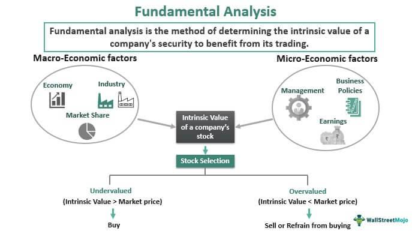

In the fast-paced world of investing, various strategies and trading types play crucial roles for traders and investors. This article focuses specifically on fundamental trading and algorithmic trading, two prominent methodologies in financial markets.

Fundamental trading revolves around assessing a company’s financial health and key events. Investors analyze earnings reports, stock splits, mergers, and other corporate activities to determine a stock's intrinsic value. This analysis helps in making informed decisions about long-term investments. Fundamental traders look beyond market fluctuations, emphasizing a stock's potential based on its fiscal performance and underlying value.



On the other hand, algorithmic trading leverages automated systems to execute trades at high speeds, based on predefined criteria. This approach utilizes computer algorithms to capitalize on short-term market movements, often exploiting inefficiencies not easily apparent to human traders. Algorithmic trading is characterized by systematic trade execution, which mitigates emotional biases and enables traders to handle large volumes effectively.

Understanding these strategies is imperative for investors aiming to enhance their financial returns. By recognizing the unique attributes and applications of fundamental and algorithmic trading, investors can make more informed decisions tailored to their financial objectives and risk tolerance. This article will further discuss these compelling investment methodologies, highlighting their individual characteristics and implications for modern trading.

## Table of Contents

## Understanding Investment Strategies

Investment strategies are comprehensive plans formulated by individuals or firms to allocate their assets with the aim of enhancing financial returns. These strategies encompass a broad spectrum of methodologies, each with varying levels of complexity and risk, tailored to meet specific financial goals and preferences. At the core, an investment strategy dictates how and where resources will be allocated, balancing risk and return to achieve desired financial outcomes.

Investment strategies can vary from basic stock [picking](/wiki/asset-class-picking), which involves selecting individual stocks perceived to have growth potential, to employing intricate financial instruments such as derivatives. Stock picking relies heavily on assessing a company's performance, potential market conditions, and other qualitative factors. Conversely, derivatives involve contracts whose value is derived from underlying assets, such as options and futures, and they require a thorough understanding of market dynamics and risk management.

Each investment strategy carries its own risk profile and potential for return. For example, a conservative strategy focused on bonds might offer lower returns with minimal risk, whereas aggressive strategies leveraging high-[volatility](/wiki/volatility-trading-strategies) stocks or derivatives could yield significant returns accompanied by heightened risk. Understanding the distinct attributes and implications of each strategy is essential for effective financial planning. This understanding helps investors match strategies with their risk tolerance, investment horizon, and financial goals.

Fundamental and [algorithmic trading](/wiki/algorithmic-trading) are two prominent yet distinct approaches within the broader landscape of investment strategies, each with unique methodologies and purposes. Fundamental trading is grounded in analyzing a company’s core financial indicators such as earnings, revenue, and economic conditions to determine its intrinsic value. It emphasizes long-term growth and stability by considering macroeconomic factors, industry trends, and company-specific events. In contrast, algorithmic trading uses computer algorithms to make swift, data-driven trading decisions based on predefined criteria. These algorithms can execute large orders at high speed, exploiting short-lived market inefficiencies and often minimizing human error.

While fundamental and algorithmic trading differ in approach—one focusing on exhaustive research and analysis, and the other on speed and precision—some investors integrate elements of both. This hybrid approach allows for strategic flexibility, potentially capturing the benefits of long-term market insights alongside the advantages of rapid execution and data analysis, thus optimizing portfolio performance and managing risks innovatively.

## Different Types of Trading

Trading strategies are essential tools employed by market participants to capitalize on price movements and other financial opportunities. Several types of trading strategies exist, each distinguished by its specific approach and analytical tools. Below are some of the most prevalent trading strategies:

### Scalping
Scalping is a high-frequency trading strategy that involves making numerous small trades within a single day to capitalize on minute price fluctuations. Traders who employ this strategy aim for quick profits and hold positions for a very short time, ranging from seconds to minutes. This approach demands significant skill in executing trades swiftly and understanding market depth. Scalpers require powerful trading platforms and low-latency access to market data to be successful. The potential profits per trade are typically small, but the cumulative gains over many trades can be substantial.

### Momentum Trading
Momentum trading is based on the concept that securities that have exhibited strong performance in the past will continue to do so in the near future. Traders utilizing this strategy identify securities showing upward price trends and attempt to capture gains as [momentum](/wiki/momentum) continues. This approach requires traders to adeptly analyze price trends, [volume](/wiki/volume-trading-strategy) data, and other market indicators to ensure timely entry and [exit](/wiki/exit-strategy). Successful momentum traders often employ trend-following tools, such as moving averages or the Relative Strength Index (RSI), to confirm momentum shifts.

### Technical Trading
Technical trading involves analyzing statistical trends gathered from trading activity, such as price movement and volume. Technical traders rely on charts and various technical indicators to predict future price movements, irrespective of a company's fundamental attributes. This strategy assumes that all market information is already reflected in the price, and patterns can be identified and exploited. Familiar tools include Bollinger Bands, MACD (Moving Average Convergence Divergence), and candlestick patterns.

### Swing Trading
Swing trading is a strategy that targets capturing gains in a stock (or any financial instrument) over a few days to several weeks. Unlike scalpers, swing traders hold positions longer but also aim to profit from short- to medium-term price movements. This strategy involves identifying "swings" in stocks, i.e., upward or downward price movements, using various technical analysis techniques. Swing traders often look for patterns such as flags, channels, and head-and-shoulders to guide their trading decisions.

### Choosing a Trading Style
Selecting the appropriate trading style is crucial for success and hinges significantly on various factors, including an individual's financial goals, risk tolerance, and available time commitment. For instance, [scalping](/wiki/gamma-scalping) may be suited for those looking for immediate, albeit small, returns and can dedicate significant time to trade actively. Conversely, swing trading may appeal to those who prefer holding positions longer while capitalizing on broader price trends.

Ultimately, the choice of trading style should align with one's personal financial objectives and align with their ability to manage risk. Understanding market behavior and trends is essential, and traders often experiment with multiple styles to discover which best suits their needs and circumstances.

## Fundamental Trading

Fundamental trading involves making informed trading decisions by analyzing specific events and financial data related to individual companies. This method focuses primarily on evaluating the intrinsic value of a stock, which is derived from comprehensive research and analysis of various factors that can influence a company's future performance.

Key factors that traders consider in fundamental trading include earnings announcements, stock splits, and analyst upgrades. Earnings announcements, which occur quarterly for publicly traded companies, provide crucial insights into a company’s profitability, revenue growth, and financial health. A positive earnings announcement often leads to an increase in the company's stock price, whereas a disappointing announcement might result in a decline.

Similarly, stock splits can impact investor perception and stock [liquidity](/wiki/liquidity-risk-premium). Although a stock split does not directly alter a company’s market value, it does increase the number of shares available, potentially making the stock more accessible to investors and enhancing its attractiveness.

Analyst upgrades and downgrades also play a significant role. Analysts evaluate various aspects of a company's performance and provide recommendations that can influence investor behavior. An upgrade might suggest stronger future performance, increasing investor confidence and demand for the stock.

Fundamental analysis is central to fundamental trading, providing the tools to assess a stock’s value based on financial statements, management effectiveness, industry conditions, and broader economic factors. This analysis often involves calculating ratios such as the price-to-earnings (P/E) ratio or the return on equity (ROE) to gauge a company's profitability and market position.

In the context of long-term investment strategies, fundamental trading offers a robust framework for evaluating a company's potential for growth and sustainability. It requires extensive research and the ability to interpret complex financial data, but for those who master it, this approach can provide significant insights into which stocks are likely to thrive over time. 

Overall, fundamental trading leverages detailed research and analysis to identify undervalued stocks, enabling traders to make strategic investments aimed at achieving substantial long-term returns.

## Algorithmic Trading

Algorithmic trading involves the use of computer programs to execute trading orders with minimal human intervention. This methodology enables traders to take advantage of short-term market inefficiencies, executing trades at speeds and frequencies impossible for human traders. At its core, algorithmic trading relies on predefined criteria, which can include timing, price, quantity, or any mathematical model.

The systematic nature of algorithmic trading eliminates emotional bias from trading decisions, ensuring all trades follow a consistent strategy. Algorithms are particularly adept at exploiting small price discrepancies in the market, often resulting in trades being executed within milliseconds. High-frequency trading ([HFT](/wiki/high-frequency-trading-strategies)) is a subset of algorithmic trading where trading firms use algorithms to execute a large number of orders in extremely short periods, capitalizing on these fleeting market opportunities.

Common strategies in algorithmic trading include:

1. **Trend-Following**: This strategy involves developing algorithms that detect and follow market trends. By analyzing historical price data, these algorithms predict continuing trends and execute trades accordingly. Moving averages and channel breakouts are typical technical indicators used in trend-following strategies.

2. **Arbitrage**: Algorithms used for arbitrage exploit price differences of identical or similar financial instruments on different markets or in different forms. For example, an algorithm might buy a stock on one exchange where the price is lower and sell it on another where the price is higher, thus taking advantage of the price differential.

3. **Statistical Modeling**: This strategy uses mathematical models to identify and forecast the probability of various market conditions and price movements. By employing statistical methods, algorithms can predict stock movements and execute trades aimed at profiting from these predictions.

Algorithmic trading systems require sophisticated technical infrastructure to function effectively. Key components include:

- **Hardware and Network Infrastructure**: To minimize latency, high-performance servers and fast network connections are crucial, especially for high-frequency trading. Lower latency enables quicker execution of trades, which is often pivotal in capturing small arbitrage opportunities or reacting to market changes before competitors.

- **Access to Quality Data**: Algorithms need access to high-quality, real-time data for markets they operate in. This data must be processed promptly to make informed trading decisions. Therefore, data feeds that offer live updates on price changes, market news, and economic indicators are indispensable.

- **Programming and Development Tools**: Languages such as Python, C++, and Java are commonly used to develop trading algorithms. Python is often preferred for its simplicity and the extensive libraries it offers for statistical analysis and machine learning.

The initial costs of engaging in algorithmic trading are generally high due to the need for complex infrastructure and development resources. However, once set up, these systems can operate with minimal oversight, continuously scanning markets and executing trades as per the coded logic. Despite the benefits, algorithmic trading carries risks, such as potential technical failures or the miscalibration of algorithms, which could lead to significant financial losses. Nonetheless, with careful planning and rigorous testing, algorithmic trading presents an effective method to achieve high trading efficiency and optimize market strategies.

## Combining Approaches

Combining fundamental and algorithmic trading strategies can offer a balanced approach that takes advantage of both detailed, long-term analysis and rapid, precise execution. This hybrid methodology merges traditional financial analysis methods with advanced technological tools. By integrating [fundamental analysis](/wiki/fundamental-analysis) with algorithmic execution, traders can benefit from a comprehensive view of market opportunities while maintaining the ability to respond quickly to market changes.

Incorporating elements of fundamental analysis, such as evaluating a company’s intrinsic value, allows traders to identify assets with strong growth prospects. This assessment is typically based on financial metrics like earnings per share (EPS), price-to-[earning](/wiki/earning-announcement) ratio (P/E), and return on equity (ROE). Integrating these insights into an algorithmic trading framework can automate the execution of trades, ensuring that decisions aligned with fundamental principles are implemented swiftly and efficiently.

For instance, an algorithm can be designed to buy a stock when its price falls below its estimated intrinsic value by a predetermined margin, suggesting an undervalued opportunity. A sample Python script to execute this strategy might look like:

```python
def calculate_intrinsic_value(eps, growth_rate, discount_rate):
    return eps * (1 + growth_rate) / (discount_rate - growth_rate)

stock_intrinsic_value = calculate_intrinsic_value(eps=2.5, growth_rate=0.05, discount_rate=0.10)

def trading_decision(stock_price, intrinsic_value):
    if stock_price < intrinsic_value:
        return "Buy"
    else:
        return "Hold"

stock_price = 20
decision = trading_decision(stock_price, stock_intrinsic_value)
print(f"Trading Decision: {decision}")
```

In this code, the intrinsic value is calculated using a simple model that considers earnings per share and growth rates. The algorithm makes a buy decision if the current stock price is below the intrinsic value.

The hybrid approach requires careful planning and execution strategies that adapt to both the analytical results from fundamental analysis and the technical execution capabilities of algorithmic trading. This blend is not without challenges; it requires sophisticated infrastructure, continual refinement of algorithms, and a deep understanding of both analytical disciplines. When executed effectively, however, it can yield enhanced returns and support diversified risk management by leveraging the thoroughness of fundamental insight and the efficiency of algorithmic strategies. 

Thus, combining these methodologies can provide a robust framework for traders seeking to optimize their investment strategies by balancing the long-term insights of fundamental analysis with the agility of algorithmic execution.

## Advantages and Challenges

Each trading strategy comes with its own set of advantages and challenges, requiring traders to weigh these aspects carefully before choosing a path.

Fundamental trading offers the benefit of providing a deep understanding of a company's health and potential for long-term viability. By focusing on core elements such as financial statements, management quality, and industry position, fundamental traders can estimate the intrinsic value of a stock. This approach can lead to long-term gains by identifying undervalued companies poised for future growth. However, a significant challenge is its inability to swiftly respond to rapid market fluctuations. Since fundamental analysis primarily considers long-term factors, it might miss out on short-term trading opportunities and sudden market changes driven by macroeconomic events or investor sentiment shifts.

Algorithmic trading, conversely, excels through its speed and precision, executing trades at lightning-fast speeds while minimizing human emotion's role in trading decisions. This approach can exploit short-term market inefficiencies and take advantage of high-frequency trading opportunities that manual trading cannot match. Nonetheless, algorithmic trading also presents challenges, particularly concerning technical risks. There is a possibility of algorithmic errors, such as coding mistakes, which can lead to significant financial losses. Additionally, the reliance on sophisticated infrastructure and continuous access to high-quality market data can incur substantial costs. Algorithms must be backtested thoroughly to ensure reliability and effectiveness across different market scenarios.

In essence, both fundamental and algorithmic trading demand in-depth knowledge and painstaking research. Fundamental trading requires a deep comprehension of business operations and the ability to interpret various financial metrics. Algorithmic trading, on the other hand, demands proficiency in programming and a strong grasp of statistical models to develop and implement strategies effectively. Rigorous testing and iteration are vital in both methodologies to optimize performance and mitigate risks, ensuring that chosen strategies align with the trader's financial goals and risk tolerance.

## Conclusion

Investment strategies, particularly fundamental trading and algorithmic trading, present diverse paths toward achieving financial success. Each method offers unique benefits well-suited to different market conditions and investor preferences. Adopting a strategic approach and continually refining trading techniques are essential for navigating the complexities of market dynamics. 

Fundamental trading emphasizes an in-depth analysis of a company’s financial health and market position, providing a robust foundation for long-term investment strategies. By understanding key financial indicators, such as price-to-earnings ratios and earnings per share, investors can make informed decisions grounded in a company’s intrinsic value. In contrast, algorithmic trading leverages technology for speed and precision, allowing traders to exploit short-term market inefficiencies. The use of complex algorithms, often driven by statistical models and [machine learning](/wiki/machine-learning), ensures that trades are executed optimally without the clouding effects of human emotions.

As technology continues to evolve, the landscape of investing is transformed, emphasizing the importance of staying informed and adapting to new tools. Modern advancements in computational power and data analytics provide vast opportunities for innovation within trading strategies. This technological progression underscores the necessity for traders to remain agile, embracing cutting-edge techniques that enhance their decision-making processes.

Ultimately, the choice of an investment strategy relies heavily on individual goals, risk appetite, and investment horizon. Investors with a long-term focus may gravitate towards fundamental trading, valuing its emphasis on intrinsic worth and stability. Conversely, those with a tolerance for short-term volatility might prefer algorithmic trading, capitalizing on its capacity for rapid responsiveness. By aligning their strategy with personal objectives and market understanding, investors can better position themselves for financial success, irrespective of market conditions.

## References & Further Reading

[1]: Damodaran, A. (2012). ["Investment Valuation: Tools and Techniques for Determining the Value of Any Asset."](https://www.wiley.com/en-us/Investment+Valuation%3A+Tools+and+Techniques+for+Determining+the+Value+of+Any+Asset%2C+3rd+Edition-p-9781118206560) Wiley.

[2]: Chan, E. P. (2009). ["Quantitative Trading: How to Build Your Own Algorithmic Trading Business."](https://github.com/ftvision/quant_trading_echan_book) Wiley.

[3]: Lopez de Prado, M. (2018). ["Advances in Financial Machine Learning."](https://www.amazon.com/Advances-Financial-Machine-Learning-Marcos/dp/1119482089) Wiley.

[4]: Aronson, D. R. (2006). ["Evidence-Based Technical Analysis: Applying the Scientific Method and Statistical Inference to Trading Signals."](https://www.amazon.com/Evidence-Based-Technical-Analysis-Scientific-Statistical/dp/0470008741) Wiley.

[5]: Jansen, S. (2020). ["Machine Learning for Algorithmic Trading: Explore Intuitive Algorithms and Data-Driven Finance for Deriving Market Insights with Python."](https://www.usatoday.com/story/news/politics/elections/2024/10/18/donald-trump-election-interference-case-new-evidence/75714784007/) Packt Publishing.