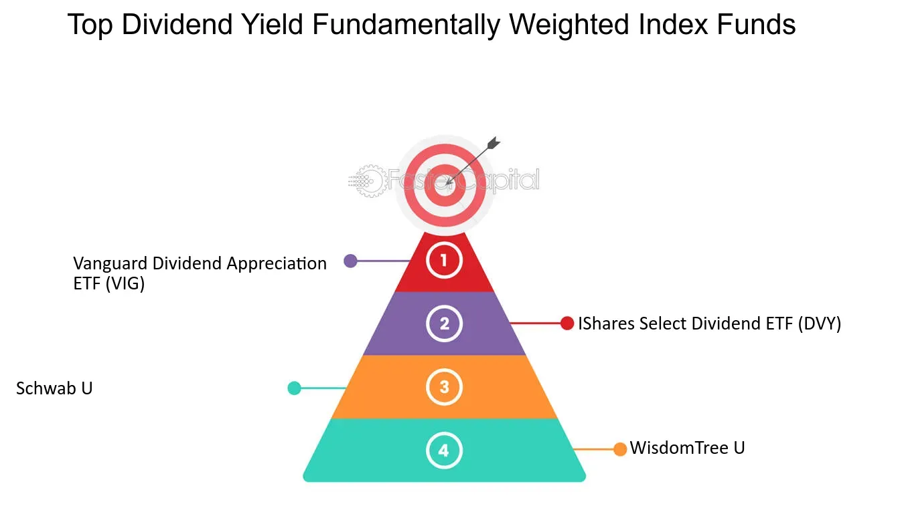

## Table of Contents

## What is fundamentally weighted index investing?

Fundamentally weighted index investing is a way to invest in a group of stocks where the amount you invest in each stock is based on certain financial measures of the company, not just its market price. Instead of putting more money into stocks that have higher prices, you put more money into stocks based on things like the company's earnings, dividends, or the total value of its assets. This method tries to focus more on the actual value of a company rather than how popular it is in the stock market.

This approach is different from traditional index investing, where the amount invested in each stock is based on its market capitalization, or the total market value of the company's outstanding shares. In a fundamentally weighted index, if a company is doing well financially but its stock price is low, it might get a bigger share of your investment. This can potentially lead to better long-term returns because you're investing more in companies that are fundamentally strong, even if they are not currently favored by the market.

## How does fundamentally weighted index investing differ from traditional market-cap weighted index investing?

Fundamentally weighted index investing and traditional market-cap weighted index investing are two different ways to pick stocks for an investment portfolio. In traditional market-cap weighted index investing, the amount of money you put into each stock depends on how much the company is worth in the stock market. This means bigger companies, which have higher stock prices, get more of your money. It's like saying, "I'll invest more in this company because its stock price is high."

On the other hand, fundamentally weighted index investing looks at different things to decide how much to invest in each stock. Instead of focusing on the stock price, it looks at how well the company is doing based on things like how much money it makes, how much it pays out in dividends, or the total value of what it owns. So, if a company is doing really well but its stock price is low, you might put more money into that company. This way, you're trying to invest more in companies that are strong and healthy, even if they're not the most popular in the stock market right now.

Both methods have their own way of trying to make money for investors. Market-cap weighted indexes are easier to understand and follow because they just go with the flow of the market. Fundamentally weighted indexes, however, try to find value in places the market might be overlooking, which could lead to better returns if those undervalued companies start to do better.

## What are the key metrics used in fundamentally weighted indexes?

Fundamentally weighted indexes use different measures to decide how much to invest in each company. These measures are called key metrics, and they help show how strong a company is. Some common metrics are earnings, which is the money a company makes after paying all its bills. Another is dividends, which is the money a company pays to its shareholders. A third metric is the book value, which is the total value of everything the company owns minus what it owes.

These metrics are important because they give a clearer picture of a company's health than just looking at its stock price. For example, if a company has high earnings but a low stock price, a fundamentally weighted index might put more money into that company. This is different from a market-cap weighted index, which would put more money into a company just because its stock price is high. By focusing on these key metrics, fundamentally weighted indexes try to find good companies that might be undervalued by the market.

## What are the potential benefits of using a fundamentally weighted index strategy?

Using a fundamentally weighted index strategy can help you find good companies that the stock market might not be paying attention to. Instead of just looking at how much a company's stock costs, this strategy looks at how much money the company makes, how much it pays out to shareholders, and what it owns. If a company is doing well but its stock price is low, you might put more money into that company. This can be a smart way to invest because you're focusing on the real value of a company, not just how popular it is.

Another benefit is that fundamentally weighted indexes might give you better returns over time. Because they focus on strong companies, even if they're not the biggest or most well-known, you could end up with more money in the long run. This strategy tries to avoid the problem of putting too much money into companies just because they have high stock prices, which can happen with market-cap weighted indexes. By looking at the fundamentals, you're trying to build a portfolio that grows steadily and safely.

## Can you explain the process of constructing a fundamentally weighted index?

To build a fundamentally weighted index, you start by [picking](/wiki/asset-class-picking) a group of companies you want to invest in. This could be all the companies in a certain market or just a specific group, like technology companies. Once you have your list, you look at each company's financial health using key metrics like earnings, dividends, and book value. Earnings are how much money the company makes after paying all its bills. Dividends are the money the company pays to its shareholders. Book value is what the company owns minus what it owes. You use these numbers to decide how much to invest in each company. If a company has high earnings but a low stock price, you might put more money into that company.

After you figure out how much to invest in each company based on these metrics, you need to keep the index up to date. This means you have to check the financial numbers regularly and adjust how much you invest in each company. If a company's earnings go up, you might put more money into it. If another company's earnings go down, you might put less money into it. This way, your index stays focused on the companies that are doing well financially, even if their stock prices don't reflect that yet. By doing this, you're trying to build a portfolio that grows steadily and safely over time.

## What are some examples of fundamentally weighted indexes?

One example of a fundamentally weighted index is the FTSE RAFI US 1000 Index. This index looks at the biggest 1000 companies in the United States and decides how much to invest in each one based on four things: the company's earnings, its sales, its dividends, and its book value. If a company is doing well in these areas, the index puts more money into it, even if its stock price is low. This way, the index tries to focus on companies that are strong and healthy, not just popular.

Another example is the WisdomTree Earnings 500 Index. This index picks the 500 biggest companies in the U.S. and weighs them based on their earnings. So, if a company is making a lot of money, the index will put more money into that company. This is different from a regular index that might put more money into a company just because its stock price is high. By focusing on earnings, the WisdomTree Earnings 500 Index tries to find good companies that might be undervalued by the market.

## How does rebalancing work in a fundamentally weighted index?

Rebalancing in a fundamentally weighted index is about keeping the index up to date with the latest financial information of the companies. Every so often, like once a year or every quarter, you look at each company's earnings, dividends, and book value again. If a company's numbers have changed, you adjust how much money you have in that company. For example, if a company's earnings have gone up a lot, you might put more money into it. If another company's earnings have gone down, you might take some money out of it. This way, the index always reflects the most current financial health of the companies.

By doing this, you make sure the index stays focused on the companies that are doing well financially. It's like checking the health of the companies regularly and making sure your investment matches their current strength. This can help keep your portfolio growing steadily because you're always investing more in the companies that are getting stronger, even if the stock market doesn't see it yet.

## What are the criticisms or potential drawbacks of fundamentally weighted index investing?

One criticism of fundamentally weighted index investing is that it can be more complicated than traditional market-cap weighted index investing. With market-cap weighted indexes, you just put more money into companies with higher stock prices. But with fundamentally weighted indexes, you have to look at things like earnings, dividends, and book value. This can make it harder to understand and manage. Also, because you have to check these numbers regularly, it can cost more to keep the index up to date.

Another potential drawback is that fundamentally weighted indexes might not always beat the market. Even though they focus on strong companies, the stock market can be unpredictable. Sometimes, companies with high stock prices do better than expected, and companies with strong fundamentals might not do as well. So, while fundamentally weighted indexes try to find undervalued companies, there's no guarantee they will perform better than a simple market-cap weighted index over time.

## How does fundamentally weighted index investing perform compared to market-cap weighted indexes over different time periods?

Fundamentally weighted index investing can sometimes do better than market-cap weighted indexes over long periods of time. This is because fundamentally weighted indexes focus on the real value of companies, like how much money they make or what they own. If a company is doing well but its stock price is low, a fundamentally weighted index might put more money into that company. Over many years, this can lead to better returns because you're investing in strong companies that might be undervalued by the market. Studies have shown that over 10 or 20 years, fundamentally weighted indexes can sometimes beat market-cap weighted indexes.

However, over shorter time periods, like a few months or a year, fundamentally weighted indexes might not always do better. The stock market can be unpredictable, and sometimes companies with high stock prices can do really well, even if they're not the strongest financially. This means that in the short term, a market-cap weighted index might perform better. It's important to remember that while fundamentally weighted indexes try to find good companies, there's no guarantee they will always beat the market, especially over shorter time frames.

## What role does fundamentally weighted index investing play in portfolio diversification?

Fundamentally weighted index investing can help make your investment portfolio more diverse. When you use this kind of investing, you're not just putting your money into the biggest companies with the highest stock prices. Instead, you're looking at how well companies are doing based on things like how much money they make, how much they pay out to shareholders, and what they own. This means you might end up investing in a wider range of companies, including some that are strong but not as popular in the stock market. By doing this, you spread your money across different types of companies, which can help reduce the risk of losing money if one company or industry does badly.

This approach can also help you avoid having too much of your money in just a few big companies, which can happen with market-cap weighted indexes. In a market-cap weighted index, the biggest companies get the most money, so if those companies do poorly, your whole portfolio could suffer. But with a fundamentally weighted index, you're focusing on the real value of companies, so your investments are spread out more evenly. This can make your portfolio more stable and less likely to be hurt by big swings in the stock market. By diversifying in this way, you're trying to build a portfolio that grows steadily and safely over time.

## How can an investor start investing in fundamentally weighted indexes?

To start investing in fundamentally weighted indexes, an investor can look for funds or exchange-traded funds (ETFs) that use this strategy. Many big investment companies offer these kinds of funds. You can find them by searching online or by talking to a financial advisor. Once you find a fund you like, you can buy shares of it through a brokerage account. This is like buying a little piece of the whole index, which is made up of many different companies.

After you buy into a fundamentally weighted index fund, it's important to keep an eye on how it's doing. These funds are managed to focus on companies that are doing well financially, so they might change what they invest in over time. You don't have to do this yourself because the fund managers will do it for you, but checking in every now and then can help you understand how your money is growing. By investing in a fundamentally weighted index, you're trying to build a portfolio that focuses on strong companies and grows steadily over time.

## What advanced strategies can be employed to optimize returns from fundamentally weighted index investing?

One way to get better returns from fundamentally weighted index investing is to mix it with other types of investing. You could put some of your money into a fundamentally weighted index fund and some into other kinds of funds, like ones that focus on growth or value stocks. This can help you spread out your risk and maybe get better returns. Another strategy is to look at different fundamentally weighted indexes and pick the ones that focus on the metrics you think are most important, like earnings or dividends. By choosing the right mix of indexes, you can tailor your investments to what you think will do well in the future.

Another advanced strategy is to use a technique called "tactical asset allocation." This means you change how much money you have in different investments based on what's happening in the market. For example, if you think the market is going to do well, you might put more money into your fundamentally weighted index fund. If you think the market is going to go down, you might move some money into safer investments like bonds. By being flexible and adjusting your investments, you can try to take advantage of market trends and get better returns over time.

## References & Further Reading

[1]: Arnott, R. D., Hsu, J. C., & Moore, P. (2005). ["Fundamental Indexation."](https://www.researchgate.net/publication/228289477_Fundamental_Indexation) Financial Analysts Journal, 61(2), 83-99.

[2]: Hsu, J. C. (2006). ["Cap-Weighted Portfolios are Sub-Optimal Portfolios."](https://papers.ssrn.com/sol3/papers.cfm?abstract_id=647001) Journal of Investment Management, 4(3), 1-10.

[3]: Amenc, N., Goltz, F., & Lodh, A. (2012). ["Alternative Equity Beta Investing: A Survey."](https://www.semanticscholar.org/paper/Choose-Your-Betas%3A-Benchmarking-Alternative-Equity-Amenc-Goltz/11c4172b7df38e320915ea0ae5a72ab9373cdeb4) Journal of Index Investing, 3(4), 62-74.

[4]: ["The Little Book of Common Sense Investing: The Only Way to Guarantee Your Fair Share of Stock Market Returns"](https://www.amazon.com/Little-Book-Common-Sense-Investing/dp/1119404509) by John C. Bogle

[5]: ["Financial Management and Analysis"](https://www.amazon.com/Financial-Management-Analysis-Frank-Fabozzi/dp/0471234842) by Frank J. Fabozzi and Pamela P. Peterson