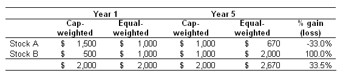

Index investing has become an integral part of modern investment strategies, attracting individuals and institutions alike due to its passive nature and cost efficiency. Traditional indices, such as the S&P 500, are designed based on market capitalization, providing investors with a straightforward way to gain exposure to a broad market segment. This method, which focuses on the market value of companies, naturally leads to a higher concentration in larger companies, reflecting the overall market behavior.

However, as the financial market has evolved, so have the approaches to index construction. Fundamentally weighted index investing presents an innovative alternative. Unlike market-capitalization-weighted indices, these indices rank and weight companies based on fundamental financial metrics—such as book value, revenue, earnings, or cash flow—rather than merely market price. This shift in methodology is predicated on the belief that such metrics offer a more accurate gauge of a company's intrinsic economic value, potentially leading to enhanced investment outcomes.



Fundamentally weighted index investing provides a fresh perspective for those who are not just passive investors but are also interested in aligning their portfolios with fundamental company performances. This approach challenges the conventional method, aiming to cushion portfolios during market volatility by mitigating exposure to stocks that might be overpriced due to excessively high market capitalizations. As a result, it seeks to offer potentially better risk-adjusted returns over the long term. 

In addition to reshaping index investing, fundamentally weighted indices have a significant role in algorithmic trading. They provide a systematic structure based on fundamental metrics, potentially enhancing the performance and reducing the biases commonly associated with discretionary trading. This methodology fits well with advanced trading algorithms seeking to optimize portfolio rebalancing and performance through a rule-based approach.

As an investment strategy that combines fundamental financial principles with passive index investing, fundamentally weighted index investing continues to gain attention from investors striving to diversify their strategies and optimize returns in an ever-changing financial landscape.

## Table of Contents

## Understanding Fundamentally Weighted Indices

Fundamentally weighted indices are an alternative form of index investing that prioritize financial metrics over the traditional market capitalization approach. Unlike market-cap indices, which determine a company's weight within the index based on its total stock market value, fundamentally weighted indices focus on attributes such as book value, cash flow, revenue, or earnings. This selection strategy targets a representation of a company's economic worth that might more closely reflect its financial health and performance.

The rationale behind fundamentally weighted indices is to offer a method of capturing a company's actual economic value beyond just its stock price. By weighting companies based on financial metrics rather than stock price, these indices aim to eliminate the distortions caused by market speculation and excessive valuation, which can significantly influence market-cap-weighted indices.

Key financial metrics used in this strategy include:

1. **Book Value**: This is a company's total tangible and intangible assets minus its liabilities. By using book value, fundamentally weighted indices give higher weight to companies that have a higher net asset position, which may indicate a strong underlying economic base.

2. **Cash Flow**: Cash flow is considered a robust indicator of a company's financial health. By assessing cash flow, the index can prioritize companies that have strong liquidity positions and are potentially better equipped to navigate economic downturns.

3. **Revenue**: Prioritizing companies with higher revenues helps emphasize size and sales efficiency, focusing on the ability to generate substantial income rather than solely on net profits which can sometimes be manipulated through accounting practices.

4. **Earnings**: While similar to revenue, earnings provide a snapshot of net profitability, giving an insight into how much profit a company makes after costs and taxes. Higher emphasis on earnings can guide the index towards companies with better profit margins and operational efficiency.

The methodology of fundamentally weighted indices endeavors to construct a portfolio that is less prone to being skewed by speculative excesses in stock market pricing, thereby potentially offering a more stable and reliable indicator of a company's intrinsic value. This method contrasts with the [volatility](/wiki/volatility-trading-strategies) seen in market-cap-weighted indices during periods of market exuberance or depression, aiming for a more stable long-term growth trajectory. As a result, fundamentally weighted indices present a noteworthy channel for investors seeking strategies that emphasize sustainable and realistic economic assessments over market sentiment-driven valuations.

## Comparison with Capitalization-Weighted Indices

Traditional market-capitalization-weighted indices, such as the S&P 500, allocate more weight to companies with higher market values. This approach results in a portfolio that reflects the relative market capitalization of each stock, which can sometimes concentrate investments in a few highly valued companies. For example, if a handful of stocks experience rapid price increases, their market cap grows, leading to a higher weight in the index. While this strategy can capture [momentum](/wiki/momentum) and rising stock prices, it may also lead to increased exposure to overvalued stocks, which can pose risks if price corrections occur.

On the other hand, fundamentally weighted indices aim to address this potential drawback by selecting and weighting companies based on key financial metrics such as book value, cash flow, revenue, or earnings rather than market capitalization. This methodology is designed to provide a more balanced representation of a company's intrinsic value, allowing these indices to potentially reduce exposure to stocks deemed overvalued by relying on fundamental financial health indicators.

Empirical studies have indicated that fundamentally weighted indices may offer superior performance over the long term compared to their cap-weighted counterparts. For instance, research analyzing historical data has shown that fundamentally weighted indices often exhibit higher returns with lower volatility. By emphasizing financial attributes rather than fluctuating market sentiments, these indices can provide more stable and consistent investment outcomes.

An example illustrating the different performance profiles can be depicted through a simple Python code simulation comparing a hypothetical market-cap weighted index and a fundamentally weighted index. Consider the following Python code snippet:

```python
import numpy as np

# Simulated returns for a market-cap weighted index
market_cap_returns = np.random.normal(loc=0.07, scale=0.15, size=1000)

# Simulated returns for a fundamentally weighted index
fundamental_returns = np.random.normal(loc=0.08, scale=0.13, size=1000)

# Calculate average returns
avg_market_cap_return = np.mean(market_cap_returns)
avg_fundamental_return = np.mean(fundamental_returns)

print(f"Average Market-Cap Weighted Return: {avg_market_cap_return:.4f}")
print(f"Average Fundamental Weighted Return: {avg_fundamental_return:.4f}")
```

This simulation generates hypothetical return profiles for both index types, suggesting that fundamentally weighted indices may achieve slightly higher average returns. While these simulations are simplistic and based on assumptions, they align with findings from academic research suggesting that the focus on economic fundamentals can enhance performance and mitigate risks associated with overpriced stocks in market-cap-weighted indices.

In summary, fundamentally weighted indices represent a different approach to index investing by focusing on economic value rather than market momentum. This distinction may offer alternative benefits, particularly for investors seeking to minimize exposure to market bubbles and capture more stable, long-term growth.

## Benefits of Fundamental Indexation

Fundamental indexation is a strategic approach to constructing indices based on key financial metrics rather than market capitalization. This method can offer several advantages, particularly in terms of volatility, diversification, and long-term performance.

One of the primary benefits of fundamental indexation is its potential to lower volatility compared to traditional market-capitalization weighted indices. By focusing on fundamental metrics such as book value, revenue, and earnings, rather than market price alone, these indices may avoid overconcentration in highly valued stocks that could be more susceptible to drastic market shifts. This difference in composition often results in a smoother performance, as indices less tied to market volatility have historically shown more stable returns.

Sector diversification is another key advantage of fundamental indexation. Unlike market-cap indices, which might heavily weight overvalued sectors due to their inflated market valuations, fundamentally weighted indices promote a more balanced sector allocation. This is because they are constructed based on the inherent economic footprint of companies rather than their market size, often resulting in increased exposure to undervalued sectors while reducing the influence of booming, yet potentially overpriced, sectors. By not overly concentrating on sectors that are temporarily popular or inflated, fundamentally weighted indices provide a diversified investment that is less susceptible to sector-specific downturns.

Proponents of fundamental indexation assert that this method can help mitigate exposure to market bubbles. Traditional indices driven by market caps can lead investors into inflated market sectors, inadvertently increasing the risk during periods of sudden market corrections. In contrast, fundamentally weighted indices, by concentrating on economic fundamentals, might provide insulation against such market excesses, steering clear of bubble-prone investments.

Moreover, there is a belief that fundamental indexation offers better long-term performance. While broad market trends can benefit capitalization-weighted indices in the short term, fundamental indexation approaches have a track record of superior performance metrics over extended periods, attributed to their valuation-centric selection criteria. Studies, such as the one conducted by Arnott et al. (2005), have shown that fundamental indexation approaches may deliver superior risk-adjusted returns and alpha over the long term by systematically capitalizing on pricing inefficiencies in the market.

This potential for enhanced performance, coupled with reduced volatility and diversified sector exposure, makes fundamental indexation an increasingly attractive option for investors seeking an alternative to traditional index funds.

## Role in Algorithmic Trading

Algorithmic trading strategies often harness fundamentally weighted indices as a foundation for model-based investing. This approach allows for a systematic integration of key financial metrics, offering an alternative to traditional cap-weighted indices. Fundamentally weighted indices focus on company fundamentals such as book value, cash flow, revenue, or earnings, providing a distinct methodology that mitigates the biases typically associated with market-capitalization-weighted indices.

The systematic nature of fundamentally weighted indices enhances [algorithmic trading](/wiki/algorithmic-trading) by reducing subjective bias inherent in discretionary trading. Models can programmatically leverage these indices to create a structured and disciplined investment process. By aligning algorithmic strategies with concrete financial metrics, traders can foster a more objective decision-making framework. Algorithmic systems can employ formulaic approaches, for example:

```python
def calculate_fundamental_score(cash_flow, book_value, revenue, earnings):
    return 0.3 * cash_flow + 0.2 * book_value + 0.25 * revenue + 0.25 * earnings

fund_portfolio = sorted(stock_data, key=lambda x: calculate_fundamental_score(x['cash_flow'], x['book_value'], x['revenue'], x['earnings']), reverse=True)
```

This Python code snippet exemplifies how algorithms can rank stocks based on a custom fundamental score derived from specified financial metrics. This methodical ranking aids in selecting which stocks to include within a fundamentally weighted index.

Furthermore, algorithmic trading systems use these indices to systematically rebalance portfolios. Such rebalancing is crucial for optimizing performance, as it ensures that the portfolio remains aligned with the underlying financial metrics. By periodically reviewing and adjusting the composition of the index, the algorithms can react to changing economic conditions and company performance.

This alignment of algorithmic trading with fundamental metrics not only streamlines the investment process but also helps in optimizing returns by focusing on the economic realities of companies rather than market sentiment. Fundamentally weighted indices, therefore, serve as a potent tool in the arsenal of algorithmic trading, aligning the precision of technology with the robustness of economic fundamentals.

## Challenges and Criticisms

Critics highlight several challenges and criticisms associated with fundamentally weighted index investing. One prominent concern is the potential subjectivity involved in selecting which fundamental metrics to weigh. Unlike traditional market-capitalization indices, which rely on the standardized metric of market value, fundamentally weighted indices require decisions about which financial indicators—such as book value, cash flow, or earnings—to prioritize. This selection process can introduce biases, as differing economic conditions might favor particular metrics, leading to varying index compositions over time.

Another significant issue is the potential for higher transaction costs. Fundamentally weighted indices often necessitate more frequent rebalancing to maintain alignment with the underlying economic metrics of the constituent companies. This increased activity can result in elevated transaction fees and impact the overall performance of an investment portfolio. Frequent rebalancing may also lead to greater exposure to market volatility during the buying and selling of assets.

The long-term effectiveness of fundamentally weighted indices compared to traditional strategies remains a topic of ongoing debate. Some studies suggest that while fundamentally weighted indices may offer superior performance over certain periods, they do not consistently outperform market-cap indices over the long term. Factors such as economic cycles, market conditions, and the specific metrics chosen for weighting can all influence the relative success of this approach. Investors should carefully evaluate the historical performance and potential future outcomes before committing to fundamentally weighted index strategies.

These criticisms highlight the need for further research and analysis to assess the viability of fundamentally weighted indices as a reliable investment strategy. As financial markets continue to evolve, investors must weigh the benefits of fundamental indexation against its potential drawbacks and consider their individual investment goals and risk tolerance.

## Conclusion

Fundamentally weighted index investing presents a distinctive strategy that prioritizes economic metrics over market capitalization. By focusing on key financial indicators such as book value, cash flow, revenue, or earnings, this approach seeks to offer a truer reflection of a company’s economic value. This methodology serves as a compelling alternative for investors intent on diversifying their portfolios and potentially increasing their returns compared to traditional index funds. 

Fundamentally weighted indices can mitigate risks associated with market bubbles by avoiding overemphasis on overvalued stocks and sectors prevalent in capitalization-weighted indices. This strategic allocation enables a more balanced exposure across different sectors, thereby offering a robust safeguard against sector-specific downturns. Furthermore, by identifying firms with strong fundamental metrics, these indices appeal to those who believe in intrinsic value rather than market sentiment.

As financial markets rapidly advance and evolve, the rationale behind fundamental indexation is gaining increased acceptance. This approach attracts investors who are keen on blending passive investment strategies with a focus on sustainable growth and long-term stability. With the ever-expanding availability of financial data and technological advancements, fundamental indexation is positioned to become a cornerstone strategy for savvy investors seeking both diversification and enhanced returns.

## References & Further Reading

[1]: Arnott, R. D., Hsu, J. C., & Moore, P. (2005). ["Fundamental Indexation."](https://www.researchgate.net/publication/228289477_Fundamental_Indexation) Financial Analysts Journal, 61(2), 83-99.

[2]: Hsu, J. C. (2006). ["Cap-Weighted Portfolios are Sub-Optimal Portfolios."](https://papers.ssrn.com/sol3/papers.cfm?abstract_id=647001) Journal of Investment Management, 4(3), 1-10.

[3]: Amenc, N., Goltz, F., & Lodh, A. (2012). ["Alternative Equity Beta Investing: A Survey."](https://www.semanticscholar.org/paper/Choose-Your-Betas%3A-Benchmarking-Alternative-Equity-Amenc-Goltz/11c4172b7df38e320915ea0ae5a72ab9373cdeb4) Journal of Index Investing, 3(4), 62-74.

[4]: ["The Little Book of Common Sense Investing: The Only Way to Guarantee Your Fair Share of Stock Market Returns"](https://www.amazon.com/Little-Book-Common-Sense-Investing/dp/1119404509) by John C. Bogle

[5]: ["Financial Management and Analysis"](https://www.amazon.com/Financial-Management-Analysis-Frank-Fabozzi/dp/0471234842) by Frank J. Fabozzi and Pamela P. Peterson