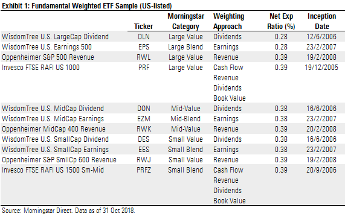

## Table of Contents

## What is a fundamentally weighted index?

A fundamentally weighted index is a type of stock market index where the companies included are chosen and weighted based on their financial performance, not just their market size. Instead of using the total value of a company's stock to decide how important it is in the index, this method looks at things like sales, earnings, dividends, and book value. This approach aims to give a more accurate picture of a company's true worth and potential for growth.

By using fundamental factors to weight the companies, a fundamentally weighted index tries to avoid some problems that can happen with traditional market-cap weighted indexes. For example, in a market-cap index, companies that are overvalued can have a bigger impact on the index's performance. A fundamentally weighted index might perform better over time because it focuses on companies that are doing well financially, rather than just those that are popular or have a high stock price. This can make it a useful tool for investors looking for a different way to measure the market's performance.

## How does a fundamentally weighted index differ from a market capitalization-weighted index?

A fundamentally weighted index and a market capitalization-weighted index are two different ways to measure how well a group of stocks is doing. In a market capitalization-weighted index, the size of each company in the index depends on how much its total stock is worth. This means bigger companies, which have a higher total stock value, have a bigger effect on the index. On the other hand, a fundamentally weighted index looks at how well a company is doing financially, using things like its sales, earnings, dividends, and book value to decide how important it is in the index. This means a company could be smaller but still have a big impact if it's doing really well financially.

The main difference between these two types of indexes is what they focus on. A market capitalization-weighted index focuses on the size of a company in the stock market, which can sometimes make the index go up or down based on how popular or overvalued certain stocks are. This can be risky if those stocks suddenly lose value. A fundamentally weighted index, however, tries to avoid this by focusing on a company's actual financial health. By doing this, it might give a more stable picture of the market and could potentially perform better over time because it's based on solid financial performance rather than just stock market popularity.

## What are the key metrics used to weight stocks in a fundamentally weighted index?

In a fundamentally weighted index, the stocks are chosen and weighted based on how well the companies are doing financially. The main things they look at are sales, earnings, dividends, and book value. Sales show how much money a company is making from selling its products or services. Earnings tell us how much profit the company is making after paying all its costs. Dividends are the money the company pays to its shareholders, which shows how much it can afford to give back. Book value is what the company would be worth if it sold all its assets and paid off all its debts.

These metrics help to give a clear picture of a company's financial health. By using them, a fundamentally weighted index tries to focus on companies that are doing well, even if they are not the biggest in terms of stock market value. This is different from a market capitalization-weighted index, which just looks at how much a company's total stock is worth. A fundamentally weighted index might be a better way to see which companies are truly strong and likely to grow in the future.

## What are the advantages of using a fundamentally weighted index?

Using a fundamentally weighted index has some good points. One big advantage is that it focuses on how well a company is doing financially, not just how big it is in the stock market. This means the index might do better over time because it picks companies that are strong and making good profits, not just companies that are popular or have a high stock price. This can help investors find companies that are likely to grow and do well in the future.

Another advantage is that a fundamentally weighted index can help avoid some problems that can happen with market cap-weighted indexes. In a market cap index, if a company's stock price goes way up, it can make the whole index go up, even if that company isn't doing well financially. This can be risky if the stock price suddenly drops. A fundamentally weighted index looks at things like sales, earnings, and dividends, so it might be less affected by these sudden changes in stock prices. This can make it a safer choice for investors who want a more stable way to measure the market's performance.

## Can you explain the potential drawbacks of fundamentally weighted indexes?

One potential problem with fundamentally weighted indexes is that they can be more complicated to set up and keep track of. Instead of just looking at how much a company's stock is worth, these indexes need to gather and analyze a lot of financial data like sales, earnings, and dividends. This can take more time and money, and it might be harder for investors to understand how the index is put together. If the data isn't accurate or up-to-date, it could lead to mistakes in how the index is weighted, which might affect its performance.

Another drawback is that fundamentally weighted indexes might not always do better than market cap-weighted indexes. Even though they focus on companies that are doing well financially, there's no guarantee that these companies will keep doing well in the future. Sometimes, companies that are popular or have high stock prices might still be a good investment, even if they're not the strongest financially. So, investors might miss out on some good opportunities if they only look at fundamentally weighted indexes. It's important to think about both types of indexes and maybe use them together to get a better overall picture of the market.

## How is the performance of a fundamentally weighted index typically measured?

The performance of a fundamentally weighted index is usually measured by looking at how much the index goes up or down over time. This is done by tracking the total return, which includes any changes in the stock prices of the companies in the index, plus any dividends they pay out. Investors and analysts often compare the performance of a fundamentally weighted index to other indexes, like market cap-weighted indexes, to see which one does better. They might also look at how much risk is involved, using measures like [volatility](/wiki/volatility-trading-strategies), to see if the index's returns are worth the risk.

Another way to measure the performance of a fundamentally weighted index is by looking at how well it does compared to a specific goal or benchmark. For example, if the goal is to beat the performance of the S&P 500, then the index's returns would be compared to the S&P 500's returns over the same time period. This helps investors see if the fundamentally weighted index is meeting its goals. Additionally, performance can be broken down into different time frames, like monthly, quarterly, or yearly, to give a more detailed view of how the index is doing over time.

## What are some examples of fundamentally weighted indexes?

The FTSE RAFI US 1000 Index is a good example of a fundamentally weighted index. It looks at the biggest 1,000 companies in the U.S. and decides how important they are in the index by looking at things like their sales, earnings, dividends, and book value. This way, even if a company is not the biggest in terms of stock market value, it can still have a big impact on the index if it's doing well financially.

Another example is the WisdomTree Earnings 500 Index. This index focuses on the 500 largest U.S. companies, but instead of using their stock market value, it weights them based on their earnings. This means companies that are making more profit will have a bigger effect on the index. Both of these indexes try to give investors a different way to measure the market's performance by focusing on how well companies are doing financially, not just how popular they are in the stock market.

## How do you construct a fundamentally weighted index?

To construct a fundamentally weighted index, you first need to choose the companies that will be part of the index. Instead of [picking](/wiki/asset-class-picking) companies based on how much their stock is worth, you look at how well they are doing financially. This means you consider things like their sales, earnings, dividends, and book value. Once you have a list of companies, you need to gather all this financial information for each one. This can be a bit tricky because you need to make sure the data is accurate and up-to-date.

After you have all the financial data, you use it to decide how important each company is in the index. For example, if you're using sales to weight the companies, those with higher sales will have a bigger impact on the index. You add up all the sales for each company and then figure out what percentage of the total sales each company represents. You do the same thing with earnings, dividends, and book value. Once you have these percentages, you use them to set the weight of each company in the index. This way, the index reflects the financial health of the companies, not just their size in the stock market.

## What role do fundamentally weighted indexes play in portfolio diversification?

Fundamentally weighted indexes help make a portfolio more diverse by focusing on different things than market cap-weighted indexes. Instead of just looking at how big a company is in the stock market, these indexes look at how well the company is doing financially. This means they might pick smaller companies that are making good profits, not just the biggest companies. By including these different kinds of companies, a fundamentally weighted index can spread out the risk in a portfolio. If one type of company does badly, the others might still do well, which can help keep the overall value of the portfolio more stable.

Using fundamentally weighted indexes can also help investors find new opportunities that they might miss if they only look at market cap-weighted indexes. Because these indexes focus on financial health, they might include companies that are growing fast but aren't the biggest yet. This can add variety to a portfolio and potentially lead to better returns over time. By mixing fundamentally weighted indexes with other types of investments, investors can create a more balanced and diverse portfolio that is better prepared to handle different market conditions.

## How do fundamentally weighted indexes respond to market cycles compared to cap-weighted indexes?

Fundamentally weighted indexes and market cap-weighted indexes can act differently during different parts of the market cycle. Market cap-weighted indexes go up and down a lot with the market because they focus on how much a company's stock is worth. If a lot of people want to buy a company's stock and its price goes up, it can make the whole index go up, even if the company isn't doing well financially. This can be risky because if the stock price suddenly drops, the index can go down a lot too. 

On the other hand, fundamentally weighted indexes might be more stable during market cycles because they look at how well a company is doing financially, not just its stock price. They focus on things like sales, earnings, and dividends, which can give a better idea of a company's true value. This means that even if the stock market is going through a rough time, a fundamentally weighted index might not go down as much because it's based on solid financial performance. Over time, this can help the index do better and be less affected by the ups and downs of the market.

## What are the tax implications of investing in funds based on fundamentally weighted indexes?

When you invest in funds that follow fundamentally weighted indexes, you need to think about taxes. These funds might have different tax effects than funds that follow market cap-weighted indexes. One reason is that fundamentally weighted funds often buy and sell stocks more often to keep the index up to date with the latest financial data. This can lead to more capital gains, which are profits from selling stocks. When a fund sells stocks and makes a profit, it has to pay taxes on those gains, and these taxes can be passed on to you, the investor.

The good news is that fundamentally weighted funds might also have some tax benefits. Because they focus on companies that are doing well financially, they might hold onto stocks for longer periods. This can mean fewer short-term capital gains, which are taxed at a higher rate than long-term gains. So, while these funds might have more trading activity, the type of gains they produce could be taxed at a lower rate. It's important to talk to a tax advisor to understand how these funds might affect your taxes and to plan your investments wisely.

## How can advanced investors use fundamentally weighted indexes to enhance their investment strategies?

Advanced investors can use fundamentally weighted indexes to make their investment strategies better by focusing on companies that are strong financially, not just big in the stock market. By choosing funds that follow these indexes, investors can find companies that might be growing fast but are not the biggest yet. This can help them spread out their investments and find new opportunities that they might miss if they only look at market cap-weighted indexes. Since fundamentally weighted indexes look at things like sales, earnings, and dividends, they can help investors find companies that are doing well and might keep doing well in the future.

Another way advanced investors can use fundamentally weighted indexes is to balance out their portfolios. Because these indexes might not go up and down as much as market cap-weighted indexes, they can make a portfolio more stable. This means that if the stock market has a bad time, a fundamentally weighted index might not lose as much value. By mixing these indexes with other types of investments, investors can create a portfolio that is ready for different market conditions. This can help them get better returns over time and manage risk better.

## References & Further Reading

[1]: Arnott, R. D., Hsu, J., & Moore, P. (2005). ["Fundamental Indexation."](https://papers.ssrn.com/sol3/papers.cfm?abstract_id=604842) Financial Analysts Journal, 61(2), 83-99.

[2]: Sindreu, J. (2020). ["Smart Beta and Alternative Indexation."](https://papers.ssrn.com/sol3/papers.cfm?abstract_id=3590995) The Wall Street Journal.

[3]: Lopez de Prado, M. (2018). ["Advances in Financial Machine Learning."](https://www.amazon.com/Advances-Financial-Machine-Learning-Marcos/dp/1119482089) Wiley.

[4]: Jansen, S. (2020). ["Machine Learning for Algorithmic Trading – Second Edition: Predictive models to extract signals from market and alternative data for systematic trading strategies with Python."](https://thuvienso.hoasen.edu.vn/bitstream/handle/123456789/12260/Contents.pdf?sequence=1) Packt Publishing.

[5]: Chan, E. (2008). ["Quantitative Trading: How to Build Your Own Algorithmic Trading Business."](https://github.com/ftvision/quant_trading_echan_book) Wiley.

[6]: Bogle, J. C. (2003). ["Common Sense on Mutual Funds: New Imperatives for the Intelligent Investor."](https://books.google.com/books/about/Common_Sense_on_Mutual_Funds.html?id=KZbOlCjj9dEC) Wiley.

[7]: Siegel, L. B., & Schwartz, M. (2006). ["The Changing Landscape of Indexing: A Capsule History of the Evolution of Stock Indexes."](https://www.researchgate.net/publication/247884354_Long-Term_Returns_on_the_Original_SP_500_Companies) CFA Institute.