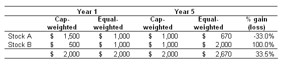

The world of investing is continually evolving, offering various strategies to both maximize returns and mitigate risks. Central to these strategies are indexes, which serve as crucial benchmarks within the financial market, providing essential insights into various market segments. An index represents a portfolio of securities intended to replicate a particular market sector, commodity, or asset type, thereby offering a snapshot of market trends.

In the context of investment strategies, this article navigates the intersection of fundamentally weighted indexes and algorithmic trading. Fundamentally weighted indexes differ from traditional market capitalization-weighted indexes by using fundamental criteria for index composition, such as revenue, earnings, and book value, rather than simply market cap. This approach can potentially offer a more stable reflection of a company's economic performance since it ties index weightings to tangible financial metrics.

Algorithmic trading, utilizing computer algorithms to automate trading decisions, plays a significant role in leveraging these indexes. Algorithms can analyze vast amounts of index data at speeds incomprehensible to human traders, thus gaining strategic advantages in terms of decision-making speed, efficiency, and accuracy.

By exploring how fundamental criteria define index composition versus market capitalization criteria and examining the role of algorithmic trading, this article seeks to provide insights into the modern dynamics of investment strategies. Additionally, it highlights the critical importance of combining these strategies with advanced technologies to navigate the complexities of today’s financial landscape.

## Table of Contents

## Understanding Investment Strategies

Investment strategies play a crucial role in guiding investors towards achieving optimal returns while effectively managing risk. Understanding these strategies involves examining the differences between active and passive investing and the growing significance of indexes in the investment landscape.

Active and passive investing are two primary approaches that investors can adopt. Active investing involves selecting stocks with the aim of outperforming the market or a specific benchmark. This strategy requires thorough analysis and frequent trading, which implies higher costs but offers the potential for superior returns if executed successfully. Active investors leverage their expertise or that of fund managers to harness market inefficiencies. Conversely, passive investing focuses on replicating the performance of a specific index, such as the S&P 500, thereby reducing trading costs and providing a secure avenue for long-term growth. Passive investors favor a buy-and-hold strategy, accepting market returns.

Indexes are central to passive investing strategies as they provide benchmarks for performance measurement. They reflect the performance of a particular market segment and serve as a baseline for evaluating investment success. Traditional market capitalization-weighted indexes, where components are weighted according to their market value, are prevalent. These include familiar indexes like the MSCI World Index and the FTSE 100.

Recently, fundamentally weighted indexes have emerged as alternatives to traditional indexes. These indexes select and weight their components based on fundamental financial metrics such as revenue, earnings, and book value. In contrast to market capitalization-weighted indexes, which might overemphasize overvalued stocks, fundamentally weighted indexes aim to provide a more balanced representation by focusing on a company's intrinsic value.

Fundamental metrics are pivotal in constructing fundamentally weighted indexes. Revenue represents the total income generated by a company and reflects its market demand and operational size. Earnings, or net income, indicate a company's profitability after all expenses are deducted. Book value, representing the net asset value of a company, serves as another essential criterion in assessing a company's financial health. These metrics offer alternative perspectives, potentially leading to indexes that mitigate the overreliance on market sentiment-driven valuations.

In summary, understanding investment strategies requires comprehending the differences between active and passive investing, the pivotal role of indexes, and the rise of fundamentally weighted indexes as viable alternatives to traditional market capitalization-weighted indexes. Through considering fundamental metrics, investors can gain diversified exposure while emphasizing intrinsic value in their investment decisions.

## Examples of Fundamentally Weighted Indexes

Fundamentally weighted indexes represent an innovative shift in index investment strategies, deviating from the conventional market capitalization-weighted approach. Instead of weighting companies based on their market value, fundamentally weighted indexes utilize fundamental financial metrics such as revenue, earnings, or book value to determine the composition and weight of companies within the index. This section examines some notable fundamentally weighted indexes and their comparative advantages and performance metrics over traditional market capitalization indexes.

One of the prominent examples of fundamentally weighted indexes is the FTSE RAFI U.S. 1000 [ETF](/wiki/etf-trading-strategies). It employs a systematic approach where companies are selected based on fundamental measures including book value, cash flow, sales, and dividends. The objective is to offer a more stable and potentially less volatile investment option as opposed to standard capitalization-weighted indexes. This methodology has been associated with providing robust risk-adjusted returns by emphasizing underlying business fundamentals rather than market sentiment.

Similarly, WisdomTree’s approach to fundamentally weighted indexes is exemplified by its U.S. Quality Dividend Growth Fund. This index focuses on identifying companies that exhibit high growth potential in dividends, solidifying its selection process on quality-oriented financial criteria like return on equity and expected earnings growth. WisdomTree aims to harness the steady growth and income prospects of companies, thereby providing investors with diversified exposure to equity markets centered on fundamental attributes.

The benefits of fundamentally weighted indexes include a diversified exposure to equity markets that is less susceptible to market [volatility](/wiki/volatility-trading-strategies) associated with [momentum](/wiki/momentum)-driven trading common in market cap-weighted indexes. Fundamentally weighted indexes aim to reduce the pitfalls of over-concentration in overvalued sectors or stocks that dominate market capitalization weights, thus potentially lowering investment risks.

Case studies comparing the performance of fundamentally weighted indexes with market capitalization indexes reveal intriguing insights. Fundamentally weighted indexes have shown a tendency to outperform during periods of market stress when market sentiment deviates significantly from underlying business fundamentals. They are designed to capture a broader market movement reflective of economic fundamentals rather than trading dynamics, often resulting in enhanced returns for long-term investors.

The analysis of long-term returns for investors adopting fundamentally weighted indexes underscores their potential for consistent performance. By focusing on core financial metrics, these indexes can provide a buffer against market fluctuations, thereby offering potentially superior long-term returns relative to traditional indexes. 

In summary, fundamentally weighted indexes represent a strategic evolution in index investment, prioritizing intrinsic company value over market sentiment. Their distinctive approach offers investors an alternative pathway to achieving diversified market exposure with a focus on essential financial health indicators.

## Algorithmic Trading and Indexes

Algorithmic trading involves the use of algorithms—automated sets of rules and calculations—to make trading decisions and execute trades efficiently. These algorithms can evaluate significant amounts of data far quicker than human traders, enabling rapid and precise decision-making in the financial markets. Typically written in programming languages such as Python, C++, or Java, these programs follow a predetermined set of rules aimed at placing orders at the most opportune times.

Indexes play a crucial role in enhancing [algorithmic trading](/wiki/algorithmic-trading) strategies. By providing a benchmark of market performance, indexes offer a reference point for algorithms to assess market conditions. This symbiotic relationship enables algorithmic traders to craft strategies that capitalize on aggregate market movements reflected by the indexes.

Two common algorithmic trading strategies that utilize index data include trend-following and index [arbitrage](/wiki/arbitrage). Trend-following exploits momentum by buying assets that are climbing in value and selling those that are declining, aligning trades with the current market trajectory. Algorithms are particularly adept at spotting trends through complex computations using historical index data. In contrast, index arbitrage seeks to profit from price discrepancies between the index value and the actual trading price of its component stocks. Algorithms detect and rapidly execute these trades to capitalize on short-lived opportunities.

Algorithmic trading provides several advantages, notably its speed, efficiency, and accuracy. Algorithms can process and act on data in milliseconds, far exceeding human capabilities. This quickness facilitates trading strategies that depend on timely decisions. Furthermore, algorithms eliminate human errors, providing precision in trade execution and optimizing resource allocation based on predefined criteria.

However, algorithmic trading is not without its challenges. Market volatility can influence the effectiveness of an algorithm, rendering it less accurate in rapidly changing markets. Additionally, technological glitches pose significant risks, as technical failures can lead to unintended trades or trading halts. The robustness and resilience of trading systems are crucial in mitigating these potential pitfalls and require ongoing adjustment.

Algorithmic trading continues to evolve, integrating sophisticated techniques and technologies to navigate the complexities of modern financial markets. Leveraging indexes in algorithmic strategies remains a powerful approach for traders seeking to enhance performance while balancing the inherent challenges of speed and technology dependence.

## Advantages and Disadvantages of Algorithmic Trading with Indexes

Algorithmic trading, particularly when applied to indexes, presents a blend of advantages and disadvantages, shaping the landscape of modern finance. 

One of the primary advantages of algorithmic trading with indexes is enhanced decision-making speed. Algorithms can process vast amounts of data and execute trades in fractions of a second, far surpassing human capabilities. This efficiency allows traders to take advantage of fleeting market opportunities, potentially leading to higher profitability. Additionally, algorithmic trading improves accuracy by reducing human errors and biases, ensuring trades are executed as intended.

Despite these benefits, there are notable disadvantages. A significant concern is the over-reliance on technology. Systems may encounter technical failures, from software glitches to server outages, potentially disrupting trading operations. Furthermore, high-frequency trading, a subset of algorithmic trading, is susceptible to mishaps such as the infamous flash crashes, where rapid, automated trades can exacerbate market volatility and lead to significant financial losses.

Market volatility represents another challenge for algorithmic trading strategies. Algorithms typically rely on historical data and patterns to make decisions, which may not adequately account for abrupt market changes. Such volatility can lead to unexpected algorithmic behavior and suboptimal trading outcomes.

From a cost perspective, algorithmic trading often boasts lower transaction fees compared to traditional trading methods, as trades are consolidated into fewer, larger transactions. However, this cost efficiency can be counterbalanced by the expenses associated with maintaining sophisticated technological infrastructure and addressing potential failures.

To mitigate these challenges, a balanced approach that combines algorithmic insights with human judgment is advisable. Traders can monitor algorithms actively and intervene when necessary, ensuring that human intuition complements computational efficiency. Additionally, implementing rigorous testing and fault-tolerant systems can reduce the risk of technical breakdowns and enhance the overall reliability of algorithmic trading with indexes.

## Future Directions for Index Investment and Algorithmic Trading

Artificial intelligence (AI) and [machine learning](/wiki/machine-learning) (ML) are significantly transforming index trading strategies by introducing more sophisticated methods for analyzing data and making trading decisions. These technologies enable the processing of vast amounts of financial data in real-time, allowing for the identification of patterns and trends that may be imperceptible to human analysts. The integration of AI into index trading strategies often involves the development of algorithms that can learn from historical data to predict future market movements. Machine learning models, such as neural networks and decision trees, are increasingly applied to improve the accuracy of these predictions, thus enhancing the decision-making process.

The rise of decentralized finance (DeFi) presents new opportunities for integrating traditional index investing with blockchain technology. DeFi operates on a decentralized network, which reduces reliance on traditional financial intermediaries. This democratization of finance allows for the creation of novel financial products and services, such as synthetic assets that mimic the behavior of indexes. Smart contracts, which are self-executing contracts with the terms of the agreement directly written into code, are increasingly used for automating trading and index management processes in the DeFi environment.

Innovations in data analytics are driving the use of [alternative data](/wiki/best-alternative-data) sources to refine algorithmic trading strategies. Alternative data encompasses a wide range of non-traditional financial data, such as satellite imagery, social media sentiment, and web traffic [statistics](/wiki/bayesian-statistics). This data provides deeper insights into market sentiment and consumer behavior, allowing trading algorithms to make more informed decisions. By combining alternative data with traditional financial datasets, traders can enhance their index trading strategies to achieve better risk-adjusted returns.

Quantum computing holds the potential to revolutionize trading systems by exponentially increasing the computational power available for processing complex calculations. Quantum computers can solve problems that are currently intractable for classical computers, such as those involving large-scale optimizations and simulations. In the context of index trading, quantum computing could enable more precise modeling of market dynamics and more efficient portfolio optimization, potentially leading to better performance outcomes.

As financial markets continue to evolve, preparing for the future necessitates adapting to emerging technologies. This requires a strategic approach that embraces the capabilities provided by AI, ML, DeFi, alternative data analytics, and quantum computing. Financial institutions and individual investors alike must remain vigilant in their pursuit of technological advancements to improve investment strategies and maintain competitive advantage. Embracing these innovations will likely lead to more robust and adaptable financial systems, better equipped to respond to changing market conditions and investor needs.

## Conclusion

The dynamic interplay between fundamentally weighted indexes and algorithmic trading creates a powerful synergy that enhances investment decision-making. Fundamentally weighted indexes, offering an alternative to traditional market capitalization methodologies, provide a diversified and potentially more stable approach to index composition. By focusing on core financial metrics like revenue, earnings, and book value, these indexes cater to investors seeking a balance between growth and stability.

Algorithmic trading takes this approach further by leveraging advanced computational techniques to optimize trading strategies. Through the use of algorithms, investment strategies gain in speed, accuracy, and efficiency, allowing traders to efficiently navigate the complexities of the financial markets. This integration is crucial as it maximizes the potential benefits of fundamentally weighted indexes by executing trades based on data-driven criteria.

The rapid evolution of technology in financial markets underscores the imperative for continuous learning and adaptability. The integration of [artificial intelligence](/wiki/ai-artificial-intelligence) and machine learning into trading systems represents a significant leap forward, offering enhanced capabilities in data analysis and predictive modeling. As these technologies evolve, they offer investors new tools for refining investment strategies and exploiting market opportunities.

Strategic foresight coupled with technological integration will be essential for investors aiming to keep pace with the shifting landscape. As emerging technologies like quantum computing and decentralized finance gain traction, they will reshape how indexes are utilized and trading strategies are formulated. This evolving paradigm emphasizes the importance of staying informed and adaptable to harness these advancements effectively.

Investors are encouraged to engage with these opportunities by adopting prudent investment strategies that incorporate both traditional wisdom and modern technological insights. By leveraging the strengths of fundamentally weighted indexes and the precision of algorithmic trading, investors can position themselves to benefit from future market innovations and optimize their returns in a rapidly changing financial environment.

## References & Further Reading

[1]: Arnott, R. D., Hsu, J., & Moore, P. (2005). ["Fundamental Indexation."](https://papers.ssrn.com/sol3/papers.cfm?abstract_id=604842) Financial Analysts Journal, 61(2), 83-99.

[2]: Sindreu, J. (2020). ["Smart Beta and Alternative Indexation."](https://papers.ssrn.com/sol3/papers.cfm?abstract_id=3590995) The Wall Street Journal.

[3]: Lopez de Prado, M. (2018). ["Advances in Financial Machine Learning."](https://www.amazon.com/Advances-Financial-Machine-Learning-Marcos/dp/1119482089) Wiley.

[4]: Jansen, S. (2020). ["Machine Learning for Algorithmic Trading – Second Edition: Predictive models to extract signals from market and alternative data for systematic trading strategies with Python."](https://thuvienso.hoasen.edu.vn/bitstream/handle/123456789/12260/Contents.pdf?sequence=1) Packt Publishing.

[5]: Chan, E. (2008). ["Quantitative Trading: How to Build Your Own Algorithmic Trading Business."](https://github.com/ftvision/quant_trading_echan_book) Wiley.

[6]: Bogle, J. C. (2003). ["Common Sense on Mutual Funds: New Imperatives for the Intelligent Investor."](https://books.google.com/books/about/Common_Sense_on_Mutual_Funds.html?id=KZbOlCjj9dEC) Wiley.

[7]: Siegel, L. B., & Schwartz, M. (2006). ["The Changing Landscape of Indexing: A Capsule History of the Evolution of Stock Indexes."](https://www.researchgate.net/publication/247884354_Long-Term_Returns_on_the_Original_SP_500_Companies) CFA Institute.