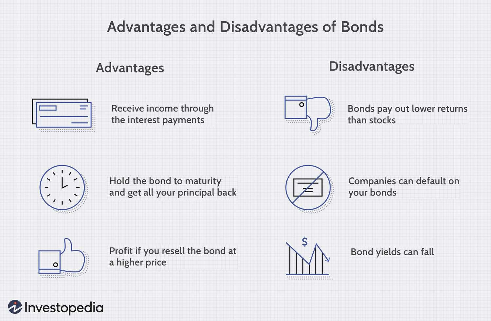

In the world of finance, bonds and algorithmic trading are essential tools for investors aiming to diversify their portfolios or enhance trading efficiency. Bonds, as fixed-income securities, represent a loan made by an investor to a borrower, typically corporate or governmental entities, providing interest income and capital preservation. This article will cover the basics of how bonds function as investment instruments and the underlying principles of algorithmic trading. 

Algorithmic trading, or algo trading, utilizes computer algorithms to execute trades at high speed and precision based on predefined criteria. This technological advancement is reshaping financial markets by automating complex trading strategies and minimizing human errors and emotional biases. Understanding both bonds and trading algorithms is crucial for investors, whether novice or experienced, who wish to improve their financial literacy and performance. 



The intersection of bonds and algorithmic trading presents new opportunities and challenges in market participation. By reading further, you will gain insights into how these areas of investment can be integrated into a comprehensive financial strategy, supporting informed decision-making and potentially enhancing portfolio returns. This exploration will assist in aligning investment practices with individual financial goals and risk appetites.

## Table of Contents

## Understanding Bonds as an Investment

Bonds are financial instruments that represent a loan made by an investor to a borrower, which is typically a corporation or government entity. When investors purchase bonds, they effectively lend money to the issuer in exchange for regular interest payments, known as coupons. These payments continue until the bond reaches its maturity date, at which point the principal amount is returned to the investor.

The bond market is diverse, offering various types of bonds, each with distinct risk and return profiles. Corporate bonds are issued by companies and generally offer higher yields to compensate for increased risk compared to government bonds. Government bonds, including Treasury bonds in the United States, are considered low-risk due to the backing of the government. Municipal bonds are issued by state or local governments, often providing tax advantages to investors, which can be an attractive feature depending on the investor's tax bracket.

Key concepts in bond investing include yield, maturity, coupon rate, and credit rating. The yield of a bond measures the return an investor can expect, factoring in the bond's price, coupon payments, and maturity. Maturity refers to the length of time until the bond's principal is repaid. The coupon rate is the interest rate the bond issuer agrees to pay annually. Credit ratings, assigned by agencies such as Moody’s or Standard & Poor’s, assess the creditworthiness of the bond issuer and the risk of default.

Investing in bonds can contribute to the stability of an investment portfolio by providing regular income and diversification. Bonds generally exhibit lower [volatility](/wiki/volatility-trading-strategies) compared to stocks, which can reduce overall portfolio risk. Additionally, they can serve as a conservative investment that helps preserve capital in uncertain market conditions. As a result, bonds are often recommended for investors seeking a balanced approach to wealth management where predictable returns and capital preservation are prioritized.

## Basic Risks of Bond Investing

Bonds are generally regarded as safer investments compared to stocks, but they are not free from risks. One of the primary risks associated with bond investing is [interest rate](/wiki/interest-rate-trading-strategies) risk. This risk arises from the inverse relationship between bond prices and interest rates; when interest rates rise, existing bond prices typically fall, and vice versa. This is because the fixed interest payments of bonds become less attractive compared to new bonds issued with higher rates, resulting in a decline in the market price of existing bonds. 

$$

\Delta P \approx -D \times \Delta i 
$$

Where:
- $\Delta P$ is the change in the bond price,
- $D$ is the bond's duration (a measure of interest rate sensitivity),
- $\Delta i$ is the change in interest rates.

Another significant risk is credit or default risk, which refers to the possibility that the bond issuer might fail to make interest payments or repay the principal at maturity. This risk is particularly relevant for corporate bonds, as companies may experience financial difficulties leading to defaults. Credit ratings, provided by agencies such as Moody's and Standard & Poor's, help investors assess the creditworthiness of issuers.

Prepayment risk is another concern for certain types of bonds, particularly mortgage-backed securities. This risk emerges when the issuer repays the bond before its maturity date. While prepayments can provide quick returns, they also force investors to reinvest the returned principal at the current, possibly lower, interest rates, potentially leading to diminished returns.

Mitigating these risks requires a comprehensive understanding of both the issuer's creditworthiness and the prevailing interest rate environment. Investors often rely on diversification across different types of bonds and maturities to manage these risks. Additionally, incorporating bonds with varying credit ratings and employing sophisticated financial instruments such as derivatives can help in constructing a robust bond investment strategy that aligns with an investor's risk tolerance and return expectations.

## Algorithmic Trading Basics

Algorithmic trading, often referred to as algo trading, involves the use of sophisticated computer programs to automate the execution of trades according to pre-established rules. These algorithms are capable of analyzing vast amounts of market data at speeds that surpass human abilities, making them particularly effective in executing high-frequency trades. This capability not only enhances the speed of transactions but also increases their efficiency, allowing for trades to be conducted at optimal prices with reduced transaction costs.

One of the primary objectives of [algorithmic trading](/wiki/algorithmic-trading) is to remove the emotional biases that typically affect human trading decisions. By relying on systematic, data-driven strategies, algorithmic trading ensures that trades are executed based on logic and pre-defined criteria, rather than on instinct or emotion, which can often lead to suboptimal decision-making.

Algorithmic trading strategies vary, with some of the most common being trend-following, [arbitrage](/wiki/arbitrage), and index fund rebalancing. Trend-following strategies capitalize on market [momentum](/wiki/momentum) by identifying and following existing market trends. Arbitrage strategies exploit price differentials of the same asset in different markets, aiming to profit from price discrepancies. Index fund rebalancing involves adjusting the components of an index fund to reflect market changes, ensuring the fund remains aligned with its investment goals.

To engage in algorithmic trading, individuals or institutions must have access to financial markets, which typically requires a brokerage account with direct market access. Additionally, proficiency in programming is advantageous, as developing and testing algorithms often necessitates coding skills. Languages such as Python are commonly used due to their robust libraries and tools for financial data analysis.

Python Example: A simple moving average crossover strategy can be developed using Python. In this strategy, a short-term moving average is compared against a long-term moving average. A buy signal is triggered when the short-term average crosses above the long-term average, and a sell signal is triggered when it crosses below.

```python
import pandas as pd

def moving_average_crossover(data, short_window, long_window):
    signals = pd.DataFrame(index=data.index)
    signals['price'] = data['price']

    # Generate short moving average
    signals['short_mavg'] = data['price'].rolling(window=short_window, min_periods=1).mean()

    # Generate long moving average
    signals['long_mavg'] = data['price'].rolling(window=long_window, min_periods=1).mean()

    # Create signals
    signals['signal'] = 0.0
    signals['signal'][short_window:] = np.where(signals['short_mavg'][short_window:] 
                                                > signals['long_mavg'][short_window:], 1.0, 0.0)

    # Generate trading orders
    signals['positions'] = signals['signal'].diff()

    return signals

# Example usage with a DataFrame 'data' containing price information
signals = moving_average_crossover(data, short_window=40, long_window=100)
```

Participants in algo trading should ensure they either possess the necessary technical expertise or have access to pre-programmed trading platforms. Such platforms provide a user-friendly interface for implementing algorithmic strategies without requiring extensive programming knowledge.

## Advantages and Challenges of Algo Trading

Algorithmic trading has revolutionized the financial markets by introducing significant efficiencies and novel strategies. One of the primary advantages of algorithmic trading is its speed. Computer algorithms can execute trades in fractions of a second, far faster than a human trader. This speed advantage allows traders to capitalize on transient market opportunities that would be impossible to seize manually.

Precision is another key benefit. Algorithms execute trades based on pre-defined criteria, minimizing human errors that often stem from emotional decision-making. This precision ensures that trades are executed under optimal conditions, aligning with the strategic goals set by the trader.

The ability to backtest strategies using historical data is crucial for developing effective trading algorithms. By simulating trades on past data, traders can evaluate the potential success of their strategies before deploying them in real-time markets. This process helps in refining the algorithms, thereby enhancing the likelihood of achieving desired outcomes.

Algorithmic trading also contributes to market [liquidity](/wiki/liquidity-risk-premium). The presence of numerous algorithms executing trades increases the number of buy and sell orders, which can reduce bid-ask spreads and improve market pricing mechanisms. Furthermore, algorithms are adept at processing large volumes of data quickly, which is essential in today's data-driven trading environment.

Despite these advantages, algorithmic trading presents several challenges. The technical proficiency required to develop and manage trading algorithms is significant. Traders must possess coding skills and a deep understanding of financial markets to create effective algorithms. This necessitates a substantial investment in education and resources.

Additionally, algorithmic trading systems are vulnerable to market volatility. Rapid price changes can lead to substantial losses if the algorithms are not designed to adapt quickly. There is also the risk of algorithmic errors, such as coding mistakes or logic flaws, which can result in inadvertent trades or financial losses.

Robust risk management and regular system updates are crucial for mitigating these risks. Effective risk management strategies include setting strict limits on trade volumes, employing stop-loss orders, and continuously monitoring system performance. Regular updates are necessary to keep the algorithms aligned with changing market conditions and regulatory requirements.

Regulations also pose a significant consideration for algorithmic traders. Regulatory bodies continually update rules to maintain fair and efficient markets. Traders must ensure that their algorithms comply with these regulations to avoid legal issues and potential fines.

In conclusion, while algorithmic trading offers substantial benefits in terms of speed, precision, and efficiency, it requires a high level of expertise and continuous adaptation to market and regulatory changes. Successful implementation relies on balancing these advantages with the associated challenges through vigilant management and strategic planning.

## Integrating Bonds and Algorithmic Trading

Investors increasingly leverage algorithmic trading to enhance their participation in the bond markets. By utilizing data-driven strategies, algorithms can identify profitable opportunities that might elude traditional analysis methods. These algorithms process vast amounts of market data, detecting patterns and trends that are not immediately apparent to human traders.

Algorithmic trading enables investors to diversify bond portfolios more effectively. It assesses the risk and return characteristics of various bonds in real-time, allowing for the strategic reallocation of assets to improve portfolio stability and returns. Moreover, the integration of algorithms into bond trading strategies facilitates decision-making in different interest rate environments. This adaptability is crucial since bond prices are sensitive to interest rate fluctuations, which can alter the risk profile of bond investments.

A key advantage of algorithmic trading in bond markets is its ability to manage transactions across a spectrum of interest rate scenarios. For instance, traders might use algorithms to exploit arbitrage opportunities, taking advantage of price differentials between bonds with similar characteristics or duration. By analyzing systematic price deviations or exploiting moments of market inefficiency, algorithms can potentially secure returns that are not accessible through manual trading.

To incorporate algorithmic trading into bond investment strategies effectively, investors need a comprehensive understanding of both the bond market dynamics and the specific trading algorithms. This requires keeping abreast of advances in computational finance and maintaining robust risk management protocols to mitigate the risks associated with algorithmic errors or unexpected market volatility.

In conclusion, the integration of algorithms in bond trading not only optimizes returns and decision-making but also enhances the investor's capacity to navigate complex and rapidly changing financial landscapes. This synergy between technological and financial acumen enables a more responsive and informed approach to bond market investments.

## Conclusion

Understanding both bond investments and algorithmic trading is vital for modern investors aiming for a balanced investment approach. Bonds, as fixed-income securities, provide stability and a predictable stream of income, making them an essential component of a diversified portfolio. They offer a safeguard against market volatility, ensuring that investors have a steady cash flow, regardless of fluctuations in equity markets. This stability allows investors to balance their portfolios, reducing overall risk while maintaining a level of return that aligns with their financial goals.

Algorithmic trading, on the other hand, significantly enhances trading speed and efficiency. By leveraging computer algorithms, traders can execute orders at a pace and frequency that human traders cannot match. This capability not only improves transaction efficiency but also reduces the emotional biases often associated with manual trading. Through algorithmic trading, investors can capitalize on small price discrepancies and market inefficiencies, which can be critical in maximizing returns, especially over shorter time horizons.

For investors, integrating bond investments with algorithmic trading requires a careful consideration of how these strategies fit into their broader financial goals and risk tolerance. A well-crafted approach will enable investors to harness the stability of bonds while exploiting the dynamic possibilities offered by algorithmic trading. This integrated strategy can aid investors in navigating volatile markets, maximizing both stability and returns.

Both traditional and automated trading strategies offer unique benefits that can complement each other. By effectively integrating these methodologies, investors can form a robust investment framework, providing versatility in a continuously changing financial landscape. As technology and financial tools evolve, staying informed and adaptive remains crucial for investors aiming to exploit future market opportunities and maintain a competitive edge. The fusion of these strategies represents a forward-thinking approach, allowing investors to meet their needs with precision and foresight.

## References & Further Reading

[1]: Fabozzi, F. J. (2008). ["Bond Markets, Analysis, and Strategies"](https://books.google.com/books/about/Bond_Markets_Analysis_and_Strategies_ten.html?id=bQpNEAAAQBAJ). Pearson.

[2]: Gomber, P., Arndt, B., Lutat, M., & Uhle, T. (2011). ["High-Frequency Trading."](https://papers.ssrn.com/sol3/papers.cfm?abstract_id=1858626) In Market Engineering: Insights from Two Decades of Research on Markets and Information.

[3]: Chincarini, L. B., & Kim, D. (2006). ["Quantitative Equity Portfolio Management: An Active Approach to Portfolio Construction and Management"](https://www.amazon.com/Quantitative-Equity-Portfolio-Management-Construction/dp/0071459391) by McGraw-Hill Education.

[4]: De Prado, M. L. (2018). ["Advances in Financial Machine Learning"](https://books.google.com/books/about/Advances_in_Financial_Machine_Learning.html?id=oU9KDwAAQBAJ). Wiley.

[5]: Chan, E. P. (2009). ["Quantitative Trading: How to Build Your Own Algorithmic Trading Business"](https://github.com/ftvision/quant_trading_echan_book). Wiley Trading.

[6]: Litterman, R., & Scheinkman, J. (1991). ["Common Factors Affecting Bond Returns."](https://www.pm-research.com/content/iijfixinc/1/1/54) The Journal of Fixed Income, 1(1), 54-61.