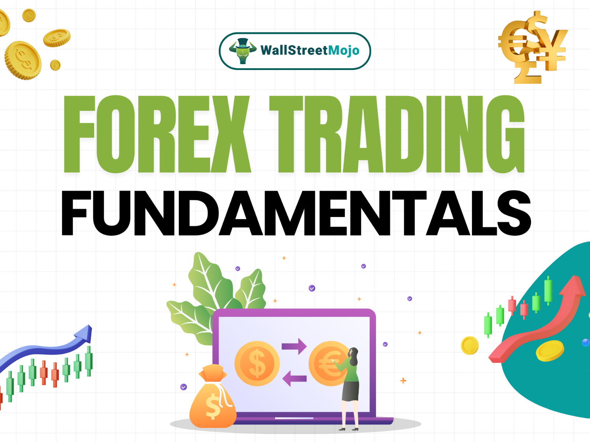

The foreign exchange, or forex, market stands as the largest financial market globally, with a staggering daily trading volume surpassing $6 trillion. Unlike other markets, the forex market operates continuously, 24 hours a day, five days a week. This seamless operation is facilitated by an interwoven network of banks, financial institutions, corporations, and individual traders around the world, ensuring the continuous exchange of currencies essential for global trade.

Forex trading involves the buying and selling of currencies. It is a critical mechanism for global commerce, allowing businesses in different countries to transact goods and services using various currencies. This need for an international currency exchange is one of the primary reasons for the immense size and fluidity of the forex market. The market's around-the-clock availability is supported by its decentralized nature, with trading sessions overlapping across major financial hubs like London, New York, Tokyo, and Sydney.



Forex trading is inherently complex, given the multitude of factors influencing currency values. Traders engage in forex with the aim of capitalizing on fluctuations in currency pairs, such as the Euro/US Dollar (EUR/USD), British Pound/US Dollar (GBP/USD), or US Dollar/Japanese Yen (USD/JPY). Currency values are shaped by an array of global economic indicators, including interest rates, inflation data, political events, and market sentiment. This complexity, while presenting considerable challenges, also offers substantial opportunities for traders, potentially yielding significant profits through strategic trading decisions.

However, forex trading is not without its risks. The highly leveraged nature of forex positions can lead to significant gains, but it also exposes traders to substantial losses. Despite these challenges, the forex market's scope and opportunities make it an enticing arena for traders seeking to unlock its financial potential.

## Table of Contents

## Forex Market Basics

Forex trading revolves around the simultaneous buying and selling of currency pairs. This fundamental aspect of the market means that traders speculate on the value movement between two currencies—essentially betting on whether one currency will strengthen or weaken relative to another. A currency "pair" is typically represented in a format like EUR/USD (Euro/US Dollar), where each pair indicates how much of the second currency (USD) is needed to purchase one unit of the first currency (EUR).

The forex market's major pairs include EUR/USD, GBP/USD, and USD/JPY. These represent some of the most traded and liquid combinations globally. For example, EUR/USD is frequently traded due to the enormity of the two economies it represents—the Eurozone and the United States. In contrast, the GBP/USD pair involves the British Pound and US Dollar and is often influenced by economic activities and announcements in both the UK and the US. Similarly, USD/JPY reflects the exchange rate between the US Dollar and the Japanese Yen, influenced by economic policies in the United States and Japan.

Global economic indicators play a crucial role in influencing [forex](/wiki/forex-system) market prices. Key developments such as inflation rates, interest rates, gross domestic product (GDP) growth, and employment figures can significantly alter currency values. For instance, if the Federal Reserve (the central bank of the United States) announces an increase in interest rates, it is likely to strengthen the US Dollar. This scenario occurs as higher interest rates often attract foreign investments seeking higher returns, thereby increasing the demand for that currency.

Furthermore, market sentiment also heavily impacts currency prices. Market sentiment reflects the overall attitude of investors towards a particular market or financial instrument. Factors influencing sentiment can range from geopolitical events, such as tensions or conflicts between countries, to economic news, such as unexpected changes in policy. For example, positive sentiment about the US economy could drive more traders to buy the USD, increasing its value relative to others. Conversely, negative sentiment could have the opposite effect.

Overall, these basic principles form the foundation of forex market operations, underscoring the complexity and dynamism within currency trading environments. Traders need to be adept at interpreting both economic signals and market sentiment to make informed trading decisions.

## Basics of Algorithmic Trading

Algorithmic trading involves the use of computer programs with predefined rules to facilitate the execution of trades in financial markets. These algorithm-driven systems leverage mathematical models and complex formulas to analyze vast amounts of data, thereby enabling traders to make informed decisions swiftly and efficiently. By executing trades without the need for human intervention, [algorithmic trading](/wiki/algorithmic-trading) can substantially reduce the influence of emotional biases and improve the overall consistency and accuracy of trade execution.

The core function of algorithmic trading systems is data analysis and trade execution. These algorithms scan a myriad of market indicators and data points to identify trading opportunities. Upon identifying a favorable condition, the program executes the trade automatically, capitalizing on opportunities that may be too fleeting for manual trading. Additionally, algorithmic systems effectively manage risk by setting stop-loss orders and other risk parameters, ensuring that trades adhere to predefined risk management strategies.

Algorithmic trading strategies can be broadly categorized into four main types:

1. **Statistical Strategies:** These methods use statistical analysis to identify trading opportunities based on historical data. The algorithms look for patterns and correlations within the data to forecast future price movements. 

2. **Auto-Hedging:** These strategies automatically manage risks by creating counterbalancing positions. For example, if a trader holds a long position in one currency pair, the algorithm might enter a short position in a correlated pair to limit potential losses.

3. **Algorithmic Execution Strategies:** These strategies aim to execute trades in the most efficient manner possible. By breaking large orders into smaller trades, they minimize market impact and reduce trading costs. Common algorithmic execution strategies include VWAP (Volume Weighted Average Price) and TWAP (Time Weighted Average Price).

4. **Direct Market Access (DMA):** This allows traders to interact directly with order books of exchanges. DMA leverages high-speed connections and market data to ensure rapid order execution, which is crucial in fast-moving markets such as forex.

By leveraging these strategies, algorithmic trading enhances market efficiency and provides significant benefits in terms of speed, accuracy, and cost reduction.

## Algorithmic Trading in the Forex Market

Algorithmic trading has significantly transformed the forex market, providing increased speed and efficiency in executing trade orders. This advancement enables traders to capitalize on market movements with precise timing. Algorithms, utilizing pre-defined set of rules, can process vast amounts of data at lightning speed, making it possible to identify and exploit trading opportunities that human traders might miss. This aspect of trading is particularly beneficial in the forex market, where currency pairs can exhibit rapid fluctuations. 

A key advantage of algorithmic trading is its ability to facilitate the rapid quoting of forex rates by banks and financial institutions. The forex market operates 24 hours a day, five days a week, which requires constant monitoring and timely updates on currency valuations. Algorithms can instantly process economic news, market data, and other relevant information, adjusting the quoted forex rates accordingly. This capability is crucial for maintaining competitive pricing and seizing [arbitrage](/wiki/arbitrage) opportunities.

The automation of risk management is another critical function provided by algorithmic systems in forex trading. Algorithms are equipped to manage trading positions and minimize exposure to market risks by setting stop-loss orders and other protective measures. These systems can continuously monitor market positions in real-time and automatically execute trades to rectify any exposure breaches. 

Here's a simple Python snippet illustrating the concept of a basic algorithm for automated trading in a forex market context:

```python
import pandas as pd

def moving_average_strategy(data, short_window=40, long_window=100):
    signals = pd.DataFrame(index=data.index)
    signals['price'] = data['Close']
    # Create short simple moving average over the short window
    signals['short_mavg'] = data['Close'].rolling(window=short_window, min_periods=1, center=False).mean()
    # Create long simple moving average over the long window
    signals['long_mavg'] = data['Close'].rolling(window=long_window, min_periods=1, center=False).mean()
    # Create signals
    signals['signal'] = 0.0
    # Generate signals when short moving average crosses above long moving average
    signals['signal'][short_window:] = np.where(signals['short_mavg'][short_window:] > signals['long_mavg'][short_window:], 1.0, 0.0)
    # Generate trading orders
    signals['positions'] = signals['signal'].diff()
    return signals

# Example usage
# data = pd.read_csv('forex_data.csv', parse_dates=True, index_col='Date')
# results = moving_average_strategy(data)
```

In this example, the function `moving_average_strategy` analyzes a dataset of forex prices and generates buy or sell signals based on the crossover of short and long-term moving averages. This is a simple illustrative strategy, demonstrating how algorithmic systems can be designed to operate efficiently in the forex market by adhering to statistical rules that optimize timing and execution. 

In summary, algorithmic trading brings significant efficiency, from rapid rate quoting to automated risk management, enhancing overall trading operations while reducing the likelihood of human error in the forex market.

## Popular Forex Algorithmic Trading Strategies

In the forex market, algorithmic trading strategies have gained significant traction owing to their ability to analyze vast amounts of data and execute trades with precision. Among the most popular strategies employed by traders and institutions are trend-following, arbitrage, and mean reversion strategies.

Trend-following strategies leverage technical indicators to identify and follow prevailing market directions. These strategies are based on the principle that prices will continue moving in the same direction until a clear reversal signal emerges. Technical indicators such as moving averages, the moving average convergence divergence (MACD), and the relative strength index (RSI) are frequently used in these strategies. The moving average helps smooth out price data, providing a clearer picture of the overall trend by calculating the average price over a specific number of periods. For example, a simple moving average (SMA) can be expressed as:

$$
\text{SMA} = \frac{P_1 + P_2 + \ldots + P_n}{n}
$$

where $P_1, P_2, \ldots, P_n$ are the closing prices for $n$ periods. The strategy generally involves entering the market when the price crosses above or below these moving averages, indicating the start of a new trend.

Arbitrage strategies are employed to exploit price discrepancies across different forex markets or instruments. These strategies rely on the principle of buying low in one market and simultaneously selling high in another to capture the price difference for profit. Due to the instantaneous nature of forex trading, arbitrage opportunities exist only briefly before the markets correct themselves. Traders utilize advanced algorithms and high-frequency trading platforms to capitalize on these transient opportunities.

Mean reversion strategies operate on the assumption that prices will eventually return to their historical averages, presenting opportunities to profit from temporary price anomalies. These strategies are predicated on the statistical concept that extreme price deviations are not sustainable over the long term. Traders often use statistical measures such as standard deviation and Bollinger Bands to identify overbought or oversold market conditions. For example, Bollinger Bands, which consist of a moving average and two standard deviation lines, can signal potential trading opportunities when prices touch or exceed these bands. The formula for Bollinger Bands can be expressed as:

$$
\text{Upper Band} = \text{SMA} + k \times \sigma
$$
$$
\text{Lower Band} = \text{SMA} - k \times \sigma
$$

where $\sigma$ is the standard deviation and $k$ is the number of standard deviations to set the band width.

These strategic approaches, underpinned by sophisticated algorithms, offer traders frameworks to navigate the forex market efficiently, leveraging the systematic analyses provided by algorithmic systems.

## Risks Involved in Forex Algorithmic Trading

Algorithmic trading in the forex market, while offering enhanced efficiency and speed, is accompanied by specific risks that traders must carefully navigate. A primary concern is algorithmic malfunctions, which can occur due to programming errors, unforeseen market behavior, or technical failures in the systems running the algorithms. Such malfunctions can lead to unexpected trading activities, resulting in significant financial losses. 

Moreover, an over-reliance on automation poses its own set of risks. Traders may become too dependent on their algorithms, ignoring the necessity of human oversight and intervention, especially in volatile or unusual market conditions. This can be detrimental when the algorithms face unprecedented scenarios they were not programmed to handle, leading to potential errors and losses.

Market fragmentation further complicates algorithmic trading. The forex market is highly decentralized, consisting of numerous trading platforms and brokers. This can lead to price discrepancies and inconsistencies in available [liquidity](/wiki/liquidity-risk-premium) across different market venues. In highly fragmented markets, obtaining accurate and timely data can be challenging, potentially affecting the performance of trading algorithms designed to exploit small disparities rapidly.

Liquidity shortages are another critical challenge in forex algorithmic trading. During periods of low trading [volume](/wiki/volume-trading-strategy) or unexpected market events, liquidity can dissipate quickly, resulting in increased [volatility](/wiki/volatility-trading-strategies) and widened spreads. Algorithms that fail to account for these liquidity fluctuations may execute trades at disadvantageous prices, thereby magnifying potential losses.

Flash crashes exemplify the volatility risk in algorithm-driven markets. These sudden and severe market movements are often catalyzed by algorithmic trading systems reacting to each other in a feedback loop, amplifying price swings disproportionately to the underlying market conditions. The May 6, 2010, U.S. stock market flash crash is a notable example, where high-frequency trading algorithms played a significant role in the abrupt plunge and brief recovery.

To mitigate these risks, traders should implement thorough testing and validation procedures for their algorithms, including [backtesting](/wiki/backtesting) across diverse market conditions. Maintaining a robust risk management framework and remaining vigilant to market changes ensures preparedness for unexpected events. Continual monitoring and adjustment of trading strategies, along with diversifying risk management approaches, can further safeguard against the perils of forex algorithmic trading.

## The Bottom Line

Algorithmic trading has substantially improved efficiency and reduced trading costs within the forex market. By automating the execution of trades, algorithms can process large volumes of transactions swiftly and accurately, minimizing the impact of human error and slippage. This technological advantage allows for more competitive pricing and tighter spreads, benefiting both individual and institutional traders.

However, alongside these advantages come significant risks. Traders must be vigilant about the potential pitfalls associated with algorithmic trading. Algorithm malfunctions, or "algo glitches," can lead to unintended trading behaviors, resulting in substantial financial losses. Additionally, relying excessively on automated systems without adequate human oversight can exacerbate these risks, as algorithms might not adapt swiftly to unexpected market events or anomalies.

Market dynamics, characterized by fragmentation and liquidity shortages, pose further challenges to algorithmic traders. In heavily fragmented markets, ensuring effective communication and order execution across multiple trading platforms can be complex, potentially leading to inefficiencies. Liquidity shortages, particularly in less frequently traded currency pairs, may also affect the performance of trading algorithms, leading to suboptimal execution prices.

One of the most concerning risks in algorithmic trading is the occurrence of flash crashes, where rapid price fluctuations can trigger stop-loss or take-profit orders automatically, sometimes exacerbating market volatility. Such events highlight the critical need for robust risk management mechanisms within algorithm trading systems.

To succeed in forex algorithmic trading, continuous learning and strategy adaptation are indispensable. Traders must keep abreast of market developments and technological advancements to refine their algorithms accordingly. This involves testing and optimizing strategies using historical and live data, ensuring their algorithms are resilient to changing market conditions.

In conclusion, while algorithmic trading offers numerous benefits in the forex market, it demands a comprehensive understanding of its associated risks. Traders must combine algorithmic precision with human insight to navigate the complexities of forex trading effectively.

## References & Further Reading

[1]: Bank for International Settlements. (2019). ["Triennial Central Bank Survey of Foreign Exchange and OTC Derivatives Markets in 2019."](https://www.bis.org/statistics/rpfx19.htm)

[2]: Taylor, M. P. (2005). ["Exchange Rates and Economic Fundamentals: A Survey"](https://www.semanticscholar.org/paper/The-Economics-of-Exchange-Rates-Taylor/a102e3d039266c8116c2cf95039cf276f9c43f77) Review of Economic Literature 45(3): 2005-2042.

[3]: ["Advances in Financial Machine Learning"](https://www.amazon.com/Advances-Financial-Machine-Learning-Marcos/dp/1119482089) by Marcos Lopez de Prado

[4]: ["Quantitative Trading: How to Build Your Own Algorithmic Trading Business"](https://www.amazon.com/Quantitative-Trading-Build-Algorithmic-Business/dp/1119800064) by Ernest P. Chan

[5]: ["Machine Learning for Algorithmic Trading - Second Edition"](https://github.com/Allensmile/Machine-Learning-for-Algorithmic-Trading-Second-Edition) by Stefan Jansen

[6]: Burnside, C. (2011). ["Order Flow and Exchange Rate Dynamics"](https://jfqa.org/wp-content/uploads/2024/06/Foreign_Exchg_Order_Flow_Burnside_Cerrato_Zhang.pdf) National Bureau of Economic Research.

[7]: Chaboud, A. P., Chiquoine, B., Hjalmarsson, E., & Vega, C. (2014). ["Rise of the Machines: Algorithmic Trading in the Foreign Exchange Market."](https://papers.ssrn.com/sol3/papers.cfm?abstract_id=1501135) Review of Financial Studies, 27(12), 3201–3234.

[8]: Dacorogna, M. M., Gencay, R., Müller, U. A., Olsen, R. B., & Pictet, O. V. (2001). ["An Introduction to High-Frequency Finance."](https://www.sciencedirect.com/book/9780122796715/an-introduction-to-high-frequency-finance)

[9]: Mackenzie, M. (2017). ["FX Algorithms and the TCA Challenge."](https://www.rbccm.com/en/insights/story.page?dcr=templatedata/article/insights/data/2017/11/expert_practitioners_discuss_the_use_of_execution_algorithms) FX Markets.

[10]: Poole, W. (2004). ["Understanding the Foreign Exchange Market."](https://pubmed.ncbi.nlm.nih.gov/15035702/) Federal Reserve Bank of St. Louis.