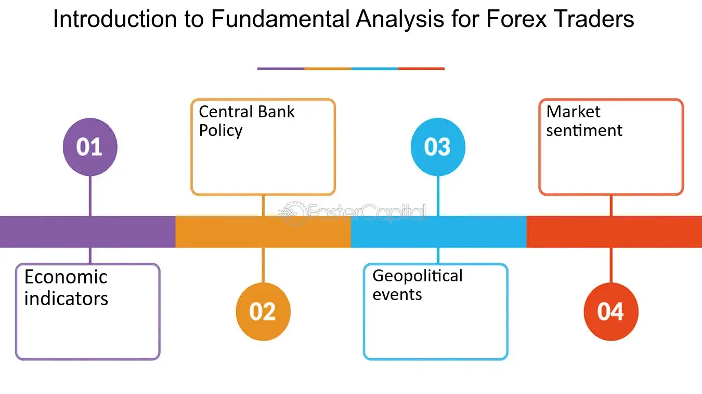

## Table of Contents

## What is Forex trading and why is it important?

Forex trading, also known as foreign exchange trading, is the buying and selling of different currencies on the global market. It's like a big marketplace where people and organizations trade one currency for another. For example, if you're traveling to another country, you might exchange your dollars for euros. Forex traders do this on a much larger scale, often trading millions of dollars at a time.

Forex trading is important for several reasons. First, it helps businesses and individuals exchange money when they need to buy things from other countries. Without Forex trading, it would be hard for a company in the U.S. to pay a supplier in Japan. Second, Forex markets help set currency values, which affects the price of imports and exports. This can influence the economy of entire countries. In short, Forex trading keeps the global economy running smoothly by making it easier to exchange money across borders.

## How does the Forex market work?

The Forex market works like a big trading platform where people and organizations from all over the world exchange different currencies. It's open 24 hours a day, from Monday to Friday, because it spans different time zones. When you trade in the Forex market, you're basically guessing that one currency will go up in value compared to another. For example, if you think the euro will get stronger against the dollar, you might buy euros with your dollars. If the euro does go up, you can sell it back for more dollars than you started with, making a profit.

The Forex market is huge and very liquid, meaning there's always someone ready to buy or sell. This makes it easy to trade, but it can also be risky. The prices of currencies can change quickly because of things like news events, economic reports, or even rumors. Traders use tools like charts and indicators to try to predict these changes, but it's never a sure thing. That's why many people who trade Forex use strategies to manage their risk, like setting limits on how much they're willing to lose on a trade.

## What are the major currency pairs in Forex trading?

In Forex trading, the major currency pairs are the ones that are traded the most. These pairs involve the world's biggest economies and are always paired with the US dollar. The most common ones are the Euro/US Dollar (EUR/USD), US Dollar/Japanese Yen (USD/JPY), and the British Pound/US Dollar (GBP/USD). These pairs are called "major" because they have the highest trading [volume](/wiki/volume-trading-strategy), which means lots of people are buying and selling them all the time.

There are also other important pairs like the US Dollar/Swiss Franc (USD/CHF), Australian Dollar/US Dollar (AUD/USD), and the US Dollar/Canadian Dollar (USD/CAD). These pairs are also very popular but not as much as the first three. Traders like to focus on these major pairs because they are more stable and easier to predict compared to other, less popular currency pairs.

## What are the basic terms and concepts every Forex trader should know?

When you start trading Forex, there are some basic terms and ideas you should know. One important term is "pip," which stands for "percentage in point." A pip is the smallest change in value between two currencies. For example, if the EUR/USD moves from 1.1000 to 1.1001, that's a one pip move. Another key term is "lot," which is the standard unit size of a Forex trade. A standard lot is usually 100,000 units of the base currency. Traders also need to understand "leverage," which lets you control a large position with a small amount of money. It can increase your profits but also your losses, so it's risky.

Another important concept is "spread," which is the difference between the buying (ask) and selling (bid) price of a currency pair. The spread is how brokers make money, and it's something traders need to consider because it affects the cost of each trade. "Margin" is also crucial; it's the amount of money you need to put up to open a leveraged position. If your trade goes against you and your losses eat up your margin, you might get a "margin call," where your broker asks for more money or closes your position. Understanding these terms and concepts will help you navigate the Forex market more effectively.

## How can one start trading Forex?

To start trading Forex, you first need to find a good broker. A broker is like a middleman who helps you buy and sell currencies. You can search online for brokers and read reviews to see which one is best for you. Once you choose a broker, you'll need to open an account with them. This usually involves filling out some forms and providing ID to prove who you are. After your account is set up, you'll need to put some money into it. This money is called your "capital," and you'll use it to make trades.

Once you have an account and some money in it, you can start trading. Most brokers have a platform where you can see the prices of different currency pairs and make trades. It's a good idea to start with a demo account first, where you can practice trading without risking real money. This helps you learn how everything works. When you feel ready, you can switch to a real account and start trading for real. Remember, Forex trading can be risky, so it's important to learn as much as you can and maybe even take a [course](/wiki/best-algorithmic-trading-courses) or read some [books](/wiki/algo-trading-books) to get better at it.

## What are the different types of Forex trading strategies?

There are different types of Forex trading strategies that traders can use. One common strategy is called "[day trading](/wiki/day-trading-spy)." This means buying and selling currencies within the same day, trying to make quick profits from small price changes. Day traders often use charts and technical analysis to help them decide when to trade. Another strategy is "swing trading," which involves holding onto a trade for a few days or even weeks. Swing traders look for bigger price movements and use both technical and [fundamental analysis](/wiki/fundamental-analysis) to find good trading opportunities.

Another popular strategy is "[scalping](/wiki/gamma-scalping)," where traders make lots of small trades to earn tiny profits that add up over time. Scalpers need to be quick and pay close attention to the market because they're trying to take advantage of very small price changes. On the other hand, "position trading" is a long-term strategy where traders hold onto their trades for months or even years. Position traders focus more on the big picture and use fundamental analysis to predict how currencies will move over the long term. Each of these strategies has its own risks and rewards, so it's important for traders to choose the one that fits their goals and how much risk they're willing to take.

## How do economic indicators affect Forex markets?

Economic indicators are like report cards for a country's economy. They give information about things like how many people have jobs, how much money people are spending, and how fast the economy is growing. When these indicators come out, they can make the value of a country's currency go up or down. For example, if a report shows that more people are working, it might make people think the economy is doing well, and they might want to buy that country's currency. This can make the currency stronger. On the other hand, if a report shows that the economy is shrinking, people might sell the currency, making it weaker.

Traders in the Forex market pay close attention to these economic indicators because they can help predict where currency prices are going. For instance, if a country's inflation rate is high, it might mean that the central bank will raise interest rates to slow down spending. Higher interest rates can make a currency more attractive to investors, causing its value to rise. By understanding these indicators, traders can make better guesses about whether to buy or sell a currency. This is why economic indicators are so important in Forex trading; they help traders make decisions based on what's happening in the world's economies.

## What are the risks involved in Forex trading and how can they be managed?

Forex trading can be risky because the prices of currencies can change a lot and very quickly. This means you could lose money if the market moves against you. Another risk is using leverage, which lets you trade with more money than you actually have. While leverage can make your profits bigger, it can also make your losses bigger. There's also the risk of not knowing enough about the market, which can lead to bad trading decisions. Plus, there are risks from things like news events or economic reports that can shake up the market in unexpected ways.

To manage these risks, it's important to have a good plan. One way to do this is by setting stop-loss orders, which automatically close your trade if the price goes against you by a certain amount. This can help limit how much money you lose on a single trade. Another way is to not put all your money into one trade; instead, spread it out over different trades to reduce the risk. It's also a good idea to keep learning about the market and to practice with a demo account before using real money. By understanding the risks and having a plan to manage them, you can trade Forex more safely.

## How does leverage work in Forex trading and what are its implications?

Leverage in Forex trading is like borrowing money from your broker to make bigger trades than you could with just your own money. It's measured as a ratio, like 50:1 or 100:1, which means for every dollar you have, you can control up to 50 or 100 dollars in the market. So, if you have $1,000 and use 100:1 leverage, you can trade with $100,000. This can make your profits bigger if the market moves in your favor, but it also makes your losses bigger if the market goes against you.

Using leverage is risky because even small changes in the market can lead to big losses. For example, if you're trading with $100,000 and the market moves against you by just 1%, you lose $1,000, which is all your own money. That's why it's important to use leverage carefully and always have a plan to manage your risks. Setting stop-loss orders can help limit your losses, and it's a good idea to only use as much leverage as you feel comfortable with, based on how much risk you're willing to take.

## What technical analysis tools are essential for Forex trading?

Technical analysis tools help Forex traders understand market trends and make better trading decisions. One of the most important tools is the moving average, which shows the average price of a currency over a certain period of time. Traders use moving averages to smooth out price data and see the overall direction of the market. Another essential tool is the Relative Strength Index (RSI), which measures how fast and how much a currency's price is changing. This helps traders see if a currency is overbought or oversold, which can signal when it might be a good time to buy or sell.

Charts are also crucial for technical analysis. Candlestick charts are popular because they show the open, high, low, and close prices of a currency for a specific time period. By looking at these charts, traders can spot patterns that might predict future price movements. For example, a "head and shoulders" pattern can signal that a currency's price might go down soon. Support and resistance levels are another key tool; they show where the price of a currency tends to stop and turn around. Traders use these levels to decide where to enter or [exit](/wiki/exit-strategy) trades, helping them manage risk and aim for profits.

## How can fundamental analysis be applied to Forex trading?

Fundamental analysis in Forex trading is all about looking at the big picture of a country's economy to guess where its currency might go. Traders look at things like how fast the economy is growing, how many people have jobs, and what interest rates are doing. For example, if a country's economy is doing well and more people are working, traders might think that country's currency will get stronger. They also pay attention to news and events that can affect the economy, like elections or changes in government policy. By understanding these factors, traders can make better guesses about whether to buy or sell a currency.

One important part of fundamental analysis is keeping an eye on economic reports and indicators. These reports tell traders about things like inflation, trade balances, and how much money people are spending. For instance, if inflation is high, a country's central bank might raise interest rates to slow down spending, which can make the currency stronger. Traders use this information to predict how currency values might change in the future. By combining these economic insights with what's happening in the news, traders can make more informed decisions about their Forex trades.

## What are advanced trading techniques used by expert Forex traders?

Expert Forex traders often use advanced techniques like [algorithmic trading](/wiki/algorithmic-trading), where they use computer programs to automatically buy and sell currencies based on set rules. These programs can analyze lots of data very quickly and make trades without the trader having to do it manually. This can help traders take advantage of small price changes that happen very fast. Another advanced technique is called hedging, which means making trades to protect against losses. For example, if a trader thinks the value of a currency might go down, they might make a trade that will make money if it does go down, helping to balance out any losses from their other trades.

Another technique used by expert traders is called [carry](/wiki/carry-trading) trading. This involves borrowing money in a currency with a low [interest rate](/wiki/interest-rate-trading-strategies) and using it to buy a currency with a higher interest rate. The goal is to make money from the difference in interest rates. This can be risky because if the value of the currency they bought goes down a lot, it could wipe out the interest they earned. Expert traders also use advanced chart patterns and technical indicators to find trading opportunities that might be hard for beginners to see. By combining these advanced techniques with good risk management, expert traders try to make the most of the Forex market while keeping their losses under control.

## What are some popular Forex algorithmic trading strategies?

In the [forex](/wiki/forex-system) market, algorithmic trading strategies have gained significant traction owing to their ability to analyze vast amounts of data and execute trades with precision. Among the most popular strategies employed by traders and institutions are trend-following, [arbitrage](/wiki/arbitrage), and mean reversion strategies.

Trend-following strategies leverage technical indicators to identify and follow prevailing market directions. These strategies are based on the principle that prices will continue moving in the same direction until a clear reversal signal emerges. Technical indicators such as moving averages, the moving average convergence divergence (MACD), and the relative strength index (RSI) are frequently used in these strategies. The moving average helps smooth out price data, providing a clearer picture of the overall trend by calculating the average price over a specific number of periods. For example, a simple moving average (SMA) can be expressed as:

$$
\text{SMA} = \frac{P_1 + P_2 + \ldots + P_n}{n}
$$

where $P_1, P_2, \ldots, P_n$ are the closing prices for $n$ periods. The strategy generally involves entering the market when the price crosses above or below these moving averages, indicating the start of a new trend.

Arbitrage strategies are employed to exploit price discrepancies across different forex markets or instruments. These strategies rely on the principle of buying low in one market and simultaneously selling high in another to capture the price difference for profit. Due to the instantaneous nature of forex trading, arbitrage opportunities exist only briefly before the markets correct themselves. Traders utilize advanced algorithms and high-frequency trading platforms to capitalize on these transient opportunities.

Mean reversion strategies operate on the assumption that prices will eventually return to their historical averages, presenting opportunities to profit from temporary price anomalies. These strategies are predicated on the statistical concept that extreme price deviations are not sustainable over the long term. Traders often use statistical measures such as standard deviation and Bollinger Bands to identify overbought or oversold market conditions. For example, Bollinger Bands, which consist of a moving average and two standard deviation lines, can signal potential trading opportunities when prices touch or exceed these bands. The formula for Bollinger Bands can be expressed as:

$$
\text{Upper Band} = \text{SMA} + k \times \sigma
$$
$$
\text{Lower Band} = \text{SMA} - k \times \sigma
$$

where $\sigma$ is the standard deviation and $k$ is the number of standard deviations to set the band width.

These strategic approaches, underpinned by sophisticated algorithms, offer traders frameworks to navigate the forex market efficiently, leveraging the systematic analyses provided by algorithmic systems.

## References & Further Reading

[1]: Bank for International Settlements. (2019). ["Triennial Central Bank Survey of Foreign Exchange and OTC Derivatives Markets in 2019."](https://www.bis.org/statistics/rpfx19.htm)

[2]: Taylor, M. P. (2005). ["Exchange Rates and Economic Fundamentals: A Survey"](https://www.semanticscholar.org/paper/The-Economics-of-Exchange-Rates-Taylor/a102e3d039266c8116c2cf95039cf276f9c43f77) Review of Economic Literature 45(3): 2005-2042.

[3]: ["Advances in Financial Machine Learning"](https://www.amazon.com/Advances-Financial-Machine-Learning-Marcos/dp/1119482089) by Marcos Lopez de Prado

[4]: ["Quantitative Trading: How to Build Your Own Algorithmic Trading Business"](https://www.amazon.com/Quantitative-Trading-Build-Algorithmic-Business/dp/1119800064) by Ernest P. Chan

[5]: ["Machine Learning for Algorithmic Trading - Second Edition"](https://github.com/Allensmile/Machine-Learning-for-Algorithmic-Trading-Second-Edition) by Stefan Jansen

[6]: Burnside, C. (2011). ["Order Flow and Exchange Rate Dynamics"](https://jfqa.org/wp-content/uploads/2024/06/Foreign_Exchg_Order_Flow_Burnside_Cerrato_Zhang.pdf) National Bureau of Economic Research.

[7]: Chaboud, A. P., Chiquoine, B., Hjalmarsson, E., & Vega, C. (2014). ["Rise of the Machines: Algorithmic Trading in the Foreign Exchange Market."](https://papers.ssrn.com/sol3/papers.cfm?abstract_id=1501135) Review of Financial Studies, 27(12), 3201–3234.

[8]: Dacorogna, M. M., Gencay, R., Müller, U. A., Olsen, R. B., & Pictet, O. V. (2001). ["An Introduction to High-Frequency Finance."](https://www.sciencedirect.com/book/9780122796715/an-introduction-to-high-frequency-finance)

[9]: Mackenzie, M. (2017). ["FX Algorithms and the TCA Challenge."](https://www.rbccm.com/en/insights/story.page?dcr=templatedata/article/insights/data/2017/11/expert_practitioners_discuss_the_use_of_execution_algorithms) FX Markets.

[10]: Poole, W. (2004). ["Understanding the Foreign Exchange Market."](https://pubmed.ncbi.nlm.nih.gov/15035702/) Federal Reserve Bank of St. Louis.