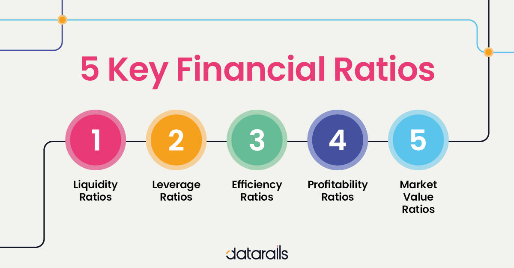

## Table of Contents

## What are the basic types of financial statements?

Financial statements are important documents that businesses use to show their financial health. The main types of financial statements are the income statement, the balance sheet, and the cash flow statement. Each of these statements gives different information about the company's money situation.

The income statement shows how much money a company made and spent over a certain period, usually a year or a quarter. It tells you if the company made a profit or a loss by comparing its revenues to its expenses. The balance sheet, on the other hand, gives a snapshot of what the company owns and owes at a specific point in time. It lists assets, liabilities, and shareholders' equity. Lastly, the cash flow statement tracks the actual cash coming in and going out of the business. It helps to see how well the company manages its cash, which is crucial for staying in business.

Understanding these three basic financial statements can help you get a good picture of a company's financial performance and position. They are used by business owners, investors, and creditors to make important decisions about the company.

## How do you define a balance sheet and what are its key components?

A balance sheet is like a big picture of what a company owns and owes at a specific time. It's one of the main financial statements that businesses use to show how they are doing financially. The balance sheet helps everyone from business owners to investors understand the company's financial health by listing everything the company has (assets), everything it owes (liabilities), and the value that's left for the owners (shareholders' equity).

The first key component of a balance sheet is assets. Assets are all the things the company owns that have value, like money in the bank, buildings, equipment, and even things like patents or trademarks. These are split into current assets, which can be turned into cash quickly, and non-current assets, which are more long-term. The second key component is liabilities. Liabilities are what the company owes to others, like loans, bills that need to be paid, and other debts. Just like assets, liabilities are divided into current liabilities, which need to be paid soon, and long-term liabilities, which are due later. The third key component is shareholders' equity, which is the amount of money that would be left if the company sold all its assets and paid off all its liabilities. It represents the owners' stake in the company.

## What is an income statement and what information does it provide?

An income statement is a report that shows how much money a company made and spent over a certain time, like a year or a quarter. It's also called a profit and loss statement because it tells you if the company made a profit or had a loss. The income statement starts with the money the company earned from selling its products or services, which is called revenue. Then, it subtracts all the costs and expenses the company had to pay to run its business, like the cost of making the products, paying employees, and other operating expenses. What's left after subtracting all these costs from the revenue is the company's net income or net loss.

The income statement gives important information about a company's financial performance. It helps business owners, investors, and creditors see if the company is making money or losing it. By looking at the income statement, you can understand how well the company is doing at selling its products or services and how good it is at managing its costs. This information is useful for making decisions about whether to invest in the company, lend it money, or keep running it the way it is.

## What is a cash flow statement and why is it important?

A cash flow statement is a report that shows how much cash a company gets and spends over a period of time, like a year or a quarter. It's different from the income statement because it only looks at actual cash coming in and going out, not just money that's promised or owed. The cash flow statement is divided into three parts: cash from operating activities, which is the money from the company's main business; cash from investing activities, which is money spent on or received from investments like buying or selling equipment; and cash from financing activities, which is money from loans, issuing stocks, or paying dividends.

The cash flow statement is important because it tells you if a company has enough cash to keep running its business. Even if a company looks profitable on its income statement, it might run out of cash if it doesn't manage its money well. By looking at the cash flow statement, business owners, investors, and creditors can see if the company can pay its bills, invest in new projects, or return money to shareholders. It's like checking the company's wallet to make sure it has enough money to do what it needs to do.

## What are financial ratios and why are they used in analysis?

Financial ratios are numbers that help you understand a company's financial health by comparing different pieces of information from its financial statements. They take big, complicated numbers and turn them into smaller, easier-to-understand numbers that you can compare. For example, you might use a ratio to see how much debt a company has compared to how much it owns, or how much profit it makes compared to how much it sells.

People use financial ratios to analyze a company because they make it easier to see if the company is doing well or if it has problems. By looking at these ratios, you can compare a company to other companies or to its own past performance. This helps investors decide if they should buy or sell the company's stock, helps creditors decide if they should lend money to the company, and helps the company's managers see where they need to make changes to improve the business.

## How do you calculate and interpret the current ratio?

The current ratio is a simple number that tells you if a company can pay its short-term bills with its short-term assets. You calculate it by dividing the company's current assets by its current liabilities. Current assets are things like cash, money people owe the company, and things that can be sold quickly. Current liabilities are bills and debts that need to be paid soon, usually within a year. So, if a company has $100,000 in current assets and $50,000 in current liabilities, its current ratio is 2 ($100,000 divided by $50,000).

Interpreting the current ratio is pretty straightforward. A ratio higher than 1 means the company has more current assets than current liabilities, which is usually a good sign because it shows the company can pay its short-term bills. A common rule of thumb is that a current ratio of 2 or higher is considered healthy. But, if the ratio is too high, it might mean the company is not using its assets efficiently. On the other hand, a ratio lower than 1 can be a warning sign that the company might struggle to pay its bills on time. It's important to compare the current ratio to other companies in the same industry because what's considered a good ratio can vary.

## What is the debt-to-equity ratio and what does it indicate about a company's financial health?

The debt-to-equity ratio is a number that shows how much a company relies on borrowed money compared to money from its owners. You calculate it by dividing the company's total liabilities by its total shareholders' equity. For example, if a company has $200,000 in liabilities and $100,000 in shareholders' equity, its debt-to-equity ratio is 2 ($200,000 divided by $100,000). This ratio tells you how the company is balancing the money it borrows with the money it gets from its owners.

A high debt-to-equity ratio means the company is using a lot of borrowed money to run its business. This can be risky because if the company can't pay back its loans, it might get into trouble. But, it can also mean the company is growing quickly and using debt to do it. A low debt-to-equity ratio means the company is using less borrowed money and more money from its owners. This can be safer, but it might also mean the company is not growing as fast as it could. What's considered a good debt-to-equity ratio can vary by industry, so it's important to compare the company to others in the same field.

## How is the return on equity (ROE) calculated and what does it tell us?

Return on Equity (ROE) is a number that shows how well a company is using the money its owners have put into it to make more money. You calculate it by dividing the company's net income by its shareholders' equity. Net income is how much money the company made after paying all its bills, and shareholders' equity is the money the owners have invested in the company plus any profits that haven't been paid out. For example, if a company made $50,000 in net income and has $250,000 in shareholders' equity, its ROE is 20% ($50,000 divided by $250,000, then multiplied by 100 to get a percentage).

ROE tells you how good a company is at turning the money its owners have given it into profit. A high ROE means the company is doing a great job of using that money to make more money. This can make the company look attractive to investors because it shows the company is growing and making good use of its resources. On the other hand, a low ROE might mean the company isn't using its owners' money very well. It's important to compare a company's ROE to other companies in the same industry because what's considered a good ROE can vary.

## What is the significance of the price-to-earnings (P/E) ratio in stock valuation?

The price-to-earnings (P/E) ratio is a number that helps people figure out if a company's stock is a good buy. You calculate it by dividing the price of one share of the company's stock by the company's earnings per share, which is how much money the company made divided by the number of shares. A high P/E ratio means people are willing to pay a lot for the company's earnings, which might mean they think the company will grow a lot in the future. A low P/E ratio might mean the stock is a bargain, or it might mean people don't think the company will do well.

The P/E ratio is important because it gives investors a quick way to compare different companies. If you're trying to decide between two companies, you can look at their P/E ratios to see which one might be a better deal. But, it's not perfect. Sometimes a high P/E ratio can mean a stock is overvalued, and a low P/E ratio can mean a stock is undervalued. It's always a good idea to look at other things too, like the company's growth, its industry, and the overall market, before making a decision.

## How can the gross profit margin be used to assess a company's financial performance?

The gross profit margin is a number that tells you how much money a company makes from selling its products or services after it pays for the things it needs to make them. You find it by taking the money the company made from sales, then subtracting the cost of the things it sold, and then dividing that by the money from sales. This gives you a percentage that shows how much of each dollar of sales is left after paying for the costs of the goods or services. A high gross profit margin means the company is good at making money from what it sells, while a low margin might mean it's not as good at keeping costs down or selling at a high enough price.

Looking at the gross profit margin can help you see how well a company is doing compared to other companies or how it's doing over time. If the margin is going up, it might mean the company is getting better at managing its costs or that it can charge more for its products. If the margin is going down, it could be a sign that costs are going up or that the company is having to lower its prices. By keeping an eye on the gross profit margin, business owners, investors, and creditors can get a good idea of the company's financial health and make better decisions about whether to invest in it or lend it money.

## What advanced ratios like the Altman Z-score can predict about a company's bankruptcy risk?

The Altman Z-score is a number that helps people guess if a company might go bankrupt soon. It was made by a man named Edward Altman, and it uses different pieces of information from a company's financial statements to come up with a score. If the score is high, it means the company is probably safe from going bankrupt. If the score is low, it means the company might be in trouble and could go bankrupt.

The Altman Z-score looks at things like how much money the company is making, how much it owns, and how much it owes. It puts all these numbers into a special formula and comes up with a score. If the score is below 1.8, it's a warning sign that the company could go bankrupt. If it's above 3, the company is probably okay. The score between 1.8 and 3 is a bit tricky, and it means the company is in a gray area where it's hard to tell. By using the Altman Z-score, people can get a quick idea of a company's health and decide if they want to invest in it or lend it money.

## How do sector-specific ratios, such as same-store sales for retail, provide deeper insights into performance?

Sector-specific ratios like same-store sales help us understand how well a retail company is doing by looking at sales from stores that have been open for a while. This is important because it shows if the company is growing by selling more in its existing stores, not just by opening new ones. If same-store sales are going up, it means the company is doing a good job at keeping its customers happy and getting them to buy more. But if same-store sales are going down, it could mean the company is having trouble and might need to change something to bring customers back.

These ratios give us a deeper look into a company's performance because they focus on the parts of the business that really matter for that industry. For a retail company, same-store sales are a big deal because they show how well the company is doing at its core business. By looking at these numbers, investors and managers can see if the company is on the right track or if it needs to make some changes to keep growing.

## What is Understanding Financial Ratios?

Financial ratios are essential tools derived from a company's financial information, providing numerical values that help assess various aspects of financial performance. These ratios serve as critical benchmarks, allowing analysts and investors to compare company performance against industry standards or peer groups. They are categorized into several types, each serving a distinct purpose:

1. **Short-term Solvency Ratios**: These ratios determine a company’s ability to meet its short-term liabilities with short-term assets. The current ratio, calculated as the ratio of current assets to current liabilities, is a primary example. It helps determine the liquidity position of a firm, indicating its ability to cover short-term obligations.
$$
   \text{Current Ratio} = \frac{\text{Current Assets}}{\text{Current Liabilities}}

$$

2. **Turnover Ratios**: Turnover ratios measure how efficiently a company utilizes its assets. Inventory turnover, for instance, assesses how effectively inventory is being managed by indicating how often a company's inventory is sold and replaced over a period. It is calculated as the cost of goods sold divided by average inventory.
$$
   \text{Inventory Turnover} = \frac{\text{Cost of Goods Sold}}{\text{Average Inventory}}

$$

3. **Financial Leverage Ratios**: These ratios analyze the extent of a company's financial leverage, representing the proportion of debt used in the company’s capital structure. The debt-to-equity ratio is a common metric, calculated by dividing total liabilities by shareholders' equity, highlighting the balance between equity and debt used to finance a company’s assets.
$$
   \text{Debt-to-Equity Ratio} = \frac{\text{Total Liabilities}}{\text{Shareholders' Equity}}

$$

4. **Profitability Ratios**: Profitability ratios indicate a company’s ability to generate profit relative to revenue, assets, equity, or other financial metrics. The return on equity (ROE), calculated as net income divided by shareholders' equity, reflects a company’s efficiency in generating profits from shareholders' investments.
$$
   \text{Return on Equity (ROE)} = \frac{\text{Net Income}}{\text{Shareholders' Equity}}

$$

These ratios collectively provide insights into a company's operational efficiency and overall financial health. Evaluating these ratios helps analysts to understand a company's ability to generate profits, manage its resources effectively, meet its financial obligations, and use leverage judiciously. Using these data-driven insights, investors and stakeholders can make informed decisions about the financial stability and performance of a company.

## What are the key financial ratios in fundamental analysis?

Short-term solvency ratios, such as the current ratio, are pivotal in assessing a company's [liquidity](/wiki/liquidity-risk-premium) position. The current ratio is defined as:

$$
\text{Current Ratio} = \frac{\text{Current Assets}}{\text{Current Liabilities}}
$$

This ratio indicates whether a company can cover its short-term obligations with its short-term assets, providing insight into its financial stability and liquidity.

Turnover ratios, like inventory turnover, measure a company’s efficiency in managing its assets. The formula for inventory turnover is:

$$
\text{Inventory Turnover} = \frac{\text{Cost of Goods Sold}}{\text{Average Inventory}}
$$

This reflects how often a company sells and replaces its stock of goods during a period, giving insight into sales efficiency and inventory management.

Financial leverage ratios, including the total debt ratio, assess the extent of financing a company uses through debt versus equity. The total debt ratio is calculated as:

$$
\text{Total Debt Ratio} = \frac{\text{Total Debt}}{\text{Total Assets}}
$$

This ratio highlights the proportion of a company’s assets that are financed by debt, helping investors understand the level of financial risk associated with the company.

Profitability ratios, such as net profit margin and earnings per share (EPS), gauge how effectively a company converts revenue into profit. The net profit margin is given by:

$$
\text{Net Profit Margin} = \frac{\text{Net Income}}{\text{Revenue}} \times 100
$$

This percentage shows how much of each dollar earned translates into profits after all expenses are deducted. Meanwhile, EPS, indicative of a company's profitability per share, is calculated using:

$$
\text{Earnings Per Share (EPS)} = \frac{\text{Net Income} - \text{Dividends on Preferred Stock}}{\text{Average Outstanding Shares}}
$$

These ratios offer crucial insights into a company’s operational efficiency and overall financial health. For investors, they are essential tools for screening and selecting stocks based on strong fundamentals, aiding in sound investment decisions.

## References & Further Reading

[1]: ["Financial Modeling for Algorithmic Trading Using Python"](https://www.freecodecamp.org/news/algorithmic-trading-in-python/) by Yves Hilpisch

[2]: Brennan, T. J., & Lo, A. W. (2011). ["The Origin of Behavior"](https://dspace.mit.edu/handle/1721.1/75346) The Quarterly Journal of Economics, MIT Press

[3]: ["Fundamentals of Financial Instruments: An Introduction to Stocks, Bonds, Foreign Exchange, and Derivatives"](https://onlinelibrary.wiley.com/doi/book/10.1002/9781119816621) by Sunil Parameswaran

[4]: Sadka, R. (2006). ["Momentum and post-earnings-announcement drift anomalies: Further evidence"](https://www.sciencedirect.com/science/article/pii/S0304405X05001819) The Review of Financial Studies, Oxford Academic

[5]: ["Handbook of Financial Time Series"](https://link.springer.com/book/10.1007/978-3-540-71297-8) Edited by Torben Gustav Andersen, among others

[6]: Bodie, Z., Kane, A., & Marcus, A. J. (2014). ["Investments"](https://www.mheducation.com/highered/product/Investments-Bodie.html) McGraw-Hill Education

[7]: ["Algorithmic Trading & DMA: An introduction to direct access trading strategies"](https://archive.org/details/algorithmictradi0000john) by Barry Johnson