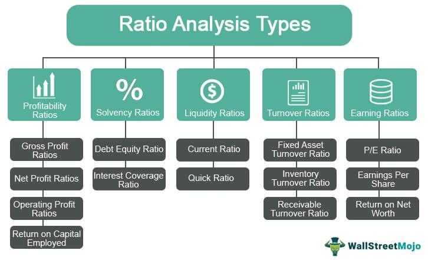

In the world of financial markets, understanding fundamental analysis ratios is crucial for making informed investment decisions. These tools offer investors a window into a company's financial health, guiding strategic decisions and minimizing risks. With the emergence of advanced technologies, the convergence of fundamental analysis, financial ratios, and algorithmic trading has opened new avenues for designing robust trading strategies. Algorithmic trading, with its ability to process vast amounts of data at high speed, has transformed market dynamics, leading to increased efficiency and reduced human error. Integrating fundamental analysis into these automated systems enhances their effectiveness by embedding a deeper understanding of market conditions and intrinsic value within trading algorithms.

Algorithmic strategies can now analyze financial ratios in real-time, identifying undervalued or overvalued assets based on criteria such as price-to-earnings (P/E) ratios, return on equity (ROE), and other vital indicators. This synthesis enables a more nuanced approach to trading, one that goes beyond mere price and volume analysis. As financial markets continue to evolve, the ability to meld these analytical frameworks is becoming increasingly pivotal for traders seeking a competitive edge. Understanding and applying these essential components can reveal lucrative market opportunities and foster more sophisticated investment methodologies.



## Table of Contents

## What is Fundamental Analysis?

Fundamental analysis is a systematic approach used to evaluate the intrinsic value of an asset by examining a wide array of economic, financial, and qualitative factors. It aims to provide investors with a comprehensive understanding of the asset's true worth, enabling informed investment decisions.

This approach involves several critical components:

1. **Financial Statements Analysis**: Fundamental analysis starts with a thorough examination of a company's financial statements, which include the balance sheet, income statement, and cash flow statement. These documents offer insights into a company's financial health, performance, and cash-generating ability. Analysts look for trends in revenues, expenses, profits, and debt to evaluate how well the company is managing its financial resources.

2. **Management Quality and Business Model**: The quality of a company’s management and its business model are pivotal in fundamental analysis. Management's ability to execute strategies effectively and adapt to market changes is crucial for sustained profitability. Fundamental analysts assess the strength of the business model by considering factors such as competitive advantage, market position, and innovation.

3. **Economic Indicators**: Analyzing macroeconomic factors is essential in fundamental analysis. Indicators such as Gross Domestic Product (GDP), inflation rates, employment levels, and interest rates provide a backdrop against which a company's performance can be gauged. These indicators help analysts predict how general economic trends could impact a company or industry.

4. **Valuation Discrepancies**: The primary goal of fundamental analysis is to determine whether an asset is overvalued or undervalued relative to its market price. This involves calculating an asset’s intrinsic value and comparing it to its current market price to identify investment opportunities. If the intrinsic value is higher than the market price, the asset might be undervalued, representing a potential buying opportunity.

5. **Integration of Macroeconomic and Microeconomic Factors**: Fundamental analysis combines both macroeconomic and microeconomic elements to provide a holistic view of an asset's value. Macroeconomic analysis includes the study of national and global economic conditions, while microeconomic analysis focuses on individual companies and industries.

6. **Use of Financial Ratios**: Financial ratios are indispensable tools in fundamental analysis. Ratios such as the price-to-earnings ratio (P/E), return on equity (ROE), and debt-to-equity ratio provide quick insights into a company's profitability, operational efficiency, and financial stability. These ratios enable analysts to compare companies within the same industry or sector effectively.

By examining these factors, fundamental analysts attempt to forecast future performance and identify securities that will generate attractive returns. This blend of quantitative data and qualitative insights helps investors construct a well-rounded investment strategy.

## Understanding Financial Ratios

Financial ratios are essential tools derived from a company's financial information, providing numerical values that help assess various aspects of financial performance. These ratios serve as critical benchmarks, allowing analysts and investors to compare company performance against industry standards or peer groups. They are categorized into several types, each serving a distinct purpose:

1. **Short-term Solvency Ratios**: These ratios determine a company’s ability to meet its short-term liabilities with short-term assets. The current ratio, calculated as the ratio of current assets to current liabilities, is a primary example. It helps determine the liquidity position of a firm, indicating its ability to cover short-term obligations.
$$
   \text{Current Ratio} = \frac{\text{Current Assets}}{\text{Current Liabilities}}

$$

2. **Turnover Ratios**: Turnover ratios measure how efficiently a company utilizes its assets. Inventory turnover, for instance, assesses how effectively inventory is being managed by indicating how often a company's inventory is sold and replaced over a period. It is calculated as the cost of goods sold divided by average inventory.
$$
   \text{Inventory Turnover} = \frac{\text{Cost of Goods Sold}}{\text{Average Inventory}}

$$

3. **Financial Leverage Ratios**: These ratios analyze the extent of a company's financial leverage, representing the proportion of debt used in the company’s capital structure. The debt-to-equity ratio is a common metric, calculated by dividing total liabilities by shareholders' equity, highlighting the balance between equity and debt used to finance a company’s assets.
$$
   \text{Debt-to-Equity Ratio} = \frac{\text{Total Liabilities}}{\text{Shareholders' Equity}}

$$

4. **Profitability Ratios**: Profitability ratios indicate a company’s ability to generate profit relative to revenue, assets, equity, or other financial metrics. The return on equity (ROE), calculated as net income divided by shareholders' equity, reflects a company’s efficiency in generating profits from shareholders' investments.
$$
   \text{Return on Equity (ROE)} = \frac{\text{Net Income}}{\text{Shareholders' Equity}}

$$

These ratios collectively provide insights into a company's operational efficiency and overall financial health. Evaluating these ratios helps analysts to understand a company's ability to generate profits, manage its resources effectively, meet its financial obligations, and use leverage judiciously. Using these data-driven insights, investors and stakeholders can make informed decisions about the financial stability and performance of a company.

## Key Financial Ratios in Fundamental Analysis

Short-term solvency ratios, such as the current ratio, are pivotal in assessing a company's [liquidity](/wiki/liquidity-risk-premium) position. The current ratio is defined as:

$$
\text{Current Ratio} = \frac{\text{Current Assets}}{\text{Current Liabilities}}
$$

This ratio indicates whether a company can cover its short-term obligations with its short-term assets, providing insight into its financial stability and liquidity.

Turnover ratios, like inventory turnover, measure a company’s efficiency in managing its assets. The formula for inventory turnover is:

$$
\text{Inventory Turnover} = \frac{\text{Cost of Goods Sold}}{\text{Average Inventory}}
$$

This reflects how often a company sells and replaces its stock of goods during a period, giving insight into sales efficiency and inventory management.

Financial leverage ratios, including the total debt ratio, assess the extent of financing a company uses through debt versus equity. The total debt ratio is calculated as:

$$
\text{Total Debt Ratio} = \frac{\text{Total Debt}}{\text{Total Assets}}
$$

This ratio highlights the proportion of a company’s assets that are financed by debt, helping investors understand the level of financial risk associated with the company.

Profitability ratios, such as net profit margin and earnings per share (EPS), gauge how effectively a company converts revenue into profit. The net profit margin is given by:

$$
\text{Net Profit Margin} = \frac{\text{Net Income}}{\text{Revenue}} \times 100
$$

This percentage shows how much of each dollar earned translates into profits after all expenses are deducted. Meanwhile, EPS, indicative of a company's profitability per share, is calculated using:

$$
\text{Earnings Per Share (EPS)} = \frac{\text{Net Income} - \text{Dividends on Preferred Stock}}{\text{Average Outstanding Shares}}
$$

These ratios offer crucial insights into a company’s operational efficiency and overall financial health. For investors, they are essential tools for screening and selecting stocks based on strong fundamentals, aiding in sound investment decisions.

## Incorporating Fundamental Analysis in Algo Trading

Algorithmic trading utilizes automated pre-programmed trading instructions to execute orders rapidly and efficiently. This modern method of trading benefits significantly from integrating [fundamental analysis](/wiki/fundamental-analysis), offering a robust framework for selecting securities based on intrinsic value. By embedding fundamental analysis principles within algorithmic strategies, traders can incorporate criteria such as price-to-earnings (P/E) ratios or return on equity (ROE) to identify undervalued securities and make informed trading decisions.

Implementing fundamental analysis in [algorithmic trading](/wiki/algorithmic-trading) involves developing algorithms capable of scanning markets using predefined fundamental criteria. For instance, an algorithm might be designed to filter stocks with a P/E ratio below a certain threshold or a high ROE. This approach enables the automation of traditional fundamental analysis processes, significantly enhancing execution speed and reducing potential human errors.

An essential aspect of this integration is access to reliable data sources and the appropriate computational tools. Traders can utilize these resources to backtest strategies founded on fundamental criteria, allowing them to refine and optimize their approaches before deploying them in live markets. Backtesting involves simulating a trading strategy using historical data to evaluate its potential profitability and risk. By doing so, traders can adjust their algorithms based on past market behaviors and enhance their strategies' resilience to future fluctuations.

Moreover, incorporating fundamental analysis in algorithmic trading supports the continuous monitoring of market conditions and adaptation to changes. For instance, traders can use Python libraries such as Pandas and NumPy to process financial data, evaluate financial ratios, and perform statistical analysis. Below is a simple Python example demonstrating how one might calculate a P/E ratio:

```python
import pandas as pd

# Sample financial data
data = {'Company': ['A', 'B', 'C'],
        'Market Price': [150, 80, 200],
        'Earnings per Share': [5, 8, 10]}

df = pd.DataFrame(data)

# Calculate P/E Ratio
df['P/E Ratio'] = df['Market Price'] / df['Earnings per Share']

print(df[['Company', 'P/E Ratio']])
```

In this example, the P/E ratio of different companies is calculated, which can be used as a criterion for developing an algorithmic trading strategy. By continuously refining algorithms using such financial metrics, traders can devise sophisticated strategies that align more closely with the intrinsic value of the securities being traded. This convergence of algorithmic trading with fundamental analysis represents a powerful evolution in trading approaches, presenting opportunities to gain competitive advantages in financial markets.

## Challenges and Considerations

Combining fundamental analysis with algorithmic trading presents several challenges. One primary issue is ensuring data accuracy, a crucial component when integrating financial metrics with automated trading systems. Accurate data is the backbone of effective trading algorithms. Errors or inconsistencies can lead to suboptimal decisions or significant financial losses. Handling qualitative information, such as management quality or business model analysis, adds another layer of complexity, as these are inherently subjective and difficult to quantify consistently in an algorithmic format.

Moreover, the lack of availability of real-time fundamental data poses a significant limitation, particularly for high-frequency trading strategies that rely on rapid data processing to make instantaneous trading decisions. Unlike market prices or technical indicators, fundamental data such as earnings reports or economic indicators may experience delayed releases, making it challenging to act on these insights promptly.

Keeping algorithms adaptive through systematic updates is vital for incorporating the latest financial statements and qualitative news. This need for up-to-date information necessitates continuous monitoring and integration of new data sets to refine trading models and strategies. This requirement underscores the importance of developing robust systems capable of swift adaptation to newly available data and evolving market conditions.

Additionally, implementing forward-looking assumptions can introduce risks, especially when algorithms are designed based on historical data, which may not always predict future market dynamics accurately. Planning is crucial to mitigate these risks, and traders must be vigilant about incorporating contingency strategies to address unexpected market shifts.

Despite these challenges, the integration of fundamental analysis within algorithmic trading frameworks offers significant potential for superior market insights. By equipping algorithms with comprehensive economic and financial indicators, traders can develop sophisticated models that identify undervalued assets with greater precision. This approach is particularly beneficial for sophisticated traders seeking to gain a strategic edge, as the combination of quantitative efficiency and fundamental depth supports enhanced decision-making in complex market environments.

## Conclusion

The integration of fundamental analysis with algorithmic trading presents a transformative approach for scrutinizing and capitalizing on market opportunities. Through the strategic use of financial ratios and fundamental insights, traders are empowered to formulate trading strategies that are not only more precise but also deeply informed by intrinsic asset values. This synthesis allows for a more nuanced understanding of market dynamics, guiding investment decisions that are rooted in comprehensive financial evaluations.

As technological advancements progress, the methodologies employed in analyzing and utilizing financial data are expected to become increasingly sophisticated. The ability to quickly process vast amounts of financial data through automated systems enhances the accuracy and speed of decision-making, offering a competitive advantage in fast-paced markets. For investors and traders, developing an expertise in the synergy between fundamental analysis and automated trading processes is becoming ever more critical.

Embracing the integration of these methodologies can yield significant advantages in the financial marketplace. By supplementing the speed and efficiency of algorithmic trading with the depth and accuracy of fundamental analysis, traders can gain a strategic edge over traditional approaches that may lack the same level of comprehensive insight. As the landscape of trading continues to evolve, those who adapt by incorporating these integrated strategies will likely find themselves better positioned to navigate and succeed in the complexities of modern financial markets.

## References & Further Reading

[1]: ["Financial Modeling for Algorithmic Trading Using Python"](https://www.freecodecamp.org/news/algorithmic-trading-in-python/) by Yves Hilpisch

[2]: Brennan, T. J., & Lo, A. W. (2011). ["The Origin of Behavior"](https://dspace.mit.edu/handle/1721.1/75346) The Quarterly Journal of Economics, MIT Press

[3]: ["Fundamentals of Financial Instruments: An Introduction to Stocks, Bonds, Foreign Exchange, and Derivatives"](https://onlinelibrary.wiley.com/doi/book/10.1002/9781119816621) by Sunil Parameswaran

[4]: Sadka, R. (2006). ["Momentum and post-earnings-announcement drift anomalies: Further evidence"](https://www.sciencedirect.com/science/article/pii/S0304405X05001819) The Review of Financial Studies, Oxford Academic

[5]: ["Handbook of Financial Time Series"](https://link.springer.com/book/10.1007/978-3-540-71297-8) Edited by Torben Gustav Andersen, among others

[6]: Bodie, Z., Kane, A., & Marcus, A. J. (2014). ["Investments"](https://www.mheducation.com/highered/product/Investments-Bodie.html) McGraw-Hill Education

[7]: ["Algorithmic Trading & DMA: An introduction to direct access trading strategies"](https://archive.org/details/algorithmictradi0000john) by Barry Johnson