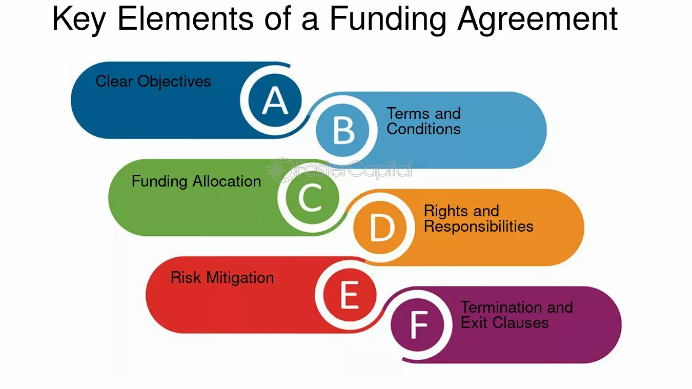

## Table of Contents

## What is a funding agreement?

A funding agreement is a contract between two parties where one party, usually an investor or a financial institution, agrees to provide money to the other party, often a business or a project. This agreement outlines the terms and conditions of the funding, including how much money will be given, when it will be given, and what the money can be used for. It also includes details about repayment, if the funding is a loan, or what the investor will get in return, if it's an investment.

These agreements are important because they help both parties understand their responsibilities and what they can expect from each other. For the party receiving the funds, it's crucial to know how and when they will get the money and what they need to do in return. For the party giving the funds, the agreement ensures that their money is used as intended and that they will get their investment back or see some benefit from it. This clarity helps prevent misunderstandings and disputes, making the funding process smoother and more reliable.

## What are the main types of funding agreements?

There are several main types of funding agreements, each designed for different needs and situations. One common type is a loan agreement, where a lender gives money to a borrower who promises to pay it back with interest over time. This is often used by businesses to finance operations or by individuals for personal needs like buying a house or a car. Another type is an equity agreement, where an investor gives money to a business in exchange for a share of ownership. This is popular with startups and growing companies that need capital but don't want to take on debt.

Another type of funding agreement is a grant, which is money given by a government or organization that doesn't need to be paid back. Grants are often used for specific projects or research and can be a great way to fund initiatives without adding financial burden. Lastly, there are convertible notes, which are a mix of debt and equity. With a convertible note, an investor loans money to a company, but instead of getting paid back with interest, the loan can be converted into equity at a later date, usually during a future funding round. This type is often used by early-stage startups to get quick funding without immediately setting a valuation.

## Who are the typical parties involved in a funding agreement?

The typical parties in a funding agreement are the funder and the recipient. The funder can be a bank, an investor, a government, or an organization. They give money to help the recipient do something, like start a business, run a project, or buy something important. The recipient can be a person, a business, or a group. They get the money and use it for what they need, following the rules set in the agreement.

Sometimes, there might be other people involved too. For example, if it's a big project, there might be a project manager who helps make sure the money is used right. Or, if it's a loan, there might be a guarantor who promises to pay back the loan if the recipient can't. But usually, it's just the funder and the recipient who sign the agreement and work together to make sure everything goes smoothly.

## What are the key components of a funding agreement?

A funding agreement has several important parts that help both the person giving the money and the person getting it know what to expect. One key part is the amount of money being given. This tells the recipient how much they will get and helps the funder keep track of their investment. Another important part is the schedule for when the money will be given. This can be all at once or spread out over time, depending on what the agreement says. The agreement also includes what the money can be used for, making sure it's spent the right way.

Another key component is the terms of repayment or return on investment. If it's a loan, the agreement will say how and when the money needs to be paid back, including any interest. If it's an investment, it will explain what the investor will get in return, like a share of the business or profits. The agreement also has rules and conditions that both parties need to follow. This can include things like reporting how the money is being used or meeting certain goals. These parts help make sure everyone understands their responsibilities and what will happen if things don't go as planned.

## How does a funding agreement differ from a loan agreement?

A funding agreement is a broader term that includes different ways money can be given to someone. It can be a loan, but it can also be an investment where the person giving the money gets a part of the business, or a grant that doesn't need to be paid back. A loan agreement is just one type of funding agreement where money is borrowed and has to be paid back with interest. The main difference is that a funding agreement can cover more types of money arrangements, while a loan agreement is specific to borrowing money.

In a funding agreement, the terms can vary a lot depending on what type it is. For example, if it's an investment, the agreement will talk about how much of the business the investor will own. If it's a grant, it will focus on how the money should be used and what reports need to be given. A loan agreement, on the other hand, will always include details like how much money is borrowed, the [interest rate](/wiki/interest-rate-trading-strategies), and the repayment schedule. So, while a loan agreement is a kind of funding agreement, not all funding agreements are loans.

## What are the benefits of entering into a funding agreement?

Entering into a funding agreement can help a lot. For the person or business getting the money, it means they can start new projects, grow their business, or solve money problems without using their own savings. This can be really important for new businesses that need money to get going or for bigger projects that need a lot of money. The agreement also makes things clear, so everyone knows what to expect. This can help avoid fights and make sure the money is used the right way.

For the person giving the money, a funding agreement can be a good way to make more money or help something they care about. If it's a loan, they can earn interest. If it's an investment, they might get a part of the business or profits. Even if it's a grant, they can feel good knowing their money is helping a cause they believe in. The agreement also protects them by setting rules on how the money should be used and what happens if things don't go as planned.

## What are the potential risks associated with funding agreements?

Entering into a funding agreement can have risks for both the person giving the money and the person getting it. For the person getting the money, one big risk is not being able to pay it back if it's a loan. This could lead to losing their business or personal property if they used it as a guarantee. If it's an investment, they might have to give up some control of their business, which could lead to disagreements with the investor. Also, if they don't follow the rules in the agreement, they might have to pay penalties or lose the funding.

For the person giving the money, the main risk is not getting their money back or not getting the return they expected. If it's a loan, the borrower might not be able to pay it back, and if it's an investment, the business might not do well, and they could lose their money. There's also the risk that the money might not be used the way they wanted, which could lead to legal problems or a waste of their money. Both sides need to be careful and understand the agreement well to avoid these risks.

## How is the performance of a funding agreement monitored and evaluated?

The performance of a funding agreement is monitored and checked to make sure the money is being used the right way and that everyone is following the rules. The person getting the money usually has to give regular reports to the person giving the money. These reports can include how much money has been spent, what it was spent on, and if the project or business is meeting its goals. Sometimes, there might be meetings or visits to check on progress in person. This helps make sure everything is going as planned and that any problems can be fixed quickly.

Evaluating the performance of a funding agreement involves looking at the reports and other information to see if the money is being used well and if the project or business is doing what it said it would. The person giving the money might look at things like how much money has been made, how many people have been helped, or if certain goals have been reached. If the agreement is a loan, they might check if the payments are being made on time. If it's an investment, they might look at how the business is growing and if it's making more money. This evaluation helps decide if the funding should continue or if changes need to be made.

## What legal considerations should be taken into account when drafting a funding agreement?

When making a funding agreement, it's important to think about the law. The agreement needs to follow the rules of the place where it's being used. This means checking local laws about loans, investments, and contracts. It's also good to make sure the agreement is clear and fair to both sides. This can help avoid fights later on. If the agreement is about a loan, it should say what happens if the money isn't paid back. If it's an investment, it should explain what the investor gets and what they can do if things go wrong.

Another thing to think about is how the agreement will be enforced. This means deciding which court will handle any problems and what laws will be used. It's also smart to include rules about what happens if one side doesn't follow the agreement. This could be paying a fine or losing the funding. Getting help from a lawyer can make sure all these legal points are covered and that the agreement is strong and clear.

## How can disputes arising from funding agreements be resolved?

Disputes in funding agreements can be settled in different ways. One common way is through talking and trying to work things out. This means both sides sit down and try to find a solution that works for everyone. If this doesn't work, they might go to mediation. In mediation, a neutral person helps both sides talk and find a solution. This can be faster and less expensive than going to court.

If talking and mediation don't solve the problem, the next step might be arbitration. In arbitration, both sides agree to let a neutral person or a panel decide the outcome. This decision is usually final and can't be changed. If all else fails, they might have to go to court. In court, a judge will listen to both sides and make a decision based on the law. Going to court can take a long time and cost a lot of money, so it's usually the last choice.

## What are some advanced strategies for negotiating funding agreements?

When negotiating funding agreements, it's smart to do a lot of research first. Find out what similar agreements look like and what other people are getting. This can help you know what to ask for and what's fair. It's also good to think about what you really need and what you can give up. This way, you can focus on the most important things and be ready to compromise on others. Building a good relationship with the other side can also help. If they trust you and feel like you're working together, they might be more willing to agree to what you want.

Another important strategy is to be clear and specific about what you want in the agreement. Write down all the details so there's no confusion later. It's also helpful to have a lawyer look over the agreement to make sure everything is legal and fair. Sometimes, it's good to think about creative solutions. For example, if the other side can't give you more money, maybe they can offer something else, like advice or connections. Being flexible and open to different ideas can lead to a better deal for everyone.

## How do international regulations impact the structuring of funding agreements?

When making funding agreements that cross borders, international rules can change how the agreement is set up. Different countries have their own laws about money, taxes, and contracts. This means that people making the agreement need to know the rules in each country involved. For example, some countries have strict rules about how much interest can be charged on loans, or they might have special taxes on money coming in from other places. This can affect how much money is given, how it's paid back, and what the agreement says about taxes.

Because of these different rules, it's important to plan carefully. People making the agreement might need to work with lawyers who know the laws in each country. They might also need to add special parts to the agreement to follow these rules. This could mean setting up the agreement in a way that works in all the countries involved, or even setting up the business in a different country where the rules are better. By understanding and following international regulations, both sides can make sure the funding agreement is strong and works well everywhere.

## References & Further Reading

[1]: Andersen, T. G., Bollerslev, T., & Diebold, F. X. (2005). ["Parametric and nonparametric volatility measurement."](https://www.nber.org/papers/w8160) In Handbook of Financial Econometrics.

[2]: Kissell, R. (Ed.). (2013). ["The Science of Algorithmic Trading and Portfolio Management."](https://www.sciencedirect.com/book/9780124016897/the-science-of-algorithmic-trading-and-portfolio-management) Academic Press.

[3]: Narang, R. K. (2013). ["Inside the Black Box: A Simple Guide to Quantitative and High Frequency Trading."](https://onlinelibrary.wiley.com/doi/book/10.1002/9781118662717) John Wiley & Sons.

[4]: Aldridge, I. (2013). ["High-Frequency Trading: A Practical Guide to Algorithmic Strategies and Trading Systems."](https://www.amazon.com/High-Frequency-Trading-Practical-Algorithmic-Strategies/dp/1118343506) John Wiley & Sons.

[5]: Harris, L. (2003). ["Trading and Exchanges: Market Microstructure for Practitioners."](https://www.amazon.com/Trading-Exchanges-Market-Microstructure-Practitioners/dp/0195144708) Oxford University Press.

[6]: Lo, A. W. (2007). ["Efficient markets hypothesis."](https://web.mit.edu/Alo/www/Papers/EMH_Final.pdf) In The New Palgrave: A Dictionary of Economics.