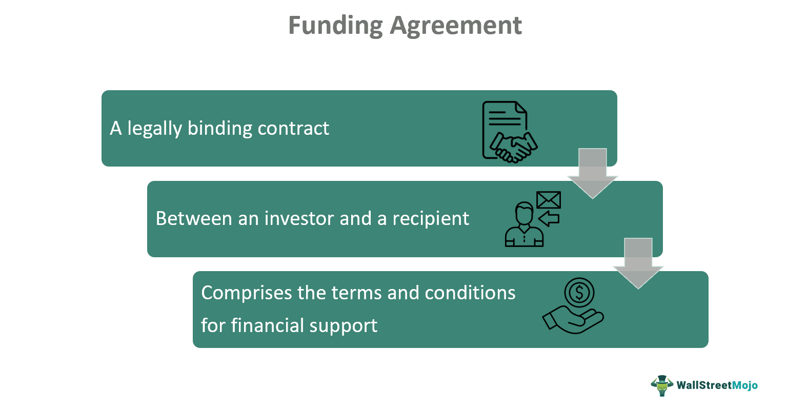

The world of investment is constantly evolving, with financial contracts, funding agreements, and algorithmic trading emerging as crucial components. This article will explore these elements, focusing on their roles in investment funding agreements and algorithmic trading. Understanding these concepts can empower investors to make informed decisions that align with their risk tolerance and investment goals. Each component plays a distinct role: financial contracts and funding agreements provide the framework necessary to manage investment activities with precision and responsibility, ensuring both compliance and strategic alignment.

Financial contracts are structured agreements between parties, specifying the terms and conditions under which financial transactions occur. These contracts, which include bonds, stocks, derivatives, and options, serve as the backbone of many investment strategies, facilitating risk management, securing returns, and ensuring legal compliance. By clearly defining the rights and obligations of each party, financial contracts act as a safeguard against disputes and misunderstandings, thereby enhancing investor confidence and stability in financial markets.



Funding agreements, on the other hand, directly relate to the securing of capital for various financial endeavors. These agreements, often favored in institutional investments, articulate the returns expected from investments, typically showcasing low-risk, fixed-income characteristics. Investors use funding agreements to preserve capital, drawing parallels to capital guarantee funds. The global nature and contractual nuances of funding agreements require a deep understanding to maximize their potential benefits while ensuring adherence to relevant regulations.

Algorithmic trading represents the technological forefront of investment strategies, using sophisticated algorithms to execute trades at high speeds and volumes. This method of trading optimizes execution processes, reducing human error and improving market liquidity. By automating the trading process, algorithmic strategies enable rapid response to market conditions, capitalizing on opportunities that would otherwise be inaccessible through manual trading. Regulatory frameworks ensure that these systems operate ethically and resiliently, maintaining order and stability in financial markets.

Together, financial contracts, funding agreements, and algorithmic trading form a comprehensive toolkit for modern investors. By leveraging these elements, investors can navigate the complexities of financial markets more effectively, aligning their strategies with individual risk tolerances and broader investment goals. As investment strategies continue to evolve with technological advancements, remaining informed and adaptable will be crucial for maximizing returns and managing associated risks.

## Table of Contents

## Understanding Financial Contracts

Financial contracts constitute the foundation of the investment landscape, acting as formal agreements that stipulate the terms and conditions under which financial transactions take place. These contracts are designed to provide structure and clarity, enabling both parties involved to understand their obligations and expectations, thereby minimizing potential disputes and misunderstandings.

A variety of financial contracts exist, each serving specific purposes within the investment ecosystem. Common types include:

1. **Bonds**: These are debt securities wherein the issuer promises to pay the bondholder a specified amount of interest for a defined term and to return the principal upon maturity. Bonds are crucial for raising capital and are considered less risky compared to stocks.

2. **Stocks**: Representing ownership in a company, stocks entitle shareholders to a portion of the corporation’s earnings and assets. The value of stocks can fluctuate based on company performance and market conditions, offering the potential for high returns at increased risk.

3. **Derivatives**: These contracts derive their value from an underlying asset, index, or interest rate. Common forms include futures, options, and swaps. Derivatives are extensively used for hedging risks or speculating on asset price movements.

4. **Options**: A type of derivative that gives the holder the right, but not the obligation, to buy or sell an asset at a fixed price before a specified date. Options are instrumental in various trading and risk management strategies.

The strategic application of these financial contracts allows investors to hedge against risks, aiming to secure returns while ensuring compliance with legal and regulatory standards. This is particularly important as regulatory bodies maintain strict oversight to protect market integrity and participant interests.

Moreover, the legal precision embedded in financial contracts is essential for risk mitigation. By clearly defining obligations, rights, and remedies, these contracts act as a preventive measure against potential disputes, ensuring a fair and orderly execution of financial transactions.

In summary, financial contracts are indispensable in managing investments effectively. They offer structural clarity, enabling risk assessment and regulatory compliance while providing avenues for potential returns. Whether through debt instruments like bonds or equity-based securities such as stocks, these contracts form the backbone of investment strategies designed to navigate the complexities of modern financial markets.

## Investment Funding Agreements

Investment funding agreements play a crucial role in the financial landscape by securing capital for a variety of financial endeavors. These agreements are formal contracts between issuers, often financial institutions or corporations, and investors, outlining the specific terms and conditions under which funds are invested and returns are generated. Such contracts are pivotal in defining the returns on lump-sum investments, ensuring that both parties are aligned in their expectations and responsibilities.

Typically, funding agreements are prevalent in institutional investments due to their low-risk, fixed-income characteristics. These contracts often resemble bonds or structured financial products that promise a guaranteed return, making them an attractive option for investors seeking capital preservation. The predictable nature of returns from these agreements makes them comparable to capital guarantee funds, which are designed to protect the principal investment while providing some level of return.

Understanding investment funding agreements also entails recognizing their global offerings and the intricate details of their contractual terms. These agreements can vary significantly across different jurisdictions and financial markets, reflecting local regulatory requirements and market practices. For instance, the structure of a funding agreement in the United States may differ from one in Europe or Asia, depending on regional financial regulations and investor preferences.

In managing these agreements, both issuers and investors must pay close attention to the contractual intricacies. These can include the duration of the agreement, the rate of return, clauses related to early withdrawal or termination, and any penalties associated with non-compliance. By carefully negotiating and drafting these terms, both parties can mitigate potential risks and align their financial goals.

Overall, investment funding agreements are vital instruments in the financial sector, offering a structured approach to [capital raising](/wiki/hedge-fund-capital-raising) and investment. By providing a stable and predictable income stream, they serve as a foundation for strategic financial planning and risk management in institutional investment portfolios.

## Algorithmic Trading in Financial Contracts

Algorithmic trading employs sophisticated algorithms to automate the execution of trades, optimizing strategies for efficiency and speed. By leveraging these algorithms, traders can swiftly analyze market data, identify potential trading opportunities, and execute orders within fractions of a second. This technological advancement is particularly useful in dealing with financial contracts such as derivatives, options, and futures, where rapid execution and precision can significantly impact profitability.

The execution of trades under financial contracts using [algorithmic trading](/wiki/algorithmic-trading) requires meticulous planning and implementation. Traders can employ statistical models, [machine learning](/wiki/machine-learning) techniques, or predefined instructions to predict market movements and respond accordingly. For instance, algorithms can be programmed to execute trades based on signals generated from technical indicators like moving averages or stochastic oscillators, enhancing the decision-making process.

Regulatory bodies, such as the Securities and Exchange Commission (SEC) in the United States and the European Securities and Markets Authority (ESMA) in Europe, enact stringent guidelines to ensure that algorithmic trading systems are resilient and ethically compliant. To prevent erratic market behaviors often associated with high-frequency trading ([HFT](/wiki/high-frequency-trading-strategies)), regulations require firms to maintain robust risk management frameworks. These include pre-trade controls, real-time monitoring, and post-trade analysis to detect and mitigate erroneous trades.

The adaptability and speed inherent in algorithmic trading render it a preferred strategy for market-making. Market makers, entities tasked with providing [liquidity](/wiki/liquidity-risk-premium) by continuously quoting both buy and sell prices, rely on algorithms to adjust their positions rapidly in response to market fluctuations. The speed of execution ensures market makers can maintain narrow bid-ask spreads, thus fostering liquidity and price stability in financial markets.

Ensuring robust systems and controls is essential in algorithmic trading to avert potential market disruptions. Techniques like circuit breakers, which temporarily halt trading to prevent undue [volatility](/wiki/volatility-trading-strategies), are crucial complements to algorithmic systems. Furthermore, continuous [backtesting](/wiki/backtesting) and stress testing of algorithms are necessary to evaluate their performance across various market conditions, ensuring trades are executed as intended even during tumultuous periods.

In summary, algorithmic trading is a vital component of modern financial markets, offering efficiency and speed in executing trades under financial contracts. The stringent regulatory landscape and technological advancements necessitate a thorough approach to developing and maintaining these systems, aiming for orderly trading environments and market stability.

## Integration of Funding Agreements and Algo Trading

The integration of funding agreements with algorithmic trading marks a significant advancement in the investment landscape, enhancing both liquidity and investment efficiency. Automated systems leverage sophisticated algorithms to manage portfolios that include funding agreements, allowing for dynamic adjustments based on prevailing market conditions. This approach not only reduces human error but also improves the overall management of portfolios, ensuring adherence to established contractual obligations, thereby increasing investor confidence.

Algorithmic trading strategies are designed to execute trades at optimal times and prices. By incorporating funding agreements into such systems, investors can benefit from the consistency and reliability of execution. Algorithms can analyze vast datasets to identify trends, enabling real-time decision-making that aligns with investment goals outlined in funding agreements. For example, an algorithm might be configured to rebalance a portfolio if market conditions trigger predefined thresholds, ensuring compliance with agreed-upon investment terms.

Continuous advancements in technology propel the synergy between funding agreements and algorithmic trading, positioning this integration at the forefront of investment innovation. Cutting-edge developments in machine learning and [artificial intelligence](/wiki/ai-artificial-intelligence) provide new capabilities for algorithms to learn and adapt, potentially increasing predictive accuracy and optimizing trade execution strategies.  

The flexibility of automated systems allows for sophisticated risk management approaches, addressing potential issues promptly. For instance, machine learning algorithms can be deployed to simulate various scenarios and assess potential impacts, ensuring that portfolios remain aligned with legal and contractual obligations even during market volatility.

Python, due to its extensive libraries and ease of use, often serves as a popular programming language for developing and testing these complex algorithms. Below is a basic Python snippet that illustrates how an algorithm can be used to trigger an action based on market changes:

```python
import pandas as pd

# Simulated market data and threshold
market_data = pd.Series([100, 102, 103, 101, 105])
threshold = 104

# Function to check market condition and adjust portfolio
def adjust_portfolio(data, threshold):
    for price in data:
        if price > threshold:
            print(f"Market price {price} exceeds threshold. Adjusting portfolio.")
        else:
            print(f"Market price {price} is within range. No action required.")

adjust_portfolio(market_data, threshold)
```

In conclusion, the integration of funding agreements and algorithmic trading provides a robust framework for enhancing investment practices. By continuously evolving with advances in algorithms and technology, this integration remains a pivotal driver of innovation in finance, empowering investors to achieve greater efficiency and reliability in their investment strategies.

## Risks and Considerations

Financial contracts and algorithmic trading provide significant advantages, yet they entail inherent risks that require careful management. One of the primary concerns is market volatility, which can lead to unexpected fluctuations in asset prices. High-frequency trading, typical in algorithmic strategies, can exacerbate this volatility. When many algorithms react simultaneously to market movements, it may amplify price swings, leading to a less stable trading environment.

System malfunctions pose another risk. Algorithms operate on complex code bases and rely heavily on technology infrastructure. Any errors in the algorithm's design, bugs, or hardware failures can result in substantial financial losses. A famous example is the 2010 “Flash Crash,” where the Dow Jones Industrial Average dropped about 1,000 points before quickly recovering, largely due to automated trading errors.

Changes in regulatory environments can also impact financial contracts and algorithmic trading strategies. Regulations are constantly evolving as market dynamics change and new technologies emerge. Compliance with these regulations is crucial, as non-compliance can lead to legal repercussions, including fines and trading restrictions. Regulatory bodies such as the Securities and Exchange Commission (SEC) and the Commodity Futures Trading Commission (CFTC) in the United States monitor and implement rules to promote fair and orderly markets.

Investors must remain vigilant about these changing conditions and ensure that their investment strategies comply with current legal standards. Comprehensive contracts with clear terms and robust systems that include fail-safes can mitigate many risks. Contracts need to explicitly outline the rights and obligations of each party and include clauses that address potential disruptions.

Evaluating the risk-return trade-off is crucial in establishing a balanced investment strategy. This involves quantifying potential risks and comparing them with the expected returns. One way to assess this balance is through metrics such as the Sharpe Ratio, which measures return per unit of risk. Optimizing this ratio helps in identifying strategies that maximize returns while minimizing exposure to unexpected market changes.

In conclusion, while the benefits of financial contracts and algorithmic trading are undeniable, they require diligent oversight. Investors who understand and proactively manage these risks can better navigate the complexities of modern financial markets.

## Conclusion

Financial contract investment funding agreements and algorithmic trading are indispensable components of contemporary financial systems. These instruments and technologies significantly enhance capital preservation and optimize investment strategies by providing structured agreements and automated trading capabilities. Understanding their mechanisms allows investors to navigate the intricate landscape of financial markets with heightened efficacy.

As technology continues to progress, staying informed and adaptable becomes increasingly crucial for leveraging these advancements to secure future financial gains. The rapid pace of innovation in algorithmic trading and the evolving nature of financial contracts require investors to remain vigilant and responsive to new developments.

Investors who skillfully harness these tools can effectively achieve their investment objectives while managing the inherent risks. The judicious integration of algorithmic trading with investment funding agreements offers a significant advantage, optimizing portfolio management and improving execution strategies. Ultimately, the strategic use of these financial instruments can facilitate a balanced approach to capital allocation, ensuring both stability and growth in a dynamic economic environment.

## References & Further Reading

[1]: Andersen, T. G., Bollerslev, T., & Diebold, F. X. (2005). ["Parametric and nonparametric volatility measurement."](https://www.nber.org/papers/w8160) In Handbook of Financial Econometrics.

[2]: Kissell, R. (Ed.). (2013). ["The Science of Algorithmic Trading and Portfolio Management."](https://www.sciencedirect.com/book/9780124016897/the-science-of-algorithmic-trading-and-portfolio-management) Academic Press.

[3]: Narang, R. K. (2013). ["Inside the Black Box: A Simple Guide to Quantitative and High Frequency Trading."](https://onlinelibrary.wiley.com/doi/book/10.1002/9781118662717) John Wiley & Sons.

[4]: Aldridge, I. (2013). ["High-Frequency Trading: A Practical Guide to Algorithmic Strategies and Trading Systems."](https://www.amazon.com/High-Frequency-Trading-Practical-Algorithmic-Strategies/dp/1118343506) John Wiley & Sons.

[5]: Harris, L. (2003). ["Trading and Exchanges: Market Microstructure for Practitioners."](https://www.amazon.com/Trading-Exchanges-Market-Microstructure-Practitioners/dp/0195144708) Oxford University Press.

[6]: Lo, A. W. (2007). ["Efficient markets hypothesis."](https://web.mit.edu/Alo/www/Papers/EMH_Final.pdf) In The New Palgrave: A Dictionary of Economics.