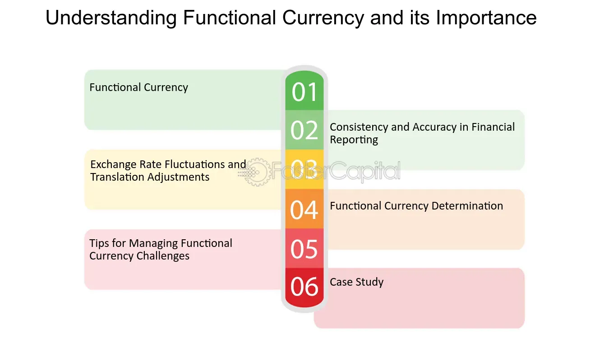

## Table of Contents

## What is a funding currency?

A funding currency is the money that traders use to borrow when they want to buy another currency. It is often a currency from a country with low interest rates. Traders use this borrowed money to invest in a currency that they think will increase in value or has higher interest rates. This way, they can make a profit from the difference in interest rates or from the rise in the value of the other currency.

For example, if a trader borrows Japanese yen, which usually has a low interest rate, and uses it to buy U.S. dollars, which might have a higher interest rate, they are using the yen as a funding currency. This strategy is called the carry trade. It can be risky because if the value of the U.S. dollar falls against the yen, the trader could lose money. But if it works, the trader can earn money from the interest rate difference and any increase in the value of the dollar.

## How does a funding currency work in financial markets?

In financial markets, a funding currency is the money that traders borrow to buy another currency. It's usually from a country with low interest rates. Traders borrow this money because it's cheaper. They then use it to buy a currency from a country with higher interest rates or one they think will go up in value. This strategy is called the carry trade. The idea is to make money from the difference in interest rates or from the currency's value going up.

For example, a trader might borrow Japanese yen, which often has a low [interest rate](/wiki/interest-rate-trading-strategies), and use it to buy U.S. dollars, which might have a higher interest rate. If the U.S. dollar's value goes up or the interest rate stays higher than the yen's, the trader makes a profit. But it's not always safe. If the U.S. dollar's value goes down compared to the yen, the trader could lose money. So, using a funding currency can be a good way to make money, but it also comes with risks.

## What are the common characteristics of a funding currency?

A funding currency usually comes from a country with low interest rates. This makes it cheaper for traders to borrow. Countries like Japan often have low interest rates, so their currency, the yen, is often used as a funding currency. Because it's cheaper to borrow, traders can use this money to buy other currencies that they think will go up in value or have higher interest rates.

Another common characteristic of a funding currency is that it is stable. Traders want a currency that won't change a lot in value because they are borrowing it to invest in other currencies. If the funding currency's value stays the same, it's easier for traders to predict their profits. This stability makes currencies from countries with strong economies more likely to be used as funding currencies.

Overall, a funding currency needs to be cheap to borrow and stable in value. These characteristics help traders make money by borrowing this currency and investing in others with potentially higher returns. But, using a funding currency can be risky if the value of the currency they invest in goes down.

## Which currencies are typically used as funding currencies?

The Japanese yen is one of the most common funding currencies. Japan often has very low interest rates, which makes it cheap for traders to borrow yen. Because Japan's economy is stable, the yen doesn't change a lot in value. This stability and low cost make the yen a popular choice for traders who want to borrow money to invest in other currencies.

Another currency often used as a funding currency is the Swiss franc. Like Japan, Switzerland usually has low interest rates. The Swiss franc is also known for being stable, which makes it attractive for traders. They can borrow Swiss francs cheaply and use them to buy other currencies that might have higher interest rates or are expected to increase in value.

Sometimes, the U.S. dollar can also be used as a funding currency, but this is less common. It depends on the interest rates in the U.S. compared to other countries. If U.S. interest rates are low compared to other countries, traders might borrow dollars to invest in currencies with higher interest rates. But because the U.S. dollar is often seen as a strong and stable currency, it's not as commonly used for this purpose as the yen or the Swiss franc.

## How do interest rates influence the choice of a funding currency?

Interest rates are a big reason why traders pick a funding currency. A funding currency comes from a country with low interest rates. This makes it cheaper for traders to borrow that money. For example, if Japan has a low interest rate, traders can borrow Japanese yen at a low cost. They then use this yen to buy other currencies that have higher interest rates or are expected to go up in value. The difference between the low interest rate they pay to borrow the yen and the higher interest rate they earn from the other currency can make them money.

But, interest rates are not the only thing that matters. The stability of the funding currency is also important. Traders want a currency that doesn't change a lot in value. If the funding currency stays stable, it's easier for traders to predict their profits. This is why currencies like the Japanese yen and the Swiss franc are popular funding currencies. They come from countries with low interest rates and stable economies. So, when choosing a funding currency, traders look for a mix of low interest rates and stability to make their investment strategy work.

## What is the role of a funding currency in carry trade strategies?

In [carry](/wiki/carry-trading) trade strategies, a funding currency is the money that traders borrow to buy another currency. They pick a funding currency from a country with low interest rates because it's cheaper to borrow. For example, if Japan has low interest rates, traders might borrow Japanese yen. They then use this yen to buy a currency from a country with higher interest rates, like the U.S. dollar. The goal is to make money from the difference between the low interest rate they pay to borrow the yen and the higher interest rate they earn from the U.S. dollar.

The funding currency needs to be stable too. Traders want a currency that doesn't change a lot in value because it makes their profits easier to predict. If the funding currency stays the same, traders can focus on the currency they bought with it. If the currency they bought goes up in value or keeps a higher interest rate, they make money. But if the funding currency's value changes a lot, it can mess up their plans. So, a good funding currency is both cheap to borrow and stable, like the Japanese yen or the Swiss franc.

## How does the choice of funding currency affect forex trading?

The choice of funding currency can really change how [forex](/wiki/forex-system) trading works. Traders pick a funding currency from a country with low interest rates because it's cheaper to borrow. For example, if Japan has low interest rates, traders might borrow Japanese yen. They then use this yen to buy a currency from a country with higher interest rates, like the U.S. dollar. The goal is to make money from the difference between the low interest rate they pay to borrow the yen and the higher interest rate they earn from the U.S. dollar. This strategy is called the carry trade.

But the funding currency needs to be stable too. Traders want a currency that doesn't change a lot in value because it makes their profits easier to predict. If the funding currency stays the same, traders can focus on the currency they bought with it. If the currency they bought goes up in value or keeps a higher interest rate, they make money. But if the funding currency's value changes a lot, it can mess up their plans. So, choosing a funding currency that is both cheap to borrow and stable, like the Japanese yen or the Swiss franc, is important for successful forex trading.

## What are the risks associated with using a funding currency?

Using a funding currency can be risky. One big risk is that the value of the funding currency might change a lot. If traders borrow a currency like the Japanese yen and its value goes up, it can make their investment more expensive. They might lose money if the currency they bought with the yen doesn't go up enough to cover the cost. This can happen if the market changes suddenly or if there's a big event that affects the funding currency's value.

Another risk is interest rate changes. If the interest rates in the country of the funding currency go up, it becomes more expensive for traders to borrow that money. This can eat into their profits or even turn their investment into a loss. Traders have to watch the interest rates closely and be ready to change their plans if rates start to rise. So, while using a funding currency can help traders make money, it also comes with risks that they need to be careful about.

## How do global economic conditions impact the effectiveness of a funding currency?

Global economic conditions can really change how well a funding currency works. If the economy of the country with the funding currency is doing well and its interest rates are low, it's easier for traders to borrow that money. They can use it to buy other currencies that might be doing better or have higher interest rates. But if the global economy gets shaky, it can mess things up. For example, if there's a big economic crisis, the value of the funding currency might go up because people want safe places to put their money. This can make it more expensive for traders to borrow, which can hurt their profits.

Also, changes in global interest rates can affect the funding currency. If interest rates around the world start to go up, the funding currency might not be as cheap to borrow anymore. This can make the carry trade less profitable because the difference between the interest rates gets smaller. Traders need to keep an eye on what's happening in the world economy and be ready to change their plans if things start to shift. So, while a funding currency can help traders make money, it's important to understand how global economic conditions can change the game.

## Can the value of a funding currency fluctuate, and if so, how?

Yes, the value of a funding currency can go up and down. This can happen because of many reasons. One big reason is changes in the country's economy. If the economy is doing well, people might want to buy more of that country's currency, which can make its value go up. But if the economy is not doing well, the value might go down. Also, if there's a big event like a financial crisis, people might want to move their money to safer places, which can change the value of the funding currency.

Another reason the value of a funding currency can change is because of interest rates. If the interest rates in the country of the funding currency go up, it can make the currency more expensive to borrow. This can make traders want to borrow less of it, which can make its value go down. On the other hand, if interest rates go down, it can make the currency cheaper to borrow, which might make its value go up. So, the value of a funding currency can fluctuate a lot, and traders need to watch these changes closely to make good decisions.

## What advanced strategies can traders employ with funding currencies?

Traders can use advanced strategies with funding currencies to try to make more money. One strategy is called currency hedging. This means they borrow a funding currency and buy another currency, but they also use tools like options or futures to protect themselves from big changes in the value of the funding currency. If the funding currency's value goes up a lot, the hedging can help them not lose too much money. This way, they can still make money from the difference in interest rates without worrying too much about the funding currency's value changing.

Another strategy is called dynamic carry trade. In this strategy, traders keep changing which funding currency they use based on what's happening in the world economy. If they see that one country's interest rates are going down, they might switch to borrowing from a different country with lower rates. They also watch the value of the currencies they are buying and selling. If they think a currency they bought is going to go down in value, they might sell it and buy a different one. This way, they can try to make the most money by always using the best funding currency and buying the best currencies at the right time.

## How do central bank policies affect the selection and performance of funding currencies?

Central bank policies can really change which currency traders pick as a funding currency and how well it works. If a central bank keeps interest rates low, like the Bank of Japan often does, traders might choose that country's currency as a funding currency because it's cheaper to borrow. But if the central bank starts to raise interest rates, borrowing that currency becomes more expensive. This can make traders look for a different funding currency from a country with lower interest rates. So, central bank policies on interest rates are a big deal when traders are deciding which currency to use.

Also, central bank policies can affect how well a funding currency performs. If a central bank does things to make its currency more stable, like buying and selling its own currency to control its value, it can be a good choice for a funding currency. Traders like stable currencies because they can predict their profits better. But if a central bank's policies make the currency's value go up and down a lot, it can be risky for traders. They might lose money if the funding currency's value changes too much. So, traders need to watch what central banks are doing to pick the best funding currency and make sure their strategy works well.

## References & Further Reading

[1]: ["Quantitative Trading: How to Build Your Own Algorithmic Trading Business"](https://www.amazon.com/Quantitative-Trading-Build-Algorithmic-Business/dp/1119800064) by Ernest P. Chan

[2]: ["Advances in Financial Machine Learning"](https://www.amazon.com/Advances-Financial-Machine-Learning-Marcos/dp/1119482089) by Marcos Lopez de Prado

[3]: Bergstra, J., Bardenet, R., Bengio, Y., & Kégl, B. (2011). ["Algorithms for Hyper-Parameter Optimization."](https://dl.acm.org/doi/10.5555/2986459.2986743) Advances in Neural Information Processing Systems 24.

[4]: ["Evidence-Based Technical Analysis: Applying the Scientific Method and Statistical Inference to Trading Signals"](https://www.amazon.com/Evidence-Based-Technical-Analysis-Scientific-Statistical/dp/0470008741) by David Aronson

[5]: ["Machine Learning for Algorithmic Trading"](https://github.com/stefan-jansen/machine-learning-for-trading) by Stefan Jansen