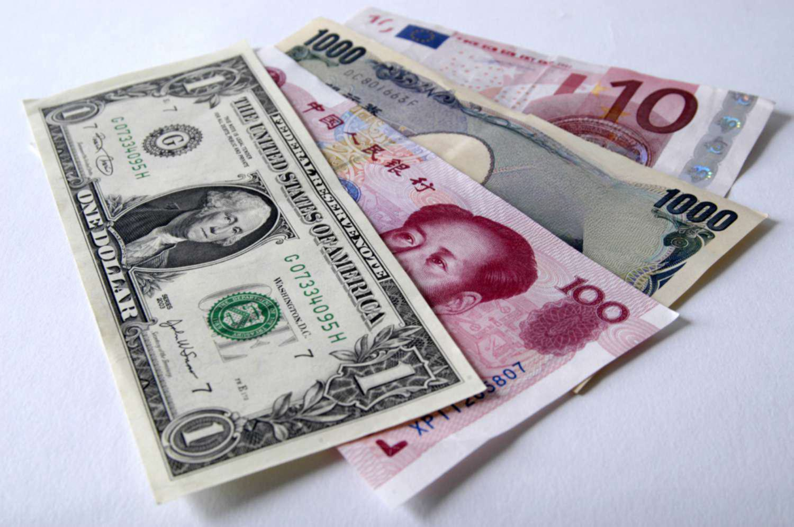

The landscape of financial trading has significantly transformed over recent decades, driven primarily by technological advancements. This transformation has introduced sophisticated tools and methodologies that have reshaped various aspects of trading. This article examines the complex interplay between financial instruments, funding currencies, currency markets, and algorithmic trading, each playing a crucial role in the modern financial ecosystem.

Algorithmic trading, in particular, has revolutionized financial market operations. By utilizing computer algorithms to execute trades at high speed and accuracy, algorithmic trading enhances efficiency and reduces transaction costs. It allows traders to analyze vast datasets quickly and execute trades with precision, leading to more strategic market participation. This technological innovation not only accelerates decision-making but also minimizes human errors, fundamentally altering the dynamics of trading activities.



Equally important are financial instruments and funding currencies, which are integral to the financial markets. Financial instruments, including stocks, bonds, commodities, and derivatives, form the foundation of trading strategies aimed at achieving diverse financial objectives. They act as vehicles facilitating the flow of capital across different sectors and markets.

Funding currencies also hold a pivotal position in international finance, especially within carry trades—where traders exploit interest rate differentials by borrowing in low-interest-rate currencies to invest in higher-yielding ones. The Japanese Yen and Swiss Franc are often used as funding currencies due to their historically low-interest rates, influencing global trade and investment flows.

Understanding these components and how they interact is essential for investors looking to navigate the currency markets effectively. Market participants can enhance their decision-making by recognizing how these elements contribute to market dynamics and financial stability. As the financial world continues to evolve, this knowledge becomes increasingly vital for adapting to changing conditions and seizing new opportunities in the global marketplace.

## Table of Contents

## Understanding Financial Instruments

Financial instruments, often categorized as stocks, bonds, commodities, and derivatives, form the backbone of modern financial markets. These instruments are essentially contracts that can be bought, sold, or traded, each serving distinct purposes and offering various advantages to investors.

Stocks represent ownership stakes in a company, granting shareholders a claim on part of the company’s assets and earnings. Investors use stocks to potentially benefit from capital appreciation, as well as dividends paid by the company. Bonds, on the other hand, are debt instruments that signify a loan made by an investor to a borrower, typically corporate or governmental. The borrower agrees to pay back the principal along with interest, providing a predictable income stream for the bondholder.

Commodities, including tangible goods like gold, oil, and agricultural products, offer another avenue for investment. These are often used to hedge against inflation or currency risk, as their prices may move independently from financial markets. Finally, derivatives are complex instruments deriving their value from an underlying asset. This category includes futures, options, and swaps, which allow investors to speculate on the future price movements of these assets or hedge against potential losses.

In financial markets, these instruments facilitate the flow of funds by acting as vehicles for investment and speculation. They enable investors to execute strategies aimed at achieving specific financial goals, such as wealth accumulation, risk management, and income generation. By selecting an appropriate mix of financial instruments, investors can tailor their portfolios to reflect their risk tolerance, investment horizon, and market outlook. The interplay of these instruments ensures [liquidity](/wiki/liquidity-risk-premium) and efficiency in financial markets, as they can be readily exchanged, thus enabling a continual redistribution of capital to optimize economic outcomes.

## The Role of Funding Currency

Funding currency is a pivotal element in international finance, primarily used in strategies such as [carry](/wiki/carry-trading) trades. A carry trade involves borrowing money in a currency with a low-[interest rate](/wiki/interest-rate-trading-strategies)—known as the funding currency—and converting it into a currency with a higher interest rate. The trader then invests in financial instruments denominated in the higher-yielding currency. The profit in carry trades arises from the interest rate differentials between the two currencies.

The strategy of using funding currencies is especially significant in foreign exchange markets. Traders target currencies with predictable interest rate disparities to secure returns. The funding currency's interest rate environment is crucial; lower rates mean cheaper borrowing costs, making it more attractive for investors to leverage positions.

The Japanese Yen (JPY) and Swiss Franc (CHF) are among the most popular funding currencies. Both have historically maintained low-interest rates, prompting their widespread use in carry trades. For instance, the Bank of Japan has consistently set low policy rates in efforts to stimulate economic growth and combat deflationary pressures. Similarly, the Swiss National Bank has upheld low rates to manage its currency's strength and economic stability.

The mechanics of carry trades involving funding currencies can be influenced by several factors, including economic indicators, monetary policies, and geopolitical conditions. These trades carry risk, particularly if the funding currency appreciates against the target currency, which can offset interest gains.

In summary, funding currencies facilitate strategic investment practices by leveraging interest rate differentials, contributing to capital flows across global markets. Understanding the dynamics behind funding currencies helps investors capitalize on global financial opportunities while managing potential risks.

## Currency Markets and Their Dynamics

Currency markets, widely referred to as foreign exchange ([forex](/wiki/forex-system)) markets, stand as the largest financial markets globally, with daily trading volumes surpassing several trillion dollars. These markets facilitate the conversion and exchange of currencies, thereby playing an essential role in global trade and investment. By determining exchange rates, forex markets immensely influence the flow of international capital and the balance of trade.

The dynamics governing currency markets are complex and multifaceted, heavily reliant on several factors. Economic indicators such as gross domestic product (GDP) growth rates, employment figures, trade balances, and inflation rates significantly sway currency valuations and market sentiments. For instance, a higher GDP growth rate often correlates to a stronger currency, as it reflects a robust economy.

Geopolitical tensions also exert considerable influence on currency markets. Political instability, conflicts, and diplomatic relations between countries can lead to rapid shifts in market confidence, affecting currency demand and consequently, exchange rates. The uncertainty associated with geopolitical events often leads investors to seek safe-haven currencies, such as the U.S. Dollar or Swiss Franc, which are perceived as more stable during tumultuous times.

Monetary policy, determined by central banks, is another pivotal element affecting currency markets. Central banks manipulate interest rates and engage in open market operations to control money supply and achieve economic objectives. For example, a decision to increase interest rates can attract foreign investment seeking higher returns, leading to an appreciation of the domestic currency. Conversely, quantitative easing — the purchase of government securities to increase money supply — can lead to currency depreciation.

Market participants, including banks, financial institutions, corporations, and individual traders, engage in the forex market for purposes such as hedging risk, speculative trading, or executing international business transactions. The forex market operates as an over-the-counter (OTC) market, without a centralized exchange, allowing it to function 24 hours a day, five days a week, across different time zones.

Technological advancements have transformed how currency markets operate. The proliferation of [algorithmic trading](/wiki/algorithmic-trading) offers enhanced speed and efficiency, allowing traders to execute transactions based on pre-determined criteria. Nonetheless, the introduction of such technology has also added layers of complexity to market dynamics, necessitating a deeper understanding of both technological and economic factors.

In summary, currency markets are integral to the global economy, offering a platform for currency exchange and speculation. Their dynamics are shaped by a myriad of influences, including economic indicators, geopolitical events, and monetary policies. As these factors interact and evolve, they continually reshape the landscape of currency trading.

## Algorithmic Trading in the Currency Markets

Algorithmic trading has become an integral component of the currency markets, employing sophisticated computer algorithms to execute trades that adhere to specific criteria, including timing, price, and [volume](/wiki/volume-trading-strategy). This method capitalizes on the ability of computers to process and analyze vast datasets at a speed that is unattainable by human traders, thus enhancing the efficiency of trading operations within the forex markets.

The capacity of algorithmic trading systems to rapidly process and interpret data is a key reason for their widespread adoption in currency markets. These systems continuously monitor market conditions, making trading decisions based on real-time input. This capability is particularly advantageous in a market where prices can fluctuate within milliseconds, enabling traders to seize opportunities that would otherwise be missed.

A significant branch of algorithmic trading is high-frequency trading ([HFT](/wiki/high-frequency-trading-strategies)), which seeks to capture small price discrepancies that occur in fractions of a second. HFT operates by employing algorithms that execute a large number of orders at extremely high speeds, often within milliseconds. The primary objective is to capitalize on very short-term market inefficiencies. For instance, HFT traders may exploit [arbitrage](/wiki/arbitrage) opportunities arising from minor discrepancies in currency prices across different trading platforms. 

Algorithmic trading systems in the currency markets often incorporate advanced predictive models that analyze historical price patterns, [volatility](/wiki/volatility-trading-strategies) indices, and a myriad of other financial indicators to forecast future movements. These systems can also execute strategies like [trend following](/wiki/trend-following), mean reversion, or [statistical arbitrage](/wiki/statistical-arbitrage), often with minimal human intervention.

The implementation of such systems requires robust technological infrastructure and involves significant investment in both hardware and software. The algorithms themselves are typically developed using programming languages such as Python, which offers extensive libraries for data analysis and [machine learning](/wiki/machine-learning), or C++, known for its execution speed. A simplified example of a Python-based trading algorithm could involve importing historical data, calculating moving averages, and executing buy or sell orders based on those calculations. For example:

```python
import pandas as pd

# Loading historical currency data
data = pd.read_csv('currency_data.csv')

# Calculating short and long moving averages
short_mavg = data['Close'].rolling(window=40).mean()
long_mavg = data['Close'].rolling(window=100).mean()

# Generating trading signals
data['Signal'] = 0
data['Signal'][40:] = np.where(short_mavg[40:] > long_mavg[40:], 1, 0)

# Calculating positions
data['Position'] = data['Signal'].diff()

# Display first few rows
print(data.head())
```

While algorithmic trading significantly enhances market efficiency, it also introduces unique challenges. These include increased market volatility due to rapid trading speeds and the potential for systemic risks arising from technological failures. Moreover, the ethical implications of using such advanced technologies, particularly concerning fairness and transparency, remain subjects of ongoing debate within the financial community.

Overall, the rise of algorithmic trading in currency markets highlights the ongoing evolution of trading practices, driven by advancements in technology and data science. As these systems continue to develop, they will likely play an even more prominent role in shaping the dynamics of the forex market.

## Benefits and Challenges of Algo Trading

Algorithmic trading, commonly referred to as algo trading, offers significant advantages across various dimensions of the financial markets. One of the primary benefits is the improvement in market liquidity. By automating trades, algorithmic systems can execute large orders efficiently without significantly affecting the market price. This liquidity provides stability, allowing for tighter spreads and more precise pricing, ultimately benefiting all market participants.

Another notable advantage is the reduction in trading costs. By automating the trading process, algo trading minimizes the need for manual intervention, leading to lower transaction costs. The elimination of human error further contributes to this cost efficiency, as systems can execute trades with high accuracy and consistency. For large financial institutions and hedge funds, these cost savings can translate into substantial financial benefits over time.

Despite these benefits, algorithmic trading also presents several challenges. One significant issue is the potential for increased market volatility. The rapid execution of large volumes of trades can lead to abrupt price movements, sometimes exacerbating market instability. Historical events, such as the 2010 Flash Crash, illustrate how algorithmic systems can contribute to sudden market disruptions.

Technological glitches are another concern. With algorithmic trading systems relying heavily on technology, any hardware or software malfunction can lead to substantial financial losses. Ensuring system robustness and implementing rigorous testing protocols are crucial to mitigating these risks.

Ethical concerns related to fairness and transparency also arise in the context of algorithmic trading. The opaque nature of some algorithmic strategies can lead to perceptions of an uneven playing field, where certain market participants might have an undue advantage. Balancing innovation with regulatory standards aimed at promoting transparency and fairness remains a key challenge for regulators.

The landscape of algorithmic trading is continuously being reshaped by advancements in [artificial intelligence](/wiki/ai-artificial-intelligence) (AI) and machine learning. These technologies enhance the predictive capabilities of trading algorithms, enabling them to process vast datasets and identify complex patterns that were previously undetectable. For example, machine learning can improve trading strategy adaptation to changing market conditions. New algorithms can be trained to learn from past data and adjust their decision-making processes, leading to more effective trade executions.

In summary, while algorithmic trading enhances market efficiency and reduces costs, it also introduces complexities that require careful management. Ongoing technological developments offer promising avenues for further refining these systems, ensuring they remain beneficial and ethical components of modern financial markets.

## Conclusion

The integration of financial instruments, funding currencies, and algorithmic trading is significantly influencing the evolution of currency markets. Financial instruments such as derivatives and commodities provide diverse options for trading strategies, while funding currencies facilitate operations by exploiting interest rate differentials. The use of algorithmic trading enhances this environment by offering unprecedented speed and efficiency, allowing traders to capitalize on minute market changes.

These components create a complex yet dynamic landscape, demanding that market participants remain informed and adaptable. As technology advances, understanding the interplay between these elements becomes increasingly vital. This involves not merely recognizing technological changes but also grasping their implications on traditional trading practices and modern economic contexts.

As market conditions and technology progress, informed stakeholders have the potential to craft more strategic investment decisions. This requires a keen awareness of both current systems and prospective developments. Being astute and proactive is crucial for anyone aiming to thrive amidst these evolving markets, ensuring decisions that maximize both opportunity and efficiency. 

In conclusion, the landscape is ever-changing, and those equipped with knowledge of these sophisticated interactions are likely to lead the way in innovative trading and investment strategies. The interaction among financial tools, funding mechanics, and high-speed algorithmic methods is not only reshaping currency trading but also setting the stage for its future trajectory.

## References & Further Reading

[1]: ["Quantitative Trading: How to Build Your Own Algorithmic Trading Business"](https://www.amazon.com/Quantitative-Trading-Build-Algorithmic-Business/dp/1119800064) by Ernest P. Chan

[2]: ["Advances in Financial Machine Learning"](https://www.amazon.com/Advances-Financial-Machine-Learning-Marcos/dp/1119482089) by Marcos Lopez de Prado

[3]: Bergstra, J., Bardenet, R., Bengio, Y., & Kégl, B. (2011). ["Algorithms for Hyper-Parameter Optimization."](https://dl.acm.org/doi/10.5555/2986459.2986743) Advances in Neural Information Processing Systems 24.

[4]: ["Evidence-Based Technical Analysis: Applying the Scientific Method and Statistical Inference to Trading Signals"](https://www.amazon.com/Evidence-Based-Technical-Analysis-Scientific-Statistical/dp/0470008741) by David Aronson

[5]: ["Machine Learning for Algorithmic Trading"](https://github.com/stefan-jansen/machine-learning-for-trading) by Stefan Jansen