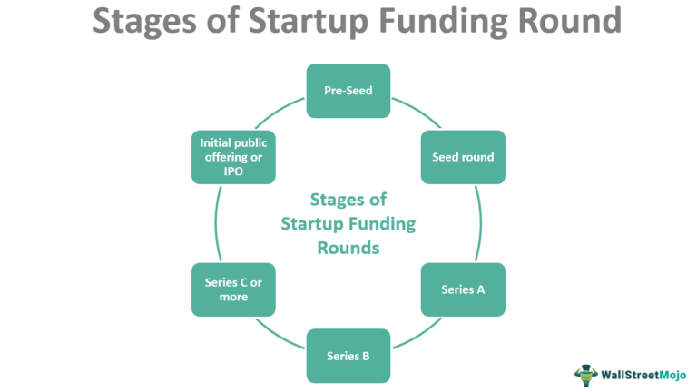

Algorithmic trading, commonly referred to as algo trading, is significantly reshaping financial markets by leveraging advanced computer algorithms to automate and execute trading decisions with precision and speed. This technological advancement not only enhances the efficiency of trading operations but also ensures optimal conditions for executing trades, thus maximizing profitability. As algo trading becomes increasingly prevalent, understanding its financial underpinnings becomes vital, particularly in the context of capital funding and financial resources.

This article is designed to provide a detailed guide for traders aiming to enhance their trading operations through effective funding solutions. By addressing the intersection of capital funding with algorithmic trading, we offer insights into various funding avenues, strategies for developing robust and sustainable trading platforms, and essential considerations when seeking financial support. These elements are crucial for both established and aspiring algorithmic traders to ensure they can secure the necessary capital and boost their operational efficiency.



Throughout the article, we will examine different funding options available to algorithmic traders. These include traditional sources such as bank loans and personal savings, as well as innovative alternatives like venture capital, crowdfunding, and proprietary trading funds. Moreover, strategies for building sustainable trading frameworks will be scrutinized, highlighting the importance of maintaining an adaptable and robust trading strategy that can withstand market fluctuations.

Key considerations when applying for funding will be explored to guide traders in crafting compelling proposals and building industry relationships that enhance visibility and attract potential investors. By understanding these aspects, traders can better align their operational goals with financial realities, thereby fostering a more resilient trading business.

Ultimately, the aim of this article is to equip traders with the necessary knowledge and tools to secure capital effectively, enabling them both to initiate and scale their algorithmic trading ventures. With a firm grasp of funding methodologies and market strategies, traders will be well-positioned to navigate the evolving landscape of algorithmic trading.

## Table of Contents

## Understanding Algorithmic Trading

Algorithmic trading involves executing market orders using pre-programmed algorithmic instructions, designed to perform at optimal speed and under favorable conditions. The trading decisions are driven by complex mathematical models and high-speed computations, allowing traders to exploit market dynamics efficiently.

There are various types of algorithms employed in algo trading, each tailored to achieve specific financial objectives. Trend-following algorithms capitalize on market [momentum](/wiki/momentum) by identifying and investing in prevailing trends across various time scales. These may employ moving averages or other trend indicators to guide trade executions. Statistical [arbitrage](/wiki/arbitrage) strategies rely on quantitative models to identify and exploit price inefficiencies between related financial instruments, aiming to profit from mean-reverting spreads. Market-making algorithms provide [liquidity](/wiki/liquidity-risk-premium) by continuously quoting bid and ask prices for specific securities, profiting from the bid-ask spread while managing the inventory risks.

Developing efficient [algorithmic trading](/wiki/algorithmic-trading) models necessitates a harmonious blend of technological proficiency and financial expertise. Technological advances have significantly enhanced the capabilities and accessibility of trading platforms, enabling high-speed computational techniques to create, test, and deploy algorithms in live markets. Frameworks like [backtesting](/wiki/backtesting) suites and simulation environments allow traders to refine algorithms by evaluating their performance against historical data, thereby reducing the risks associated with live trading.

The intersection of programming skills and a deep understanding of financial markets opens up possibilities for creating more sophisticated and responsive strategies. Knowledge in programming languages such as Python or C++ is essential to implement complex algorithms that can process vast amounts of data in real time. For example, a simple moving average crossover strategy might be implemented in Python as follows:

```python
import pandas as pd

def moving_average_strategy(data, short_window=40, long_window=100):
    data['short_mavg'] = data['Close'].rolling(window=short_window, min_periods=1, center=False).mean()
    data['long_mavg'] = data['Close'].rolling(window=long_window, min_periods=1, center=False).mean()
    data['signal'] = 0.0
    data['signal'][short_window:] = np.where(data['short_mavg'][short_window:] > data['long_mavg'][short_window:], 1.0, 0.0)

    data['positions'] = data['signal'].diff()

    return data

# Assuming `price_data` is a DataFrame with a 'Close' column containing historical prices
strategy_results = moving_average_strategy(price_data)
```

This code snippet calculates the short and long moving averages and generates buy/sell signals based on crossover points. Such strategies can be further refined and combined with additional market indicators to enhance performance.

As technological infrastructure evolves, opportunities for implementing innovative trading techniques will continue to expand, offering traders the potential to optimize strategies in increasingly complex and dynamic markets.

## The Importance of Capital in Algo Trading

Adequate funding is crucial for sustaining algorithmic trading operations due to the significant costs involved. These costs encompass technology infrastructure, data subscriptions, and algorithm development, all of which are essential for creating and maintaining competitive trading models. Capital plays a vital role in enhancing trading efficiency by providing the necessary resources and sophisticated technology that improve decision-making and reduce transaction costs.

The technological infrastructure required for algorithmic trading is extensive, often including high-performance servers, low-latency networks, and specialized software platforms. These components ensure that trades are executed at optimal speeds and under favorable conditions, which is crucial in a competitive trading environment where even milliseconds can impact profitability. Additionally, access to real-time market data and historical financial datasets is imperative for developing and testing trading algorithms, and this typically involves substantial data subscription costs.

A robust capital base also influences risk management strategies. With sufficient funding, traders can diversify their portfolios across different markets and asset classes, reducing their exposure to any single source of market risk. This diversification not only provides resilience against market [volatility](/wiki/volatility-trading-strategies) but also presents opportunities for capturing returns in a broader range of market conditions. The ability to allocate capital across various strategies is a key [factor](/wiki/factor-investing) in mitigating risk and maximizing potential returns.

Moreover, increased capital facilitates scaling opportunities within algorithmic trading operations. As trading models prove their efficacy, the injection of additional capital allows for scaling up positions, optimizing the balance between risk and reward, and exploring new market opportunities. This scaling is critical for expanding operations and increasing the potential for profitability across numerous trades and markets.

In summary, the importance of capital in algorithmic trading cannot be overstated. It not only covers essential operational costs but also enhances the capacity for effective risk management and strategic scaling. For traders aiming to maintain a competitive edge, securing adequate capital is fundamental to their success.

## Exploring Funding Options for Algorithmic Traders

Algorithmic traders seeking capital infusion can explore a variety of traditional and alternative funding sources, enabling them to support their trading operations effectively. Traditional funding sources often include personal savings and bank loans. Personal savings allow traders to maintain control over their operations but may require significant initial capital outlay and pose substantial personal financial risk. Alternatively, bank loans provide access to larger sums but typically entail personal guarantees, collateral requirements, and the obligation of regular interest payments, which can be burdensome.

In recent years, alternative funding options have gained prominence, offering innovative solutions for traders in need of capital. Crowdfunding is one such method, allowing traders to raise small amounts of capital from a large number of people, usually facilitated through online platforms. This approach can democratize the funding process, although it requires significant effort in pitching and marketing to potential backers. Venture capital (VC) presents another avenue, providing substantial funding in exchange for equity stakes. While VC firms bring not only financial resources but also strategic guidance and industry connections, traders must be willing to share control and future profits.

Similarly, angel investors, who are typically affluent individuals looking to invest in promising ventures, offer funds in exchange for equity or convertible debt. The advantage of angel investors lies in their flexibility and willingness to invest at early stages compared to more structured VC firms. However, like VC, they often require a stake in the business, influencing decision-making processes.

Proprietary trading firms offer another viable funding option specifically tailored for skilled traders. These firms provide capital and often sophisticated technological infrastructure in exchange for a share of the profits generated by the trader's activities. This symbiotic relationship allows traders to focus on strategy execution while benefitting from the firm's resources, though it typically requires a proven track record and alignment with the firm's trading philosophy.

Finally, peer-to-peer (P2P) lending platforms and online trading competitions provide unique paths to acquire necessary capital. P2P lending connects borrowers directly with individual lenders, offering flexibility and potentially faster loan approvals compared to traditional banks. However, interest rates might be higher given the increased risk assumed by lenders. Online trading competitions present an opportunity for traders to showcase their skills, often with cash prizes or access to trading capital as rewards, though competitive entry and consistent performance are essential to succeed.

Each of these funding options carries distinct advantages and potential drawbacks, and the choice depends on the trader's specific needs, risk tolerance, and strategic objectives. These funding avenues collectively offer diverse paths for algorithmic traders to bolster their operations and pursue growth in the dynamic financial markets.

## Key Considerations When Applying for Funding

When seeking funding for algorithmic trading endeavors, several critical considerations come into play to ensure a successful application process. At the forefront is maintaining a solid trading track record. Investors typically look for evidence of consistent performance over an extended period, as this serves as an indicator of future profitability. A comprehensive historical analysis demonstrating successful strategies, risk management, and return on investment can be pivotal in convincing investors to provide capital.

Crafting a compelling proposal is another paramount step. This proposal should detail your trading strategies, explaining the algorithms used, the logic behind them, and how they manage risk under varying market conditions. Transparency in sharing backtesting results, along with projected cash flows, enhances credibility. A well-articulated document will illuminate not only the technical aspects of the trading model but also the broader vision for growth and risk management strategies.

Networking and building relationships within the trading and investment communities can significantly enhance visibility and open doors to funding opportunities. Engaging with industry peers, attending conferences, and participating in discussions on digital platforms creates avenues for potential investors to notice your work. These interactions can lead not only to funding but also to mentorship and strategic partnerships.

Selecting the appropriate funding source is a nuanced decision, requiring careful evaluation of several factors. Control is a primary concern, as different funding sources imply varying levels of influence over trading operations. Moreover, the cost of capital—essentially the price of obtaining funds—varies across traditional loans, venture capital, angel investments, and proprietary trading firms. Each option carries its own implications for the nature and quantity of profits shared, affecting long-term financial planning.

Lastly, the legal and documentation aspects of funding cannot be understated. Ensuring compliance with financial regulations and providing thorough, accurate documentation is critical to maintain transparency and avoid legal complications. Meticulous attention to these details not only safeguards the trading operation against regulatory risks but also reinforces investor confidence in the professionalism and reliability of the trading enterprise.

By carefully addressing these considerations, algorithmic traders can position themselves advantageously in the competitive landscape of securing capital, paving the way for successful and sustainable trading endeavors.

## Building a Sustainable Trading Strategy

A robust trading strategy is crucial for adapting to shifting market dynamics and maintaining steady profitability in the competitive landscape of algorithmic trading. Building such a strategy involves a multifaceted approach, where key elements such as backtesting, risk management, continuous improvement, and technological integration play significant roles.

Backtesting forms the backbone of strategy refinement and optimization before any live deployment. By rigorously testing trading algorithms against historical data, traders can evaluate how their strategies would have performed in past market conditions. This helps in identifying potential weaknesses and adjusting parameter settings for optimal performance. As an illustration, consider a moving average crossover strategy:

```python
# Example: Simple Moving Average Crossover Strategy Backtest
import pandas as pd

def moving_average_strategy(data, short_window=40, long_window=100):
    signals = pd.DataFrame(index=data.index)
    signals['price'] = data['Close']
    signals['short_mavg'] = data['Close'].rolling(window=short_window, min_periods=1, center=False).mean()
    signals['long_mavg'] = data['Close'].rolling(window=long_window, min_periods=1, center=False).mean()
    signals['signal'] = 0.0
    signals['signal'][short_window:] = np.where(signals['short_mavg'][short_window:] > signals['long_mavg'][short_window:], 1.0, 0.0)
    signals['positions'] = signals['signal'].diff()
    return signals

# Suppose 'data' is your historical market data in a pandas DataFrame format
signals = moving_average_strategy(data)
```

Risk management is another pillar of a sustainable trading strategy. Diversification across different instruments or asset classes reduces exposure to any single asset's volatility. Additionally, implementing mechanisms like stop-loss orders helps in automatically limiting potential losses by pausing trades that fall below predefined thresholds. For example, setting a stop-loss at 3% below the purchase price ensures that the trader does not accrue significant losses from an unfavorable market movement.

Continuous improvement is essential for maintaining strategy resilience. This involves not only monitoring performance metrics but also staying informed about emerging market and technological trends that may affect trading outcomes. Regularly updating algorithmic models to incorporate recent data trends or market conditions aids in keeping strategies relevant.

Incorporating [machine learning](/wiki/machine-learning) techniques further enhances strategic adaptability and precision. Machine learning models can analyze complex market data patterns, offering predictive insights that traditional methods might overlook. For instance, a trader could employ supervised learning to predict price movements based on input features derived from technical indicators and past price data:

```python
# Example: Machine Learning Model for Predicting Price Direction
from sklearn.ensemble import RandomForestClassifier
from sklearn.model_selection import train_test_split

# Assume 'features' is a DataFrame containing relevant features and 'labels' is the target variable
X_train, X_test, y_train, y_test = train_test_split(features, labels, test_size=0.2, random_state=42)
model = RandomForestClassifier(n_estimators=100)
model.fit(X_train, y_train)
predictions = model.predict(X_test)
```

Integrating these elements into a cohesive strategy significantly enhances a trader's ability to navigate market fluctuations effectively and consistently achieve their trading objectives. A well-formed algorithmic strategy is therefore not static but evolves continuously with the changing market and technological landscape.

## Case Studies and Success Stories

Real-world examples of algorithmic traders securing funding and scaling operations offer valuable insights into the strategies that contribute to their success. Two illustrative cases are Jane Doe and John Smith, whose journeys underscore the significance of building a strong track record and leveraging networking opportunities in algorithmic trading.

Jane Doe is an algorithmic trader who managed to secure capital through a combination of consistent performance and effective networking. Initially starting with her personal savings, Jane focused on developing robust trading algorithms that consistently generated profits. Her diligence in documenting trading results and refining her strategies over time was crucial. By attending industry conferences and engaging with online trading communities, Jane expanded her network of potential investors. Her efforts culminated in securing a partnership with a venture capital firm, which provided the necessary funding to expand her trading operations. The key lesson from Jane's experience is the importance of maintaining a transparent and impressive track record while actively seeking networking opportunities to engage with potential investors.

Similarly, John Smith's story highlights the impact of crafting compelling investment pitches and participating in networking opportunities such as trading competitions. John's initial breakthrough came from winning a prestigious trading competition, which not only boosted his reputation but also attracted the attention of prominent investors. His ability to articulate his trading strategies, backed by solid data and performance metrics, played a crucial role in convincing investors of his potential. By focusing on clear communication and data-driven results, John was able to secure funding through a combination of private investors and proprietary trading firms. His case emphasizes the need for algorithmic traders to demonstrate consistent performance and prepare well-crafted pitches to engage potential investors effectively.

In addition to these individual stories, networking opportunities such as trading competitions have proven to be effective platforms for visibility and investor engagement. Competitions offer traders a chance to showcase their skills and performance under real market conditions, providing investors with insight into their potential as trading partners. These events often attract industry professionals and investors looking to discover and support talented traders, making them a strategic avenue for those seeking funding.

Finally, adaptability and persistence are recurring themes in the success stories of algorithmic traders. Both Jane and John faced challenges in their trading journeys, from market volatility to technical setbacks. However, their ability to adapt to changing conditions, continuously improve their strategies, and remain persistent in seeking funding opportunities were critical factors in their long-term success. By focusing on these key elements, algorithmic traders can enhance their prospects of securing the capital needed to grow their trading operations effectively.

## Conclusion

Securing funding is a crucial step for algorithmic traders aiming for market success and growth. A variety of funding options exist, ranging from traditional methods like bank loans to innovative approaches such as crowdfunding and proprietary trading opportunities. These diverse avenues provide essential capital to enhance operational capabilities and support trading ventures.

At the core of successfully obtaining funding is the ability to forge strong relationships within the financial community. Networking is vital; it not only increases visibility but also provides access to potential funders. Demonstrating a robust trading track record and crafting compelling proposals can greatly improve the chances of securing the necessary capital. A clear presentation of past performance and future strategies instills confidence in potential investors, showcasing the viability and profitability of the trading models.

Continuous technological and financial advancements significantly influence funding opportunities in algorithmic trading. Emerging technologies, such as [artificial intelligence](/wiki/ai-artificial-intelligence) and machine learning, streamline the execution of trading algorithms and data analysis, which attracts innovative funding solutions and partnerships. This dynamic evolution in technology provides new tools and methodologies for traders to demonstrate their capabilities and prospects, thereby improving funding scenarios.

Looking forward, the future of funding in algorithmic trading appears promising. Enhanced accessibility to financial resources, spurred by technological innovations and diverse financing strategies, furnishes traders with increasing opportunities. As the trading landscape evolves, aspiring algorithmic traders will have greater support and access to capital, enabling the development and scaling of sophisticated trading operations.

## References & Further Reading

For those seeking to deepen their understanding of algorithmic trading and associated funding methods, a wealth of resources is available to provide both theoretical and practical insights into this rapidly evolving field. 

Books like "Advances in Financial Machine Learning" by Marcos López de Prado are invaluable for understanding the application of machine learning to financial problems. This text provides a foundation in developing sophisticated algorithms that leverage historical and real-time data to inform trading decisions.

Platforms such as QuantConnect and Alpaca offer valuable resources and tips for beginner to advanced algorithmic traders. These platforms enable users to backtest strategies using historical data, refine algorithms based on real-world conditions, and even execute trades in a live market setting. QuantConnect, in particular, supports multiple programming languages, including Python and C#, enhancing its accessibility for traders with varying coding expertise.

Online courses on sites like Coursera, edX, and Udacity provide comprehensive content ranging from the basics of financial markets to advanced machine learning concepts applied in trading. These courses often include modules on Python programming, data analysis, and financial theory, equipping learners with the skills necessary to build and test their own algorithmic trading strategies. 

Engaging with trading communities like EliteTrader and Stack Exchange's Quantitative Finance forum can also offer practical knowledge and support. These communities provide a platform for traders to share experiences, discuss challenges, and explore innovative approaches to algorithmic trading. Participating in discussions and accessing shared code snippets can significantly enhance one’s practical knowledge and troubleshooting capabilities.

For those interested in the statistical and mathematical underpinnings of algorithmic trading, scholarly articles and journals such as the Journal of Financial Data Science provide peer-reviewed insights into the latest research in the field.

Combining these resources can offer a comprehensive educational experience for traders aspiring to improve their algorithmic trading skills and secure necessary funding.

