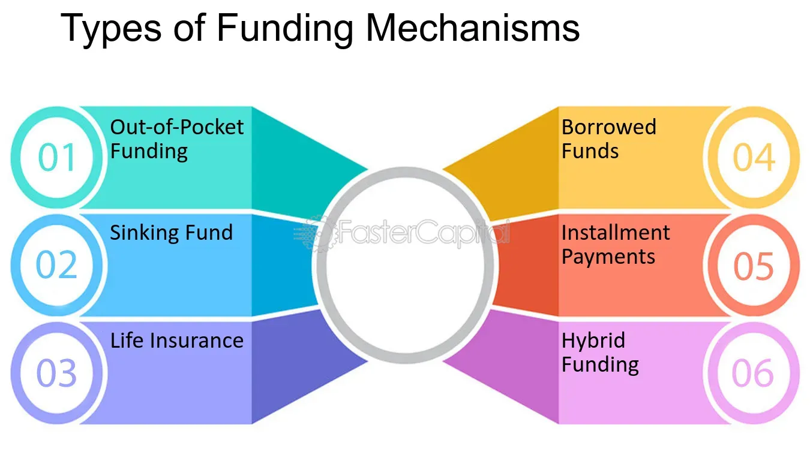

## Table of Contents

## What are funding mechanisms?

Funding mechanisms are ways that organizations or projects get the money they need to operate or grow. These can include things like loans, grants, investments, or even crowdfunding. Each type of funding has its own rules and benefits. For example, a loan needs to be paid back with interest, while a grant might not need to be repaid at all. Understanding the different funding mechanisms can help people choose the best way to support their goals.

Different funding mechanisms are used depending on what the money is needed for. For instance, a startup company might look for investors who are willing to take a risk on a new idea in exchange for a share of the company. On the other hand, a non-profit organization might apply for grants from government agencies or foundations that support their cause. Crowdfunding is another popular option where many people contribute small amounts of money online to help fund a project or product. Each mechanism has its own process and requirements, so it's important to research and understand them before deciding which one to use.

## Why are funding mechanisms important for projects and organizations?

Funding mechanisms are important for projects and organizations because they provide the money needed to start and keep going. Without funding, a project or organization can't do what it needs to do, like buying supplies, paying workers, or spreading the word about what they do. Having a good funding plan helps make sure that there's enough money to cover all the costs and keep things running smoothly.

Different funding mechanisms also let projects and organizations reach different kinds of people who might want to help. For example, some people might want to give money to a cause they believe in through a grant or donation, while others might be interested in investing in a new business idea. By using different funding mechanisms, projects and organizations can get support from a wider group of people, which can help them grow and succeed.

## What are the most common types of funding mechanisms?

The most common types of funding mechanisms are loans, grants, investments, and crowdfunding. Loans are money that you borrow and have to pay back with interest. Banks and other financial institutions often give out loans. Grants are money that you don't have to pay back. Governments, foundations, and other organizations give out grants to support specific projects or causes. Investments are when people give you money in exchange for a part of your business or project. Investors hope to make money if your business does well. Crowdfunding is when you ask a lot of people to each give a small amount of money, usually online, to help fund your project or idea.

Each type of funding mechanism has its own benefits and challenges. Loans can be a good option if you need a lot of money and are sure you can pay it back, but the interest can make it more expensive. Grants are great because you don't have to pay them back, but they can be hard to get and often have strict rules about how you can use the money. Investments can give you the money you need without having to pay it back, but you have to share your business with investors. Crowdfunding can be a fun way to get a lot of people involved in your project, but it might not raise as much money as other options and takes a lot of work to manage.

## How do grants work as a funding mechanism?

Grants are a type of funding where you get money that you don't have to pay back. They are often given by governments, foundations, or other organizations to help support specific projects or causes. To get a grant, you usually have to apply and explain what you need the money for and how you will use it. The people giving out the grants will look at your application and decide if your project fits what they want to support.

Grants can be a great way to get funding because you don't have to worry about paying the money back. But, they can be hard to get. There are usually a lot of people applying for the same grants, and the people giving out the money have strict rules about who can get it and how it can be used. If you get a grant, you will have to follow these rules and sometimes report back on how you used the money.

## What is the difference between equity and debt financing?

Equity financing is when you get money for your business by selling a part of it to investors. These investors give you money and in return, they get a share of your company. This means they own a piece of your business and might get a part of the profits if your business does well. The good thing about equity financing is that you don't have to pay the money back. But, you have to share control of your business with your investors, and they might want a say in how you run things.

Debt financing is when you borrow money that you have to pay back, usually with interest. This is like taking out a loan from a bank or another lender. You get the money you need to grow your business, but you have to make regular payments until the loan is paid off. The good thing about debt financing is that you keep full control of your business because you don't have to give away any ownership. But, the downside is that the interest can make it more expensive, and if you can't pay back the loan, it can cause big problems for your business.

## How can crowdfunding be used as a funding mechanism?

Crowdfunding is a way to get money for your project or business by asking a lot of people to each give a small amount. You usually do this online on special websites where you can share your idea and people can choose to support it. If enough people like your idea and give money, you can reach your funding goal and use the money to make your project happen. Crowdfunding is popular because it lets you connect with a big group of people who might be interested in what you're doing.

There are different types of crowdfunding. One type is reward-based, where people who give money get something back, like a product or a thank-you gift. Another type is donation-based, where people give money just to support your cause without expecting anything in return. There's also equity crowdfunding, where people who give money get a small piece of your business. Each type has its own rules and can be a good fit for different kinds of projects. Crowdfunding can be a fun and exciting way to get the money you need, but it takes a lot of work to make it successful.

## What are the advantages and disadvantages of venture capital?

Venture capital is when investors give money to a business that they think will grow a lot. The big advantage of venture capital is that you get a lot of money to help your business grow fast. These investors also often give you advice and help you connect with other people who can help your business. This can be really good if you are starting a new business and need money and help to make it successful. But, the downside is that you have to give up part of your business to these investors. They own a piece of your company and might want to have a say in how you run it. This can be hard if you want to keep full control of your business.

Another disadvantage of venture capital is that these investors expect your business to grow very quickly. They want to see big results fast because they are taking a big risk with their money. This can put a lot of pressure on you to make your business grow faster than you might be ready for. If your business doesn't grow as fast as they want, the investors might not be happy and could decide to stop supporting you. So, while venture capital can give you a lot of money and help, it also comes with high expectations and less control over your own business.

## How do government subsidies and incentives function as funding mechanisms?

Government subsidies and incentives are ways that the government gives money or other help to businesses or projects. Subsidies are like direct payments or discounts that make it cheaper for a business to do something. For example, a government might give a subsidy to a farmer to help them buy seeds or to a company to help them build a new factory. Incentives are a bit different. They are rewards that the government gives to encourage certain actions. For instance, a government might give a tax break to a company that hires more people or uses green energy. Both subsidies and incentives are used to help businesses grow and do things that the government thinks are good for the country.

These funding mechanisms can be really helpful for businesses because they make it easier to start or expand. But, they also come with rules. To get a subsidy or an incentive, a business has to follow the government's guidelines and show that they are using the money in the right way. Sometimes, the rules can be strict, and if a business doesn't follow them, they might have to pay the money back. So, while government subsidies and incentives can be a great way to get funding, it's important for businesses to understand the rules and make sure they can meet them.

## What role do angel investors play in funding?

Angel investors are people who give money to new businesses that they think have a good chance of growing. They are often rich people who want to help new businesses get started. When an angel investor gives money to a business, they usually get a part of the business in return. This means they own a piece of the company and might make money if the business does well. Angel investors are important because they can give a new business the money it needs to start and grow when it might be hard to get money from other places like banks.

Angel investors also do more than just give money. They often share their knowledge and experience with the business owners. They can give advice on how to run the business and help connect the owners with other people who can help. This can be really helpful for new business owners who are just starting out. But, like with any kind of funding, there are things to think about. When you take money from an angel investor, you have to share control of your business with them. They might want to have a say in how you run things, which can be hard if you want to keep full control of your business.

## How can non-profit organizations utilize funding mechanisms effectively?

Non-profit organizations can use different funding mechanisms to get the money they need to do their work. One common way is by applying for grants. Governments, foundations, and other groups give out grants to help non-profits do things like help people in need or protect the environment. To get a grant, a non-profit has to write a good application that explains what they want to do and how the money will help. If they get the grant, they have to use the money the way the grant says and sometimes report back on what they did with it. Another way non-profits can get money is through donations. People who believe in what the non-profit is doing can give money to help them. Non-profits can ask for donations by sending letters, using social media, or holding events.

Crowdfunding is another way non-profits can raise money. They can set up a page online where people can give small amounts of money to help with a specific project or cause. This can be a fun way to get a lot of people involved and excited about what the non-profit is doing. Non-profits can also work with businesses that want to help. Some businesses give money or other help to non-profits as part of their way of giving back to the community. This can be a good way for non-profits to get the money and resources they need. By using different funding mechanisms, non-profits can make sure they have the money to keep doing their important work.

## What advanced strategies can be used to optimize funding from multiple sources?

To optimize funding from multiple sources, non-profits and businesses can use a strategy called diversification. This means they don't rely on just one type of funding, like grants or donations, but instead use a mix of different funding mechanisms. By doing this, they can spread out the risk. If one source of funding stops, they still have other sources to keep going. For example, a non-profit might use grants for big projects, donations for day-to-day costs, and crowdfunding for special events. This way, they can make sure they have enough money coming in from different places.

Another strategy is to build strong relationships with funders. This means talking to them regularly and keeping them updated on what the organization is doing. When funders feel connected to the work and see the impact of their money, they are more likely to keep giving. Non-profits and businesses can also look for ways to work together with other organizations. By partnering up, they can share resources and apply for bigger grants or funding opportunities that they might not be able to get on their own. This teamwork can help them get more money and do more good work.

## How do international funding mechanisms differ from domestic ones, and what are the key considerations for global projects?

International funding mechanisms can be different from domestic ones because they often involve more rules and different ways of working. When you get money from another country or an international group, you might have to follow their laws and rules, which can be different from the ones in your own country. For example, an international grant might have strict rules about how you can use the money and what you have to report back. Also, international funding can come from places like the United Nations, the World Bank, or big foundations that want to help with global problems like poverty or climate change. These groups might have their own special ways of giving money and working with projects around the world.

For global projects, there are some important things to think about when looking for funding. First, you need to understand the rules and cultures of the countries where you are working. What works in one country might not work in another, so you have to be ready to change your plans to fit different places. Second, it's good to build strong relationships with international funders. They can help you learn about new funding opportunities and give you advice on how to make your project better. Finally, it's important to think about how you will manage money across different countries. This can be hard because of things like different currencies and banking rules, so you need a good plan to make sure the money is used the right way.

## References & Further Reading

For those seeking to deepen their understanding of [algorithmic trading](/wiki/algorithmic-trading) and associated funding methods, a wealth of resources is available to provide both theoretical and practical insights into this rapidly evolving field. 

Books like "Advances in Financial Machine Learning" by Marcos López de Prado are invaluable for understanding the application of [machine learning](/wiki/machine-learning) to financial problems. This text provides a foundation in developing sophisticated algorithms that leverage historical and real-time data to inform trading decisions.

Platforms such as QuantConnect and Alpaca offer valuable resources and tips for beginner to advanced algorithmic traders. These platforms enable users to backtest strategies using historical data, refine algorithms based on real-world conditions, and even execute trades in a live market setting. QuantConnect, in particular, supports multiple programming languages, including Python and C#, enhancing its accessibility for traders with varying coding expertise.

Online courses on sites like Coursera, edX, and Udacity provide comprehensive content ranging from the basics of financial markets to advanced machine learning concepts applied in trading. These courses often include modules on Python programming, data analysis, and financial theory, equipping learners with the skills necessary to build and test their own algorithmic trading strategies. 

Engaging with trading communities like EliteTrader and Stack Exchange's Quantitative Finance forum can also offer practical knowledge and support. These communities provide a platform for traders to share experiences, discuss challenges, and explore innovative approaches to algorithmic trading. Participating in discussions and accessing shared code snippets can significantly enhance one’s practical knowledge and troubleshooting capabilities.

For those interested in the statistical and mathematical underpinnings of algorithmic trading, scholarly articles and journals such as the Journal of Financial Data Science provide peer-reviewed insights into the latest research in the field.

Combining these resources can offer a comprehensive educational experience for traders aspiring to improve their algorithmic trading skills and secure necessary funding.

