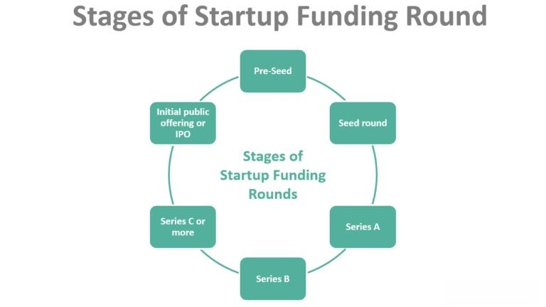

Private companies often encounter distinct challenges in securing funding essential for their growth and development. Access to funding is vital for startups and established businesses alike, especially during phases of expansion and innovation. Unlike publicly listed companies, private entities generally lack access to public capital markets, which necessitates exploring various funding options. Understanding and navigating these options are crucial for business owners and entrepreneurs seeking strategic and sustainable growth.

Private companies can consider multiple financing avenues such as traditional bank loans, angel investments, venture capital, and crowdfunding initiatives. Each option presents its own set of advantages and limitations, tailored to different business needs and growth paths. Furthermore, the emergence of investment strategies like algorithmic trading can offer private companies additional ways to optimize their financial performance. Algorithmic trading leverages computer algorithms to execute trades, potentially increasing investment returns by capitalizing on rapid market movements.

Choosing the appropriate funding strategy requires a comprehensive understanding of the company’s financial condition, growth goals, and risk appetite. By strategically selecting and combining these options, private companies can effectively steer their growth trajectories in alignment with their long-term vision and operational capabilities.

## Table of Contents

## Funding Options for Private Companies

Private companies can pursue several funding avenues, each presenting distinct benefits and limitations. The choice of funding should align with the company's growth stage, operational needs, and financial health.

Traditional bank loans serve as a reliable source of capital for companies with established revenues and a proven operational track record. These loans typically require the company to provide comprehensive financial documentation, including profit and loss statements, balance sheets, and financial forecasts. The borrowing terms, including interest rates and repayment schedules, are often influenced by the company's creditworthiness and collateral availability. However, traditional bank loans may not be ideal for startups or businesses without steady revenue streams, as meeting stringent eligibility criteria can be challenging for such entities.

Angel investors and venture capitalists are essential funding sources for businesses with high growth potential. Angel investors are usually affluent individuals who provide capital in exchange for convertible debt or ownership equity. Venture capitalists, on the other hand, are professional groups that invest larger sums in exchange for equity, often seeking significant returns within a predefined timeframe. Both may provide invaluable mentorship and business acumen in addition to funding but typically expect a degree of influence in business operations, possibly affecting company autonomy.

Friends and family funding is a flexible and informal method that leverages personal networks for financial support. This approach can offer more favorable terms compared to formal financial institutions, such as lower interest rates or equity requirements. However, it is crucial to formalize agreements to mitigate misunderstandings and maintain personal relationships. Entrepreneurs must clearly communicate the associated risks, as personal relationships might be strained if the business fails or performs below expectations.

Crowdfunding platforms such as Kickstarter and GoFundMe provide a modern mechanism to raise funds by tapping into vast online communities. These platforms are especially effective for startups promoting innovative products or services, as they offer an avenue to raise smaller increments of capital from a large number of contributors. Successful crowdfunding campaigns not only secure financial backing but can also validate business concepts by gauging consumer interest. Nevertheless, launching a campaign often demands a robust marketing strategy to capture the attention of potential backers. 

In summary, funding strategies for private companies should be selected based on financial needs, growth objectives, and the nature of business operations. Understanding the nuances of each option can significantly influence the company's ability to secure the necessary capital for sustainable growth.

## Algorithmic Trading: An Investment Strategy

Algorithmic trading utilizes computer algorithms to execute trades autonomously based on predefined conditions. This approach leverages the ability of algorithms to process vast amounts of data rapidly, identifying opportunities and executing trades within fractions of a second. By capitalizing on swift market movements, [algorithmic trading](/wiki/algorithmic-trading) offers the potential for private companies to enhance their return on investment.

For companies considering establishing an algorithmic trading operation, there exists significant potential to manage and trade large volumes efficiently, particularly within structures like hedge funds, proprietary funds, and family offices. These entities can benefit from the automation and precision that algorithms provide, reducing human error and increasing trading efficiency.

Despite its profitability potential, algorithmic trading comes with challenges. Developing algorithmic trading systems requires substantial expertise in both finance and computer science. Sophisticated algorithms need initial investment in software development, technological infrastructure, and ongoing maintenance. Key components of a robust algorithmic trading setup include high-speed internet connectivity, access to market data feeds, and powerful computing resources capable of processing and analyzing data in real-time.

Risk management is crucial in algorithmic trading. Companies must not only develop strategies that capitalize on market inefficiencies but also incorporate risk management mechanisms to mitigate potential losses. This may involve setting stop-loss limits or diversifying algorithmic strategies across asset classes.

The regulatory landscape must be navigated carefully. Companies must comply with financial regulations that govern algorithmic trading, such as those related to market manipulation and data transparency. This requires a thorough understanding of applicable laws as well as readiness to adapt to regulatory changes.

In summary, while algorithmic trading presents lucrative opportunities for private companies, its implementation demands a blend of technological prowess, financial expertise, and a robust understanding of regulatory requirements. This balance is essential for successfully leveraging algorithmic trading as a strategic investment approach.

## Navigating Regulatory Challenges

Private companies must remain vigilant about regulatory requirements when choosing funding and investment pathways. The regulatory environment poses distinct challenges that can significantly impact the operations and success of these companies. 

When seeking bank loans, private firms are typically required to provide detailed financial disclosures and well-structured business plans. These documents enable banks to assess the company’s creditworthiness and capacity to repay the loan. Such requirements ensure that only businesses with viable financial outlooks secure funding through this traditional route.

For those considering angel investors and venture capitalists, the dynamics change. These investors often demand equity stakes, meaning that they take ownership interests in the business in exchange for capital. Additionally, they may seek an active role in guiding business operations, which could lead to shifts in company leadership and strategic decisions. Therefore, entrepreneurs must evaluate whether they are willing to share control and profits with external investors.

Algorithmic trading, on the other hand, mandates strict compliance with financial regulations and trading standards. This strategy involves employing computer algorithms to execute trades automatically, which requires adherence to the regulatory frameworks established by financial authorities. Failure to comply with these regulations can result in severe penalties and damage to a company’s reputation. Therefore, businesses engaging in algorithmic trading must ensure that their practices are legally compliant and ethically sound.

Successfully navigating these regulatory landscapes necessitates thorough preparation and expert counsel. Companies should proactively engage legal and financial advisors who specialize in the relevant regulatory domains. Such experts can provide invaluable guidance, helping to avert potential legal pitfalls and ensuring that the business's operations remain above board.

In conclusion, understanding and addressing the regulatory challenges associated with different funding and investment strategies are crucial for private companies aiming for sustainable growth. By doing so, they can better position themselves to capitalize on opportunities while mitigating risks.

## Conclusion

Private companies face numerous funding and investment options, each tailored to specific business needs and growth trajectories. The selection of the appropriate option involves a thorough understanding of the company's financial situation, growth objectives, and risk profile. This decision-making process is critical because it determines the trajectory of the company's future growth and development. 

Algorithmic trading is an innovative investment avenue offering potential high returns, but it demands substantial expertise and caution. Companies must invest in advanced technological infrastructure and possess a robust understanding of market dynamics to capitalize effectively on this opportunity. The advantages of algorithmic trading come with inherent risks that must be managed through rigorous risk assessment and adherence to regulatory standards.

The choice of funding and investment strategy for a private company should align with its long-term vision and operational capabilities. This alignment ensures sustainable growth while mitigating risks associated with financial strategies. Companies need to approach decisions with strategic foresight, matching their chosen strategies to their broader business goals and existing resources. Thus, informed decision-making is indispensable for private companies aspiring to capitalize on growth opportunities through careful financial planning and investment.

## References & Further Reading

[1]: Bergstra, J., Bardenet, R., Bengio, Y., & Kégl, B. (2011). ["Algorithms for Hyper-Parameter Optimization."](https://papers.nips.cc/paper/4443-algorithms-for-hyper-parameter-optimization) Advances in Neural Information Processing Systems 24.

[2]: ["Advances in Financial Machine Learning"](https://www.amazon.com/Advances-Financial-Machine-Learning-Marcos/dp/1119482089) by Marcos Lopez de Prado

[3]: ["Evidence-Based Technical Analysis: Applying the Scientific Method and Statistical Inference to Trading Signals"](https://www.amazon.com/Evidence-Based-Technical-Analysis-Scientific-Statistical/dp/0470008741) by David Aronson

[4]: ["Machine Learning for Algorithmic Trading"](https://github.com/PacktPublishing/Machine-Learning-for-Algorithmic-Trading-Second-Edition) by Stefan Jansen

[5]: ["Quantitative Trading: How to Build Your Own Algorithmic Trading Business"](https://books.google.com/books/about/Quantitative_Trading.html?id=j70yEAAAQBAJ) by Ernest P. Chan