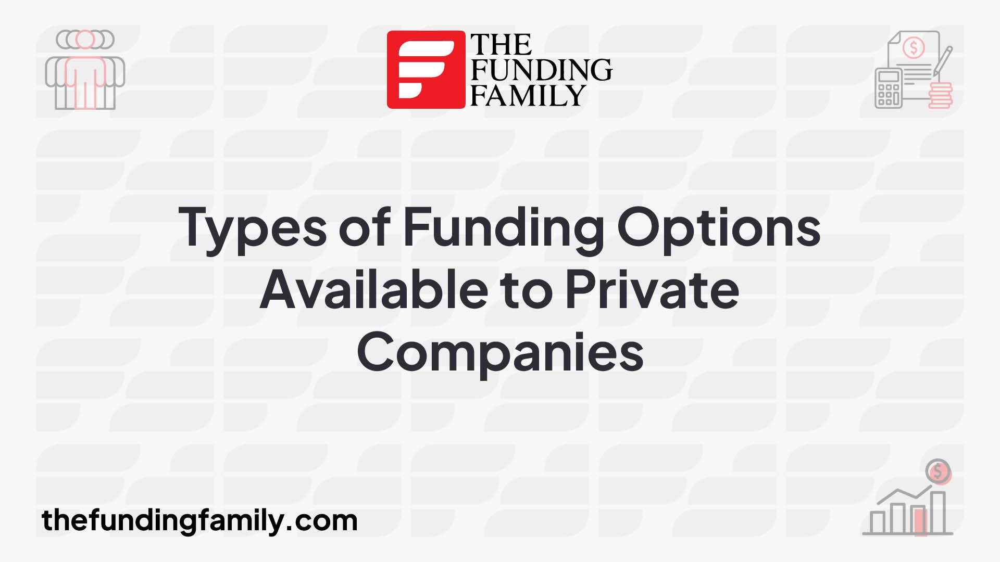

## Table of Contents

## What are the basic funding options available for private companies?

Private companies have several basic funding options to help them start and grow. One common option is using personal savings or money from friends and family. This is often the first step for many new businesses because it's quick and doesn't involve complicated paperwork. Another option is taking out a bank loan. Banks might lend money to a business if they believe it will be successful and can pay back the loan with interest. This can be a good choice, but it requires a solid business plan and sometimes collateral, like property, to secure the loan.

Another popular funding option is attracting investors, such as angel investors or venture capitalists. Angel investors are usually wealthy individuals who provide money to start-ups in exchange for ownership equity or convertible debt. Venture capitalists are firms that invest in businesses with high growth potential, also in exchange for equity. Both types of investors can provide not just money but also valuable advice and connections. Lastly, crowdfunding is a newer option where a business raises small amounts of money from a large number of people, often through online platforms. This can be a great way to get funding and also test the market interest in a product or service.

## How does bootstrapping work as a funding method for private companies?

Bootstrapping is when a private company uses its own money or the money from the people who started it to grow the business. Instead of getting loans from banks or money from investors, the company relies on the savings of the founders or the money they earn from selling their products or services. This method is popular because it lets the founders keep control of their company without having to share it with outside investors.

While bootstrapping can be a good way to start a business, it can also be challenging. Since the company is using its own money, it might grow more slowly because there's less money to spend on things like hiring new people or buying equipment. But, if the company can make enough money from its sales, it can keep growing without needing to borrow money or give away part of the business to others. This way, the founders stay in charge and can make all the decisions about their company.

## What is the difference between equity and debt financing for private companies?

Equity financing is when a company gets money by selling part of the business to investors. These investors become owners of the company and get a share of the profits, usually in the form of dividends. The big advantage of equity financing is that the company doesn't have to pay back the money. But, the downside is that the original owners have to share control of the company with the new investors, who might want to have a say in how the business is run.

Debt financing, on the other hand, is when a company borrows money that it has to pay back over time, usually with interest. This can be from a bank loan or issuing bonds. The main advantage of debt financing is that the company keeps full control because it's not giving away any ownership. The downside is that the company has to make regular payments, which can be hard if the business isn't making enough money. If the company can't pay back the debt, it might have to declare bankruptcy.

In simple terms, equity financing means sharing the business and its profits with others, while debt financing means borrowing money and paying it back with interest. Both methods have their pros and cons, and the choice depends on what the company needs and how much risk it's willing to take.

## How can private companies qualify for bank loans?

To qualify for a bank loan, private companies need to show the bank that they can pay back the money they borrow. This usually means having a good business plan that explains how the company will make money and grow. The bank will look at the company's financial history, like how much money it has made in the past and how much it owes. They will also check the credit score of the business and sometimes the personal credit scores of the owners. If the company has been making money and paying its bills on time, it has a better chance of getting a loan.

Sometimes, banks ask for something called collateral. This is something valuable, like property or equipment, that the bank can take if the company can't pay back the loan. Having collateral can make it easier to get a loan because it reduces the risk for the bank. The size of the loan and the [interest rate](/wiki/interest-rate-trading-strategies) the company has to pay will depend on how risky the bank thinks the loan is. If the company can show it's a safe bet, it might get a bigger loan with a lower interest rate.

## What are angel investors and how can they help fund a private company?

Angel investors are rich people who give money to start-up companies. They usually invest their own money, not money from a big company. When they give money to a business, they get a piece of the company in return. This means they own part of it and can make money if the company does well. Angel investors often help businesses that are just starting out and need money to grow.

Besides giving money, angel investors can also help in other ways. They often have a lot of experience in business and can give good advice to the people running the company. They might know other people who can help the business, like lawyers or other investors. This can be really helpful for a new company that doesn't have a lot of connections yet. So, angel investors not only provide money but also support and guidance to help the business succeed.

## What role do venture capitalists play in funding private companies?

Venture capitalists are companies that give money to other companies that they think will grow a lot. They usually invest in businesses that are already started but need more money to get bigger. When venture capitalists give money to a company, they get a part of the company in return. This means they own some of it and can make money if the company does well. Venture capitalists often invest a lot of money, more than what angel investors usually give.

Besides giving money, venture capitalists also help the companies they invest in. They have a lot of experience and can give good advice on how to grow the business. They might also know other people who can help, like other investors or experts in the industry. This can be really helpful for a company that is trying to get bigger. So, venture capitalists not only give money but also support and guidance to help the company succeed.

## How does crowdfunding work as a funding option for private companies?

Crowdfunding is when a private company asks a lot of people for small amounts of money to help start or grow their business. They usually do this through websites like Kickstarter or Indiegogo. The company makes a page on these websites where they explain their business and what they need the money for. People who like the idea can give money to help. In return, the company might give them a reward, like a product or a thank-you note. This way, the company can get the money it needs without borrowing from a bank or giving away part of the business to investors.

Crowdfunding can be a great way for a company to see if people are interested in what they are selling. If a lot of people give money, it shows that there is a demand for the product or service. But, it can also be hard because the company has to convince a lot of people to trust them with their money. If the company doesn't reach its goal, it might not get any money at all. So, it's important for the company to have a good plan and a strong way to tell people about their business.

## What are the advantages and disadvantages of using convertible notes for funding?

Convertible notes are a way for companies to get money without deciding right away if it's a loan or an investment. They are like IOUs that can turn into ownership of the company later. The big advantage of using convertible notes is that they are quick and easy to set up. The company doesn't have to agree on how much the business is worth right away, which can be hard to do when the company is new. This makes it simpler to get money from investors. Another good thing is that if the company does well, the investors can turn their notes into ownership and make money as the company grows.

But, there are also some downsides to using convertible notes. One problem is that if the company doesn't do well, the investors might not want to turn their notes into ownership. This can make it hard for the company to get more money later. Also, when the notes do turn into ownership, it can make the original owners own less of the company. This can be a problem if they want to keep control. So, while convertible notes can be a good way to get quick money, they can also lead to some tricky situations down the road.

## How can private companies leverage government grants and subsidies?

Private companies can use government grants and subsidies to help them start or grow their business. These are like free money from the government that the company doesn't have to pay back. To get these grants, the company usually has to apply and show that their business fits what the government wants to support. This could be things like new technology, helping the environment, or creating jobs in certain areas. The company needs to fill out forms and sometimes write a plan to show how they will use the money.

Using government grants and subsidies can be a big help for a company because it gives them money without adding debt or giving away part of the business. But, it can also be hard to get these grants because a lot of other companies want them too. The company has to follow the rules set by the government, like spending the money in certain ways or reporting back on how they used it. If they don't follow the rules, they might have to give the money back. So, while government grants and subsidies can be a great way to get funding, they come with some work and responsibility.

## What strategic considerations should private companies keep in mind when seeking funding?

When private companies look for funding, they need to think about what kind of funding will help them reach their goals. Different types of funding, like loans, investors, or grants, come with different rules and costs. A company should choose the type that fits best with what they want to do. For example, if they want to keep control of the business, they might choose a loan or a grant instead of giving away part of the company to investors. They also need to think about how much money they really need and how they will use it to grow their business.

Another important thing to consider is the timing of the funding. Companies should think about when they need the money and how long it will take to get it. Some funding options, like loans, can be quick, while others, like government grants, might take longer. It's also important to plan for the future. The company should think about how the funding will affect them later on. For example, taking a loan means they will have to pay it back with interest, which could be hard if the business doesn't grow as expected. By thinking about these things carefully, a company can choose the best way to get the money they need to succeed.

## How do private equity firms evaluate and fund private companies?

Private equity firms are companies that buy parts of other companies to help them grow. They look at a lot of things before they decide to give money to a private company. They check how much money the company makes, how much it owes, and if it has a good plan to grow. They also look at the people who run the company to see if they can trust them to do a good job. If the private equity firm thinks the company can make more money in the future, they might decide to invest in it. They usually want to own a big part of the company so they can help make important decisions.

When a private equity firm decides to fund a company, they give money in exchange for owning part of it. This can be a lot of money, sometimes millions of dollars. The private equity firm hopes that the company will grow and make more money, so they can sell their part later for a bigger price. While they own part of the company, they often help the people running it by giving advice and sometimes even changing how the company works to make it better. This way, both the private equity firm and the company can benefit from the funding.

## What advanced financial instruments can private companies use for sophisticated funding strategies?

Private companies can use advanced financial instruments like convertible preferred stock to get funding. This is a type of stock that gives investors special rights, like getting their money back before others if the company is sold. It can also turn into regular stock later, which can be good for the company because it doesn't have to pay back the money right away. Another option is mezzanine financing, which is a mix of debt and equity. It's like a loan that can turn into ownership if the company doesn't pay it back on time. This can be a good way to get a lot of money quickly, but it can also be risky because the company might lose control if it can't pay back the loan.

Another advanced instrument is a revenue-based financing agreement. This is when a company gets money in exchange for giving a part of its future sales to the investor. It's good for companies that don't want to give away ownership or take on debt. The company pays back the money as it makes sales, so it's less risky than a regular loan. Lastly, there are options like SAFE (Simple Agreement for Future Equity) and KISS (Keep It Simple Security). These are agreements that let investors give money to the company now and get ownership later, without deciding right away how much the company is worth. These instruments can be complex, but they give companies more ways to get the money they need to grow.

## References & Further Reading

[1]: Bergstra, J., Bardenet, R., Bengio, Y., & Kégl, B. (2011). ["Algorithms for Hyper-Parameter Optimization."](https://papers.nips.cc/paper/4443-algorithms-for-hyper-parameter-optimization) Advances in Neural Information Processing Systems 24.

[2]: ["Advances in Financial Machine Learning"](https://www.amazon.com/Advances-Financial-Machine-Learning-Marcos/dp/1119482089) by Marcos Lopez de Prado

[3]: ["Evidence-Based Technical Analysis: Applying the Scientific Method and Statistical Inference to Trading Signals"](https://www.amazon.com/Evidence-Based-Technical-Analysis-Scientific-Statistical/dp/0470008741) by David Aronson

[4]: ["Machine Learning for Algorithmic Trading"](https://github.com/PacktPublishing/Machine-Learning-for-Algorithmic-Trading-Second-Edition) by Stefan Jansen

[5]: ["Quantitative Trading: How to Build Your Own Algorithmic Trading Business"](https://books.google.com/books/about/Quantitative_Trading.html?id=j70yEAAAQBAJ) by Ernest P. Chan