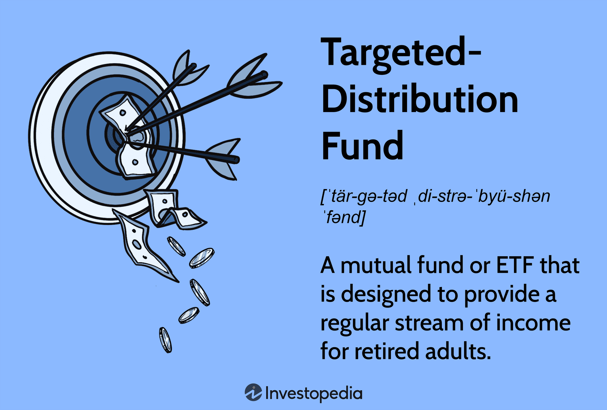

In today's financial landscape, mastering the complexities of funds distribution, investment income, and algorithmic trading is essential to achieve optimal financial results. The integration of these elements shapes the framework for effective financial strategies aimed at growth and stability. Through the application of precise financial calculation methods, investors assess potential returns and risks to make informed decisions. This involves critical evaluations of various investment options using metrics such as net present value (NPV) and internal rate of return (IRR), which help determine the financial feasibility and profitability of investments.

Efficient distribution of financial resources is paramount in maximizing investment performance while minimizing exposure to risk. Techniques like diversification and asset allocation are crucial in spreading investments across different asset classes, including equities, fixed income, and real estate, to balance potential returns against potential risks.



Optimizing investment income is another critical aspect, achievable through strategies such as dividend reinvestment, utilization of interest-bearing accounts, and income generation from real estate portfolios. Investment metrics like yield and distribution rates help investors quantify income potential and align strategies with their financial objectives and prevailing market conditions.

Algorithmic trading represents a significant advancement in investment strategies, using sophisticated algorithms to execute trades at speeds unimaginable to human traders. These algorithms analyze vast quantities of market data to identify trading opportunities, thereby enhancing yield optimization and improving overall investment returns.

Together, these elements form a cohesive approach to financial strategy, enabling investors to leverage intricate calculations, thoughtful resource distribution, focused income maximization, and cutting-edge trading technologies for sustained growth and financial stability.

## Table of Contents

## Understanding Financial Calculations

Financial calculations are essential components of investment strategies, as they provide critical insights into potential returns and associated risks. These calculations are structured frameworks that help investors evaluate the financial viability and profitability of various investment options, aiding in informed decision-making processes. 

One of the foundational calculations in finance is the Net Present Value (NPV). NPV is used to determine the value of an investment by analyzing the present value of expected future cash flows, discounted at an appropriate rate to account for the time value of money. The formula for NPV is given by:

$$
\text{NPV} = \sum_{t=0}^{n} \frac{R_t}{(1 + i)^t}
$$

where $R_t$ is the net cash inflow during the period $t$, $i$ is the discount rate, and $n$ is the total number of periods. A positive NPV indicates a potentially profitable investment, while a negative NPV suggests the opposite.

Another crucial calculation is the Internal Rate of Return (IRR), which estimates the discount rate that makes the NPV of an investment zero. It provides an annualized rate of growth an investment is expected to generate. The IRR can be found by solving the equation:

$$
0 = \sum_{t=0}^{n} \frac{R_t}{(1 + \text{IRR})^t}
$$

This metric is useful for comparing the profitability of multiple investment opportunities, given that the higher the IRR, the more desirable the project.

Risk assessment is another vital aspect of financial calculations, encompassing various measures to evaluate potential investment risks. Standard deviation, for example, is used to measure the total risk of an investment, while the beta coefficient assesses systematic risk in relation to the market. These metrics help in tailoring investment strategies to match an investor's risk appetite.

By employing these financial calculations, investors can ascertain the feasibility and profitability of investments, aligning them with their financial objectives and constraints. These methods are pivotal for structuring investment portfolios that maximize returns while mitigating risks.

## Funds Distribution in Investments

Proper funds distribution is a critical component in achieving optimal investment returns while mitigating associated risks. The techniques of diversification and asset allocation are integral to successful funds distribution, ensuring that investments are spread effectively across various asset classes. 

Diversification involves spreading investments across diverse financial instruments, industries, and other categories to reduce exposure to any single asset or risk. The rationale behind diversification is that a diverse portfolio, comprising different sectors like technology, healthcare, and consumer goods, will yield more stable returns as individual losses are offset by gains in other areas.

Asset allocation, on the other hand, involves distributing investments among different asset categories, such as stocks, bonds, and real estate. The proportion of each asset class in a portfolio depends on the investor's risk tolerance, time horizon, and financial goals. For instance, a more aggressive allocation might favor a higher percentage of stocks, whereas a conservative strategy might prioritize bonds and real estate.

To illustrate, consider a fundamental allocation model: the Risk Parity approach. This strategy focuses on balancing the risk contributed by each asset class in the portfolio rather than just the capital investment. The method entails calculating the risk contribution — usually the standard deviation of returns — and adjusting the weights of asset classes so that each contributes equally to the total portfolio risk.

Python example to calculate Risk Parity portfolio weights:

```python
import numpy as np
from scipy.optimize import minimize

# Example returns matrix for three assets
returns = np.random.randn(1000, 3)
cov_matrix = np.cov(returns.T)

def risk_parity_objective(weights, cov_matrix):
    portfolio_risk = np.sqrt(np.dot(weights.T, np.dot(cov_matrix, weights)))
    marginal_risk_contribution = np.dot(cov_matrix, weights) / portfolio_risk
    risk_contribution = weights * marginal_risk_contribution
    return np.sum((risk_contribution - portfolio_risk / len(weights))**2)

# Initial weights guess
init_guess = np.array([1/3, 1/3, 1/3])

# Constraints: sum of weights = 1, all weights >= 0
constraints = ({'type': 'eq', 'fun': lambda weights: np.sum(weights) - 1},
               {'type': 'ineq', 'fun': lambda weights: weights})

# Minimize risk contribution difference
optimal_weights = minimize(risk_parity_objective, init_guess, args=(cov_matrix,), constraints=constraints).x

print("Optimal Weights for Risk Parity:", optimal_weights)
```

Moreover, strategic funds distribution often aligns with specific risk-adjusted metrics, such as the Sharpe Ratio, which measures the excess return per unit of standard deviation in investment returns. By focusing on risk-adjusted performance, investors can prioritize investments that offer the highest potential returns for the level of risk accepted.

In summary, effective funds distribution through diversification and asset allocation is crucial for optimizing returns and minimizing risks. By employing advanced strategies and leveraging computational tools, investors can strategically position their portfolios across multiple asset classes to achieve desired financial outcomes. This balanced approach not only cushions the portfolio against market [volatility](/wiki/volatility-trading-strategies) but also enhances the prospect of sustainable financial growth.

## Maximizing Investment Income

Investment income can be optimized through several strategic approaches, each designed to enhance financial returns in alignment with the investor's overall financial objectives and prevailing market conditions. The primary methods include dividend investment, interest-bearing accounts, and real estate income, each offering unique advantages and considerations.

### Dividend Investment

Dividend investing involves purchasing shares in companies that distribute a portion of their earnings to shareholders in the form of dividends. This strategy not only provides regular income but can also offer long-term capital appreciation. Key metrics for evaluating dividend investments include the dividend yield and payout ratio. The dividend yield is calculated as:

$$
\text{Dividend Yield} = \left( \frac{\text{Annual Dividends per Share}}{\text{Price per Share}} \right) \times 100
$$

A high dividend yield may indicate a generous payout, but investors must also consider the sustainability of the dividend, which is often assessed using the payout ratio:

$$
\text{Payout Ratio} = \left( \frac{\text{Dividends per Share}}{\text{Earnings per Share}} \right) \times 100
$$

A lower payout ratio suggests that a company retains more earnings for growth, potentially signaling future dividend increases.

### Interest-Bearing Accounts

Interest-bearing accounts, such as savings accounts, certificates of deposit (CDs), and money market accounts, provide a relatively low-risk way to earn income through interest payments. The primary metric for these accounts is the annual percentage yield (APY), which reflects the actual interest earned in a year, accounting for compounding. Investors must consider current interest rates and inflation since the real return on interest-bearing accounts is the nominal rate less inflation.

### Real Estate Income

Real estate investments generate income through rental yields and potential value appreciation. Effective management and location selection are critical for maximizing rental income. The capitalization rate (cap rate) is a key metric:

$$
\text{Cap Rate} = \left( \frac{\text{Net Operating Income}}{\text{Current Market Value}} \right) \times 100
$$

A higher cap rate generally indicates a potentially higher income return on investment but may also come with increased risk. 

### Strategic Alignment

Aligning investment income strategies with financial goals is essential. Investors should consider their risk tolerance, income needs, and investment horizon. For instance, younger investors with a longer horizon might favor dividend [growth stocks](/wiki/growth-stocks) for both income and appreciation, while retirees might prioritize steady interest income. Moreover, adapting to market conditions, such as adjusting portfolios in response to [interest rate](/wiki/interest-rate-trading-strategies) changes, ensures that income strategies remain effective over time.

In conclusion, maximizing investment income requires a careful balance of risk and return, an understanding of key financial metrics, and a strategy tailored to individual financial goals and market dynamics. By effectively leveraging dividend investments, interest-bearing accounts, and real estate, investors can optimize their income streams and enhance overall financial performance.

## Algorithmic Trading: Revolutionizing Investment Strategies

Algorithmic trading employs advanced computer algorithms to automate the process of trading assets in financial markets. This approach enables traders to execute orders at speeds and frequencies that are beyond human capabilities, thus achieving more efficient trading outcomes. By analyzing expansive datasets in real-time, [algorithmic trading](/wiki/algorithmic-trading) identifies trading opportunities and trends that might elude traditional trading methods.

Central to algorithmic trading is yield optimization, achieved by leveraging vast amounts of market data. Algorithms assess historical and present market conditions to make informed predictions about future price movements. This predictive capability is largely powered by quantitative models that utilize statistical analysis, [machine learning](/wiki/machine-learning), and [artificial intelligence](/wiki/ai-artificial-intelligence). These models often incorporate complex mathematical formulas like:

$$
\text{Expected Return} = \sum \left( \text{Probability of Outcome} \times \text{Payoff of Outcome} \right)
$$

where the expected return is calculated using outcomes influenced by various market factors.

Algorithmic strategies can vary from simple to highly complex. Basic strategies may involve [trend following](/wiki/trend-following) and [arbitrage](/wiki/arbitrage), wherein algorithms seek price differentials of the same asset across different markets. More sophisticated methods integrate machine learning, enabling the algorithms to adapt autonomously to new data and evolving market circumstances.

Python is frequently used for developing such algorithms due to its extensive libraries and frameworks like NumPy, pandas, and scikit-learn. For instance, a basic [backtesting](/wiki/backtesting) script might utilize Python to assess historical performance of a trading strategy:

```python
import pandas as pd
import numpy as np

# Sample market data
market_data = pd.DataFrame({
    'price': [100, 102, 101, 105, 107],
    'volume': [200, 220, 210, 215, 230]
})

# Simple moving average strategy
market_data['SMA'] = market_data['price'].rolling(window=2).mean()

# Generate buy/sell signals
market_data['Signal'] = 0
market_data['Signal'][1:] = np.where(
    market_data['price'][1:] > market_data['SMA'][1:], 1, -1
)

print(market_data)
```

Integration of algorithmic trading into investment strategies can lead to significant enhancement of returns. By consistently applying data-driven decision-making processes, investors can reduce emotional biases and achieve more stable performance. Additionally, the ability to process and react to new information instantly ensures that trades are executed at optimal times, maximizing potential profit and minimizing risk.

As technology continues to evolve, the sophistication and capabilities of algorithmic trading are expected to expand, further transforming investment strategies and outcomes across financial markets.

## Case Studies and Real-World Applications

Examining case studies of financial strategies reveals the effective integration of financial calculation, funds distribution, and algorithmic trading to achieve optimized investment outcomes. These real-world applications illustrate how these processes function in concert within various market environments.

One significant case involves Renaissance Technologies, a prominent [hedge fund](/wiki/hedge-fund-trading-strategies) known for using quantitative models and algorithmic trading to execute trades. Renaissance Technologies particularly emphasizes precision in financial calculations to predict market trends and potential returns. They employ mathematical models that consider net present value (NPV) and internal rate of return (IRR) to determine the financial feasibility and profitability of investments. This rigorous approach allows the firm to effectively manage funds distribution across a diverse array of asset classes, which minimizes risk while maximizing potential returns. The algorithmic trading strategies employed by Renaissance rely on high-frequency data analysis to identify patterns and execute trades swiftly, thereby capitalizing on transient market opportunities.[^1^]

A similar approach is adopted by the BlackRock Investment Institute, which integrates algorithmic trading with traditional investment strategies to manage expansive portfolios. BlackRock utilizes sophisticated risk assessment metrics to guide funds distribution. By balancing allocations across stocks, bonds, and alternative assets, BlackRock aims to optimize income while managing risk according to market conditions. Algorithmic trading is embedded in their strategy, enabling dynamic adjustments to asset allocations based on real-time market data. This strategic integration helps maintain high performance in changing economic circumstances.[^2^]

The real estate investment firm, Invitation Homes, provides another example of optimal financial practices. This firm focuses on maximizing investment income by leveraging a combination of rental income and property appreciation. Financial calculations such as capital asset pricing model (CAPM) are used to evaluate potential investment properties, aligning their investment with desired yield and risk levels. Fund distribution is strategically managed to balance purchase, renovation, and maintenance costs of properties, thus maximizing cash flow. Additionally, while Invitation Homes primarily operates within the real estate domain, they utilize data analytics, akin to algorithmic trading, to forecast demand trends and property value appreciations, guiding their investment decisions.[^3^]

These examples underscore the effectiveness of integrating financial calculations, strategic funds distribution, and algorithmic trading in diverse sectors. The synthesis of these financial practices results in enhanced decision-making capabilities, improved financial performance, and sustainable competitive advantages in rapidly evolving markets.

[^1^]: Zuckerman, G. (2019). "The Man Who Solved the Market: How Jim Simons Launched the Quant Revolution". Portfolio.

[^2^]: BlackRock Investment Institute. (2020). "Sustainability: The Future of Investing". Retrieved from [BlackRock](https://www.blackrock.com)

[^3^]: Invitation Homes Annual Report 2021. Retrieved from [Invitation Homes](https://www.invitationhomes.com)

## Challenges and Considerations

Challenges and considerations in the field of finance are numerous and multifaceted, presenting risks that investors must navigate carefully to optimize financial outcomes. 

**Market Volatility**  
Market volatility is one of the most significant challenges investors face. It refers to the rapid and unpredictable changes in the value of assets, which can lead to financial gains or losses. High volatility increases risk, making it difficult for investors to forecast returns accurately. Managing volatility involves adopting strategies like diversification, which spreads investments across various assets to mitigate risk. Moreover, employing options and futures can hedge against potential losses, providing a buffer in tumultuous market conditions.

**Regulatory Changes**  
Regulatory changes also present substantial challenges. Financial markets around the world are subject to the regulations of respective countries. These regulations can alter trading conditions, impact asset valuation, and affect the overall market environment. Compliance with regulatory standards is essential to avoid penalties and ensure smooth operations. Investors must stay informed about changes in legislation and incorporate compliance strategies into their investment plans. This might involve consulting legal experts or investing in markets with stable regulatory environments.

**Technological Demands**  
Technological demands are increasingly shaping the landscape of modern investments. With technological advancements, investors are required to continually update their systems and strategies. Algorithmic trading, for example, relies heavily on robust technological infrastructure and sophisticated algorithms to analyze market data in real-time. To remain competitive, investors must invest in cutting-edge technology and ensure their teams are trained in the latest financial software and methodologies.

**Adaptation and Continuous Learning**  
Adaptation and continuous learning are crucial in overcoming these challenges. The financial market is dynamic, and strategies that worked in the past may not be effective in the future. Investors need to stay abreast of global economic trends, advancements in trading technology, and shifts in market sentiment. Continuous learning can be facilitated through professional development courses, attending industry conferences, and engaging with financial thought leaders. By fostering a culture of adaptability and learning, investors can enhance their ability to respond to new opportunities and threats swiftly.

In summary, while market volatility, regulatory changes, and technological demands pose significant challenges, they are not insurmountable. By understanding these challenges and adopting proactive strategies, investors can effectively manage risks and capitalize on the ever-evolving financial landscape.

## Conclusion and Future Outlook

The integration of financial calculations, funds distribution, investment income strategies, and algorithmic trading forms a cohesive framework that empowers investors with enhanced decision-making tools. The crucial role of financial calculations, such as net present value (NPV) and internal rate of return (IRR), cannot be overstated as they provide quantitative measures for evaluating the viability and profitability of investments. These calculations help investors navigate complex financial environments, enabling precision in projecting future cash flows and assessing investment risks.

As technological advancements continue to reshape the financial landscape, the efficiency and effectiveness of these strategies are poised to advance. Algorithmic trading, in particular, stands out by leveraging data analysis to swiftly identify market opportunities, thus optimizing returns and fostering more dynamic trading operations. The related algorithms, capable of processing vast datasets in real time, provide insights that are indispensable for competitive advantage.

Investment income strategies, including dividend reinvestment plans and interest-bearing accounts, also benefit from technology-driven tools that allow for tailored approaches aligned with specific financial objectives. The sophistication of these tools ensures that investors can adapt strategies to enhance income generation while balancing market contingencies effectively.

Looking ahead, the convergence of these financial strategies, underpinned by technological innovations, is set to transform investment landscapes. Artificial intelligence and machine learning hold promise in further refining algorithmic trading efficiencies, just as blockchain technology could redefine how asset allocations are managed across diverse investment portfolios.

Importantly, maintaining a competitive edge in the evolving financial sector demands an openness to these emerging technologies and methods. Embracing continuous learning and adaptability in this context will be essential for maximizing potential gains and mitigating risks. As these tools evolve alongside technological innovations, their strategic application will remain critical to achieving sustainable growth and stability in the financial markets.

## References & Further Reading

- Allen, F., & Carletti, E. (2013). "An Overview of the Crisis: Causes, Consequences, and Solutions." _Journal of Economic Literature_, 51(1), 1-30. This paper offers insights into financial crises, providing a backdrop for evaluating risk assessment metrics within financial calculations.

- Bodie, Z., Kane, A., & Marcus, A. J. (2018). _Investments_. McGraw-Hill Education. Offers a comprehensive introduction to investment strategies, including financial calculations and the principles of funds distribution, diversification, and asset allocation.

- Hull, J. C. (2017). _Options, Futures, and Other Derivatives_. Pearson. This text delves into derivatives and their role in optimizing investment income, supporting the understanding of complex financial products.

- Kissell, R. (2013). _The Science of Algorithmic Trading and Portfolio Management_. Academic Press. An essential read for understanding the intricacies of algorithmic trading and its impact on investment strategies.

- Markowitz, H. (1952). "Portfolio Selection." _The Journal of Finance_, 7(1), 77-91. This foundational paper introduces the concept of diversification and modern portfolio theory, essential for funds distribution strategies.

- Malkiel, B. G. (2019). _A Random Walk Down Wall Street: The Time-Tested Strategy for Successful Investing_. W. W. Norton & Company. It provides a broader perspective on investment income strategies and market dynamics.

- O'Hara, M. (2015). _High-Frequency Trading: New Realities for Traders, Markets, and Regulators_. Risk Books. Discusses algorithmic trading, high-frequency trading strategies, and regulatory challenges in modern financial markets.

- Shreve, S. E. (2004). _Stochastic Calculus for Finance I: The Binomial Asset Pricing Model_. Springer. Offers mathematical foundations necessary for understanding financial calculations related to pricing models. 

For further exploration, online platforms like Coursera and edX offer courses on financial strategies and algorithmic trading taught by leading experts in the field. Websites such as Investopedia also provide valuable definitions and tutorials related to various investment strategies and financial calculations.

