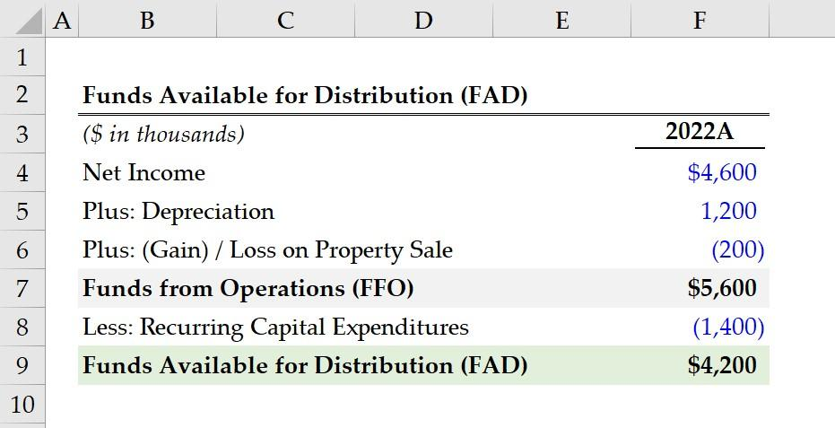

## Table of Contents

## What are Funds Available for Distribution (FAD)?

Funds Available for Distribution (FAD) is a measure used by Real Estate Investment Trusts (REITs) to show how much money they can pay out to their investors. It's like figuring out how much money is left after all the bills are paid, so the REIT can give it to shareholders as dividends.

FAD is important because it gives a clearer picture of the REIT's financial health than just looking at their profits. It takes into account things like depreciation and maintenance costs, which can eat into the money available for dividends. By understanding FAD, investors can better judge if a REIT is a good investment and how much they might get back in dividends.

## Why are Funds Available for Distribution important for investors?

Funds Available for Distribution (FAD) are really important for investors because they show how much money a Real Estate Investment Trust (REIT) can actually give back to them. It's like checking your piggy bank to see how much you can spend or share with others. For investors, knowing the FAD helps them understand if the REIT is doing well and if it can keep paying out dividends regularly. This is crucial because investors often rely on these dividends as a source of income.

Also, FAD gives a clearer picture of a REIT's financial health than just looking at their profits. Profits can sometimes be misleading because they don't always account for all the costs, like fixing up buildings or replacing old equipment. FAD takes these costs into account, so it's a more honest way to see how much money is really left over. This helps investors make smarter choices about where to put their money, ensuring they pick REITs that are likely to keep paying out good dividends over time.

## How do Funds Available for Distribution differ from Funds From Operations (FFO)?

Funds Available for Distribution (FAD) and Funds From Operations (FFO) are both important numbers for Real Estate Investment Trusts (REITs), but they tell us different things. FFO is a way to measure how much money a REIT makes from its main business, which is usually renting out properties. It adds back things like depreciation, which is a non-cash expense, to the net income. This gives investors a better idea of the REIT's operating performance without the impact of accounting rules that can make profits look smaller than they really are.

FAD, on the other hand, goes a step further than FFO. It takes the FFO and then subtracts costs that the REIT needs to spend to keep its properties in good shape, like repairs and maintenance. This gives a clearer picture of how much money is actually left over that the REIT can pay out to its investors as dividends. So, while FFO shows the overall cash flow from operations, FAD focuses more on the cash that's available for distribution, making it a key number for investors who want to know about their potential dividend income.

## What are the typical sources of Funds Available for Distribution?

Funds Available for Distribution (FAD) mainly come from the money that Real Estate Investment Trusts (REITs) make from renting out their properties. When tenants pay rent, this money goes into the REIT's pockets. After paying for things like property management and other operating costs, what's left is a big part of the FAD. It's like the money you have left after paying your bills, which you can then use or share with others.

But there are other sources too. Sometimes, REITs might sell a property and use the money from that sale to add to their FAD. They might also get money from interest on loans they've given out or from other investments they've made. All these different streams of income help make up the total amount of money that the REIT can distribute to its investors as dividends.

## Can you explain the basic formula used to calculate Funds Available for Distribution?

To figure out Funds Available for Distribution (FAD), you start with Funds From Operations (FFO). FFO is like the money a Real Estate Investment Trust (REIT) makes from renting out properties, plus any other money they make, after taking away some costs like depreciation. So, the first step is to calculate FFO. This is done by adding back depreciation and amortization to the net income, and then making some other adjustments to show the real cash flow from operations.

Once you have the FFO, you then need to subtract the costs that the REIT needs to spend to keep its properties in good shape. These costs can include things like repairs, maintenance, and any money spent on fixing up buildings. After taking these costs away from the FFO, what you're left with is the FAD. This number shows how much money the REIT can actually pay out to its investors as dividends, giving a clear picture of the cash available for distribution.

## What adjustments are commonly made to net income when calculating FAD?

To calculate Funds Available for Distribution (FAD), you start with the net income of the Real Estate Investment Trust (REIT). Then, you make some changes to this number. The first big change is adding back depreciation and amortization. These are costs that don't actually take money out of the REIT's pocket right away, so adding them back gives a better idea of the real cash the REIT is making. You might also add back or subtract other things like gains or losses from selling properties, because these can make the net income look different from the actual cash flow.

After adjusting the net income to get the Funds From Operations (FFO), you then subtract costs that the REIT needs to spend to keep its buildings in good shape. These costs can include things like repairs, maintenance, and money spent on fixing up the properties. By taking these costs away from the FFO, you get the FAD. This number tells you how much money the REIT has left over that it can give to its investors as dividends. It's a clear way to see how much cash is really available for distribution.

## How does depreciation and amortization affect the calculation of FAD?

Depreciation and amortization are big words that mean the costs of things getting old or used up over time. When calculating Funds Available for Distribution (FAD), we start with the net income of a Real Estate Investment Trust (REIT). But net income can be tricky because it includes these costs, even though no real money is spent on them right away. So, to get a better picture of the actual cash the REIT is making, we add back depreciation and amortization to the net income. This step helps us figure out the Funds From Operations (FFO), which is a key part of finding out the FAD.

After we have the FFO, we then take away the costs that the REIT needs to spend to keep its properties in good shape, like repairs and maintenance. These costs are real and can eat into the money available for dividends. By adding back depreciation and amortization first, and then subtracting these real costs, we get to the FAD. This number shows how much money the REIT can actually give to its investors, giving a clear idea of the cash that's really available for distribution.

## What role do capital expenditures play in determining Funds Available for Distribution?

Capital expenditures are the money a Real Estate Investment Trust (REIT) spends on big projects, like fixing up old buildings or buying new ones. These costs are important when figuring out Funds Available for Distribution (FAD). After calculating Funds From Operations (FFO), which shows the cash the REIT makes from its business, you need to subtract these capital expenditures. This is because these costs take away from the money that could be given to investors as dividends.

By taking away capital expenditures from FFO, you get a clearer picture of how much money is really left over for the REIT to distribute. This is the FAD, which tells investors how much they might get back. It's like checking your wallet after buying something big; you need to see how much money you have left for other things. So, capital expenditures play a big role in making sure the FAD number is honest and shows the true amount of money available for dividends.

## How can changes in working capital impact the FAD calculation?

Changes in working capital can affect the calculation of Funds Available for Distribution (FAD) because working capital includes things like money owed to the Real Estate Investment Trust (REIT) by tenants or money the REIT owes to others. If tenants pay their rent late, the REIT might have less cash on hand, which could lower the FAD. On the other hand, if the REIT collects rent faster or pays its bills slower, it might have more cash available, which could increase the FAD.

So, when figuring out FAD, it's important to look at how working capital is changing. If the REIT has more money coming in than going out, this can add to the cash available for distribution to investors. But if the REIT is spending more on things like repairs or other costs before getting paid, this can reduce the cash left for dividends. Keeping an eye on working capital helps make sure the FAD number is as accurate as possible, showing investors the real amount of money they might get.

## What are some industry-specific considerations when calculating FAD for real estate investment trusts (REITs)?

When figuring out Funds Available for Distribution (FAD) for Real Estate Investment Trusts (REITs), there are some special things to think about because of the real estate business. One big thing is that REITs often have to spend a lot of money on keeping their buildings in good shape. This is called capital expenditures, and it can be different for each type of property, like apartments, shopping centers, or office buildings. For example, an apartment building might need money for new roofs or fixing up kitchens, while a shopping center might need to fix parking lots or update stores. These costs can change a lot from year to year, so it's important to look at them closely when calculating FAD.

Another thing to consider is how leases work in real estate. Some leases might have special deals where tenants pay for some of the building costs, which can affect how much money the REIT has left for dividends. Also, the timing of when tenants pay rent can make a big difference. If tenants pay late, it might mean the REIT has less cash on hand, which could lower the FAD. On the other hand, if the REIT has a lot of long-term leases with steady rent, it might make the FAD more predictable. All these things are important to keep in mind when figuring out how much money a REIT can really pay out to its investors.

## How do analysts and investors use Funds Available for Distribution to assess a company's performance?

Analysts and investors use Funds Available for Distribution (FAD) to get a clear picture of how well a Real Estate Investment Trust (REIT) is doing. FAD shows how much money the REIT has left over after paying all its costs, which is the money it can give back to investors as dividends. By looking at FAD, investors can see if the REIT is making enough money to keep paying out good dividends. This is really important because many investors choose REITs for the steady income they can provide. If the FAD is high and stable, it means the REIT is doing well and is likely to keep paying out dividends regularly.

FAD also helps analysts and investors compare different REITs to see which ones are better investments. They can look at how the FAD changes over time to see if the REIT is getting better or worse at making money. If the FAD is growing, it's a good sign that the REIT is managing its properties well and making smart investments. On the other hand, if the FAD is going down, it might mean the REIT is facing problems or spending too much on fixing up its buildings. By understanding FAD, investors can make smarter choices about where to put their money and how much they might get back in dividends.

## What are the limitations and potential pitfalls of relying on FAD as a performance metric?

Using Funds Available for Distribution (FAD) as a way to measure how well a Real Estate Investment Trust (REIT) is doing has some problems. One big issue is that FAD can be different from one REIT to another because they might count things like repairs or other costs in different ways. This makes it hard to compare different REITs fairly. Also, FAD doesn't tell you everything about the REIT's future. It's based on what's happening right now, but it might not show if the REIT is going to have big costs coming up or if it's going to have trouble paying its bills later.

Another thing to watch out for is that FAD can be tricky because it's not a number that's set in stone by rules. REITs can sometimes make changes to how they calculate FAD to make their numbers look better. This means that investors need to be careful and look at other things too, like how much debt the REIT has or if it's growing in a healthy way. Relying too much on FAD without looking at the bigger picture can lead to wrong ideas about how well the REIT is really doing.

## What is Understanding Financial Calculations?

Financial calculations are essential components of investment strategies, as they provide critical insights into potential returns and associated risks. These calculations are structured frameworks that help investors evaluate the financial viability and profitability of various investment options, aiding in informed decision-making processes. 

One of the foundational calculations in finance is the Net Present Value (NPV). NPV is used to determine the value of an investment by analyzing the present value of expected future cash flows, discounted at an appropriate rate to account for the time value of money. The formula for NPV is given by:

$$
\text{NPV} = \sum_{t=0}^{n} \frac{R_t}{(1 + i)^t}
$$

where $R_t$ is the net cash inflow during the period $t$, $i$ is the discount rate, and $n$ is the total number of periods. A positive NPV indicates a potentially profitable investment, while a negative NPV suggests the opposite.

Another crucial calculation is the Internal Rate of Return (IRR), which estimates the discount rate that makes the NPV of an investment zero. It provides an annualized rate of growth an investment is expected to generate. The IRR can be found by solving the equation:

$$
0 = \sum_{t=0}^{n} \frac{R_t}{(1 + \text{IRR})^t}
$$

This metric is useful for comparing the profitability of multiple investment opportunities, given that the higher the IRR, the more desirable the project.

Risk assessment is another vital aspect of financial calculations, encompassing various measures to evaluate potential investment risks. Standard deviation, for example, is used to measure the total risk of an investment, while the beta coefficient assesses systematic risk in relation to the market. These metrics help in tailoring investment strategies to match an investor's risk appetite.

By employing these financial calculations, investors can ascertain the feasibility and profitability of investments, aligning them with their financial objectives and constraints. These methods are pivotal for structuring investment portfolios that maximize returns while mitigating risks.

## How can one maximize investment income?

Investment income can be optimized through several strategic approaches, each designed to enhance financial returns in alignment with the investor's overall financial objectives and prevailing market conditions. The primary methods include dividend investment, interest-bearing accounts, and real estate income, each offering unique advantages and considerations.

### Dividend Investment

Dividend investing involves purchasing shares in companies that distribute a portion of their earnings to shareholders in the form of dividends. This strategy not only provides regular income but can also offer long-term capital appreciation. Key metrics for evaluating dividend investments include the dividend yield and payout ratio. The dividend yield is calculated as:

$$
\text{Dividend Yield} = \left( \frac{\text{Annual Dividends per Share}}{\text{Price per Share}} \right) \times 100
$$

A high dividend yield may indicate a generous payout, but investors must also consider the sustainability of the dividend, which is often assessed using the payout ratio:

$$
\text{Payout Ratio} = \left( \frac{\text{Dividends per Share}}{\text{Earnings per Share}} \right) \times 100
$$

A lower payout ratio suggests that a company retains more earnings for growth, potentially signaling future dividend increases.

### Interest-Bearing Accounts

Interest-bearing accounts, such as savings accounts, certificates of deposit (CDs), and money market accounts, provide a relatively low-risk way to earn income through interest payments. The primary metric for these accounts is the annual percentage yield (APY), which reflects the actual interest earned in a year, accounting for compounding. Investors must consider current interest rates and inflation since the real return on interest-bearing accounts is the nominal rate less inflation.

### Real Estate Income

Real estate investments generate income through rental yields and potential value appreciation. Effective management and location selection are critical for maximizing rental income. The capitalization rate (cap rate) is a key metric:

$$
\text{Cap Rate} = \left( \frac{\text{Net Operating Income}}{\text{Current Market Value}} \right) \times 100
$$

A higher cap rate generally indicates a potentially higher income return on investment but may also come with increased risk. 

### Strategic Alignment

Aligning investment income strategies with financial goals is essential. Investors should consider their risk tolerance, income needs, and investment horizon. For instance, younger investors with a longer horizon might favor dividend [growth stocks](/wiki/growth-stocks) for both income and appreciation, while retirees might prioritize steady interest income. Moreover, adapting to market conditions, such as adjusting portfolios in response to [interest rate](/wiki/interest-rate-trading-strategies) changes, ensures that income strategies remain effective over time.

In conclusion, maximizing investment income requires a careful balance of risk and return, an understanding of key financial metrics, and a strategy tailored to individual financial goals and market dynamics. By effectively leveraging dividend investments, interest-bearing accounts, and real estate, investors can optimize their income streams and enhance overall financial performance.

## How is Algorithmic Trading Revolutionizing Investment Strategies?

Algorithmic trading employs advanced computer algorithms to automate the process of trading assets in financial markets. This approach enables traders to execute orders at speeds and frequencies that are beyond human capabilities, thus achieving more efficient trading outcomes. By analyzing expansive datasets in real-time, [algorithmic trading](/wiki/algorithmic-trading) identifies trading opportunities and trends that might elude traditional trading methods.

Central to algorithmic trading is yield optimization, achieved by leveraging vast amounts of market data. Algorithms assess historical and present market conditions to make informed predictions about future price movements. This predictive capability is largely powered by quantitative models that utilize statistical analysis, [machine learning](/wiki/machine-learning), and [artificial intelligence](/wiki/ai-artificial-intelligence). These models often incorporate complex mathematical formulas like:

$$
\text{Expected Return} = \sum \left( \text{Probability of Outcome} \times \text{Payoff of Outcome} \right)
$$

where the expected return is calculated using outcomes influenced by various market factors.

Algorithmic strategies can vary from simple to highly complex. Basic strategies may involve [trend following](/wiki/trend-following) and [arbitrage](/wiki/arbitrage), wherein algorithms seek price differentials of the same asset across different markets. More sophisticated methods integrate machine learning, enabling the algorithms to adapt autonomously to new data and evolving market circumstances.

Python is frequently used for developing such algorithms due to its extensive libraries and frameworks like NumPy, pandas, and scikit-learn. For instance, a basic [backtesting](/wiki/backtesting) script might utilize Python to assess historical performance of a trading strategy:

```python
import pandas as pd
import numpy as np

# Sample market data
market_data = pd.DataFrame({
    'price': [100, 102, 101, 105, 107],
    'volume': [200, 220, 210, 215, 230]
})

# Simple moving average strategy
market_data['SMA'] = market_data['price'].rolling(window=2).mean()

# Generate buy/sell signals
market_data['Signal'] = 0
market_data['Signal'][1:] = np.where(
    market_data['price'][1:] > market_data['SMA'][1:], 1, -1
)

print(market_data)
```

Integration of algorithmic trading into investment strategies can lead to significant enhancement of returns. By consistently applying data-driven decision-making processes, investors can reduce emotional biases and achieve more stable performance. Additionally, the ability to process and react to new information instantly ensures that trades are executed at optimal times, maximizing potential profit and minimizing risk.

As technology continues to evolve, the sophistication and capabilities of algorithmic trading are expected to expand, further transforming investment strategies and outcomes across financial markets.

## References & Further Reading

- Allen, F., & Carletti, E. (2013). "An Overview of the Crisis: Causes, Consequences, and Solutions." _Journal of Economic Literature_, 51(1), 1-30. This paper offers insights into financial crises, providing a backdrop for evaluating risk assessment metrics within financial calculations.

- Bodie, Z., Kane, A., & Marcus, A. J. (2018). _Investments_. McGraw-Hill Education. Offers a comprehensive introduction to investment strategies, including financial calculations and the principles of funds distribution, diversification, and asset allocation.

- Hull, J. C. (2017). _Options, Futures, and Other Derivatives_. Pearson. This text investigates into derivatives and their role in optimizing investment income, supporting the understanding of complex financial products.

- Kissell, R. (2013). _The Science of Algorithmic Trading and Portfolio Management_. Academic Press. An essential read for understanding the intricacies of algorithmic trading and its impact on investment strategies.

- Markowitz, H. (1952). "Portfolio Selection." _The Journal of Finance_, 7(1), 77-91. This foundational paper introduces the concept of diversification and modern portfolio theory, essential for funds distribution strategies.

- Malkiel, B. G. (2019). _A Random Walk Down Wall Street: The Time-Tested Strategy for Successful Investing_. W. W. Norton & Company. It provides a broader perspective on investment income strategies and market dynamics.

- O'Hara, M. (2015). _High-Frequency Trading: New Realities for Traders, Markets, and Regulators_. Risk Books. Discusses algorithmic trading, high-frequency trading strategies, and regulatory challenges in modern financial markets.

- Shreve, S. E. (2004). _Stochastic Calculus for Finance I: The Binomial Asset Pricing Model_. Springer. Offers mathematical foundations necessary for understanding financial calculations related to pricing models. 

For further exploration, online platforms like Coursera and edX offer courses on financial strategies and algorithmic trading taught by leading experts in the field. Websites such as Investopedia also provide valuable definitions and tutorials related to various investment strategies and financial calculations.

