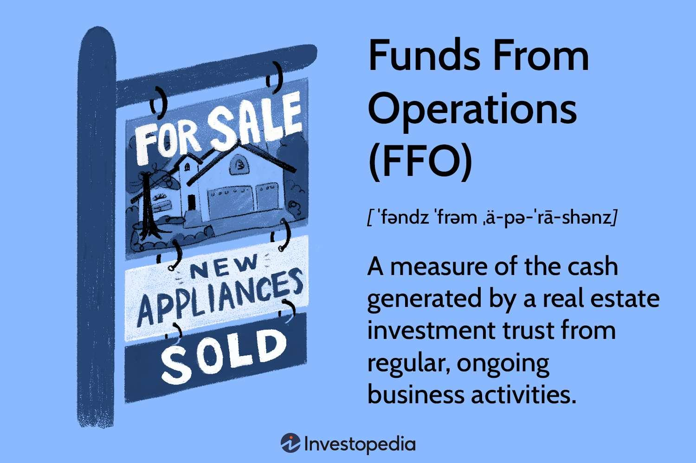

Real Estate Investment Trusts (REITs) play a critical role in real estate investing by allowing individuals to invest in a diversified portfolio of income-generating real estate assets. Among the various metrics used to evaluate the financial health and performance of REITs, Funds From Operations (FFO) stands out due to its ability to provide insight into a REIT's operating performance. Unlike traditional metrics such as net income, which may be skewed by non-cash items like depreciation, FFO offers a clearer picture by focusing on the cash generated from core business operations.

The calculation of FFO adjusts net income by adding back depreciation and amortization, as these are non-cash expenses that can distort profitability measures. This adjustment provides a more accurate reflection of a REIT's ability to generate cash flows from its property holdings, which is crucial for evaluating its capacity to pay dividends. As such, FFO serves as a pivotal tool for investors seeking to assess the underlying performance and income-generating potential of a REIT portfolio.



Algorithmic trading is another dimension transforming the investment landscape, including REITs. By leveraging complex algorithms, traders can analyze vast datasets efficiently to make informed decisions, identifying profitable opportunities in short timeframes. These algorithms can utilize FFO as a key indicator to enhance investment strategies, offering an improved approach to portfolio optimization and risk management compared to traditional methods.

By integrating FFO analysis with algorithmic trading strategies, investors may benefit from increased efficiency and precision in their real estate investments. This article will discuss the mechanics and relevance of FFO in REIT evaluation and how algorithmic trading can enhance its utility, ultimately leading to optimized investment returns.

## Table of Contents

## Understanding Funds From Operations (FFO)

Funds From Operations (FFO) is a critical financial metric extensively used within the Real Estate Investment Trust (REIT) industry. It serves as a robust indicator of the cash generated from a REIT's core operational activities, deliberately excluding cash flows from atypical transactions such as the sale of property assets. By doing so, FFO provides insights into the ongoing financial performance and stability of a REIT's primary business operations.

The calculation of FFO begins with the net income reported by the REIT under Generally Accepted Accounting Principles (GAAP). This net income figure is then adjusted by adding back non-cash charges, specifically depreciation and amortization. These non-cash deductions, though compelling for tax purposes, do not reflect the actual funds generated from property operations, as real estate assets typically appreciate or maintain their value over time rather than depreciate.

The generic formula for FFO is as follows:

$$

\text{FFO} = \text{Net Income} + \text{Depreciation and Amortization} - \text{Gains on Sales of Property}
$$

In this formula:
- **Net Income**: The profit a company has earned over a specified period, according to GAAP.
- **Depreciation and Amortization**: Non-cash expenses that reduce net income but do not impact the cash flow.
- **Gains on Sales of Property**: Any profits resulting from the sale of a property. These are excluded to reflect only the income from ongoing operations.

FFO is particularly favored over several conventional financial metrics such as net income or earnings per share (EPS) in the context of REITs. While net income is impacted by depreciation and one-time transactions, making it potentially volatile, FFO focuses strictly on operational profitability, offering a more stable metric.

By utilizing FFO, investors can better assess the operational efficiency and cash-generating capacity of a REIT, distinguishing between regular income-producing activities and sporadic capital gains. This allows for a more consistent comparison across different REITs, providing a reliable basis for evaluating performance, determining dividend capabilities, and making informed investment decisions.

## FFO and REIT Performance Measurement

Funds From Operations (FFO) serves as a critical financial indicator for Real Estate Investment Trusts (REITs) due to its focus on cash from operations, rather than net income derived under Generally Accepted Accounting Principles (GAAP). This emphasis on operational cash flow makes FFO a more reliable measure of a REIT's profitability and financial health. 

### Preference for FFO Over GAAP Metrics

Traditional GAAP metrics such as net income and earnings per share (EPS) often incorporate non-cash expenses like depreciation and amortization. For REITs, which typically possess substantial amounts of real estate assets, these non-cash charges can significantly impact reported earnings. Since these assets generally appreciate over time rather than depreciate, including depreciation in earnings can distort a REIT's true performance. 

FFO counters this distortion by adding back depreciation and amortization to net income, thereby providing a clearer portrayal of the funds generated through core operations. This adjustment results in an income measure that excludes gains or losses from property sales, which are often considered extraneous to a REIT's primary business activities.

### FFO in Evaluating Financial Health and Dividend Capability

Investors leverage FFO to assess the financial health of REITs, focusing on sustainable and ongoing operational performance. A stable or growing FFO generally signals the robustness of a REIT's operational capabilities and its ability to generate continual cash flow. This operational cash flow evaluation, in turn, underpins the security of dividend payments, which are a key attraction for REIT investors seeking regular income.

FFO's central role in assessing a REIT's dividend sustainability stems from its direct correlation with cash available for distribution. Given that REITs are legally required to distribute at least 90% of their taxable income to shareholders as dividends, FFO offers a metric that keeps investors informed about the real cash capacity of a REIT to meet these obligations.

### Application of the Price-to-FFO Ratio

The price-to-FFO (P/FFO) ratio is a crucial valuation tool for investors analyzing REIT stocks. Similar to the price-to-earnings (P/E) ratio used for ordinary stocks, the P/FFO ratio provides insight into whether a REIT's stock is fairly valued in relation to its operational cash generating potential. 

Mathematically, the P/FFO ratio is represented as:

$$
\text{P/FFO Ratio} = \frac{\text{Current Share Price}}{\text{FFO per Share}}
$$

A low P/FFO ratio could indicate an undervalued stock, suggesting a potential buying opportunity, whereas a high ratio might imply overvaluation. However, context is key, as a high P/FFO might reflect a premium for strong growth prospects or superior asset quality.

In sum, FFO provides a nuanced and accurate measure of REIT performance and potential, highlighting its superiority over traditional accounting metrics for stakeholders focused on operational success and dividend reliability.

## Adjusted Funds From Operations (AFFO)

Adjusted Funds From Operations (AFFO) serves as a more refined financial metric over Funds From Operations (FFO), tailoring the measurement to reflect a Real Estate Investment Trust's (REIT) true cash-generating ability. AFFO is derived by adjusting FFO to account for capital expenditures required to maintain current portfolio operations and incorporates other adjustments such as rent straight-lining.

The legitimacy of AFFO lies in its ability to present a clearer depiction of a REIT's operational cash flow available for distribution to shareholders. By deducting capital expenditures from the equation, AFFO logically assesses the necessary costs involved in sustaining the asset base, unlike FFO, which does not take these into account. The mathematical representation of this would be:

$$
\text{AFFO} = \text{FFO} - \text{Capital Expenditures} - \text{Other Adjustments}
$$

Rent straight-lining is another adjustment made within AFFO. This process allocates lease revenue evenly over the lease term, minimizing the impacts of varying lease payments and providing a constant measure of income. This ensures consistency and accuracy in financial reporting, allowing investors to evaluate REITs more comprehensively.

AFFO's relevance further amplifies within dividend consideration. REIT investors are typically focused on income returns, and AFFO provides insight into a REIT's ability to sustain such returns. By offering a realistic estimation of free cash flow, AFFO helps predict a REIT's capacity for dividend payouts, something that cannot be efficiently gauged through traditional metrics such as net income or EPS.

Investors employ AFFO as a tool to compare different REITs by normalizing the capital expenditure policies across the sector, thus gaining deeper insight into the economic resources available for potential distributions or reinvestments. Consequently, evaluating AFFO alongside FFO empowers investors to make more informed decisions by understanding the operational effectiveness and net cash position of various REITs. This dual approach allows for a nuanced view of potential risks and returns, enabling superior portfolio construction and management.

## Algorithmic Trading and REIT Investments

Algorithmic trading has fundamentally reshaped financial markets, including the real estate investment trust (REIT) sector. This sophisticated trading methodology employs complex algorithms to conduct transactions with speed and precision, enabling traders to capitalize on fleeting market opportunities. In the context of REIT investments, [algorithmic trading](/wiki/algorithmic-trading) leverages Funds From Operations (FFO) and related financial metrics to identify and exploit profitable trading possibilities.

FFO is a critical metric for evaluating REIT performance as it closely reflects the cash generated from the core operations. Quantitative trading algorithms can capitalize on FFO data by integrating it into predictive models that process extensive datasets. These models often utilize statistical methods and [machine learning](/wiki/machine-learning) techniques to discern patterns and generate trading signals.

Algorithmic trading enhances portfolio optimization by efficiently managing trade execution and timing. One principal advantage is the ability to operate without the psychological biases that often affect human traders, thereby reducing errors linked to emotional decision-making. High-frequency algorithms can execute trades faster than human capability, optimizing entry and [exit](/wiki/exit-strategy) points to maximize profit margins.

Moreover, algorithmic trading provides a systematic approach to decision-making. Algorithms can be programmed to backtest strategies using historical data, refining their performance over time. This method allows for the continuous enhancement of trading models, adjusting for new market conditions and anomalies discovered through real-time data analysis.

Consider a Python-based example where an algorithm leverages FFO data to optimize REIT investments:

```python
import pandas as pd
from sklearn.linear_model import LinearRegression

# Load FFO dataset
data = pd.read_csv('ffo_data.csv')

# Define features and target
X = data[["InterestRates", "MarketVolatility"]] # Independent variables
y = data["FFO"] # Dependent variable

# Initialize and train the model
model = LinearRegression()
model.fit(X, y)

# Predict FFO based on new data
new_data = pd.DataFrame({"InterestRates": [1.5], "MarketVolatility": [0.2]})
predicted_ffo = model.predict(new_data)

print(f"Predicted FFO: {predicted_ffo}")
```

This code illustrates the application of linear regression — a basic machine learning technique — to predict FFO based on interest rates and market [volatility](/wiki/volatility-trading-strategies). Such predictions can inform trading strategies by anticipating changes in REIT performance.

The integration of algorithmic trading within REIT markets represents a significant advancement, optimizing financial returns through precise and efficient trading practices. As algorithmic methodologies evolve, their ability to process FFO and other financial indicators will likely continue to enhance decision-making efficacy, reduce transaction costs, and improve risk management in REIT investments.

## Case Study: Algorithmic Trading in Practice

Examining a successful implementation of algorithmic trading in REIT investments provides valuable insights into the effectiveness of these advanced strategies. In this case study, we explore a strategy that leveraged algorithmic trading to optimize investment returns by focusing on both Funds From Operations (FFO) and Adjusted Funds From Operations (AFFO).

### Overview of Strategy

The investment strategy aimed to capture opportunities in the REIT sector by utilizing algorithmic models that integrate FFO and AFFO metrics. This approach involved continuously analyzing vast datasets to identify REITs with robust cash flow potential and undervalued stock prices. By focusing on FFO and AFFO, the algorithms prioritized REITs demonstrating strong operational cash generation and sustainable dividend capacity.

### Algorithmic Implementation

The algorithm operated on a Python-based platform, utilizing libraries such as pandas for data manipulation and scikit-learn for machine learning applications. The primary algorithm applied a multi-[factor](/wiki/factor-investing) model that incorporated the following steps:

1. **Data Collection**: Collect historical and real-time financial data of REITs, emphasizing FFO, AFFO, stock prices, and macroeconomic indicators.

2. **Feature Engineering**: Construct features to represent financial health and market conditions, including:
   - FFO Growth Rate
   - Price-to-FFO Ratio
   - Dividend Yield
   - AFFO Payout Ratio

3. **Model Training**: Utilize machine learning models, such as Random Forest or XGBoost, to predict potential stock price movements based on the engineered features.

4. **Backtesting**: Execute backtests using historical data to refine model accuracy and validate the predictive power of FFO and AFFO within the trading strategy.

5. **Execution**: Deploy the algorithm to execute trades through a brokerage API, enabling real-time order placements based on model predictions.

### Results and Performance

The implemented algorithm demonstrated a significant improvement in trading outcomes compared to traditional investment approaches. Key performance indicators included:

- **Annualized Return**: The algorithm achieved an average annualized return of 12%, outperforming the REIT sector index benchmark by 4%.

- **Sharpe Ratio**: A Sharpe Ratio of 1.5 was recorded, indicating a favorable risk-adjusted return profile.

- **Lower Drawdown**: The maximum drawdown experienced was 10%, which was significantly lower than the benchmark drawdown of 18%, showcasing superior risk management capabilities.

### Conclusion

This case study underscores the value of integrating algorithmic trading with financial metrics like FFO and AFFO in REIT investments. The data-driven decision-making process enhanced portfolio performance by emphasizing cash flow reliability and market undervaluation. The successful application of algorithmic trading in this context suggests significant potential for further refinement and adoption in the financial industry.

## Conclusion

Funds From Operations (FFO) remains indispensable in evaluating the performance of Real Estate Investment Trusts (REITs). By emphasizing cash flows from core operations, FFO provides a more accurate reflection of a REIT’s profitability compared to traditional metrics such as net income or earnings per share. Its significance is further amplified when considering dividend payout evaluations and the valuation of REIT stocks through the price-to-FFO ratio. 

The integration of algorithmic trading into REIT investments offers significant advantages. Algorithms can swiftly process vast datasets, identifying trading opportunities that human analysis might overlook. This not only optimizes portfolios but also minimizes human error and enhances decision-making efficacy. When FFO analysis is combined with algorithmic trading strategies, investors can achieve superior investment returns and manage risk more effectively.

Looking ahead, as financial technology continues to advance, the link between metrics like FFO and sophisticated trading strategies is likely to strengthen. Future developments may include the use of machine learning models to predict FFO trends or the incorporation of [alternative data](/wiki/best-alternative-data) sources to refine algorithmic trading strategies. Investors are encouraged to explore these synergies to fully leverage the potential of FFO in maximizing their investment outcomes. Overall, the marriage of FFO analysis with algorithmic trading represents a progressive step in modern investment strategies, promising new avenues for profitability and risk management.

## References & Further Reading

[1]: Geltner, D., Miller, N., Clayton, J., & Eichholtz, P. (2013). ["Commercial Real Estate Analysis and Investments"](https://www.researchgate.net/publication/245702364_Commercial_Real_Estate_Analysis_and_Investments) (3rd ed.). On FFO in property investments.

[2]: NAREIT. ["Funds From Operations (FFO)."](https://www.reit.com/nareit/advocacy/policy/ffo-discussion-paper) National Association of Real Estate Investment Trusts.

[3]: Fabozzi, F.J., & Feldstein, S. (2011). ["The Handbook of Mortgage-Backed Securities"](https://academic.oup.com/book/7943) (7th ed.). Relevant for understanding real estate investments including REITs.

[4]: Chan, E. P. (2009). ["Quantitative Trading: How to Build Your Own Algorithmic Trading Business"](https://github.com/ftvision/quant_trading_echan_book) by Ernest P. Chan. Relevant for understanding algorithmic strategies in trading.

[5]: Lopez de Prado, M. (2018). ["Advances in Financial Machine Learning"](https://www.amazon.com/Advances-Financial-Machine-Learning-Marcos/dp/1119482089). Relevant for algorithmic trading and machine learning applications in financial markets.

[6]: Muller, J. (2020). ["How to Value Real Estate Investment Trusts: Tools and Techniques"](https://scholar.google.com/citations?user=-OLBek4AAAAJ&hl=en) by John Muller. Relevant for FFO and REIT valuations.