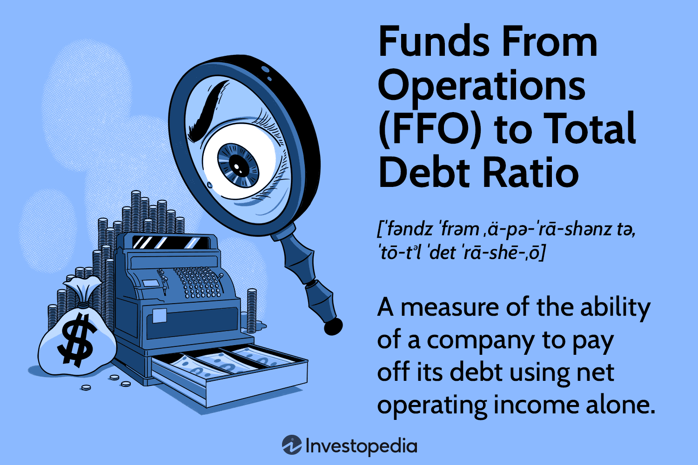

## Table of Contents

## What is the Funds From Operations (FFO) to Total Debt Ratio?

The Funds From Operations (FFO) to Total Debt Ratio is a financial metric used to evaluate a company's ability to pay off its debt using the cash it generates from its operations. Specifically, it measures how well a company's earnings from its core business activities can cover its total debt. This ratio is particularly important for companies in the real estate sector, such as Real Estate Investment Trusts (REITs), because it provides a clearer picture of their financial health and operational efficiency.

To calculate the FFO to Total Debt Ratio, you take the Funds From Operations and divide it by the total debt of the company. Funds From Operations is calculated by adding depreciation, amortization, and losses on sales of assets to net income, and then subtracting any gains on sales of assets and interest income. A higher ratio indicates that the company is generating enough operational cash flow to comfortably manage its debt, which is a sign of financial stability. Conversely, a lower ratio might suggest that the company could struggle to meet its debt obligations, signaling potential financial risk.

## Why is the FFO to Total Debt Ratio important for real estate investment trusts (REITs)?

The FFO to Total Debt Ratio is really important for real estate investment trusts, or REITs, because it shows how well they can pay off their debts with the money they make from their business. REITs often have a lot of debt because they buy and manage properties, and they need to make sure they can handle these debts. By looking at this ratio, people who invest in REITs or lend them money can see if the REIT is making enough money to cover its debts.

This ratio is especially useful for REITs because their traditional earnings numbers can be misleading. REITs have a lot of depreciation and amortization expenses, which are non-cash charges that can make their net income look lower than it really is. The FFO to Total Debt Ratio takes these factors into account, giving a clearer picture of the REIT's financial health. A higher ratio means the REIT is in a good spot to pay off its debts, making it a safer investment.

## How do you calculate the Funds From Operations (FFO)?

To calculate Funds From Operations, or FFO, you start with the company's net income. Then, you add back depreciation and amortization because these are non-cash expenses that don't actually take money out of the company's pocket. You also add back any losses from selling assets, because these losses can make the net income look worse than it really is. On the other hand, you subtract any gains from selling assets, because these gains can make the net income look better than it really is. Finally, you subtract any interest income the company earned, because FFO focuses on the money made from the main business, not from other sources like investments.

FFO is really important for companies like real estate investment trusts, or REITs, because it shows how much money they are making from their main business of managing properties. Traditional net income can be misleading for REITs because of all the depreciation and amortization they have to account for. By using FFO, investors and analysts can get a better idea of how much cash the REIT is actually generating, which helps them understand if the company is doing well financially.

## What constitutes Total Debt in the FFO to Total Debt Ratio?

Total Debt in the FFO to Total Debt Ratio includes all the money a company owes. This means it covers both short-term debt, like loans that need to be paid back soon, and long-term debt, like mortgages or bonds that will be paid back over many years. It also includes any other borrowings the company has, like lines of credit or notes payable.

For real estate investment trusts, or REITs, knowing the total debt is important because they often use a lot of borrowed money to buy properties. By comparing the Funds From Operations to this total debt, investors can see if the REIT is making enough money to pay back what it owes. A higher ratio means the REIT is in a good position to handle its debts, which makes it a safer investment.

## Can you provide a simple example of how to compute the FFO to Total Debt Ratio?

Let's say a real estate investment trust, or REIT, has a net income of $100,000. It also has depreciation and amortization expenses of $20,000, and it made a loss of $5,000 from selling an asset. On the other hand, it had a gain of $3,000 from selling another asset and earned $2,000 in interest income. To find the Funds From Operations, or FFO, we start with the net income of $100,000. We add back the depreciation and amortization of $20,000 and the loss from selling an asset of $5,000. Then, we subtract the gain from selling an asset of $3,000 and the interest income of $2,000. So, the FFO is $100,000 + $20,000 + $5,000 - $3,000 - $2,000 = $120,000.

Now, let's say this REIT also has a total debt of $600,000. This includes all the money it owes, like short-term loans and long-term mortgages. To calculate the FFO to Total Debt Ratio, we take the FFO of $120,000 and divide it by the total debt of $600,000. So, the ratio is $120,000 / $600,000 = 0.20. This means for every dollar of debt, the REIT is generating $0.20 from its operations. A higher ratio would mean the REIT is in a better position to pay off its debts, showing it's financially healthier.

## What is considered a good FFO to Total Debt Ratio?

A good FFO to Total Debt Ratio depends on the industry, but for real estate investment trusts, or REITs, a ratio of 0.20 or higher is generally considered healthy. This means the REIT is making enough money from its operations to cover at least 20% of its total debt each year. A higher ratio, like 0.25 or above, is even better because it shows the REIT has more cash coming in to handle its debts, making it a safer investment.

However, what's considered "good" can vary. Some investors might be okay with a lower ratio if they believe the REIT's properties will increase in value over time. But in general, a higher FFO to Total Debt Ratio means the REIT is in a strong financial position and less likely to have trouble paying back what it owes.

## How does the FFO to Total Debt Ratio differ from other financial ratios used in real estate?

The FFO to Total Debt Ratio is a special financial ratio used a lot in real estate, especially for REITs. It shows how well a company can pay its debts with the money it makes from its main business. This ratio is different from others because it uses Funds From Operations, or FFO, which adds back non-cash expenses like depreciation and amortization to the net income. This gives a clearer picture of the cash the company is really making, which is super important for REITs because they deal with a lot of property and have big depreciation costs.

Other common financial ratios in real estate include the Debt to Equity Ratio and the Net Income to Debt Ratio. The Debt to Equity Ratio looks at how much a company is borrowing compared to what the owners have put in, showing how much risk the company is taking on. The Net Income to Debt Ratio uses the company's net income to see how well it can pay its debts, but it doesn't adjust for non-cash expenses like the FFO to Total Debt Ratio does. So, while these ratios give important information, the FFO to Total Debt Ratio is more specific to the real estate industry and gives a better idea of a REIT's ability to handle its debts with the cash it generates from its operations.

## What are the limitations of using the FFO to Total Debt Ratio as a financial metric?

The FFO to Total Debt Ratio is a helpful way to see how well a real estate company can pay off its debts with the money it makes from its main business. But it has some limitations. One big problem is that it doesn't tell you about the quality of the company's assets. Just because a company has a high FFO to Total Debt Ratio doesn't mean all its properties are in good shape or will keep making money. Also, this ratio doesn't show if the company is spending too much on maintaining or improving its properties, which can affect how much money it makes in the future.

Another limitation is that the FFO to Total Debt Ratio can be affected by how the company decides to report its numbers. For example, if a company changes how it calculates depreciation or decides to sell off some assets, it can make the FFO look different without the company's actual financial health changing much. This means investors need to look at other things too, like the company's overall strategy and the health of the real estate market, to get a full picture of how well the company is doing.

## How can changes in the FFO to Total Debt Ratio impact investment decisions?

Changes in the FFO to Total Debt Ratio can really affect how investors decide to put their money into real estate investment trusts, or REITs. If the ratio goes up, it means the REIT is making more money from its operations compared to its debt. This can make investors feel more confident because it shows the REIT is in a better position to pay back what it owes. A higher ratio might encourage investors to buy more shares or invest more money, thinking the REIT is financially stable and a safer bet.

On the other hand, if the FFO to Total Debt Ratio goes down, it can make investors worried. A lower ratio means the REIT might not be making enough money to cover its debts easily. This could lead investors to sell their shares or decide not to invest more money, as they might see the REIT as riskier. So, keeping an eye on this ratio helps investors make smarter choices about where to put their money, based on how well the REIT can handle its financial responsibilities.

## What industry benchmarks should be considered when analyzing the FFO to Total Debt Ratio?

When looking at the FFO to Total Debt Ratio for real estate investment trusts, or REITs, it's helpful to compare it to industry benchmarks. A common benchmark is a ratio of 0.20 or higher, which means the REIT is making enough money to cover at least 20% of its debt each year. This is seen as a sign that the REIT is doing well financially. But what's considered a good ratio can change depending on the type of real estate the REIT is involved in, like shopping centers, apartments, or office buildings. Each type of real estate might have different standards for what's considered a healthy ratio.

Also, it's important to look at how the FFO to Total Debt Ratio compares to other REITs in the same industry. If a REIT's ratio is much lower than its competitors, it might be a sign that it's not managing its debt as well. On the other hand, if it's much higher, it could mean the REIT is in a stronger financial position. Keeping an eye on these benchmarks helps investors and analysts understand how a REIT is doing compared to others and make better investment choices.

## How does the FFO to Total Debt Ratio correlate with a company's credit rating?

The FFO to Total Debt Ratio can tell us a lot about a company's credit rating. A high ratio means the company is making enough money from its main business to cover a good part of its debt. This makes lenders feel more confident about giving the company money because it looks like the company can pay it back easily. So, a high FFO to Total Debt Ratio can lead to a better credit rating, which means the company might get lower interest rates on loans and have an easier time borrowing money.

On the other hand, if the FFO to Total Debt Ratio is low, it can worry lenders. A low ratio means the company might not be making enough money to pay off its debts well. This can lead to a lower credit rating, making it harder for the company to borrow money and possibly having to pay higher interest rates. So, keeping an eye on this ratio is important for understanding how safe it is to lend money to a company and what kind of credit rating it might have.

## What advanced analytical techniques can be applied to enhance the interpretation of the FFO to Total Debt Ratio?

To get a better understanding of the FFO to Total Debt Ratio, you can use a technique called trend analysis. This means looking at how the ratio changes over time. If the ratio keeps going up, it shows the company is getting better at making money to pay its debts. But if it keeps going down, it might mean the company is having trouble. By looking at these trends, you can see if the company is improving or if it might face problems in the future. This can help investors and analysts make smarter choices about where to put their money.

Another helpful technique is comparing the FFO to Total Debt Ratio with other companies in the same industry. This is called benchmarking. If a company's ratio is higher than its competitors, it might be doing a better job at managing its debt. But if it's lower, it could be a sign that the company is not as financially strong. Also, you can use statistical tools like regression analysis to see how the FFO to Total Debt Ratio relates to other financial indicators, like the company's growth or the health of the real estate market. This can give a fuller picture of what the ratio means and help predict how the company might do in the future.

## What is the Funds From Operations (FFO) to Total Debt Ratio?

The Funds From Operations (FFO) to Total Debt ratio is a crucial leverage ratio that quantifies a company's ability to generate cash flow relative to its total debt. This ratio plays a vital role in assessing the financial health of real estate investment trusts (REITs) and other entities with significant debt obligations. By scrutinizing this ratio, investors and analysts can gain insights into a company's capacity to manage and repay its debts through operational earnings.

The FFO in this context usually refers to the net operating income after adjusting for essential non-cash expenses such as depreciation and amortization. These non-cash adjustments are critical as they add back to the net income to produce a more accurate reflection of the cash flow from operations. The formula for calculating the FFO to Total Debt ratio is as follows:

$$
\text{FFO to Total Debt Ratio} = \frac{\text{Funds From Operations}}{\text{Total Debt}}
$$

In this equation, the Funds From Operations is calculated by taking the net income and adding back non-cash charges, including but not limited to depreciation and amortization.

This ratio is particularly insightful for identifying a company's leverage level. A lower FFO to Total Debt ratio indicates a higher risk, suggesting that the company might struggle to meet its debt obligations without resorting to asset liquidation or additional borrowing. This scenario is often indicative of higher financial leverage and increased vulnerability to fiscal challenges.

Conversely, a higher FFO to Total Debt ratio portrays the company's robust capacity to service its debt primarily from its operating income, thereby minimizing its credit risk. Such a financial position is favorable, as it signals a stronger ability to manage debt through internal cash flow, potentially enhancing the company's creditworthiness and investor appeal.

In summary, the FFO to Total Debt ratio offers an insightful measure of a company's financial resilience and risk exposure, offering guidance on its operational cash generation compared to the weight of its debt.

## What are the Calculation and Components of the FFO to Total Debt Ratio?

To calculate the Funds From Operations (FFO) to Total Debt ratio, begin by determining the Free Cash Flow (FFO). FFO is calculated by taking the net income and adding back non-cash charges such as depreciation and amortization, which are subtracted in traditional accounting to reflect wear and tear on assets but do not represent actual cash outflows. The formula for FFO can be expressed as:

$$

\text{FFO} = \text{Net Income} + \text{Depreciation} + \text{Amortization} + \text{Other Non-Cash Charges}
$$

Next, calculate the Total Debt. Total debt includes both long-term and short-term liabilities. Long-term debt consists of obligations like bonds and loans that are due in more than a year, while short-term debt encompasses liabilities such as commercial papers and bank overdrafts that are payable within the year. Total debt can be expressed as:

$$

\text{Total Debt} = \text{Long-Term Liabilities} + \text{Current Liabilities}
$$

Using these two components, the FFO to Total Debt ratio can be calculated with the following formula:

$$

\text{FFO to Total Debt Ratio} = \frac{\text{FFO}}{\text{Total Debt}}
$$

This ratio offers insights into a company's capacity to meet its debt obligations from its operating cash flow, providing a measure of financial risk and stability. The key components essential in this calculation include net operating income, depreciation, amortization, and any non-cash adjustments. It is important for analysts and investors to ensure accurate adjustments for these non-cash items to reflect an accurate cash flow figure that would be available for debt servicing.

## References & Further Reading

[1]: ["Financial Ratios Analysis: Leverage Ratios"](https://www.financestrategists.com/wealth-management/accounting-ratios/leverage-ratios/) - Investopedia

[2]: ["Corporate Finance: Theory and Practice"](https://www.amazon.com/Corporate-Finance-Practice-Pierre-Vernimmen/dp/1119424488) by Aswath Damodaran

[3]: ["Algorithmic Trading and DMA: An Introduction to Direct Access Trading Strategies"](https://www.amazon.com/Algorithmic-Trading-DMA-introduction-strategies/dp/0956399207) by Barry Johnson

[4]: ["The Intelligent Investor: The Definitive Book on Value Investing"](https://www.amazon.com/Intelligent-Investor-3rd-Ed/dp/0063356724) by Benjamin Graham

[5]: ["Financial Statement Analysis and Security Valuation"](https://cie-advances.asme.org/files-library-Documents/financial-statement-analysis-and-security-valuation.pdf) by Stephen H. Penman