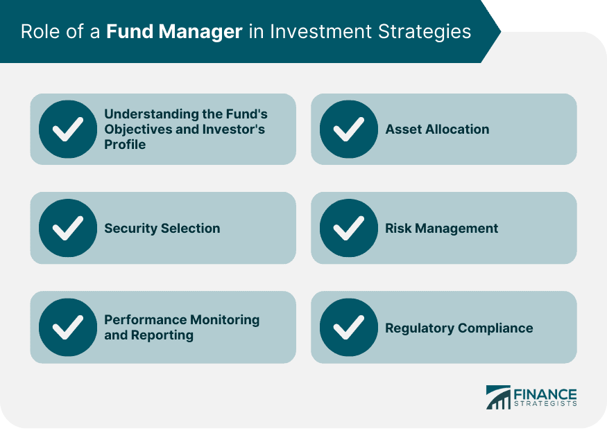

## Table of Contents

## What is funds management?

Funds management is the process of handling and investing money for people or organizations. It involves making decisions about where to put the money so it can grow over time. People who manage funds, called fund managers, look at different investments like stocks, bonds, and real estate. They try to pick the best options to help their clients reach their financial goals.

Fund managers also keep an eye on the performance of the investments. They make changes if needed to keep the money safe and growing. This job requires a lot of knowledge about the market and the economy. Fund managers use this knowledge to make smart choices and help their clients' money work harder for them.

## What are the primary responsibilities of a funds manager?

A funds manager's main job is to take care of other people's money and make it grow. They do this by choosing where to invest the money, like in stocks, bonds, or real estate. They look at a lot of information to decide which investments are the best. They also think about what their clients want, like if they want to save for retirement or buy a house. The goal is to pick investments that will help the clients reach their goals.

Another big part of a funds manager's job is to watch how the investments are doing. They keep track of the market and the economy to see if they need to make changes. If an investment isn't doing well, they might sell it and buy something else. They also need to make sure the money is safe and not too risky. This means they have to balance the chance of making more money with the chance of losing it. It's a big responsibility, but it's important for helping clients' money grow over time.

## How does funds management differ from personal financial management?

Funds management and personal financial management are two different ways of handling money. Funds management is when a professional, called a fund manager, takes care of a large pool of money for other people or organizations. The fund manager makes decisions about where to invest this money to make it grow. They look at lots of different options like stocks, bonds, and real estate, and try to pick the best ones to meet the goals of their clients. This is different from personal financial management, which is when an individual manages their own money. In personal financial management, people make their own decisions about saving, spending, and investing based on their personal goals and needs.

The main difference between the two is who is in control and the scale of the money being managed. In funds management, the fund manager has the control and is managing a large amount of money that belongs to many different people or organizations. They have to think about the big picture and make choices that will help everyone's money grow. On the other hand, in personal financial management, the individual has control over their own money. They might have less money to manage, but they can make choices that fit their own life and goals. Both types of management are important, but they work in different ways and serve different purposes.

## What are the key skills required to be a successful funds manager?

To be a successful funds manager, you need to be good at understanding the market and the economy. This means you have to know a lot about different investments like stocks, bonds, and real estate. You also need to be able to look at a lot of information and make smart choices about where to put the money. Being good at math and analyzing data helps a lot because you have to figure out which investments will grow the most and be the safest.

Another important skill is being able to talk to people and understand what they want. As a funds manager, you work with clients who have different goals, like saving for retirement or buying a house. You need to listen to them and make sure you pick investments that will help them reach their goals. It's also important to be able to explain your choices to your clients in a way they can understand. Being organized and good at managing your time helps too, because you have to keep track of a lot of different investments and make sure everything is going well.

## What industries commonly employ funds managers?

Funds managers work in many different industries, but they are most common in finance and investment companies. These companies hire funds managers to take care of money for their clients. The clients might be regular people saving for the future, or big organizations like companies and governments. The funds managers in these places make choices about where to invest the money so it can grow over time.

Another industry that often uses funds managers is the insurance industry. Insurance companies collect money from people who buy insurance policies. They need to invest this money wisely so they can pay out claims when people need them. Funds managers help the insurance companies choose the best investments to keep the money safe and growing. 

Some pension funds and endowments also hire funds managers. Pension funds are big pools of money that help people save for when they retire. Endowments are funds that support things like universities or charities. Both types of organizations need funds managers to make sure the money lasts a long time and can help as many people as possible.

## How do funds managers assess and manage risk?

Funds managers assess and manage risk by looking at different things that could affect the money they are taking care of. They think about how likely it is that an investment might lose value and how much money could be lost. They also look at how the market and the economy are doing, because these can change the value of investments. To help them understand the risk, funds managers use tools like risk models and stress tests. These tools help them see what might happen if things go wrong, so they can plan for it.

Once they understand the risks, funds managers try to manage them in different ways. One way is by spreading the money across many different types of investments. This is called diversification, and it helps because if one investment loses value, the others might still be doing well. Another way is by choosing investments that are less likely to lose a lot of money, even if they might not grow as fast. Funds managers also keep an eye on their investments all the time, so they can make changes if they see that the risk is getting too high. By doing all these things, they try to keep the money safe while still helping it grow.

## What are the different types of funds that can be managed?

Funds managers can handle many different types of funds. One common type is mutual funds. These are pools of money from many people that a funds manager invests in things like stocks and bonds. The goal is to make the money grow for everyone who put money into the fund. Another type is hedge funds, which are also pools of money but they often use more risky ways to try to make money. Hedge funds are usually for people who can handle more risk and have more money to invest.

Another type of fund is pension funds. These are used to help people save for when they stop working. Funds managers invest the money in these funds to make sure it lasts a long time and can pay out to people when they retire. Endowment funds are similar, but they are used to support things like schools or charities. The funds manager's job is to make sure the money keeps growing so it can help the school or charity for many years.

There are also exchange-traded funds (ETFs) and index funds. ETFs are like mutual funds but they can be bought and sold like stocks on the stock market. Index funds are a type of mutual fund that tries to match the performance of a specific part of the market, like the S&P 500. Funds managers handle these funds by choosing the right investments to meet the goals of the fund. Each type of fund has its own way of working, but the main job of the funds manager is always to make the money grow while keeping it safe.

## How do regulatory requirements impact funds management?

Regulatory requirements are rules that funds managers have to follow. These rules are made by governments and other groups to make sure that funds managers do their job in a fair and honest way. They help protect the people who put their money into funds. For example, there are rules about what funds managers can and can't do with the money they manage. They have to be clear about their fees and how they make money. They also have to tell their clients about any risks and keep them updated on how their money is doing.

These rules can make the job of a funds manager harder because they have to spend time making sure they follow all the rules. But the rules are important because they help keep the money safe and make sure everyone is treated fairly. Funds managers have to keep up with changes in the rules, which can happen often. This means they need to be good at understanding and following new laws. Even though it can be a lot of work, following the rules is a big part of being a good funds manager.

## What are the latest trends in funds management?

One of the latest trends in funds management is the growing interest in sustainable and responsible investing. More and more people want their money to be invested in companies that are good for the environment and society. This means funds managers are looking for investments that not only make money but also help the world. They might choose companies that use clean energy or have good labor practices. This trend is changing how funds managers pick investments and is making them think about more than just making money.

Another trend is the use of technology in funds management. Funds managers are using new tools like [artificial intelligence](/wiki/ai-artificial-intelligence) and big data to make better decisions about where to invest. These tools help them look at a lot of information quickly and find patterns that they might not see otherwise. This can help them pick better investments and manage risk more effectively. As technology keeps getting better, it's likely that funds managers will use it even more to help their clients' money grow.

## How do funds managers use technology to enhance their performance?

Funds managers use technology to make their jobs easier and better. They use computers and special software to look at a lot of information quickly. This helps them see patterns and trends that they might miss if they were just looking at numbers on paper. For example, they use artificial intelligence to help them pick the best investments. AI can look at a lot of data and find the best choices faster than a person could. This helps funds managers make smarter decisions and find good investments that they might not have found otherwise.

Another way funds managers use technology is to manage risk better. They use special tools called risk models and stress tests to see what might happen if the market changes. These tools help them understand how risky their investments are and make plans to keep the money safe. Technology also helps them keep track of their investments all the time. They can use apps and online platforms to watch how their investments are doing and make changes if they need to. This makes it easier for them to keep their clients' money growing and safe.

## What are the ethical considerations in funds management?

Funds managers have to think about doing the right thing when they handle other people's money. One big ethical issue is being honest and clear with their clients. They need to tell their clients about any fees they charge and how they make money. They also have to explain the risks of the investments they pick. If they don't tell the truth or hide important information, it's not fair to the people who trust them with their money.

Another ethical consideration is making sure they put their clients' needs first. Sometimes, funds managers might be tempted to pick investments that make them more money, even if they're not the best for their clients. This is called a conflict of interest, and it's not right. Funds managers should always choose investments that help their clients reach their goals, even if it means they make less money themselves. By doing this, they show that they care about their clients and are working to help them, not just to help themselves.

## How can funds managers optimize portfolio performance in volatile markets?

In volatile markets, funds managers can optimize portfolio performance by using a strategy called diversification. This means they spread the money across many different types of investments, like stocks, bonds, and real estate. By doing this, if one investment loses value because the market is going up and down a lot, the other investments might still be doing well. This helps keep the money safe and can make the portfolio more stable. Funds managers also keep a close eye on the market and the economy. They use tools like risk models and stress tests to see how their investments might do if things change a lot. This helps them make smart choices about when to buy or sell investments to protect their clients' money.

Another way funds managers can optimize performance in volatile markets is by being ready to make changes quickly. They need to be able to react fast if the market starts to change a lot. This might mean selling some investments that are too risky and buying ones that are safer. Funds managers also need to talk to their clients a lot during these times. They should explain what's happening in the market and what they're doing to keep the money safe. By being clear and keeping their clients informed, funds managers can help everyone feel more confident, even when the market is going up and down a lot.

## References & Further Reading

Explore key publications on fund management and [algorithmic trading](/wiki/algorithmic-trading) for deeper insights:

1. **"The Intelligent Investor" by Benjamin Graham**: This classic text on investment strategies offers timeless wisdom on fund management principles and the art of value investing. It emphasizes the importance of thorough analysis and disciplined decision-making in achieving long-term financial success.

2. **"Algorithmic Trading: Winning Strategies and Their Rationale" by Ernest P. Chan**: A comprehensive guide to developing and implementing algorithmic trading systems. This book covers various algorithmic strategies, including statistical arbitrage, market making, and mean reversion, providing practical insights for traders and fund managers.

3. **"Advances in Financial Machine Learning" by Marcos López de Prado**: This resource highlights how machine learning techniques can enhance financial predictions and investment strategies. It explores the application of algorithms, backtesting, and portfolio optimization in the context of modern finance.

4. **"Financial Markets and Institutions" by Frederic S. Mishkin and Stanley Eakins**: This book provides an overview of the financial sector and its impact on fund management. It details how banks, investment firms, and other financial institutions contribute to the investment landscape, focusing on regulatory frameworks and technological trends.

5. **"Python for Finance: Mastering Data-Driven Finance" by Yves Hilpisch**: This text serves as a practical guide for financial professionals looking to integrate Python programming into their workflow. It covers tools and techniques for data analysis, quantitative finance, and the implementation of algorithmic trading models.

6. **"Machine Trading: Deploying Computer Algorithms to Conquer the Markets" by Ernest P. Chan**: This book further explores the intricacies of algorithmic trading. It provides a detailed look into strategy development, execution, and risk management, with a focus on leveraging technology and analytics.

7. **Academic Journals**: Leading journals such as the "Journal of Financial Markets" and the "Review of Financial Studies" often publish research on the latest trends and advancements in fund management and algorithmic trading. These publications can offer valuable insights into emerging strategies and regulatory challenges.

8. **Online Courses and Lectures**: Platforms like Coursera and edX offer courses on investment strategies and financial technologies, often featuring industry experts and academics. These resources can be beneficial for staying updated on new methodologies and tools in fund management and trading.

These texts and resources provide comprehensive coverage of the critical aspects of fund management and algorithmic trading, offering valuable perspectives for students, professionals, and anyone interested in finance.

