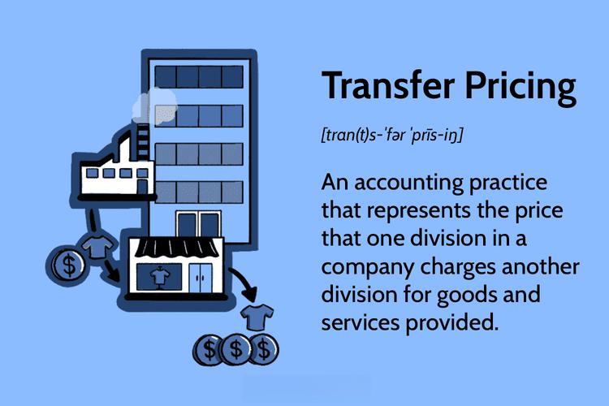

Funds Transfer Pricing (FTP) is an essential framework in banking finance that plays a pivotal role in enabling financial institutions to evaluate and optimize their profitability across various business segments. By adopting FTP, banks can comprehensively analyze how different funding sources contribute to their overall financial performance. This methodology allows for a clear understanding of the dynamics between interest income from loans and the cost associated with deposits and other liabilities.

Understanding FTP is fundamental for banks as it aids in the effective allocation of funds, ensuring that resources are directed towards the most profitable avenues. It also serves as a crucial tool for risk management, helping institutions monitor and mitigate potential risks associated with interest rate fluctuations and liquidity challenges. By providing insights into the true costs and returns of different banking activities, FTP enables more informed decision-making and strategy formulation.



This article will explore the key aspects of FTP, including various calculation methodologies and protocols. It will further discuss the critical importance of FTP in banking and finance, particularly highlighting its application in algorithmic trading. By dissecting the nuances of FTP, we aim to provide a comprehensive understanding of its vital role in enhancing the financial performance of institutions.

## Table of Contents

## What is Funds Transfer Pricing (FTP)?

Funds Transfer Pricing (FTP) is a financial management tool utilized by banks to evaluate how their funding sources impact overall profitability. This methodology enables banks to allocate interest expense and revenues to various business units, significantly aiding in the assessment of their performance. By understanding the contribution of each funding source to profitability, banks can strategically manage their resources and profitability metrics.

FTP plays a vital role in examining the performance of distinct product lines, branch outlets, and internal business processes. Through FTP, banks are able to attribute the costs and benefits of funds to specific departments or products, facilitating a detailed analysis of their economic contributions. This insight is crucial for identifying high-performing segments that drive profitability and recognizing areas requiring improvement.

In the banking industry, FTP is widely adopted for its ability to provide profound insights. It helps in analyzing not only the financial strengths but also the potential areas where enhancements are needed. By offering a clearer picture of where profits and costs originate, FTP assists in strategic decision-making, ensuring resources are channeled effectively to enhance overall financial health. This comprehensive evaluation makes FTP an indispensable component of a bank’s financial strategy, contributing significantly to efficient resource allocation and strategic planning.

## How FTP Works

Funds Transfer Pricing (FTP) is a strategic financial management tool used by banks to assess the performance of their asset and liability management operations. This involves a systematic process of measuring the profitability contributions from lending activities and deposit handling, which are fundamental components of a bank's operations. By allocating a cost to the funds that each division or product line uses, banks can ascertain the true profitability of their various business segments.

FTP is crucial in balancing a bank's funding sources and lending activities. A well-structured FTP system improves a bank's treasury management by optimizing the allocation and use of its financial resources. This involves establishing internal transfer rates that reflect current market conditions and funding costs, which allows banks to efficiently manage the mismatch between their assets and liabilities.

In practice, FTP works by assigning transfer prices to the different internal users and providers of funds within the bank. For instance, the deposits collected by a branch are assigned a cost, while the loans provided are assigned a revenue based on market-based funding rates. The difference between these rates indicates the spread or margin, which reflects the profitability of these activities.

Mathematically, the FTP framework can represent the contribution from a lending activity as:

$$
\text{Profitability} = (\text{Interest Rate on Loans} - \text{Transfer Price}) \times \text{Loan Volume}
$$

Similarly, for deposit handling:

$$
\text{Profitability} = (\text{Transfer Price} - \text{Interest Rate on Deposits}) \times \text{Deposit Volume}
$$

By applying these calculations, banks can derive key insights into the efficiency and profitability of their operations. Effective FTP helps in pinpointing the sources of profits and losses, thus aiding in strategic decision-making and resource allocation across the bank. Furthermore, by considering the profitability contributions from various business units, banks can foster competitiveness and enhance overall financial performance.

## FTP Methodologies

Funds Transfer Pricing (FTP) methodologies are essential in determining the cost of funds and allocating financial resources within a banking institution. The two primary methodologies for calculating FTP are single-rate and multi-rate, each offering distinct advantages in assessing financial performance and managing risks.

Single-rate FTP utilizes a uniform rate for all assets and liabilities. This approach simplifies balance sheet analysis by applying the same internal transfer price across various segments of the bank. The simplicity of the single-rate model can be advantageous, especially for smaller banks or those with less complex financial structures. By reducing the complexity of allocation calculations, it allows for a straightforward determination of the bank's net interest margin. However, it may not always capture the nuanced differences between various types of assets and liabilities, potentially leading to less precise performance insights.

On the other hand, the multi-rate FTP method categorizes assets and liabilities based on specific characteristics such as maturity, [liquidity](/wiki/liquidity-risk-premium), and associated risk profiles. By assigning different rates to different categories, the multi-rate approach provides a more granular analysis of profitability and risk. This method involves breaking down assets and liabilities into distinct pools, each reflecting unique funding costs and risks. For example, short-term consumer loans may be evaluated at a different rate compared to long-term corporate bonds. Through this detailed approach, banks gain a clearer understanding of the risk-return dynamics of their portfolio, allowing them to fine-tune their strategies for each product line or business unit.

Mathematically, the single-rate FTP might be represented as:

$$
\text{Net Interest Margin} = \frac{\text{Interest Income} - \text{Interest Expense}}{\text{Average Earning Assets}}
$$

For the multi-rate FTP, Python code could be used to process different asset classes and calculate their contribution based on varying rates:

```python
def calculate_multi_rate_ftp(assets, rates):
    total_ftp_value = 0
    for asset, rate in zip(assets, rates):
        total_ftp_value += asset['value'] * rate
    return total_ftp_value

assets = [
    {'type': 'consumer_loan', 'value': 1000000},
    {'type': 'corporate_bond', 'value': 2000000},
]

rates = [0.03, 0.04]  # consumer loan rate, corporate bond rate

total_ftp = calculate_multi_rate_ftp(assets, rates)
print(f"Total FTP Value: {total_ftp}")
```

In practice, adopting a multi-rate FTP may require sophisticated systems capable of handling large data and complex calculations. Despite the additional complexity, multi-rate FTP offers improved accuracy in profitability and risk assessment, making it invaluable for large or diversified banks aiming to maximize financial stability and growth.

## The Importance of FTP Protocols

Implementing Funds Transfer Pricing (FTP) protocols is crucial for banks to efficiently manage risks such as mispricing, market [volatility](/wiki/volatility-trading-strategies), and liquidity challenges. FTP protocols serve as a foundational tool for financial institutions to ensure accurate pricing of products and effective allocation of financial resources.

Mispricing occurs when inadequate FTP methodologies lead to incorrect evaluation of interest rates and costs associated with funds. By adopting robust FTP protocols, banks can align their internal pricing mechanisms with market conditions, thereby reducing the likelihood of mispricing. This alignment ensures that both lending and borrowing rates reflect true economic values, allowing for fair and competitive product offerings.

Market volatility poses another significant risk for financial institutions, as abrupt fluctuations can impact the profitability of assets and liabilities. FTP protocols help banks adjust to market changes by providing a framework for continuous assessment and realignment of prices. A dynamic approach to FTP allows institutions to revise their pricing strategies proactively, thereby minimizing exposure to market risks.

Liquidity challenges arise when banks fail to balance the inflow and outflow of funds effectively. FTP protocols address this issue by offering a structured method for evaluating the liquidity position of a bank. Through methodologies such as liquidity transfer pricing, banks can assess the cost of maintaining liquid assets and adjust their strategies to improve liquidity management. This helps in ensuring that sufficient funds are available to meet short-term obligations without incurring excessive costs.

The failure to implement clear FTP guidelines can lead to significant financial losses and operational inefficiencies. Without proper FTP systems, banks may struggle with inaccurate product pricing, resulting in reduced competitiveness and profitability. Inconsistent FTP practices can also lead to suboptimal resource allocation, affecting the overall financial stability of the institution.

By establishing well-defined FTP protocols, banks are better equipped to manage their funds effectively. This involves setting appropriate internal transfer rates and aligning them with external market conditions. When executed correctly, FTP protocols foster a transparent pricing environment and support strategic decision-making. Banks are thus able to improve their risk management capabilities and achieve optimal financial performance.

## Example and Application in Banking

Funds Transfer Pricing (FTP) is instrumental in evaluating branch-level profitability within banking institutions. By examining deposits, loans, and customer bases at individual branches, FTP provides a granular view of how each segment contributes to the bank's overall financial health. This methodology supports strategic decision-making by identifying branches that may be underperforming or exceeding expectations. As a result, banks can make informed decisions about branch closures or reallocations of resources to more profitable locations, thus optimizing their operational efficiency and resource utilization.

The use and significance of FTP were notably highlighted during the 2007-2008 financial crisis, when it served as a crucial tool for regulatory compliance and risk management. During this period, the financial landscape underwent significant stress, spotlighting the vulnerabilities in banks' financial strategies and operational models. FTP protocols helped financial institutions to reassess and adjust their pricing strategies, ensuring that they could weather the crisis more effectively. By providing insights into cost structures and revealing profit-generating potential, FTP enabled banks to align their financial planning with regulatory expectations, thereby enhancing their capability to manage risks associated with market volatility and liquidity challenges. This example underscores not only the practical applications of FTP in routine banking operations but also its critical role during periods of financial instability.

## FTP in Algorithmic Trading

Funds Transfer Pricing (FTP) plays a significant role in enhancing the efficacy of [algorithmic trading](/wiki/algorithmic-trading) in banking by providing critical insights into cost structures and profitability metrics. By integrating FTP into algorithmic models, banks can gain a comprehensive understanding of the costs and revenues associated with different financial instruments and trading strategies. This integration leads to more informed decision-making, optimizing trading operations and strategic outcomes.

Algorithmic trading relies heavily on precise data to execute trades efficiently and profitably. FTP data offers granular insights into the funding costs associated with financial transactions, enabling algorithmic models to [factor](/wiki/factor-investing) in these costs when evaluating potential trades. This allows for a more accurate assessment of profitability and risk, leading to better-aligned trading strategies with the bank's overall financial goals.

By incorporating FTP data into algorithms, banks can adjust their trading strategies in real-time based on current cost structures. For example, if FTP analysis reveals higher funding costs for specific assets, algorithmic models can adjust their trading behavior to minimize exposure to those assets or enhance pricing strategies to preserve profit margins.

Moreover, FTP contributes to enhancing the precision of trade executions. By providing detailed information regarding cost allocation and profitability, FTP enables algorithmic models to identify and prioritize trades that align with the bank's targeted financial outcomes. This focused approach helps in achieving desired trade execution and financial performance, making algorithmic trading not just faster but also more strategic and effective.

Incorporating FTP into algorithmic trading frameworks also supports better risk management. By understanding the profitability metrics associated with different trading positions, banks can balance their portfolios more effectively, mitigating risks associated with market volatility and liquidity.

Overall, the integration of FTP calculations in algorithmic trading is vital for banks aiming to refine their trading strategies. By offering a granular view of cost structures and aligning trading activities with financial objectives, FTP enhances the strategic decision-making process involved in algorithmic trading, thereby optimizing banks' competitive edge in the financial markets.

## Conclusion

Funds Transfer Pricing (FTP) remains a critical tool for financial institutions to evaluate and enhance their financial performance. It allows banks to attribute costs and revenues accurately to various segments of the business, providing clarity on profitability drivers. By understanding and implementing FTP effectively, banks can better manage risks, such as [interest rate](/wiki/interest-rate-trading-strategies) risk, liquidity risk, and credit risk, thereby optimizing profitability across different segments.

The strategic importance of FTP is underscored by its ability to offer insights into the cost and revenue structures of financial products and services. This granular visibility aids banks in maintaining competitive pricing strategies and improving decision-making processes related to asset and liability management. A well-executed FTP system fosters a culture of accountability, where each business unit is responsible for its respective funding costs and revenues, aligning organizational behaviors with broader financial goals.

As the financial landscape evolves, driven by technological advancements and regulatory changes, FTP will continue to be an invaluable component in developing robust, data-driven strategies. These strategies are crucial for adapting to market changes, enhancing operational efficiency, and ensuring compliance with regulatory standards. In an era marked by increased competition and economic volatility, the ability to leverage FTP for strategic advantage becomes even more critical. Implementing dynamic FTP systems that integrate real-time data analytics and predictive modeling can further enhance a bank's ability to respond swiftly to market fluctuations, securing long-term financial stability and growth.

## References & Further Reading

[1]: ["Advances in Financial Machine Learning"](https://www.amazon.com/Advances-Financial-Machine-Learning-Marcos/dp/1119482089) by Marcos Lopez de Prado

[2]: ["Quantitative Risk Management: Concepts, Techniques and Tools"](http://assets.press.princeton.edu/chapters/c10496.pdf) by Alexander J. McNeil, Rüdiger Frey, and Paul Embrechts

[3]: ["Funds Transfer Pricing and Risk Management"](https://www.finastra.com/sites/default/files/file/2023-10/resource-funds-transfer-pricing-ftp-primer.pdf) by various authors on Risk.net

[4]: ["Funds Transfer Pricing in banking"](https://www.moodys.com/web/en/us/insights/banking/funds-transfer-pricing-in-banks.html) by Treasury Today

[5]: ["The Principles of Banking"](https://www.aba.com/training-events/books/principles-of-banking) by Moorad Choudhry

[6]: ["Machine Learning for Algorithmic Trading"](https://github.com/PacktPublishing/Machine-Learning-for-Algorithmic-Trading-Second-Edition) by Stefan Jansen