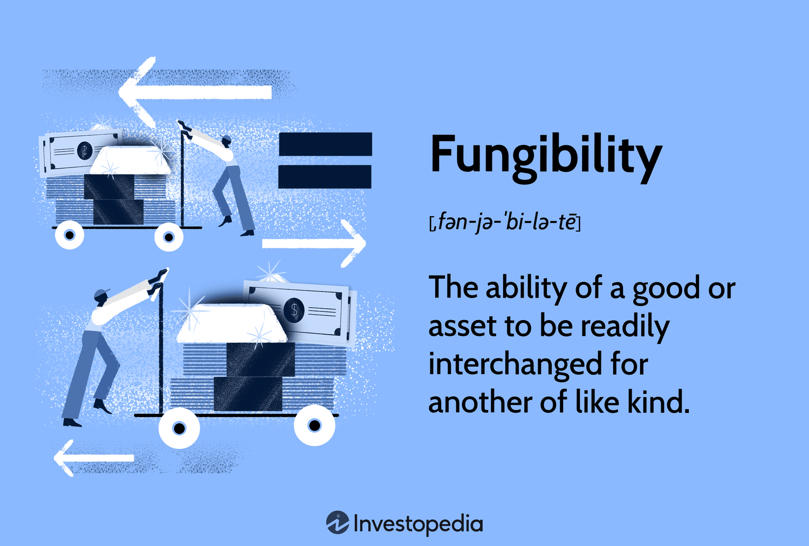

Fungibility, a fundamental concept in economics, refers to the interchangeability of goods and assets. An item is considered fungible when individual units are essentially indistinguishable from one another and can be exchanged on a one-to-one basis. Money is a classic example of fungibility; one dollar holds the same value as any other dollar, allowing for seamless economic transactions. This property plays a crucial role in trade by enabling the standardization and simplification of exchanges, thereby contributing to market efficiency and liquidity.

Algorithmic trading has emerged as a transformative force in financial markets. It involves the use of computer algorithms to automate the trading process, relying on predefined criteria to execute trades with precision and speed that are unattainable for human traders. Automation reduces the impact of human biases and errors while simultaneously lowering transaction costs. This has led to substantial growth in algorithmic trading, particularly in high-frequency trading (HFT), where the speed of execution is paramount.



The purpose of this article is to explore the intersection of trade fungibility and algorithmic trading. Fungibility enhances the efficiency of algorithmic trading by ensuring assets can be traded seamlessly, while algorithmic trading strategies often rely on the fungible nature of financial instruments to exploit market opportunities. By examining how these concepts interact, we gain a deeper understanding of their combined impact on market dynamics and efficiency.

## Table of Contents

## Understanding the Concept of Fungibility

Fungibility in economics refers to the property of a good or asset to be easily interchangeable with another good or asset of the same type. This characteristic ensures that individual units of a product or asset are indistinguishable and can be substituted seamlessly in transactions. The concept of fungibility plays a vital role in the efficient functioning of markets, as it allows for the straightforward exchange and valuation of goods and assets.

Fungible items are standardized, which makes them interchangeable. A prime example of a fungible item is money. A ten-dollar bill is regarded as equivalent to another ten-dollar bill, and this characteristic makes currency a highly fungible asset. Commodities, such as oil, gold, or wheat, also demonstrate fungibility. A barrel of crude oil from one producer can replace a barrel from another producer as long as it meets certain quality standards, thereby facilitating trade in global commodity markets.

In contrast, non-fungible items are unique and not directly interchangeable. Real estate is a notable example of a non-fungible asset, as each property possesses distinct characteristics—location, size, design—that distinguish it from others. Similarly, collectibles, such as art, antiques, or rare coins, are non-fungible due to their unique attributes and value, which can vary significantly from one item to another.

The importance of fungibility lies in its ability to facilitate trade and market efficiency. Interchangeable goods and assets allow for the smooth execution of transactions, price discovery, and [liquidity](/wiki/liquidity-risk-premium) in financial markets. Fungibility reduces the time and costs associated with the exchange of goods, as parties in a transaction do not need to assess the distinctive qualities of each item involved. This property enhances market liquidity by ensuring that assets can be bought and sold rapidly without significant price adjustments.

Moreover, fungible assets contribute to the process of risk management and investment strategies. Investors can easily diversify portfolios by replacing one security or commodity with another of a similar category. This ease of substitution also enables markets to function more effectively by ensuring that pricing remains consistent across different transactions.

Overall, fungibility is a fundamental aspect of economics that supports trade and market efficiency by enabling seamless asset interchangeability, reducing transaction complexity, and facilitating rapid market operations.

## Fungibility in Financial Markets

Fungibility is a fundamental concept that greatly benefits financial market operations, especially in the trading of commodities and currencies. It refers to the interchangeability of units, enabling each unit to be perfectly substitutable. This characteristic is vital in financial markets where seamless trading and liquidity are paramount.

Fungibility facilitates liquidity in financial markets by ensuring that assets can be readily bought and sold at stable prices. For instance, the foreign exchange market, reliant on currency fungibility, exhibits high liquidity. As each unit of a currency is identical, traders can execute large [volume](/wiki/volume-trading-strategy) transactions without causing significant price disruptions. This liquidity is further enhanced because fungible assets attract a broader pool of participants, each confident in the asset’s uniformity and availability.

Besides liquidity, fungibility also plays a crucial role in reducing transaction costs. In markets where assets are fungible, standardization simplifies the trade process—traders need not negotiate specific terms for each transaction. This simplification results in reduced legal, administrative, and time costs associated with verifying and executing trades. For example, commodities such as [crude oil](/wiki/crude-oil) and gold are standardized to specific grades and purity levels, enabling streamlined trading across global markets without necessitating individual quality assessments.

However, challenges arise when goods are non-fungible, leading to market inefficiencies. Non-fungible items, like real estate or art, lack standardization, making each unit unique and thus not interchangeable. This uniqueness necessitates detailed evaluations for each transaction, increasing time and cost. Additionally, the lack of interchangeability can lead to liquidity issues; selling a unique asset can be more time-consuming and may require substantial price concessions.

In summary, fungibility enhances financial market operations by promoting liquidity and minimizing transaction costs. On the other hand, non-fungible goods pose challenges by introducing inefficiencies that complicate the trade process, affecting market dynamics. As financial markets continue to evolve, understanding and managing the implications of fungibility will remain crucial for efficient market operations.

## Basics of Algorithmic Trading

Algorithmic trading, also known as automated trading, refers to the use of computer algorithms to execute trading decisions and transactions in financial markets. These algorithms are defined by a series of rules and mathematical models designed to operate at speeds and frequencies beyond human capability. The growth of [algorithmic trading](/wiki/algorithmic-trading) has been significant in recent years, driven by technological advancements and the increasing complexity of financial markets.

Algorithmic trading operates by scanning market data in real-time to identify trading opportunities that meet pre-established criteria. These criteria are based on strategic models that can range from simple to highly sophisticated, encompassing various trading strategies such as [momentum](/wiki/momentum), statistical [arbitrage](/wiki/arbitrage), and mean reversion. Once the criteria are met, the algorithms execute orders automatically without human intervention, ensuring swift capital movements.

Key advantages of algorithmic trading include precision, efficiency, and the elimination of human error. Algorithms operate with exactness, executing trades at optimal prices, timing, and quantities according to their code. This level of precision minimizes slippage—the difference between the expected price of a trade and the actual price—and ensures consistent performance across trades. 

Algorithmic trading also contributes to reduced transaction costs. By executing a large number of trades simultaneously and efficiently, these systems maximize the potential for profit while minimizing costs associated with human labor and errors. Furthermore, algorithms have the capability to explore and execute trades at scale and speed impossible for human traders, thus taking advantage of transient market opportunities.

Despite their advantages, it is important to note that algorithmic trading systems are only as effective as the models and data they rely on. The development and maintenance of these systems require significant resources and expertise to ensure they adapt to changing market conditions and continue to function effectively.

## Strategies in Algorithmic Trading

Algorithmic trading strategies are diverse and adaptable, with some of the most prevalent being trend-following, arbitrage, and mean reversion. These strategies capitalize on the fungibility of assets to enhance trading efficiency and profitability.

**Trend-Following Strategy**

Trend-following is a technique based on the analysis of an asset's price movement direction. Traders using this strategy aim to capitalize on full-scale market trends by buying an asset when its price is rising and selling when it is falling. Given the interchangeable nature of fungible assets, traders can execute trades across various markets without concern for differing intrinsic asset values.

In a trend-following algorithm, the ability to seamlessly substitute identical assets, like stocks or currency units, facilitates simplified large-scale trading. As a result, trade execution can occur smoothly at different venues, leveraging fungibility to maximize market opportunities.

**Arbitrage Strategy**

Arbitrage involves the simultaneous buying and selling of an asset or its equivalent across different markets to profit from price discrepancies. This strategy is critically reliant on fungibility, as it assumes that identical assets can be exchanged across markets without value degradation.

An example is triangular arbitrage in foreign currency markets:
$$
\text{Profit} = (\frac{1}{rate_{AB}} \times rate_{BC} \times rate_{CA}) - 1
$$

This calculation exploits slight variations in currency exchange rates among three different currencies (A, B, C). By swiftly executing trades across fungible units in different markets, algorithms can capitalize on fleeting price inefficiencies, ensuring immediate returns with minimal risk.

**Mean Reversion Strategy**

Mean reversion is based on the concept that asset prices will revert to their historical mean or average value over time. This strategy identifies when an asset deviates significantly from its mean, signaling a potential buying or selling opportunity.

In the presence of fungible assets, mean reversion algorithms efficiently trade by substituting equivalent assets, depending on availability and transaction costs. By anticipating the price correction, traders can buy undervalued assets or sell overvalued ones, enhancing portfolio returns.

```python
# Python code example for mean reversion signal in trading using rolling mean

import pandas as pd

def mean_reversion_signal(prices, window_size=20):
    mean = prices.rolling(window=window_size).mean()
    signal = prices - mean
    return signal

# Example usage
prices = pd.Series([100, 102, 101, 105, 110, 108, 107, 105, 102, 100])
signal = mean_reversion_signal(prices)
print(signal)
```

In conclusion, algorithmic trading strategies exploit the fungibility of assets for enhanced trading efficiency by allowing seamless interchange among equivalent units. These strategies, when well-executed, demonstrate the potential of algorithms in optimizing trade operations through price discrepancies. Such capabilities affirm the critical nature of fungibility in the robust operation of algorithmic trading.

## Fungibility and Algorithmic Trading: A Symbiotic Relationship

Fungibility plays a crucial role in enhancing the effectiveness of algorithmic trading. At its core, fungibility ensures that individual units of an asset are indistinguishable and mutually interchangeable, which is essential for automated trading systems. In algorithmic trading, where precision and speed are paramount, the assumption of fungibility allows algorithms to process transactions seamlessly, treating each unit of [cryptocurrency](/wiki/cryptocurrency) or financial asset as identical in value and utility. This homogeneity is paramount for executing large volumes of trades with minimal discrepancies in valuation.

Algorithmic trading can also test and affirm the fungibility of assets through automated transactions. By analyzing patterns in high-frequency trading or engaging in arbitrage between different markets, algorithms can verify the consistency in the interchangeability of an asset or identify any deviations that may need rectification. For instance, if a certain portion of a supposedly fungible commodity consistently trades at a different price, it signals potential issues in its perceived fungibility. Anomalies detected by algorithms can prompt further examination, thereby fostering market transparency and standardization of asset characteristics.

Innovations in algorithmic trading can significantly impact the understanding and application of fungibility. Machine learning and [artificial intelligence](/wiki/ai-artificial-intelligence) allow traders to analyze vast datasets for subtle patterns, potentially leading to insights that redefine perceptions of what constitutes a fungible asset. Additionally, the increasing use of blockchain technology in trading platforms can bolster fungibility by providing transparent and immutable records of transactions, which ensure the authenticity and uniformity of traded assets. As algorithmic trading models evolve, they may challenge traditional notions of fungibility by introducing broader criteria for assessing asset interchangeability, thereby reshaping financial markets' dynamics.

## Challenges and Considerations

Algorithmic trading, while offering efficiency and speed in financial transactions, faces considerable challenges when dealing with non-fungible assets and potential market distortions. Non-fungible assets, by nature, lack the interchangeability characteristic of fungible ones, such as currencies or commodities. This lack of uniformity can make it challenging for algorithms designed for high-frequency trading ([HFT](/wiki/high-frequency-trading-strategies)), which often capitalize on the homogeneity and predictable behavior of fungible assets. One issue is the difficulty in automating trades around unique or rare items where valuation is not straightforward, impacting transaction speed and efficiency—critical components of algorithmic trading.

Market distortions are inherent risks in algorithmic trading, exacerbated by the presence of non-fungible assets. These distortions occur when trading algorithms interact in unforeseen ways, leading to price anomalies that can ripple through trading platforms. For instance, algorithms set to execute trades based on specific price movements can trigger a cascade event, creating sharp and sudden market movements. This scenario is challenging to manage when attributes of assets resist standard valuation practices.

High-frequency trading in particular raises significant regulatory concerns due to its potential to amplify [volatility](/wiki/volatility-trading-strategies). Regulators worry that the speed and volume of HFT can destabilize markets, sometimes leading to "flash crashes," where rapid sell-offs occur, only to recover shortly after. Such events question the market stability and fairness, as not all participants have access to the same technological advantages. The European Securities and Markets Authority (ESMA) and the U.S. Securities and Exchange Commission (SEC) have thus considered implementing rules to curb excessive HFT activities.

Balancing market integrity with technological efficiency remains a critical consideration. Regulatory bodies strive to ensure that technological advancements do not compromise fair market practices. This involves monitoring trading behaviors and putting restrictions on practices that might lead to unfair market advantages or unintended economic consequences. For example, circuit breakers are a common regulatory mechanism designed to pause trading during extreme volatility, allowing time to restore market order.

Maintaining an equilibrium between innovation and regulation requires continuous dialogue between technologists, traders, and regulators. This balance ensures that advancements in algorithmic trading enhance, rather than undermine, the financial ecosystem's stability. As algorithmic trading continues to evolve, its integration with newer asset classes like cryptocurrencies and non-fungible tokens (NFTs) could further challenge existing paradigms, necessitating adaptive regulatory frameworks. Thus, the ongoing oversight is crucial to support the sustainable development of algorithmic trading and its incorporation of non-fungible assets.

## The Future of Fungibility in Algorithmic Trading

The future of fungibility in algorithmic trading is increasingly tied to the development of digital and decentralized assets, such as cryptocurrencies. Cryptocurrencies, by design, are highly fungible; each unit of a currency like Bitcoin or Ethereum is essentially identical and interchangeable with another, making them ideal for algorithmic trading. This fungibility facilitates liquidity, reduces transaction costs, and ensures smoother market operations.

However, the rise of non-fungible tokens (NFTs) presents unique challenges. Unlike cryptocurrencies, NFTs are distinct and cannot be exchanged on a one-to-one basis. This non-fungibility creates complications for algorithmic trading models traditionally reliant on the certainty and uniformity provided by fungible assets. Algorithms must be adapted to accommodate the unique properties of NFTs, such as scarcity and provenance, which are core to their value. This adaptation involves developing new trading strategies that consider an asset's uniqueness rather than its interchangeability.

As financial markets evolve with technological advancements, algorithmic trading will need to account for a broader range of asset types. This includes digital assets and potentially other decentralized assets that rely on blockchain technology. The efficient handling of these assets could lead to more sophisticated and diversified trading strategies, allowing traders to exploit niche markets and asset classes previously deemed too complex.

Ultimately, the evolution of financial markets in light of ongoing advancements in algorithmic trading will likely continue pushing the boundaries of what's possible in trading fungible and non-fungible assets. For market participants, understanding these dynamics will become increasingly important to remain competitive and drive innovation in trading strategies. This knowledge will be crucial as markets further embrace digital assets, requiring traders to navigate the complex interplay between fungibility and non-fungibility in a rapidly changing landscape.

## Conclusion

The concepts of trade fungibility and algorithmic trading represent fundamental components of contemporary financial markets. Fungibility, the property that allows individual units of a good or asset to be interchangeable, is crucial for creating efficient and highly liquid markets. It simplifies trading processes by enabling assets to be easily exchanged without any differentiation. This characteristic not only reduces transaction costs but also enhances market liquidity, making it easier for participants to buy and sell assets at stable prices.

Algorithmic trading—defined by the use of automated and predefined criteria to execute trade orders—revolutionizes the speed and precision of trading activities. By integrating sophisticated algorithms, traders can capitalize on fleeting market opportunities, execute trades at optimal times, and minimize human errors. This technological advancement underscores the significance of fungibility, as it relies on the interchangeability of assets to function seamlessly.

For investors and market participants, a robust understanding of these concepts is paramount. Fungibility ensures that markets operate smoothly, while algorithmic trading increases market efficiency and reduces costs. Together, they play a pivotal role in the evolution of financial markets.

As both fields continue to develop, staying informed about the latest trends and advancements is essential. These include the emergence of digital assets, the increasing role of cryptocurrencies, and the potential for non-fungible tokens (NFTs) to reshape existing trading models. Understanding the interplay between fungibility and algorithmic trading will be crucial as these domains shape the future landscape of finance.

## References & Further Reading

[1]: Bergstra, J., Bardenet, R., Bengio, Y., & Kégl, B. (2011). ["Algorithms for Hyper-Parameter Optimization."](https://papers.nips.cc/paper/4443-algorithms-for-hyper-parameter-optimization) Advances in Neural Information Processing Systems 24.

[2]: ["Advances in Financial Machine Learning"](https://www.amazon.com/Advances-Financial-Machine-Learning-Marcos/dp/1119482089) by Marcos Lopez de Prado

[3]: ["Evidence-Based Technical Analysis: Applying the Scientific Method and Statistical Inference to Trading Signals"](https://www.amazon.com/Evidence-Based-Technical-Analysis-Scientific-Statistical/dp/0470008741) by David Aronson

[4]: ["Machine Learning for Algorithmic Trading"](https://github.com/stefan-jansen/machine-learning-for-trading) by Stefan Jansen

[5]: ["Quantitative Trading: How to Build Your Own Algorithmic Trading Business"](https://www.amazon.com/Quantitative-Trading-Build-Algorithmic-Business/dp/1119800064) by Ernest P. Chan