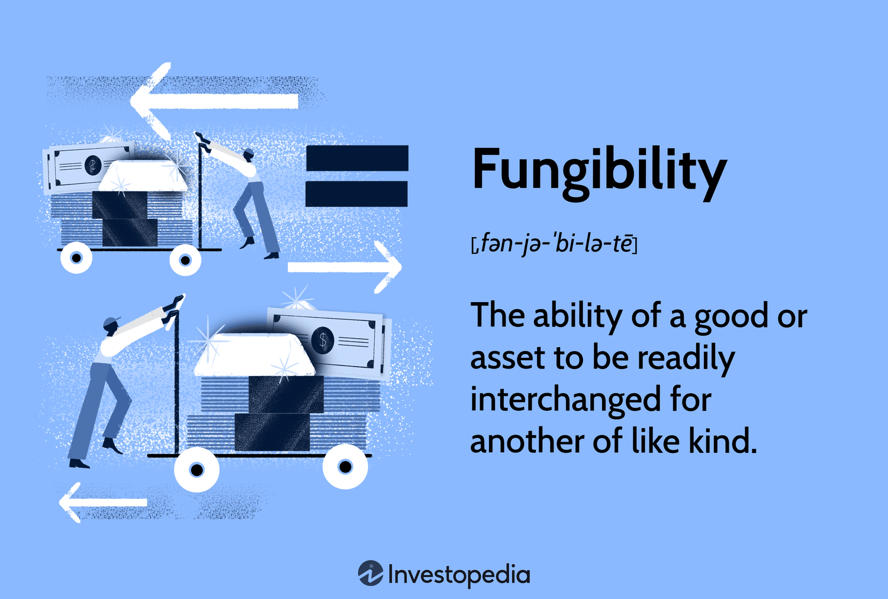

## Table of Contents

## What are fungible goods?

Fungible goods are items that can be easily exchanged or replaced because they are essentially the same. For example, money is a fungible good because one dollar is the same as another dollar. Other examples include grains like wheat or corn, where one bushel is considered equivalent to another bushel of the same type.

These goods are important in trade and commerce because they make transactions simpler. If you buy a bag of sugar, it doesn't matter which specific bag you get as long as it's the same type and amount. This makes it easier to buy, sell, and trade these items without needing to check each one individually.

## Can you provide examples of fungible goods?

Fungible goods are things that you can swap easily because they are the same. Money is a good example. If you have a dollar, it doesn't matter which dollar you get because all dollars are the same. Another example is oil. One barrel of oil is the same as another barrel of oil, so you can trade them without any problem.

Grains like wheat and corn are also fungible goods. If you buy a bag of wheat, it doesn't matter which bag you get as long as it's the same amount and type. This makes it easy to trade and sell these goods because you don't need to check each bag or grain individually.

Other examples include metals like gold and silver. One ounce of gold is the same as another ounce of gold, so they can be traded easily. This is why fungible goods are important in trade and commerce; they make buying and selling simpler and more efficient.

## How do fungible goods differ from non-fungible goods?

Fungible goods are items that you can easily swap or replace because they are the same. For example, money is a fungible good because one dollar is the same as another dollar. Other examples include grains like wheat or corn, and metals like gold and silver. You can trade these goods without worrying about which specific item you get, as long as it's the same type and amount. This makes buying, selling, and trading much simpler and more efficient.

Non-fungible goods, on the other hand, are unique and can't be easily swapped or replaced. Each non-fungible item has its own special characteristics that make it different from others. For example, a piece of art or a house is non-fungible because each one is unique. You can't just trade one painting for another and expect them to be the same. This uniqueness means that non-fungible goods often need to be carefully checked and valued before they can be traded.

## Why are fungible goods important in economics?

Fungible goods are important in economics because they make trading easier and faster. When you buy something like a bag of sugar or a barrel of oil, it doesn't matter which specific bag or barrel you get, as long as it's the same type and amount. This means that you can trade these goods quickly without having to check each one. This helps businesses and people buy and sell things more efficiently, which is good for the economy.

Another reason fungible goods are important is that they help set prices. Because these goods are the same, it's easy to compare prices and figure out what they're worth. For example, if you know the price of one barrel of oil, you can use that to figure out the price of another barrel of oil. This helps keep the market stable and makes it easier for people to make smart decisions about buying and selling.

## What are the characteristics that define a good as fungible?

Fungible goods are things that you can swap easily because they are the same. For example, money is a fungible good because one dollar is the same as another dollar. Other examples include grains like wheat or corn, and metals like gold and silver. These goods are important because you can trade them without worrying about which specific item you get, as long as it's the same type and amount. This makes buying, selling, and trading much simpler and more efficient.

The key characteristic of a fungible good is that it can be replaced by another identical item. This means that each unit of the good is considered interchangeable with another unit of the same type. For instance, if you buy a bag of rice, it doesn't matter which bag you get as long as it's the same amount and type of rice. This interchangeability makes it easy to trade these goods without needing to check each one individually, which helps keep the market running smoothly.

## How are fungible goods traded in markets?

Fungible goods are traded in markets in a way that makes it easy and quick. Because these goods are the same, like one dollar being the same as another dollar, you don't have to check each one before you trade. For example, if you want to buy oil, you can just look at the price of a barrel of oil and buy it without worrying about which barrel you get. This makes trading fast and efficient, which is good for both buyers and sellers.

Markets where fungible goods are traded can be physical, like a grain market where farmers sell wheat, or they can be digital, like a stock market where people trade shares of a company. In both cases, the key thing is that the goods are the same, so you can easily buy and sell them without needing to look at each item. This helps keep the market running smoothly and makes it easier for people to make decisions about buying and selling.

## What role do fungible goods play in commodity trading?

Fungible goods are really important in commodity trading because they make it easier and faster to buy and sell things. When you trade commodities like oil, wheat, or gold, you don't need to check each barrel, bag, or ounce because they are all the same. This means that you can trade these goods quickly without worrying about which specific item you get, as long as it's the same type and amount. This helps keep the market running smoothly and makes it easier for people to make decisions about buying and selling.

In commodity markets, both physical and digital, fungible goods help set prices and keep the market stable. Because these goods are the same, it's easy to compare prices and figure out what they're worth. For example, if you know the price of one barrel of oil, you can use that to figure out the price of another barrel of oil. This helps everyone in the market make smart decisions about when to buy and sell, which is good for the economy.

## How does the concept of fungibility affect pricing and valuation?

Fungibility affects pricing and valuation because it makes things easier to compare. When goods are fungible, like one dollar being the same as another dollar, you can easily see what they're worth. For example, if you know the price of one barrel of oil, you can use that to figure out the price of another barrel of oil. This means that everyone in the market can agree on a price because they're all looking at the same thing. It helps keep the market stable and makes it easier for people to make smart decisions about buying and selling.

Because fungible goods are the same, it's also easier to set prices and value them. If you're trading wheat, for example, you don't need to check each bag to see if it's worth the same as another bag. This makes the market run smoothly and helps everyone know what things are worth. When everyone agrees on the value of a good, it's easier to trade and the economy works better.

## What are the challenges in maintaining the fungibility of goods?

Keeping goods fungible can be hard because sometimes things can change and make them different. For example, if you're trading oil, it might be hard to keep every barrel the same because the oil might come from different places or be of different quality. If one barrel of oil is not the same as another, it can mess up the trading because people won't know what they're getting. This can make it harder to set prices and value the goods correctly.

Another challenge is making sure that everyone agrees on what makes a good fungible. For example, with money, everyone has to agree that one dollar is the same as another dollar. If people start thinking that some dollars are better than others, it can cause problems. This can happen if there's a lot of fake money or if people start using different kinds of money. Keeping everyone on the same page about what makes a good fungible is important for trading and the economy.

## How do regulations impact the trading of fungible goods?

Regulations can help make sure that fungible goods stay the same and easy to trade. For example, rules about how oil should be measured or how wheat should be stored can help keep every barrel or bag the same. This makes it easier for people to buy and sell these goods because they know what they're getting. Without these rules, it might be hard to trust that one barrel of oil is the same as another, which could slow down trading and make prices go up and down a lot.

On the other hand, too many regulations can make trading harder. If there are a lot of rules about how to trade or what you need to do to buy and sell, it can slow things down. For example, if you have to fill out a lot of paperwork or wait for approvals, it can take longer to make a trade. This can make it harder for businesses to work quickly and can affect how much they can buy and sell. So, finding the right balance of regulations is important to keep trading smooth and efficient.

## What are some advanced trading strategies involving fungible goods?

One advanced trading strategy involving fungible goods is called futures trading. This is when people agree to buy or sell a certain amount of a good, like oil or wheat, at a set price in the future. This can help people lock in prices and protect themselves from big changes in the market. For example, if a farmer thinks the price of wheat might go down, they can sell a futures contract to make sure they get a good price for their wheat later. This strategy can be risky because if the market goes the other way, you might lose money, but it can also help manage risk and make trading more predictable.

Another strategy is called arbitrage. This is when traders buy a fungible good in one market where it's cheap and sell it in another market where it's more expensive. Because fungible goods are the same, you can do this without worrying about the quality of what you're buying and selling. For example, if gold is cheaper in one country than another, a trader can buy it in the cheaper country and sell it in the more expensive one to make a profit. This helps keep prices the same across different markets and can be a smart way to make money if you know how to find these opportunities.

A third strategy is called hedging. This is when traders use fungible goods to protect themselves from price changes. For example, an airline might use oil futures to hedge against rising fuel costs. If they think the price of oil will go up, they can buy oil futures at today's price to make sure they don't have to pay more later. This can help businesses plan better and avoid big losses if prices change a lot. Hedging can be complicated, but it's a useful way to manage risk in trading fungible goods.

## How might technological advancements influence the future of fungible goods trading?

Technological advancements could make trading fungible goods faster and easier. For example, blockchain technology, which is like a digital ledger that everyone can see, could help make sure that every unit of a good is the same. This could make trading more trustworthy because everyone can see what's happening. Also, smart contracts, which are like digital agreements that happen automatically, could make buying and selling quicker and less risky. If you want to trade oil, a smart contract could make sure you get the right amount at the right price without needing a lot of paperwork.

Another way technology could change trading is through better data and analytics. With more information and faster computers, traders can make smarter decisions about when to buy and sell. For example, if you can see that the price of wheat is going up in one market, you might want to buy it there and sell it somewhere else where the price is lower. This could make trading more efficient and help keep prices the same across different markets. As technology keeps getting better, it could make trading fungible goods even smoother and more reliable.

## What are Algorithmic Trading Strategies and how does Fungibility relate to them?

Algorithmic trading strategies leverage the fungibility of financial instruments to execute trades efficiently and capitalize on market movements. These strategies, which include trend-following, [arbitrage](/wiki/arbitrage), and mean reversion, are designed to exploit the inherent interchangeability of assets, ensuring consistency and [liquidity](/wiki/liquidity-risk-premium) in transactions.

**Trend-following** is a strategy that capitalizes on consistent, directional market trends. It involves identifying assets with a strong upward or downward trend and executing trades accordingly. Given the fungible nature of many assets, such as stocks or commodities, traders can easily buy or sell large volumes without concern over uniqueness or variability between units. Trend-following algorithms use technical indicators, such as moving averages or the Relative Strength Index (RSI), to systematically identify and enter positions that align with the prevailing market direction. The main formula often used is the moving average crossover strategy:

$$
\text{Buy when } MA_{\text{short-term}} > MA_{\text{long-term}}
$$
$$
\text{Sell when } MA_{\text{short-term}} < MA_{\text{long-term}}
$$

**Arbitrage** involves exploiting price discrepancies of the same asset across different markets or exchanges. Fungibility is essential here, as it assures the trader that one unit of the asset is identical regardless of location, allowing them to profit from price imbalances. Arbitrage strategies require the rapid execution of large trades, facilitated by high-frequency trading systems, to make small but consistent profits before the price discrepancy closes. An example of a simple arbitrage strategy can be described as follows:

```python
def arbitrage_opportunity(price_market1, price_market2, transaction_cost):
    if price_market1 + transaction_cost < price_market2:
        return "Buy from Market1, Sell in Market2"
    elif price_market2 + transaction_cost < price_market1:
        return "Buy from Market2, Sell in Market1"
    else:
        return "No Arbitrage Opportunity"
```

**Mean Reversion** assumes that asset prices tend to revert to a long-term mean or average. In this strategy, trades are made based on the deviation of an asset's current price from its historical average, with the expectation that prices will return to the mean. The fungibility of assets ensures that the systematic performance characteristics instead of the unique attributes of individual units are relevant. The concept can be mathematically expressed using the z-score:

$$
z = \frac{X - \mu}{\sigma}
$$

Where $X$ is the current price, $\mu$ is the average price, and $\sigma$ is the standard deviation. A high absolute z-score might indicate a potential trading opportunity for mean reversion.

These [algorithmic trading](/wiki/algorithmic-trading) strategies fundamentally rely on fungible assets, as their interchangeable nature supports precise and scalable execution, ultimately enhancing market efficiency and liquidity.

## References & Further Reading

Explore a range of resources to gain a comprehensive understanding of algorithmic trading, fungibility, and financial markets. A thorough examination of these materials will provide insights into the mechanisms that drive modern trading practices.

1. **Academic Papers**: 
   - "High-Frequency Trading and Price Efficiency" by Charles M. Jones provides a detailed analysis of the effects of algorithmic trading on market efficiency.
   - "The Impact of Algorithmic Trading on Market Liquidity" by Foucault and Moinas explores how automated trading influences liquidity.

2. **Financial Textbooks**:
   - "Algorithmic Trading: Winning Strategies and Their Rationale" by Ernest P. Chan offers a practical guide on implementing successful trading strategies, emphasizing the importance of fungibility.
   - "Options, Futures, and Other Derivatives" by John C. Hull presents foundational concepts essential for understanding the financial instruments often involved in algorithmic trading.

3. **Market Analysis Reports**:
   - Reports from financial institutions like JPMorgan Chase and Goldman Sachs provide insights into current trends and future directions in algorithmic trading, including the integration of digital and decentralized assets.
   - The World Economic Forum's studies on blockchain and cryptocurrencies offer perspectives on how fungibility evolves with technological advancements in financial markets.

These resources will equip readers with the necessary knowledge to navigate and succeed in the evolving landscape of financial trading.

